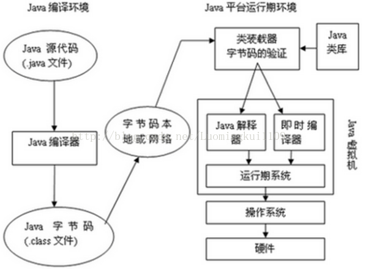
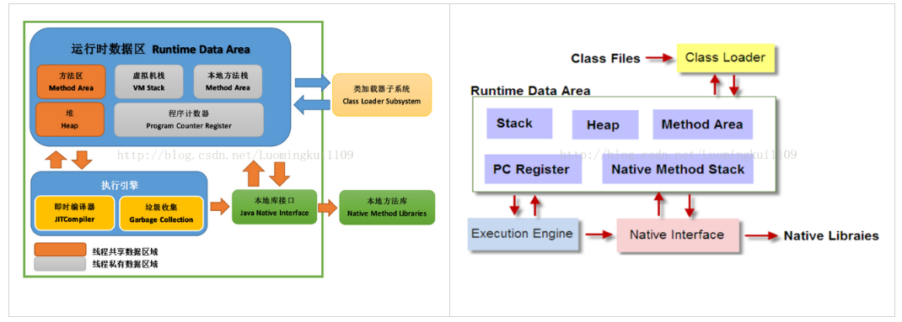
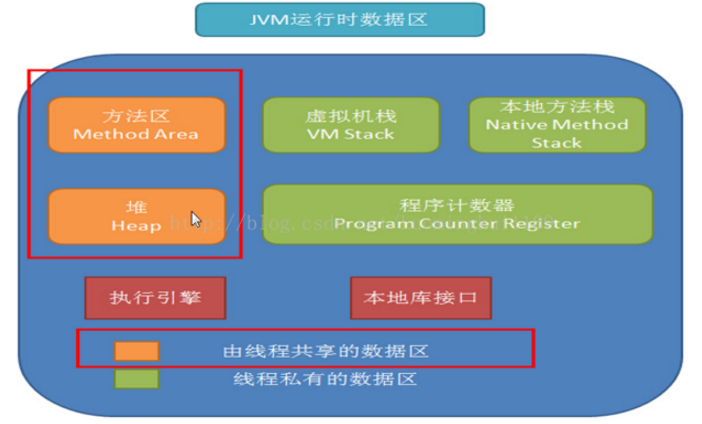
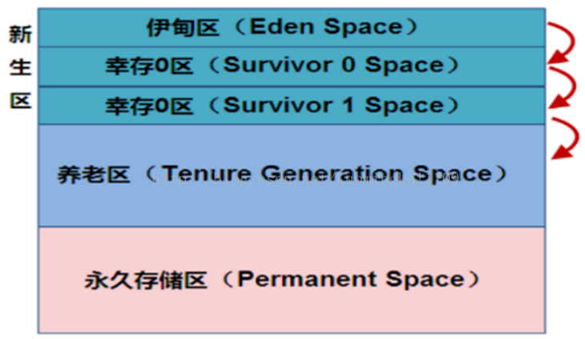
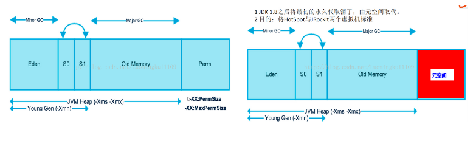
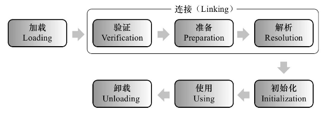
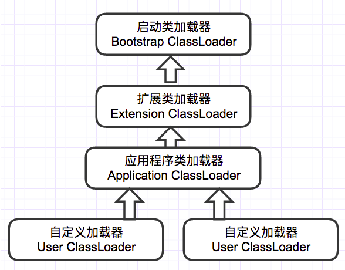
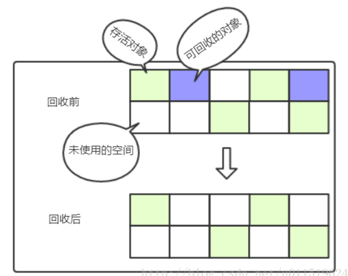
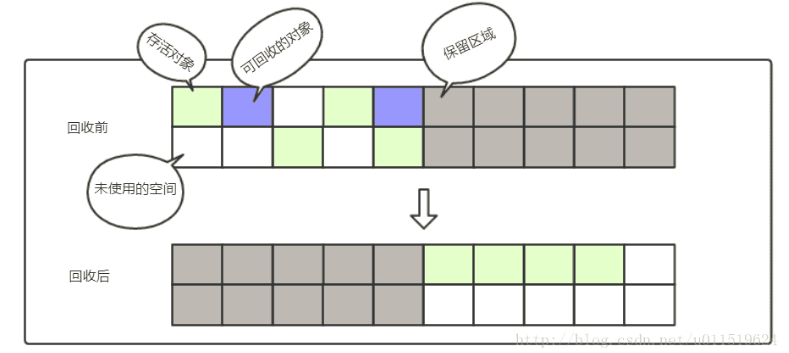
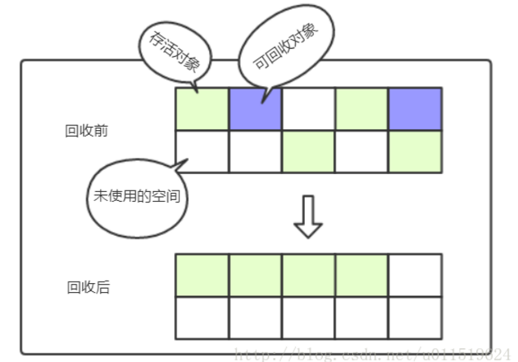

# JVM

## JVM简介

​	Java平台由Java虚拟机和Java应用程序接口搭建，Java语言则是进入这个平台的通道，用Java语言编写并编译的程序可以运行在这个平台上。这个平台的结构如下图所示：     运行期环境代表着Java平台，开发人员编写Java代码(.java文件)，然后将之编译成字节码(.class文件)，再然后字节码被装入内存，一旦字节码进入虚拟机，它就会被解释器解释执行，或者是被即时代码发生器有选择的转换成机器码执行。 



​	JVM在它的生存周期中有一个明确的任务，那就是运行Java程序，因此当Java程序启动的时候，就产生JVM的一个实例；当程序运行结束的时候，该实例也跟着消失了。     在Java平台的结构中, 可以看出，Java虚拟机(JVM) 处在核心的位置，是程序与底层操作系统和硬件无关的关键。它的下方是移植接口，移植接口由两部分组成：适配器和Java操作系统, 其中依赖于平台的部分称为适配器；JVM 通过移植接口在具体的平台和操作系统上实现；在JVM 的上方是Java的基本类库和扩展类库以及它们的API， 利用Java API编写的应用程序(application) 和小程序(Java applet) 可以在任何Java平台上运行而无需考虑底层平台, 就是因为有Java虚拟机(JVM)实现了程序与操作系统的分离，从而实现了Java 的平台无关性。 

## JVM基本概念

### 1.基本概念 

​	JVM是可运行Java代码的假想计算机 ，包括一套字节码指令集、一组寄存器、一个栈、一个垃圾回收、堆 和 一个存储方法域。JVM是运行在操作系统之上的，它与硬件没有直接的交互。 

### 2.运行过程 

​	我们都知道Java源文件，通过编译器，能够生产相应的.Class文件，也就是字节码文件，而字节码文件又通过Java虚拟机中的解释器，编译成特定机器上的机器码 。

也就是如下：

​     ① Java源文件—->编译器—->字节码文件

​     ② 字节码文件—->JVM—->机器码

 	每一种平台的解释器是不同的，但是实现的虚拟机是相同的，这也就是Java为什么能够跨平台的原因了 ，当一个程序从开始运行，这时虚拟机就开始实例化了，多个程序启动就会存在多个虚拟机实例。程序退出或者关闭，则虚拟机实例消亡，多个虚拟机实例之间数据不能共享。

### 3.三种JVM 

​	① Sun公司的HotSpot；

​	② BEA公司的JRockit；

​	③ IBM公司的J9 JVM；

 	在JDK1.7及其以前我们所使用的都是Sun公司的HotSpot，但由于Sun公司和BEA公司都被oracle收购，jdk1.8将采用Sun公司的HotSpot和BEA公司的JRockit两个JVM中精华形成jdk1.8的JVM。

## JVM体系结构 



### 1.Class Loader类加载器 

​	负责加载 .class文件，class文件在文件开头有特定的文件标示，并且ClassLoader负责class文件的加载等，至于它是否可以运行，则由Execution Engine决定。

​	① 定位和导入二进制class文件

​	② 验证导入类的正确性

​	③ 为类分配初始化内存

​	④ 帮助解析符号引用

### 2.Native Interface本地接口 

​	本地接口的作用是融合不同的编程语言为Java所用，它的初衷是融合C/C++程序，Java诞生的时候C/C++横行的时候，要想立足，必须有调用C/C++程序，于是就在内存中专门开辟了一块区域处理标记为native的代码，它的具体作法是Native Method Stack中登记native方法，在Execution Engine执行时加载native libraies。

​	目前该方法使用的越来越少了，除非是与硬件有关的应用，比如通过Java程序驱动打印机，或者Java系统管理生产设备，在企业级应用中已经比较少见。

### 3.Execution Engine 执行引擎 

​	执行包在装载类的方法中的指令，也就是方法。 

### 4.Runtime data area 运行时数据区

​	虚拟机内存或者Jvm内存，冲整个计算机内存中开辟一块内存存储Jvm需要用到的对象，变量等，运行区数据有分很多小区，分别为：方法区，虚拟机栈，本地方法栈，堆，程序计数器。 

## JVM运行时数据区详解

​	JVM调优主要就是优化 Heap堆 和 Method Area 方法区。 



### 1.Native Method Stack本地方法栈 

​	它的具体做法是Native Method Stack中登记native方法，在Execution Engine执行时加载native libraies。 

### 2.PC Register程序计数器 

​	每个线程都有一个程序计算器，就是一个指针，指向方法区中的方法字节码（下一个将要执行的指令代码），由执行引擎读取下一条指令，是一个非常小的内存空间，几乎可以忽略不记。 

### 3.Method Area方法区 

​	方法区是被所有线程共享，所有字段和方法字节码，以及一些特殊方法如构造函数，接口代码也在此定义。简单说，所有定义的方法的信息都保存在该区域，此区域属于共享区间。 

​	静态变量+常量+类信息+运行时常量池存在方法区中，实例变量存在堆内存中。 

### 4.VM Stack虚拟机栈

​	① 栈是什么 

​		栈也叫栈内存，主管Java程序的运行，是在线程创建时创建，它的生命期是跟随线程的生命期，线程结束栈内存也就释放，对于栈来说不存在垃圾回收问题，只要线程一结束该栈就Over，生命周期和线程一致，是线程私有的。 

​		基本类型的变量和对象的引用变量都是在函数的栈内存中分配。 

​	② 栈存储什么 

​		栈帧中主要保存3类数据： 

​		本地变量（Local Variables）：输入参数和输出参数以及方法内的变量； 

​		栈操作（Operand Stack）：记录出栈、入栈的操作； 

​		栈帧数据（Frame Data）：包括类文件、方法等等。 

​	③ 栈运行原理 

​		栈中的数据都是以栈帧（Stack Frame）的格式存在，栈帧是一个内存区块，是一个数据集，是一个有关方法和运行期数据的数据集，当一个方法A被调用时就产生了一个栈帧F1，并被压入到栈中，A方法又调用了B方法，于是产生栈帧F2也被压入栈，B方法又调用了C方法，于是产生栈帧F3也被压入栈…… 依次执行完毕后，先弹出后进......F3栈帧，再弹出F2栈帧，再弹出F1栈帧。 

​		遵循“先进后出”/“后进先出”原则。 

### 5.Heap 堆 

​	

​	堆这块区域是JVM中最大的，应用的对象和数据都是存在这个区域，这块区域也是线程共享的，也是 gc 主要的回收区，一个 JVM 实例只存在一个堆类存，堆内存的大小是可以调节的。类加载器读取了类文件后，需要把类、方法、常变量放到堆内存中，以方便执行器执行，堆内存分为三部分： 

​	① 新生区 （新生代）

​	新生区是类的诞生、成长、消亡的区域，一个类在这里产生，应用，最后被垃圾回收器收集，结束生命。新生区又分为两部分：伊甸区（Eden space）和幸存者区（Survivor pace），所有的类都是在伊甸区被new出来的。幸存区有两个：0区（Survivor 0 space）和1区（Survivor 1 space）。当伊甸园的空间用完时，程序又需要创建对象，JVM的垃圾回收器将对伊甸园进行垃圾回收（Minor GC）,将伊甸园中的剩余对象移动到幸存0区。若幸存0区也满了，再对该区进行垃圾回收，然后移动到1区。那如果1去也满了呢？再移动到养老区。若养老区也满了，那么这个时候将产生Major GC（FullGCC），进行养老区的内存清理。若养老区执行Full GC 之后发现依然无法进行对象的保存，就会产生OOM异常“OutOfMemoryError”。 

​	 如果出现java.lang.OutOfMemoryError: Java heap space异常，说明Java虚拟机的堆内存不够。原因有二：Java虚拟机的堆内存设置不够，可以通过参数-Xms、-Xmx来调整；代码中创建了大量大对象，并且长时间不能被垃圾收集器收集（存在被引用）。

​	② 养老区 （老年代）

​	养老区用于保存从新生区筛选出来的 JAVA 对象，一般池对象都在这个区域活跃。 

​	③ 永久区 （永久代）

​	永久存储区是一个常驻内存区域，用于存放JDK自身所携带的 Class,Interface 的元数据，也就是说它存储的是运行环境必须的类信息，被装载进此区域的数据是不会被垃圾回收器回收掉的，关闭 JVM 才会释放此区域所占用的内存。 

​	如果出现java.lang.OutOfMemoryError: PermGen space，说明是Java虚拟机对永久代Perm内存设置不够。原因有二：程序启动需要加载大量的第三方jar包。例如：在一个Tomcat下部署了太多的应用；大量动态反射生成的类不断被加载，最终导致Perm区被占满。

​	注意：

​	Jdk1.6及之前：常量池分配在永久代 。

​	Jdk1.7：有，但已经逐步“去永久代” 。

​	Jdk1.8及之后：无(java.lang.OutOfMemoryError: PermGen space,这种错误将不会出现在JDK1.8中)。



​	注意：

​	实际而言，方法区和堆一样，是各个线程共享的内存区域，它用于存储虚拟机加载的：类信息+普通常量+静态常量+编译器编译后的代码等等，虽然JVM规范将方法区描述为堆的一个逻辑部分，但它却还有一个别名叫做Non-Heap（非堆），目的就是要和堆分开。

​	对于HotSpot虚拟机，很多开发者习惯将方法区称之为“永久代（Parmanent Gen）”,但严格本质上说两者不同，或者说使用永久代来实现方法区而已，永久代是方法区的一个实现，jdk1.7的版本中，已经将原本放在永久代的字符串常量池移走。

​	常量池（Constant Pool）是方法区的一部分，Class文件除了有类的版本、字段、方法、接口等描述信息外，还有一项信息就是常量池，这部分内容将在类加载后进入方法区的运行时常量池中存放。

## JVM类加载机制

​	如下图所示，JVM类加载机制分为五个部分：加载，验证，准备，解析，初始化，下面我们就分别来看一下这五个过程。 



### 1.加载

​	加载是类加载过程中的一个阶段，这个阶段会在内存中生成一个代表这个类的java.lang.Class对象，作为方法区这个类的各种数据的入口。注意这里不一定非得要从一个Class文件获取，这里既可以从ZIP包中读取（比如从jar包和war包中读取），也可以在运行时计算生成（动态代理），也可以由其它文件生成（比如将JSP文件转换成对应的Class类）。 

### 2.验证

​	这一阶段的主要目的是为了确保Class文件的字节流中包含的信息是否符合当前虚拟机的要求，并且不会危害虚拟机自身的安全。 

### 3.准备

​	准备阶段是正式为类变量分配内存并设置类变量的初始值阶段，即在方法区中分配这些变量所使用的内存空间。注意这里所说的初始值概念，比如一个类变量定义为： 

```
public static int v = 8080;
```

​	实际上变量v在准备阶段过后的初始值为0而不是8080，将v赋值为8080的putstatic指令是程序被编译后，存放于类构造器<client>方法之中，这里我们后面会解释。 但是注意如果声明为： 

```
public static final int v = 8080;
```

​	在编译阶段会为v生成ConstantValue属性，在准备阶段虚拟机会根据ConstantValue属性将v赋值为8080。 

### 4.解析

​	解析阶段是指虚拟机将常量池中的符号引用替换为直接引用的过程。符号引用就是class文件中的： 	

- CONSTANT_Class_info
- CONSTANT_Field_info
- CONSTANT_Method_info

符号引用和直接引用的概念 

- 符号引用与虚拟机实现的布局无关，引用的目标并不一定要已经加载到内存中。各种虚拟机实现的内存布局可以各不相同，但是它们能接受的符号引用必须是一致的，因为符号引用的字面量形式明确定义在Java虚拟机规范的Class文件格式中。
- 直接引用可以是指向目标的指针，相对偏移量或是一个能间接定位到目标的句柄。如果有了直接引用，那引用的目标必定已经在内存中存在。

### 5.初始化

​	初始化阶段是类加载最后一个阶段，前面的类加载阶段之后，除了在加载阶段可以自定义类加载器以外，其它操作都由JVM主导。到了初始阶段，才开始真正执行类中定义的Java程序代码。 

​	初始化阶段是执行类构造器<client>方法的过程。<client>方法是由编译器自动收集类中的类变量的赋值操作和静态语句块中的语句合并而成的。虚拟机会保证<client>方法执行之前，父类的<client>方法已经执行完毕。p.s: 如果一个类中没有对静态变量赋值也没有静态语句块，那么编译器可以不为这个类生成<client>()方法。 

​	注意以下几种情况不会执行类初始化： 

- 通过子类引用父类的静态字段，只会触发父类的初始化，而不会触发子类的初始化。
- 定义对象数组，不会触发该类的初始化。
- 常量在编译期间会存入调用类的常量池中，本质上并没有直接引用定义常量的类，不会触发定义常量所在的类。
- 通过类名获取Class对象，不会触发类的初始化。
- 通过Class.forName加载指定类时，如果指定参数initialize为false时，也不会触发类初始化，其实这个参数是告诉虚拟机，是否要对类进行初始化。
- 通过ClassLoader默认的loadClass方法，也不会触发初始化动作。

### 6.类加载器

​	虚拟机设计团队把加载动作放到JVM外部实现，以便让应用程序决定如何获取所需的类，JVM提供了3种类加载器： 

- 启动类加载器(Bootstrap ClassLoader)：负责加载 JAVA_HOME\lib 目录中的，或通过-Xbootclasspath参数指定路径中的，且被虚拟机认可（按文件名识别，如rt.jar）的类。
- 扩展类加载器(Extension ClassLoader)：负责加载 JAVA_HOME\lib\ext 目录中的，或通过java.ext.dirs系统变量指定路径中的类库。
- 应用程序类加载器(Application ClassLoader)：负责加载用户路径（classpath）上的类库。

JVM通过双亲委派模型进行类的加载，当然我们也可以通过继承java.lang.ClassLoader实现自定义的类加载器。 



​	当一个类加载器收到类加载任务，会先交给其父类加载器去完成，因此最终加载任务都会传递到顶层的启动类加载器，只有当父类加载器无法完成加载任务时，才会尝试执行加载任务。采用双亲委派的一个好处是比如加载位于rt.jar包中的类java.lang.Object，不管是哪个加载器加载这个类，最终都是委托给顶层的启动类加载器进行加载，这样就保证了使用不同的类加载器最终得到的都是同样一个Object对象。

## JVM垃圾回收

​	内存处理是编程人员容易出现问题的地方，忘记或者错误的内存回收会导致程序或系统的不稳定甚至崩溃，Java提供的GC功能可以自动监测对象是否超过作用域从而达到自动回收内存的目的 。

### 1.判断对象存活

​	① 引用计数法

​		引用计数法就是给对象加个引用计数器，每有一个地方引用到它时，这个引用计数器就加1。当引用失效的时候，计数器的值就减1，也就是说根据引用计数器的值来判断对象是否存活，若值是0，那么该对象就不再被使用了。 

​	②可达性分析法

​		可达性分析法的基本思路是通过一系列的GC Roots对象作为起始点，从这些点向下搜索它们引用的对象，这样可以生成一颗引用树，树的节点就是可达的对象。反之，不在树上的对象即可判定对象已死。 

​		作为GC Roots的对象必须是极难被回收的对象，包括了如下几种对象： 

- 虚拟机栈（`栈帧中的本地变量表`）中引用的对象，如在方法中定义和使用的变量

- 方法区中的`类静态属性引用的对象`，如static修饰的成员变量

- 方法区中`常量引用的对象`，如static和final共同修饰的常量

- 本地方法栈中`JNI引用的对象`，JNI也就是调的native方法

  ​	注意：

- `强引用`：只要某个对象有强引用与之关联，JVM必定不会回收这个对象，即使在内存不足的情况下，`JVM宁愿抛出OutOfMemory错误也不会回收`这种对象。 

- `软引用`：软引用是用来描述一些有用但并不是必需的对象，比如引用图片地址等，在Java中用java.lang.ref.SoftReference类来表示。对于软引用关联着的对象，`只有在内存不足的时候JVM才会回收`该对象。 

- `弱引用`：弱引用也是用来描述非必需对象的，当JVM进行垃圾回收时，无论内存是否充足，都会回收被弱引用关联的对象。也就是说被弱引用关联的对象，`只能生存到下一次垃圾收集发生之前`。 

- `虚引用（幽灵引用或幻影引用）`：虚引用和前面的软引用、弱引用不同，它并不影响对象的生命周期。在java中用java.lang.ref.PhantomReference类表示。如果一个对象与虚引用关联，则跟没有引用与之关联一样，在任何时候都可能被垃圾回收器回收。为一个对象设置虚引用关联的`唯一目的就是能在这个对象被收集器回收时收到一个系统通知`。与弱引用区别：在GC时会被通知。 

### 2.垃圾回收算法

​	① 标记-清除算法

​		算法的过程就如同算法的名字，分为`标记`和`清除`两个阶段：首先标记出所有要回收的对象，然后对标记的对象统一清除。算法很简单，再看下逻辑图：  



​		内存空间经过标记清除算法回收的过程一目了然，从图中也能看出这种算法的不足，即`标记清除后会产生大量的不连续的内存碎片`，如果碎片过多会导致大对象无法分配足够的空间而不得不触发垃圾回收。 另外，标记清除算法的标记和清除阶段效率都不高，所以效率也是个问题。 

​	②复制算法

​		既然标记清除效率达不到预期，那么新的回收算法就被创造出来了–复制算法。算法将可用内存分成两块大小一样的区域，每次只使用其中的一块区域，当使用的区域空间不足时就得进行垃圾回收了，而存活的对象就直接转移至另一块区域，如此往复。看如下复制算法逻辑图：  



​		每次垃圾回收都是在一块区域进行，即一半的空间进行内存回收。好处是`内存分配后不会产生内存碎片问题`，当然缺点也显而易见，内存空间利用率只有一半。 

​		由于每次垃圾回收需要对存活对象再一次迁移，这种算法适用于存活对象较少的场景。根据大多数经验表明，新生代的对象98%都是朝生熄灭的，所以复制算法适应于新生代的垃圾回收。但是在新生代中，一半的空间利用率实在太低，而且绝大部分对象都会被回收的特性，所以将内存分为了较大的eden区和两个较小的survivor区（s0和s1区），每次使用eden区和其中的一个survivor区，另一个survivor区则用于保存存活的对象。HotSpot虚拟机默认eden和survivor的比例是8:1，也就是说空间利用率达到了90%（80%+10%）。 

​	③ 标记-整理算法

​		顾名思义，看名字大致与标记-清除算法类似，其算法的标记过程还真是一样，但后续不是直接清除垃圾对象，而是让所有的存活的对象向一个方向移动，然后再清理掉存活对象边界之外的内存空间。来看图更清晰：  



​		上图与标记清除算法的图一比较就很容易发现区别了，标记整理算法重在`整理`。  那么标记整理算法相对于复制算法有什么优势呢？复制算法，在回收对象存活率低的情况下比较合适，如果在对象存活率较高时（比如老年代的垃圾回收），就要进行较多的复制操作，效率明显变低，所以不会采用复制算法。而在对象存活较高的区域中，如老年代，采用标记整理算法是比较合适的。 

​	④分代收集算法

​		堆中根据对象的存活时间划分为新生代、老年代和永久代几个区域，这里又可以根据各个年代的特点采用最合适的垃圾回收算法。新生代绝大部分对象朝生熄灭，只有少部分存活，采用复制算法最合适不过。老年代对象即使进行了垃圾回收，对象的存活率也高，所以采用标记清除或标记整理算法都是不错的选择。 