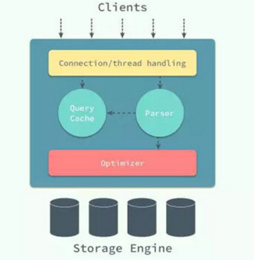

# MySQL

## 简介

### 数据库和实例

- 数据库：物理操作文件系统或其他形式文件类型的集合；
- 实例：MySQL 数据库由后台线程以及一个共享内存区组成；

在 MySQL 中，实例和数据库往往都是一一对应的，而我们也无法直接操作数据库，而是要通过数据库实例来操作数据库文件，可以理解为数据库实例是数据库为上层提供的一个专门用于操作的接口。 

在 Unix 上，启动一个 MySQL 实例往往会产生两个进程， mysqld 就是真正的数据库服务守护进程，而 mysqld_safe是一个用于检查和设置 mysqld 启动的控制程序，它负责监控 MySQL 进程的执行，当 mysqld 发生错误时， mysqld_safe 会对其状态进行检查并在合适的条件下重启。 

### 架构设计

MySQL 从第一个版本发布到现在已经有了 20 多年的历史，在这么多年的发展和演变中，整个应用的体系结构变得越来越复杂： 



最上层用于连接、线程处理的部分并不是 MySQL 『发明』的，很多服务都有类似的组成部分；第二层中包含了大多数 MySQL 的核心服务，包括了对 SQL 的解析、分析、优化和缓存等功能，存储过程、触发器和视图都是在这里实现的；而第三层就是 MySQL 中真正负责数据的存储和提取的存储引擎，例如：InnoDB、MyISAM 等，文中对存储引擎的介绍都是对 InnoDB 实现的分析。 

### 存储引擎

　　myisam：

　　是按照数据插入的顺序存储在磁盘上的，myisam中的主键索引和二级索引在结构上并没有什么不同，主键索引就是一个名为primary的唯一非空索引。

　　innodb：

　　因为innodb支持聚集索引，所以使用非常不同的方式存储同样的数据，innodb聚集索引包含了整个表的数据，而不是只有索引，因为在Innodb中，聚集索引就是表，所以不像myisam那样需要独立的行存储。聚集索引的每一个叶子节点都包含了主键值，事务ID，用于事务和MVCC的回滚指针以及所有剩余列的值，如果主键是一个列前缀索引，innodb也会包含完整的主键列和剩下的列的值。innodb二级索引的叶子节点中存储的不是行指针，而是主键值，并以此作为指向行的指针，这样的策略减少了当出现行移动或者数据页的分裂时二级索引的维护工作，使用主键值当做指针会让二级索引占用更多的空间，换来的好处是，innodb在移动行时无须更新二级索引中的这个指针。

## 数据的存储

### 存储结构

在整个数据库体系结构中，我们可以使用不同的存储引擎来存储数据，而绝大多数存储引擎都以二进制的形式存储数据；在 InnoDB 存储引擎中，所有的数据都被逻辑地存放在表空间中，表空间（tablespace）是存储引擎中最高的存储逻辑单位，在表空间的下面又包括段（segment）、区（extent）、页（page） 。

 

同一个数据库实例的所有表空间都有相同的页大小；默认情况下，表空间中的页大小都为 16KB，当然也可以通过改变 innodb_page_size 选项对默认大小进行修改，需要注意的是不同的页大小最终也会导致区大小的不同。在 InnoDB 存储引擎中，一个区的大小最小为 1MB，页的数量最少为 64 个。 

### 数据文件

MySQL 使用 InnoDB 存储表时，会将表的定义和数据索引等信息分开存储，其中前者存储在 .frm 文件中，后者存储在 .ibd 文件中。


​	①.frm 文件

​	无论在 MySQL 中选择了哪个存储引擎，所有的 MySQL 表都会在硬盘上创建一个 .frm 文件用来描述表的格式或者说定义； .frm 文件的格式在不同的平台上都是相同的。 

​	②.ibd 文件

​	InnoDB 中用于存储数据的文件总共有两个部分，一是系统表空间文件，包括 ibdata1、 ibdata2 等文件，其中存储了 InnoDB 系统信息和用户数据库表数据和索引，是所有表公用的。当打开 innodb_file_per_table 选项时， .ibd 文件就是每一个表独有的表空间，文件存储了当前表的数据和相关的索引数据。

### 文件格式

​	与现有的大多数存储引擎一样，InnoDB 使用页作为磁盘管理的最小单位；数据在 InnoDB 存储引擎中都是按行存储的，每个 16KB 大小的页中可以存放 2-200 行的记录。 

​	

​	Antelope 是 InnoDB 最开始支持的文件格式，它包含两种行格式 Compact 和 Redundant，它最开始并没有名字；Antelope 的名字是在新的文件格式 Barracuda 出现后才起的，Barracuda 的出现引入了两种新的行格式 Compressed 和 Dynamic；InnoDB 对于文件格式都会向前兼容，而官方文档中也对之后会出现的新文件格式预先定义好了名字：Cheetah、Dragon、Elk 等等。 

​	两种行记录格式 Compact 和 Redundant 在磁盘上按照以下方式存储： 


Compact 和 Redundant 格式最大的不同就是记录格式的第一个部分；在 Compact 中，行记录的第一部分倒序存放了一行数据中列的长度（Length），而 Redundant 中存的是每一列的偏移量（Offset），从总体上上看，Compact 行记录格式相比 Redundant 格式能够减少 20% 的存储空间。 

​	当 InnoDB 使用 Compact 或者 Redundant 格式存储极长的 VARCHAR 或者 BLOB 这类大对象时，我们并不会直接将所有的内容都存放在数据页节点中，而是将行数据中的前 768 个字节存储在数据页中，后面会通过偏移量指向溢出页。 但是当我们使用新的行记录格式 Compressed 或者 Dynamic 时都只会在行记录中保存 20 个字节的指针，实际的数据都会存放在溢出页面中。 

### 	**数据页结构** 

​	页是 InnoDB 存储引擎管理数据的最小磁盘单位，而 B-Tree 节点就是实际存放表中数据的页面，一个 InnoDB 页有以下七个部分 ，每一个页中包含了两对 header/trailer：内部的 Page Header/Page Directory 关心的是页的状态信息，而 Fil Header/Fil Trailer 关心的是记录页的头信息。 在页的头部和尾部之间就是用户记录和空闲空间了，每一个数据页中都包含 Infimum 和 Supremum 这两个虚拟的记录（可以理解为占位符），Infimum 记录是比该页中任何主键值都要小的值，Supremum 是该页中的最大值 。


​	User Records 就是整个页面中真正用于存放行记录的部分，而 Free Space 就是空余空间了，它是一个链表的数据结构，为了保证插入和删除的效率，整个页面并不会按照主键顺序对所有记录进行排序，它会自动从左侧向右寻找空白节点进行插入，行记录在物理存储上并不是按照顺序的，它们之间的顺序是由 next_record 这一指针控制的。 

​	B+ 树在查找对应的记录时，并不会直接从树中找出对应的行记录，它只能获取记录所在的页，将整个页加载到内存中，再通过 Page Directory 中存储的稀疏索引和 n_owned、 next_record 属性取出对应的记录，不过因为这一操作是在内存中进行的，所以通常会忽略这部分查找的耗时。 

## 索引

### 	索引的数据结构

​	InnoDB 存储引擎在绝大多数情况下使用 B+ 树建立索引，这是关系型数据库中查找最为常用和有效的索引，但是 B+ 树索引并不能找到一个给定键对应的具体值，它只能找到数据行对应的页，数据库把整个页读入到内存中，并在内存中查找具体的数据行。 B+ 树是平衡树，它查找任意节点所耗费的时间都是完全相同的，比较的次数就是 B+ 树的高度 。


### 	聚集索引和辅助索引

​	数据库中的 B+ 树索引可以分为聚集索引（clustered index）和辅助索引（secondary index），它们之间的最大区别就是，聚集索引中存放着一条行记录的全部信息，而辅助索引中只包含索引列和一个用于查找对应行记录的『书签』。 

​	①聚集索引

​	InnoDB 存储引擎中的表都是使用索引组织的，也就是按照键的顺序存放；聚集索引就是按照表中主键的顺序构建一颗 B+ 树，并在叶节点中存放表中的行记录数据。 聚集索引与表的物理存储方式有着非常密切的关系，所有正常的表应该有且仅有一个聚集索引（绝大多数情况下都是主键），表中的所有行记录数据都是按照聚集索引的顺序存放的。 当我们使用聚集索引对表中的数据进行检索时，可以直接获得聚集索引所对应的整条行记录数据所在的页，不需要进行第二次操作。 

​	在innodb表中按主键顺序插入行，如果正在使用Innodb表并且没有什么数据需要聚集，那么可以定义一个代理键作为主键，这种主键的数据应该和应用无关，最简单的方法是使用auto_increment自增列，这样可以保证数据行是按顺序插入的，对于根据主键做关联操作的性能也会更好。

　　不要使用UUID来作为聚集索引，否则性能会很糟糕，因为它使得聚集索引的插入变得完全随机，使得数据没有任何聚集特性。因为UUID作为主键插入行不仅花费的时间更长，而且索引也更大，这一方面是因为主键字段变长了，另外一方面毫无疑问是由于页分裂导致时间变长和碎片导致的索引变大。因为主键的值是顺序的，所以Innodb把每一条记录都存储在上一条记录的后面，当达到页的最大填充因子时（innodb默认的最大填充因子是页大小的十六分之十五，留出部分空间用于以后修改），下一条记录就会写入新的页中，一旦数据按照这种顺序的方式加载，主键页就会近似被顺序的记录填满，这也正是所期望的结果（然而，二级索引页可能是不一样的）。

​	优点：

​		A：可以把相关数据保存在一起，如：实现电子邮箱时，可以根据用户ID来聚集数据，这样只需要从磁盘读取少量的数据页就能获取某个用户全部邮件，如果没有使用聚集索引，则每封邮件都可能导致一次磁盘IO

　　	B：数据访问更快，聚集索引将索引和数据保存在同一个btree中，因此从聚集索引中获取数据通常比在非聚集索引中查找要快

　　	C：使用覆盖索引扫描的查询可以直接使用页节点中的主键值

​	缺点：

​		A：聚簇数据最大限度地提高了IO密集型应用的性能，但如果数据全部放在内存中，则访问的顺序就没有那么重要了，聚集索引也没有什么优势了

　　	B：插入速度严重依赖于插入顺序，按照主键的顺序插入是加载数据到innodb表中速度最快的方式，但如果不是按照主键顺序加载数据，那么在加载完成后最好使用optimize table命令重新组织一下表

　　	C：更新聚集索引列的代价很高，因为会强制innodb将每个被更新的行移动到新的位置

　　	D：基于聚集索引的表在插入新行，或者主键被更新导致需要移动行的时候，可能面临页分裂的问题，当行的主键值要求必须将这一行插入到某个已满的页中时，存储引擎会将该页分裂成两个页面来容纳该行，这就是一次页分裂操作，页分裂会导致表占用更多的磁盘空间

　　	E：聚集索引可能导致全表扫描变慢，尤其是行比较稀疏，或者由于页分裂导致数据存储不连续的时候

​	②辅助索引

​	数据库将所有的非聚集索引都划分为辅助索引；辅助索引也是通过 B+ 树实现的，但是它的叶节点并不包含行记录的全部数据，仅包含索引中的所有键和一个用于查找对应行记录的『书签』，在 InnoDB 中这个书签就是当前记录的主键。辅助索引的存在并不会影响聚集索引，因为聚集索引构成的 B+ 树是数据实际存储的形式，而辅助索引只用于加速数据的查找，所以一张表上往往有多个辅助索引以此来提升数据库的性能。一张表一定包含一个聚集索引构成的 B+ 树以及若干辅助索引的构成的 B+ 树。

## 	并发控制机制

​	InnoDB 存储引擎中使用的就是悲观锁，而按照锁的粒度划分，也可以分成行锁和表锁。 乐观锁和悲观锁其实都是并发控制的机制，同时它们在原理上就有着本质的差别；

- 乐观锁是一种思想，它其实并不是一种真正的『锁』，它会先尝试对资源进行修改，在写回时判断资源是否进行了改变，如果没有发生改变就会写回，否则就会进行重试，在整个的执行过程中其实都没有对数据库进行加锁；
- 悲观锁就是一种真正的锁了，它会在获取资源前对资源进行加锁，确保同一时刻只有有限的线程能够访问该资源，其他想要尝试获取资源的操作都会进入等待状态，直到该线程完成了对资源的操作并且释放了锁后，其他线程才能重新操作资源；

虽然乐观锁和悲观锁在本质上并不是同一种东西，一个是一种思想，另一个是一种真正的锁，但是它们都是一种并发控制机制。乐观锁不会存在死锁的问题，但是由于更新后验证，所以当冲突频率和重试成本较高时更推荐使用悲观锁，而需要非常高的响应速度并且并发量非常大的时候使用乐观锁就能较好的解决问题，在这时使用悲观锁就可能出现严重的性能问题；在选择并发控制机制时，需要综合考虑上面的四个方面（冲突频率、重试成本、响应速度和并发量）进行选择。 

### 	锁的种类和粒度

​	对数据的操作其实只有两种，也就是读和写，而数据库在实现锁时，也会对这两种操作使用不同的锁；InnoDB 实现了标准的行级锁，也就是共享锁（Shared Lock）和互斥锁（Exclusive Lock）；共享锁代表了读操作、互斥锁代表了写操作，所以我们可以在数据库中并行读，但是只能串行写，只有这样才能保证不会发生线程竞争，实现线程安全。 

- 共享锁（读锁）：允许事务对一条行数据进行读取；
- 互斥锁（写锁）：允许事务对一条行数据进行删除或更新；

无论是共享锁还是互斥锁其实都只是对某一个数据行进行加锁，InnoDB 支持多种粒度的锁，也就是行锁和表锁；为了支持多粒度锁定，InnoDB 存储引擎引入了意向锁（Intention Lock），意向锁就是一种表级锁。 意向锁其实不会阻塞全表扫描之外的任何请求，它们的主要目的是为了表示是否有人请求锁定表中的某一行数据。 

- 意向共享锁：事务想要在获得表中某些记录的共享锁，需要在表上先加意向共享锁；
- 意向互斥锁：事务想要在获得表中某些记录的互斥锁，需要在表上先加意向互斥锁；


### 	锁的算法

- Record Lock:记录锁（Record Lock）是加到索引记录上的锁 。通过对索引的加锁实现；只有通过索引条件检索数据时，InnoDB才使用行级锁，否则，InnoDB将使用表锁 

- Gap Lock：记录锁是在存储引擎中最为常见的锁，除了记录锁之外，InnoDB 中还存在间隙锁（Gap Lock），间隙锁是对索引记录中的一段连续区域的锁；当使用类似 SELECT*FROM users WHERE id BETWEEN10AND20FOR UPDATE;的 SQL 语句时，就会阻止其他事务向表中插入 id=15 的记录，因为整个范围都被间隙锁锁定了。 间隙锁是存储引擎对于性能和并发做出的权衡，并且只用于某些事务隔离级别。

  虽然间隙锁中也分为共享锁和互斥锁，不过它们之间并不是互斥的，也就是不同的事务可以同时持有一段相同范围的共享锁和互斥锁，它唯一阻止的就是其他事务向这个范围中添加新的记录。

- Next-Key Lock：Next-Key 锁锁定的是当前值和前面的范围。 当我们更新一条记录，比如 SELECT*FROM users WHERE age=30FOR UPDATE;，InnoDB 不仅会在范围 (21,30] 上加 Next-Key 锁，还会在这条记录后面的范围 (30,40] 加间隙锁，所以插入 (21,40]范围内的记录都会被锁定。 

### 事务与隔离级别

​	 ACID 四大特性：原子性（Atomicity）、一致性（Consistency）、隔离性（Isolation）和持久性（Durability） 

​	ISO 和 ANIS SQL 标准制定了四种事务隔离级别，而 InnoDB 遵循了 SQL:1992 标准中的四种隔离级别： READ UNCOMMITED、 READ COMMITED、 REPEATABLE READ和 SERIALIZABLE；每个事务的隔离级别其实都比上一级多解决了一个问题：

- RAED UNCOMMITED：使用查询语句不会加锁，可能会读到未提交的行（Dirty Read）；
- READ COMMITED：只对记录加记录锁，而不会在记录之间加间隙锁，所以允许新的记录插入到被锁定记录的附近，所以再多次使用查询语句时，可能得到不同的结果（Non-Repeatable Read）；
- REPEATABLE READ：多次读取同一范围的数据会返回第一次查询的快照，不会返回不同的数据行，但是可能发生幻读（Phantom Read）；
- SERIALIZABLE：InnoDB 隐式地将全部的查询语句加上共享锁，解决了幻读的问题；

MySQL 中默认的事务隔离级别就是 REPEATABLE READ，但是它通过 Next-Key 锁也能够在某种程度上解决幻读的问题。

​	lREAD_UNCOMMITTED会出现脏读、不可重复读、幻读(隔离级别最低，并发性能高)

​	lREAD_COMMITTED会出现不可重复读、幻读问题（锁定正在读取的行）

​	lREPEATABLE_READ会出幻读（锁定所读取的所有行）

​	lSERIALIZABLE保证所有的情况不会发生（锁表）

## 调优

### 	索引优化

​		①缺省情况下建立的索引是非聚簇索引，但有时它并不是最佳的。在非群集索引下，数据在物理上随机存放在数据页上。合理的索引设计要建立在对各种查询的分析和预测上。一般来说：  　　

​		a.有大量重复值、且经常有范围查询（ > ,< ，> =,< =）和order by、group by发生的列，可考  　　虑建立聚集索引；  　　

​		b.经常同时存取多列，且每列都含有重复值可考虑建立组合索引；  　　

​		c.组合索引要尽量使关键查询形成索引覆盖，其前导列一定是使用最频繁的列。索引虽有助于提高性能但不是索引越多越好，恰好相反过多的索引会导致系统低效。用户在表中每加进一个索引，维护索引集合就要做相应的更新工作。  		

​		②ORDER BY和GROPU BY使用ORDER BY和GROUP BY短语，任何一种索引都有助于SELECT的性能提高。  

​		③多表操作在被实际执行前，查询优化器会根据连接条件，列出几组可能的连接方案并从中找出系统开销最小的最佳方案。连接条件要充份考虑带有索引的表、行数多的表；内外表的选择可由公式：外层表中的匹配行数*内层表中每一次查找的次数确定，乘积最小为最佳方案。

​		④任何对列的操作都将导致表扫描，它包括数据库函数、计算表达式等等，查询时要尽可能将操作移至等号右边。  

​		⑤IN、OR子句常会使用工作表，使索引失效。如果不产生大量重复值，可以考虑把子句拆开。拆开的子句中应该包含索引。 

### 	缓存优化

​		①足够大的 innodb_buffer_pool_size

​		推荐将数据全然保存在 innodb_buffer_pool_size ，即按存储量规划 innodb_buffer_pool_size 的容量。这样你能够全然从内存中读取数据。最大限度降低磁盘操作。

​		② 数据预热

​		默认情况，仅仅有某条数据被读取一次，才会缓存在 innodb_buffer_pool。所以，数据库刚刚启动，须要进行数据预热，将磁盘上的全部数据缓存到内存中。数据预热能够提高读取速度。

​		③不要让数据存到 SWAP 中

​		假设是专用 MYSQL server。能够禁用 SWAP，假设是共享server，确定 innodb_buffer_pool_size 足够大。或者使用固定的内存空间做缓存，使用 memlock 指令。

### 	写入优化

​		①使用足够大的写入缓存 innodb_log_file_size

​		可是须要注意假设用 1G 的 innodb_log_file_size 。假如server当机。须要 10 分钟来恢复。推荐 innodb_log_file_size 设置为 0.25 * innodb_buffer_pool_size

​		②innodb_flush_log_at_trx_commit

​		这个选项和写磁盘操作密切相关：

​		innodb_flush_log_at_trx_commit = 1 则每次改动写入磁盘
		innodb_flush_log_at_trx_commit = 0/2 每秒写入磁盘

​		假设你的应用不涉及非常高的安全性 (金融系统)，或者基础架构足够安全，或者 事务都非常小，都能够用 0 或者 2 来减少磁盘操作。

​		③避免双写入缓冲

```
innodb_flush_method=O_DIRECT
```

​		④提高磁盘读写速度

​		RAID0 尤其是在使用 EC2 这样的虚拟磁盘 (EBS) 的时候，使用软 RAID0 很重要。

### 	碎片优化

​		删除数据必然会在数据文件中造成不连续的空白空间,而当插入数据时,这些空白空间不会被利用起来.于是造成了数据的存储位置不连续,以及物理存储顺序与理论上的排序顺序不同,这种是数据碎片.实际上数据碎片分为两种,一种是单行数据碎片,另一种是多行数据碎片.前者的意思就是一行数据,被分成N个片段,存储在N个位置.后者的就是多行数据并未按照逻辑上的顺序排列.当有大量的删除和插入操作时,必然会产生很多未使用的空白空间,这些空间就是多出来的额外空间.索引也是文件数据,所以也会产生索引碎片,理由同上,大概就是顺序紊乱的问题.Engine 不同,OPTIMIZE 的操作也不一样的,MyISAM 因为索引和数据是分开的,所以 OPTIMIZE 可以整理数据文件,并重排索引。这样不但会浪费空间，并且查询速度也更慢。 

​	查看表碎片的方法

```
mysql> select ROW_FORMAT,TABLE_ROWS,DATA_LENGTH,INDEX_LENGTH,MAX_DATA_LENGTH,DATA_FREE,ENGINE from TABLES where TABLE_SCHEMA='test_db' and TABLE_NAME='table_name' limit 1;
```

​	通过OPTIMIZE TABLE　table_name 后再查询一下结果 


​	

​	

​	