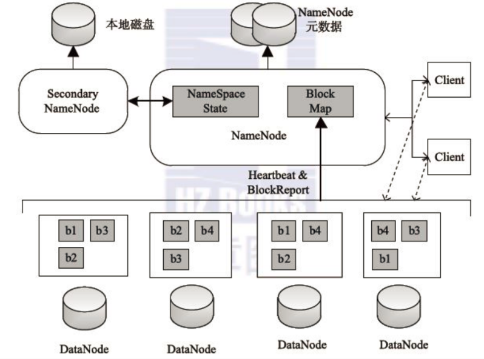
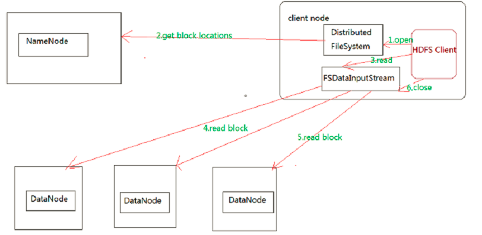
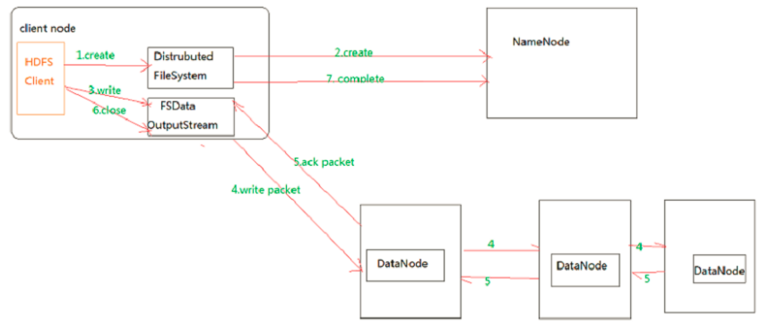
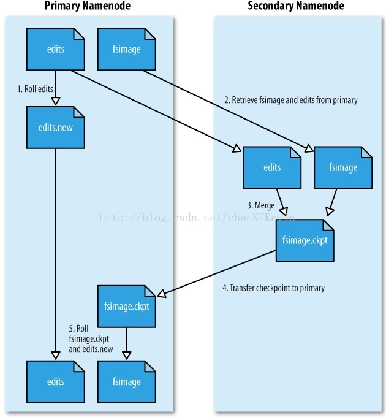

# HDFS

## 概要

HDFS（Hadoop Distributed File System）是Hadoop项目的核心子项目，是分布式计算中数据存储管理的基础，是基于流数据模式访问和处理超大文件的需求而开发的，可以运行于廉价的商用服务器上。它所具有的高容错、高可靠性、高可扩展性、高获得性、高吞吐率等特征为海量数据提供了不怕故障的存储，为超大数据集（Large Data Set）的应用处理带来了很多便利。 

HDFS 的优点：

1、高容错性

1)数据自动保存多个副本。它通过增加副本的形式，提高容错性
2)某一个副本丢失以后，它可以自动恢复，这是由 HDFS 内部机制实现的，我们不必关心。

2、适合批处理

1)它是通过移动计算而不是移动数据
2)它会把数据位置暴露给计算框架。

3、适合[大数据](http://lib.csdn.net/base/hadoop)处理

1)处理数据达到 GB、TB、甚至PB级别的数据。

2)能够处理百万规模以上的文件数量，数量相当之大。
3)能够处理10K节点的规模

4、流式文件访问
1)一次写入，多次读取。文件一旦写入不能修改，只能追加。
2)它能保证数据的一致性。

5、可构建在廉价机器上
1)它通过多副本机制，提高可靠性。

2)它提供了容错和恢复机制。比如某一个副本丢失，可以通过其它副本来恢复。 
HDFS 缺点（不适用适用HDFS的场景）： 
1、低延时数据访问 
1)比如毫秒级的来存储数据，这是不行的，它做不到。
2)它适合高吞吐率的场景，就是在某一时间内写入大量的数据。但是它在低延时的情况下是不行的，比如毫秒级以内读取数据，这样它是很难做到的。

2、小文件存储 
1)存储大量小文件的话，它会占用 NameNode大量的内存来存储文件、目录和块信息。这样是不可取的，因为NameNode的内存总是有限的。
2)小文件存储的寻道时间会超过读取时间，它违反了HDFS的设计目标。

3、并发写入、文件随机修改

1)一个文件只能有一个写，不允许多个线程同时写。 
2)仅支持数据 append（追加），不支持文件的随机修改。

## 架构



HDFS 采用Master/Slave的架构来存储数据，这种架构主要由四个部分组成，分别为HDFS Client、NameNode、DataNode和Secondary NameNode。下面我们分别介绍这四个组成部分。

Client：就是客户端。

​       1、文件切分。文件上传 HDFS 的时候，Client 将文件切分成 一个一个的Block，然后进行存储。

​       2、与 NameNode 交互，获取文件的位置信息。

​      3、与 DataNode 交互，读取或者写入数据。

​       4、Client 提供一些命令来管理 HDFS，比如启动或者关闭HDFS。

​       5、Client 可以通过一些命令来访问 HDFS。

NameNode：就是 master，它是一个主管、管理者。

​      1、管理 HDFS 的名称空间。

​       2、管理数据块（Block）映射信息

​       3、配置副本策略

​      4、处理客户端读写请求。

DataNode：就是Slave。NameNode 下达命令，DataNode 执行实际的操作。

​       1、存储实际的数据块。

​       2、执行数据块的读/写操作。

Secondary NameNode：并非 NameNode 的热备。当NameNode 挂掉的时候，它并不能马上替换 NameNode 并提供服务。

​       1、辅助 NameNode，分担其工作量。

​      2、定期合并 fsimage和fsedits，并推送给NameNode。

​       3、在紧急情况下，可辅助恢复 NameNode。

(四) HDFS 如何读取文件？ 
HDFS 读取文件步骤图：



HDFS的文件读取原理，详细解析如下：

​     1、首先调用FileSystem对象的open方法，其实获取的是一个DistributedFileSystem的实例。

​         2、DistributedFileSystem通过RPC(远程过程调用)获得文件的第一批block的locations，同一block按照重复数会返回多个locations，这些locations按照[Hadoop](http://lib.csdn.net/base/hadoop)拓扑结构排序，距离客户端近的排在前面。

​     3、前两步会返回一个FSDataInputStream对象，该对象会被封装成 DFSInputStream对象，DFSInputStream可以方便的管理datanode和namenode数据流。客户端调用read方 法，DFSInputStream就会找出离客户端最近的datanode并连接datanode。

​           4、数据从datanode源源不断的流向客户端。

​          5、如果第一个block块的数据读完了，就会关闭指向第一个block块的datanode连接，接着读取下一个block块。这些操作对客户端来说是透明的，从客户端的角度来看只是读一个持续不断的流。

​         6、如果第一批block都读完了，DFSInputStream就会去namenode拿下一批blocks的location，然后继续读，如果所有的block块都读完，这时就会关闭掉所有的流。 
（五） HDFS 如何写入文件？ 
HDFS的文件写入步骤图: 



HDFS的文件写入原理详细步骤解析：

​      1.客户端通过调用 DistributedFileSystem 的create方法，创建一个新的文件。

​      2.DistributedFileSystem 通过 RPC（远程过程调用）调用 NameNode，去创建一个没有blocks关联的新文件。创建前，NameNode 会做各种校验，比如文件是否存在，客户端有无权限去创建等。如果校验通过，NameNode 就会记录下新文件，否则就会抛出IO异常。

​      3.前两步结束后会返回 FSDataOutputStream 的对象，和读文件的时候相似，FSDataOutputStream 被封装成 DFSOutputStream，DFSOutputStream 可以协调 NameNode和 DataNode。客户端开始写数据到DFSOutputStream,DFSOutputStream会把数据切成一个个小packet，然后排成队列 data queue。

​      4.DataStreamer 会去处理接受 data queue，它先问询 NameNode 这个新的 block 最适合存储的在哪几个DataNode里，比如重复数是3，那么就找到3个最适合的 DataNode，把它们排成一个 pipeline。DataStreamer 把 packet 按队列输出到管道的第一个 DataNode 中，第一个 DataNode又把 packet 输出到第二个 DataNode 中，以此类推。

​      5.DFSOutputStream 还有一个队列叫 ack queue，也是由 packet 组成，等待DataNode的收到响应，当pipeline中的所有DataNode都表示已经收到的时候，这时akc queue才会把对应的packet包移除掉。

​      6.客户端完成写数据后，调用close方法关闭写入流。

​      7.DataStreamer 把剩余的包都刷到 pipeline 里，然后等待 ack 信息，收到最后一个 ack 后，通知 DataNode 把文件标示为已完成。

## Namenode 

Namenode主要维护两个文件，一个是fsimage，一个是editlog。

fsimage保存了最新的元数据检查点，包含了整个HDFS文件系统的所有目录和文件的信息。对于文件来说包括了数据块描述信息、修改时间、访问时间等；对于目录来说包括修改时间、访问权限控制信息(目录所属用户，所在组)等。

editlog主要是在NameNode已经启动情况下对HDFS进行的各种更新操作进行记录，HDFS客户端执行所有的写操作都会被记录到editlog中。

简单来想，NameNode维护了文件与数据块的映射表以及数据块与数据节点的映射表，什么意思呢？就是一个文件，它切分成了几个数据块，以及这些数据块分别存储在哪些datanode上，namenode一清二楚。Fsimage就是在某一时刻，整个hdfs 的快照，就是这个时刻hdfs上所有的文件块和目录，分别的状态，位于哪些个datanode，各自的权限，各自的副本个数。然后客户端对hdfs所有的更新操作，比如说移动数据，或者删除数据，都会记录在editlog中。

为了避免editlog不断增大，secondary namenode会周期性合并fsimage和edits成新的fsimage，新的操作记录会写入新的editlog中，这个周期可以自己设置（editlog到达一定大小或者定时）。



可以很清晰看出，第一步：将hdfs更新记录写入一个新的文件——edits.new。

第二步：将fsimage和editlog通过http协议发送至secondary namenode。

第三步：将fsimage与editlog合并，生成一个新的文件——fsimage.ckpt。这步之所以要在secondary namenode中进行，是因为比较耗时，如果在namenode中进行，或导致整个系统卡顿。

第四步：将生成的fsimage.ckpt通过http协议发送至namenode。

第五步：重命名fsimage.ckpt为fsimage，edits.new为edits。

 

这样的话，fsimage与editlog合并的过程就完成了。所以如果namenode宕机，其实secondary namenode还保存这一份不久前的fsimage，还能挽回一些损失吧。

另外上篇中说，一旦有datanode挂掉了（宕机或者是网络阻塞），namenode能很快感知到，并且将宕机的节点上的数据块转移至其余空闲节点。这点是因为hdfs中心跳机制（heartbeat）。

心跳机制默认3s中一次，datanode会向namenode发送一次一跳，告知namenode当前节点上存放的数据文件是什么。如果namenode中记录的是该datanode存放了文件A的两个数据块和文件B的一个数据块，但是心跳中只有文件A的一个数据块信息，namenode就会知道该datanode数据块损坏了，会把损坏的数据块在别的datanode上补充。

## 2.X 变化

我们知道，在Hadoop 2.x中解决了NameNode的单点故障问题；同时SecondaryName已经不用了，而之前的Hadoop 1.x中是通过SecondaryName来合并fsimage和edits以此来减小edits文件的大小，从而减少NameNode重启的时间。而在Hadoop 2.x中已经不用SecondaryName，那它是怎么来实现fsimage和edits合并的呢？首先我们得知道，在Hadoop 2.x中提供了HA机制（解决NameNode单点故障），可以通过配置奇数个JournalNode来实现HA，如何配置今天就不谈了！HA机制通过在同一个集群中运行两个NN（active NN & standby NN）来解决NameNode的单点故障，在任何时间，只有一台机器处于Active状态；另一台机器是处于Standby状态。Active NN负责集群中所有客户端的操作；而Standby NN主要用于备用，它主要维持足够的状态，如果必要，可以提供快速的故障恢复。 　　为了让Standby NN的状态和Active NN保持同步，即元数据保持一致，它们都将会和JournalNodes守护进程通信。当Active NN执行任何有关命名空间的修改，它需要持久化到一半以上的JournalNodes上(通过edits log持久化存储)，而Standby NN负责观察edits log的变化，它能够读取从JNs中读取edits信息，并更新其内部的命名空间。一旦Active NN出现故障，Standby NN将会保证从JNs中读出了全部的Edits，然后切换成Active状态。Standby NN读取全部的edits可确保发生故障转移之前，是和Active NN拥有完全同步的命名空间状态 　　那么这种机制是如何实现fsimage和edits的合并？在standby NameNode节点上会一直运行一个叫做CheckpointerThread的线程，这个线程调用StandbyCheckpointer类的doWork()函数，而doWork函数会每隔Math.min(checkpointCheckPeriod, checkpointPeriod)秒来坐一次合并操作，相关代码如下： 

```
try{
          Thread.sleep(1000* checkpointConf.getCheckPeriod());
        }catch(InterruptedException ie) {
}
 
publiclonggetCheckPeriod() {
    returnMath.min(checkpointCheckPeriod, checkpointPeriod);
}
 
checkpointCheckPeriod = conf.getLong(
        DFS_NAMENODE_CHECKPOINT_CHECK_PERIOD_KEY,
        DFS_NAMENODE_CHECKPOINT_CHECK_PERIOD_DEFAULT);
         
checkpointPeriod = conf.getLong(DFS_NAMENODE_CHECKPOINT_PERIOD_KEY,
                                DFS_NAMENODE_CHECKPOINT_PERIOD_DEFAULT);
try{
          Thread.sleep(1000* checkpointConf.getCheckPeriod());
        }catch(InterruptedException ie) {
}
 
publiclonggetCheckPeriod() {
    returnMath.min(checkpointCheckPeriod, checkpointPeriod);
}
 
checkpointCheckPeriod = conf.getLong(
        DFS_NAMENODE_CHECKPOINT_CHECK_PERIOD_KEY,
        DFS_NAMENODE_CHECKPOINT_CHECK_PERIOD_DEFAULT);
         
checkpointPeriod = conf.getLong(DFS_NAMENODE_CHECKPOINT_PERIOD_KEY,
                                DFS_NAMENODE_CHECKPOINT_PERIOD_DEFAULT);

```

