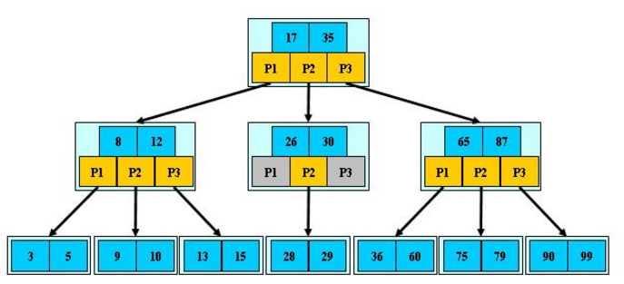

# JDK数据结构

## List

​	List是一个有序的集合，和set不同的是，List允许存储项的值为空，也允许存储相等值的存储项。List是继承于Collection接口，除了Collection通用的方法以外，扩展了部分只属于List的方法。 


### 	ArraryList

​	ArrayList是一个数组实现的列表，由于数据是存入数组中的，所以它的特点也和数组一样，查询很快，但是中间部分的插入和删除很慢。 扩容为原来的1.5倍，调用native方法赋值对象。初始大小和vector一样都是10。

```
private void grow(int minCapacity) {
        // overflow-conscious code
        int oldCapacity = elementData.length;
        int newCapacity = oldCapacity + (oldCapacity >> 1);
        if (newCapacity - minCapacity < 0)
            newCapacity = minCapacity;
        if (newCapacity - MAX_ARRAY_SIZE > 0)
            newCapacity = hugeCapacity(minCapacity);
        // minCapacity is usually close to size, so this is a win:
        elementData = Arrays.copyOf(elementData, newCapacity);
    }
   
   
public static native void arraycopy(Object src,  int  srcPos,
                                        Object dest, int destPos,
                                        int length);
```

### 	Vector

​	Vector就是ArrayList的线程安全版，它的方法前都加了synchronized锁，其他实现逻辑都相同。 

​	当前的数组已经满了，实际上需要扩展数组的长度。常见的手法就是新建一个当前数组长度两倍的数组，再将当前数组的元素给拷贝过去。我们可以用一个capacityIncrement来指示调整数组长度的时候到底增加多少。默认的情况下相当于数组长度翻倍，如果设置了这个变量就增加这个变量指定的这么多。栈最大的长度取决于vector里面数组能有多长。这里vector里面最大能取到Integer.MAX_VALUE。

```
private void grow(int minCapacity) {
        // overflow-conscious code
        int oldCapacity = elementData.length;
        int newCapacity = oldCapacity + ((capacityIncrement > 0) ?
                                         capacityIncrement : oldCapacity);
        if (newCapacity - minCapacity < 0)
            newCapacity = minCapacity;
        if (newCapacity - MAX_ARRAY_SIZE > 0)
            newCapacity = hugeCapacity(minCapacity);
        elementData = Arrays.copyOf(elementData, newCapacity);
    }
```

### 	LinkedList

​	故名思意就是链表，和我们大学在数据结构里学的链表是一会事，LinkedList还是一个双向链表。 LinkedList继承于AbstractSequentialList,和ArrayList一个套路。内部维护了3个成员变量，一个是当前链表的头节点，一个是尾部节点，还有是链表长度。 

## Queue

​	队列是一种特殊的线性表，它只允许在表的前端（front）进行删除操作，而在表的后端（rear）进行插入操作。进行插入操作的端称为队尾，进行删除操作的端称为队头。队列中没有元素时，称为空队列。 在队列这种数据结构中，最先插入的元素将是最先被删除的元素；反之最后插入的元素将是最后被删除的元素，因此队列又称为“先进先出”（FIFO—first in first out）的线性表。

​	Queue使用时要尽量避免Collection的add()和remove()方法，而是要使用offer()来加入元素，使用poll()来获取并移出元素。它们的优点是通过返回值可以判断成功与否，add()和remove()方法在失败的时候会抛出异常。 如果要使用前端而不移出该元素，使用 element()或者peek()方法。 值得注意的是LinkedList类实现了Queue接口，因此我们可以把LinkedList当成Queue来用。 

## Stack

​	栈是Vector的一个子类，它实现了一个标准的后进先出的栈。堆栈只定义了默认构造函数，用来创建一个空栈。 堆栈除了包括由Vector定义的所有方法，也定义了自己的一些方法。

​	在java里面，如果我们普通定义的类型属于强引用类型。比如这里vector就底层用的Object[]这个数组强类型来保存数据。强类型在jvm中做gc的时候，只要程序中有引用到它，它是不会被回收的。这就意味着在这里，只要我们一直在用着stack，那么stack里面所有关联的元素就都别想释放了。这样运行时间一长就会导致内存泄露的问题。那么，为了解决这个问题，这里就是用的removeElementAt()方法。 就是用待删除元素的后面元素依次覆盖前面一个元素。这样，就相当于将数组的实际元素长度给缩短了。 

## Map


### 	HashMap


​	Java8 对 HashMap 进行了一些修改，最大的不同就是利用了红黑树，所以其由 数组+链表+红黑树 组成。根据 Java7 HashMap 的介绍，我们知道，查找的时候，根据 hash 值我们能够快速定位到数组的具体下标，但是之后的话，需要顺着链表一个个比较下去才能找到我们需要的，时间复杂度取决于链表的长度，为 O(n)。为了降低这部分的开销，在 Java8 中，当链表中的元素超过了 8 个以后，会将链表转换为红黑树，在这些位置进行查找的时候可以降低时间复杂度为 O(logN)。

```
static final int hash(Object key) {
        int h;
        return (key == null) ? 0 : (h = key.hashCode()) ^ (h >>> 16);
    }
 
// 第三个参数 onlyIfAbsent 如果是 true，那么只有在不存在该 key 时才会进行 put 操作
// 第四个参数 evict 我们这里不关心
final V putVal(int hash, K key, V value, boolean onlyIfAbsent,
               boolean evict) {
    Node<K,V>[] tab; Node<K,V> p; int n, i;
    // 第一次 put 值的时候，会触发下面的 resize()，类似 java7 的第一次 put 也要初始化数组长度
    // 第一次 resize 和后续的扩容有些不一样，因为这次是数组从 null 初始化到默认的 16 或自定义的初始容量
    if ((tab = table) == null || (n = tab.length) == 0)
        n = (tab = resize()).length;
    // 找到具体的数组下标，如果此位置没有值，那么直接初始化一下 Node 并放置在这个位置就可以了
    if ((p = tab[i = (n - 1) & hash]) == null)
        tab[i] = newNode(hash, key, value, null);
 
    else {// 数组该位置有数据
        Node<K,V> e; K k;
        // 首先，判断该位置的第一个数据和我们要插入的数据，key 是不是"相等"，如果是，取出这个节点
        if (p.hash == hash &&
            ((k = p.key) == key || (key != null && key.equals(k))))
            e = p;
        // 如果该节点是代表红黑树的节点，调用红黑树的插值方法，本文不展开说红黑树
        else if (p instanceof TreeNode)
            e = ((TreeNode<K,V>)p).putTreeVal(this, tab, hash, key, value);
        else {
            // 到这里，说明数组该位置上是一个链表
            for (int binCount = 0; ; ++binCount) {
                // 插入到链表的最后面(Java7 是插入到链表的最前面)
                if ((e = p.next) == null) {
                    p.next = newNode(hash, key, value, null);
                    // TREEIFY_THRESHOLD 为 8，所以，如果新插入的值是链表中的第 9 个
                    // 会触发下面的 treeifyBin，也就是将链表转换为红黑树
                    if (binCount >= TREEIFY_THRESHOLD - 1) // -1 for 1st
                        treeifyBin(tab, hash);
                    break;
                }
                // 如果在该链表中找到了"相等"的 key(== 或 equals)
                if (e.hash == hash &&
                    ((k = e.key) == key || (key != null && key.equals(k))))
                    // 此时 break，那么 e 为链表中[与要插入的新值的 key "相等"]的 node
                    break;
                p = e;
            }
        }
        // e!=null 说明存在旧值的key与要插入的key"相等"
        // 对于我们分析的put操作，下面这个 if 其实就是进行 "值覆盖"，然后返回旧值
        if (e != null) {
            V oldValue = e.value;
            if (!onlyIfAbsent || oldValue == null)
                e.value = value;
            afterNodeAccess(e);
            return oldValue;
        }
    }
    ++modCount;
    // 如果 HashMap 由于新插入这个值导致 size 已经超过了阈值，需要进行扩容
    if (++size > threshold)
        resize();
    afterNodeInsertion(evict);
    return null;
}
//resize() 方法用于初始化数组或数组扩容，每次扩容后，容量为原来的 2 倍，并进行数据迁移。
final Node<K,V>[] resize() {
    Node<K,V>[] oldTab = table;
    int oldCap = (oldTab == null) ? 0 : oldTab.length;
    int oldThr = threshold;
    int newCap, newThr = 0;
    if (oldCap > 0) { // 对应数组扩容
        if (oldCap >= MAXIMUM_CAPACITY) {
            threshold = Integer.MAX_VALUE;
            return oldTab;
        }
        // 将数组大小扩大一倍
        else if ((newCap = oldCap << 1) < MAXIMUM_CAPACITY &&
                 oldCap >= DEFAULT_INITIAL_CAPACITY)
            // 将阈值扩大一倍
            newThr = oldThr << 1; // double threshold
    }
    else if (oldThr > 0) // 对应使用 new HashMap(int initialCapacity) 初始化后，第一次 put 的时候
        newCap = oldThr;
    else {// 对应使用 new HashMap() 初始化后，第一次 put 的时候
        newCap = DEFAULT_INITIAL_CAPACITY;
        newThr = (int)(DEFAULT_LOAD_FACTOR * DEFAULT_INITIAL_CAPACITY);
    }
 
    if (newThr == 0) {
        float ft = (float)newCap * loadFactor;
        newThr = (newCap < MAXIMUM_CAPACITY && ft < (float)MAXIMUM_CAPACITY ?
                  (int)ft : Integer.MAX_VALUE);
    }
    threshold = newThr;
 
    // 用新的数组大小初始化新的数组
    Node<K,V>[] newTab = (Node<K,V>[])new Node[newCap];
    table = newTab; // 如果是初始化数组，到这里就结束了，返回 newTab 即可
 
    if (oldTab != null) {
        // 开始遍历原数组，进行数据迁移。
        for (int j = 0; j < oldCap; ++j) {
            Node<K,V> e;
            if ((e = oldTab[j]) != null) {
                oldTab[j] = null;
                // 如果该数组位置上只有单个元素，那就简单了，简单迁移这个元素就可以了
                if (e.next == null)
                    newTab[e.hash & (newCap - 1)] = e;
                // 如果是红黑树，具体我们就不展开了
                else if (e instanceof TreeNode)
                    ((TreeNode<K,V>)e).split(this, newTab, j, oldCap);
                else { 
                    // 这块是处理链表的情况，
                    // 需要将此链表拆成两个链表，放到新的数组中，并且保留原来的先后顺序
                    // loHead、loTail 对应一条链表，hiHead、hiTail 对应另一条链表，代码还是比较简单的
                    Node<K,V> loHead = null, loTail = null;
                    Node<K,V> hiHead = null, hiTail = null;
                    Node<K,V> next;
                    do {
                        next = e.next;
                        if ((e.hash & oldCap) == 0) {
                            if (loTail == null)
                                loHead = e;
                            else
                                loTail.next = e;
                            loTail = e;
                        }
                        else {
                            if (hiTail == null)
                                hiHead = e;
                            else
                                hiTail.next = e;
                            hiTail = e;
                        }
                    } while ((e = next) != null);
                    if (loTail != null) {
                        loTail.next = null;
                        // 第一条链表
                        newTab[j] = loHead;
                    }
                    if (hiTail != null) {
                        hiTail.next = null;
                        // 第二条链表的新的位置是 j + oldCap，这个很好理解
                        newTab[j + oldCap] = hiHead;
                    }
                }
            }
        }
    }
    return newTab;
}

final Node<K,V> getNode(int hash, Object key) {
    Node<K,V>[] tab; Node<K,V> first, e; int n; K k;
    if ((tab = table) != null && (n = tab.length) > 0 &&
        (first = tab[(n - 1) & hash]) != null) {
        // 判断第一个节点是不是就是需要的
        if (first.hash == hash && // always check first node
            ((k = first.key) == key || (key != null && key.equals(k))))
            return first;
        if ((e = first.next) != null) {
            // 判断是否是红黑树
            if (first instanceof TreeNode)
                return ((TreeNode<K,V>)first).getTreeNode(hash, key);
 
            // 链表遍历
            do {
                if (e.hash == hash &&
                    ((k = e.key) == key || (key != null && key.equals(k))))
                    return e;
            } while ((e = e.next) != null);
        }
    }
    return null;
}
```

### 	Hashtable

​		成员变量：

​		①table是一个Entry[]数组类型，而Entry实际上就是一个单向链表。哈希表的"key-value键值对"都是存储在Entry数组中的。 

​		②count是Hashtable的大小，它是Hashtable保存的键值对的数量。 

​		③threshold是Hashtable的阈值，用于判断是否需要调整Hashtable的容量。threshold的值="容量*加载因子"。

​		④loadFactor就是加载因子。

​		⑤modCount是用来实现fail-fast机制的。keySet,values,entrySet返回的迭代都是fail-fast模式的。当迭代创建后的任何时间里任何方式Hashtable的结构变了，迭代都会抛出 ConcurrentModificationException异常 （如果迭代只是自己调用了remove,不会有异常）。因此，一旦碰到并发改动，迭代就快速干脆的失败报错了，而不是把这种不定的风险，无法预料的行为留在未知后期。 

​		Hashtable和HashMap的不同：

​		①基类不同：HashTable基于Dictionary类，而HashMap是基于AbstractMap。Dictionary是什么？它是任何可将键映射到相应值的类的抽象父类，而AbstractMap是基于Map接口的骨干实现，它以最大限度地减少实现此接口所需的工作。

​		②null不同：HashMap可以允许存在一个为null的key和任意个为null的value，但是HashTable中的key和value都不允许为null。

​		③线程安全：HashMap时单线程安全的，Hashtable是多线程安全的。

​		④遍历不同：HashMap仅支持Iterator的遍历方式，Hashtable支持Iterator和Enumeration两种遍历方式。

### 	LinkedHashMap

​		HashMap和双向链表合二为一即是LinkedHashMap。它是一个将所有Entry节点链入一个双向链表的HashMap。由于LinkedHashMap是HashMap的子类，所以LinkedHashMap自然会拥有HashMap的所有特性。 LinkedHashMap可以很好的支持LRU算法 。默认情况，遍历时的顺序是**按照插入节点的顺序**。这也是其与`HashMap`最大的区别。 

- `accessOrder` ,默认是false，则迭代时输出的顺序是**插入节点的顺序**。若为true，则输出的顺序是按照访问节点的顺序。为true时，可以在这基础之上构建一个`LruCache`.
- `LinkedHashMap`并没有重写任何put方法。但是其重写了构建新节点的`newNode()`方法.在每次构建新节点时，将**新节点链接在内部双向链表的尾部**
- `accessOrder=true`的模式下,在`afterNodeAccess()`函数中，会将当前**被访问**到的节点e，**移动**至内部的双向链表**的尾部**。值得注意的是，`afterNodeAccess()`函数中，会修改`modCount`,因此当你正在`accessOrder=true`的模式下,迭代`LinkedHashMap`时，如果同时查询访问数据，也会导致`fail-fast`，因为迭代的顺序已经改变。
- `nextNode()` 就是迭代器里的`next()`方法 。 
  该方法的实现可以看出，迭代`LinkedHashMap`，就是从**内部维护的双链表的表头开始循环输出**。 
  而双链表节点的顺序在`LinkedHashMap`的**增、删、改、查时都会更新。以满足按照插入顺序输出，还是访问顺序输出。**
- 它与`HashMap`比，还有一个小小的优化，重写了`containsValue()`方法，直接遍历内部链表去比对value值是否相等。

		

	## 	WeakHashMap

		WeakHashMap 继承于AbstractMap，实现了Map接口.和[HashMap](http://www.cnblogs.com/skywang12345/p/3310835.html)一样，WeakHashMap 也是一个**散列表**，它存储的内容也是**键值对(key-value)映射**，而且**键和值都可以是null**。不过WeakHashMap的**键是“弱键”**。在 WeakHashMap 中，当某个键不再正常使用时，会被从WeakHashMap中被自动移除。更精确地说，对于一个给定的键，其映射的存在并不阻止垃圾回收器对该键的丢弃，这就使该键成为可终止的，被终止，然后被回收。某个键被终止时，它对应的键值对也就从映射中有效地移除了。     这个“弱键”的原理呢？大致上就是，**通过WeakReference和ReferenceQueue实现的**。 WeakHashMap的key是“弱键”，即是WeakReference类型的；ReferenceQueue是一个队列，它会保存被GC回收的“弱键”。实现步骤是：   
	
		①新建WeakHashMap，将“**键值对**”添加到WeakHashMap中。实际上，WeakHashMap是通过数组table保存Entry(键值对)；每一个Entry实际上是一个单向链表，即Entry是键值对链表.
	
		②当**某“弱键”不再被其它对象引用**，并**被GC回收**时。在GC回收该“弱键”时，**这个“弱键”也同时会被添加到ReferenceQueue(queue)队列**中。
	
		③当下一次我们需要操作WeakHashMap时，会先同步table和queue。table中保存了全部的键值对，而queue中保存被GC回收的键值对；同步它们，就是**删除table中被GC回收的键值对**。 

	## 	TreeMap

		见平衡二叉树中的红黑树。

## Set

​	注重独一无二的性质,该体系集合可以知道某物是否已近存在于集合中,不会存储重复的元素。用于存储无序(存入和取出的顺序不一定相同)元素，值不能重复。 引用到堆上同一个对象的两个引用是相等的。如果对两个引用调用hashCode方法，会得到相同的结果，如果对象所属的类没有覆盖Object的hashCode方法的话，hashCode会返回每个对象特有的序号（java是依据对象的内存地址计算出的此序号），所以两个不同的对象的hashCode值是不可能相等的。 

### 	HashSet 

​	元素的哈希值是通过元素的hashcode方法 来获取的, HashSet首先判断两个元素的哈希值，如果哈希值一样，接着会比较equals方法 如果 equls结果为true ，HashSet就视为同一个元素。如果equals 为false就不是同一个元素。 

### 	TreeSet 

​	TreeSet是用来排序的, 可以指定一个顺序, 对象存入之后会按照指定的顺序排列

```
----| Comparable  
            compareTo(Object o)     元素自身具备比较性  
----| Comparator  
            compare( Object o1, Object o2 ) 给容器传入比较器
```

### 	LinkedHashSet 

​	LinkedHashSet集合同样是根据元素的hashCode值来决定元素的存储位置，但是它同时使用链表维护元素的次序。这样使得元素看起 来像是以插入顺 序保存的，也就是说，当遍历该集合时候，LinkedHashSet将会以元素的添加顺序访问集合的元素。 

## Tree

### 	二叉树简介

​		二叉树的每个结点至多只有二棵子树(不存在度大于2的结点)，二叉树的子树有左右之分，次序不能颠倒。二叉树的第i层至多有2^{i-1}个结点；深度为k的二叉树至多有2^k-1个结点 。

​		①完全二叉树

​		若设二叉树的深度为h，除第 h 层外，其它各层 (1～h-1) 的结点数都达到最大个数，第 h 层所有的结点都连续集中在最左边，这就是完全二叉树。 

​		②满二叉树

​		一个二叉树，如果每一个层的结点数都达到最大值，则这个二叉树就是满二叉树。也就是说，如果一个二叉树的层数为K，且结点总数是(2^k) -1 ，则它就是满二叉树。 

​		③二叉查找树

​		二叉查找树（Binary Search Tree），也称有序二叉树（ordered binary tree）,排序二叉树（sorted binary tree），是指一棵空树或者具有下列性质的二叉树：

​		a)若任意节点的左子树不空，则左子树上所有结点的值均小于它的根结点的值；

​		b)若任意节点的右子树不空，则右子树上所有结点的值均大于它的根结点的值；

​		c)任意节点的左、右子树也分别为二叉查找树。

​		d)没有键值相等的节点（no duplicate nodes）。

### 	平衡二叉树

​		①AVL树

​		平衡二叉树要求对于每一个节点来说，它的左右子树的高度之差不能超过1，如果插入或者删除一个节点使得高度之差大于1，就要进行节点之间的旋转，将二叉树重新维持在一个平衡状态。这个方案很好的解决了二叉查找树退化成链表的问题，把插入，查找，删除的时间复杂度最好情况和最坏情况都维持在O(logN)。但是频繁旋转会使插入和删除牺牲掉O(logN)左右的时间，不过相对二叉查找树来说，时间上稳定了很多。 


​		②红黑树

​		红黑树又称红-黑二叉树，它首先是一颗二叉树，它具体二叉树所有的特性。同时红黑树更是一颗自平衡的排序二叉树。 红黑树需要满足的五条性质：  **性质一：节点是红色或者是黑色；** **性质二：根节点是黑色；** **性质三：每个叶节点（NIL或空节点）是黑色；**  **性质四：每个红色节点的两个子节点都是黑色的（也就是说不存在两个连续的红色节点）；**  **性质五：从任一节点到其没个叶节点的所有路径都包含相同数目的黑色节点；** 


​		TreeMap继承AbstractMap，实现NavigableMap、Cloneable、Serializable三个接口。其中AbstractMap表明TreeMap为一个Map即支持key-value的集合， NavigableMap则意味着它支持一系列的导航方法，具备针对给定搜索目标返回最接近匹配项的导航方法 。 

```
public V put(K key, V value) {
        Entry<K,V> t = root;
        if (t == null) {
            compare(key, key); // type (and possibly null) check

            root = new Entry<>(key, value, null);
            size = 1;
            modCount++;
            return null;
        }
        int cmp;
        Entry<K,V> parent;
        // split comparator and comparable paths
        Comparator<? super K> cpr = comparator;
        if (cpr != null) {
            do {
                parent = t;
                cmp = cpr.compare(key, t.key);
                if (cmp < 0)
                    t = t.left;
                else if (cmp > 0)
                    t = t.right;
                else
                    return t.setValue(value);
            } while (t != null);
        }
        else {
            if (key == null)
                throw new NullPointerException();
            @SuppressWarnings("unchecked")
                Comparable<? super K> k = (Comparable<? super K>) key;
            do {
                parent = t;
                cmp = k.compareTo(t.key);
                if (cmp < 0)
                    t = t.left;
                else if (cmp > 0)
                    t = t.right;
                else
                    return t.setValue(value);
            } while (t != null);
        }
        Entry<K,V> e = new Entry<>(key, value, parent);
        if (cmp < 0)
            parent.left = e;
        else
            parent.right = e;
        fixAfterInsertion(e);
        size++;
        modCount++;
        return null;
    }
```

​		与AVL树的比较：

​		a)如果插入一个node引起了树的不平衡，AVL和RB-Tree都是最多只需要2次旋转操作，即两者都是O(1)；但是在删除node引起树的不平衡时，最坏情况下，AVL需要维护从被删node到root这条路径上所有node的平衡性，因此需要旋转的量级O(logN)，而RB-Tree最多只需3次旋转，只需要O(1)的复杂度。

​		c)其次，AVL的结构相较RB-Tree来说更为平衡，在插入和删除node更容易引起Tree的unbalance，因此在大量数据需要插入或者删除时，AVL需要rebalance的频率会更高。因此，RB-Tree在需要大量插入和删除node的场景下，效率更高。自然，由于AVL高度平衡，因此AVL的search效率更高。

​		c)map的实现只是折衷了两者在search、insert以及delete下的效率。总体来说，RB-tree的统计性能是高于AVL的。 

### 	B类树

​		①B-树

​		B-树是一种多路搜索树（并不一定是二叉的）。1970年，R.Bayer和E.mccreight提出了一种适用于外查找的树，它是一种平衡的多叉树，称为B树（或B-树、B_树）。一棵度为m的B-树称为m阶B-树。一个结点有k个孩子时，必有k-1个关键字才能将子树中所有关键字划分 为k个子集。B-树中所有结点的孩子结点最大值称为B-树的阶，通常用m表示。从查找效率考虑，一般要求 m≥3。一棵m阶的B-树或者是一棵空树，或者是满足下列要求的m叉树：

- 树中的每个结点至多有m颗子树。
- 若根结点不是叶子结点，则至少有两颗子树。
- 除根结点外，所有非终端结点至少有[ m/2 ] ( 向上取整 )颗子树。
- 所有的非终端结点中包括如下信息的数据



​		②B+树

​		B+树是应文件系统所需而出的一种B-树的变型树。一棵m阶的B+树和m阶的B-树的差异在于：

​		a)有n棵子树的结点中含有n个关键字，每个关键字不保存数据，只用来索引，所有数据都保存在叶子节点。

​		b)所有的叶子结点中包含了全部关键字的信息，及指向含这些关键字记录的指针，且叶子结点本身依关键字的大小自小而大顺序链接。

​		c)所有的非终端结点可以看成是索引部分，结点中仅含其子树（根结点）中的最大（或最小）关键字。 
通常在B+树上有两个头指针，一个指向根结点，一个指向关键字最小的叶子结点。


B+的搜索与B-树也基本相同，区别是B+树只有达到叶子结点才命中（B-树可以在非叶子结点命中），其性能也等价于在关键字全集做一次二分查找；在B-树基础上，为叶子结点增加链表指针，所有关键字都出现在叶子结点的链表中（稠密索引），且链表中的关键字恰好是有序的。

​		③B*树

​		定义了非叶子结点关键字个数至少为(2/3)*M，即块的最低使用率为2/3（代替B+树的1/2）；

​		B+树的分裂：当一个结点满时，分配一个新的结点，并将原结点中1/2的数据复制到新结点，最后在父结点中增加新结点的指针；B+树的分裂只影响原结点和父结点，而不会影响兄弟结点，所以它不需要指向兄弟的指针；

​		B*树的分裂：当一个结点满时，如果它的下一个兄弟结点未满，那么将一部分数据移到兄弟结点中，再在原结点插入关键字，最后修改父结点中兄弟结点的关键字（因为兄弟结点的关键字范围改变了）；如果兄弟也满了，则在原结点与兄弟结点之间增加新结点，并各复制1/3的数据到新结点，最后在父结点增加新结点的指针；

​		所以，B*树分配新结点的概率比B+树要低，空间使用率更高； 


### 	LSM树

​		LSM（Log-Structured Merge-Trees）和 B+ 树相比，是牺牲了部分读的性能来换取写的性能(通过批量写入)，实现读写之间的。 Hbase、LevelDB、Tair（Long DB）、nessDB 采用 LSM 树的结构。LSM可以快速建立索引。 

- B+ 树读性能好，但由于需要有序结构，当key比较分散时，磁盘寻道频繁，造成写性能。
- LSM 是将一个大树拆分成N棵小树，先写到内存（无寻道问题，性能高），在内存中构建一颗有序小树（有序树），随着小树越来越大，内存的小树会flush到磁盘上。当读时，由于不知道数据在哪棵小树上，因此必须遍历（二分查找）所有的小树，但在每颗小树内部数据是有序的。
- 极端的说，基于LSM树实现的HBase的写性能比MySQL高了一个数量级，读性能低了一个数量级。
- 优化方式：Bloom filter 替代二分查找；compact 小数为大树，提高查询性能。
- Hbase 中，内存中达到一定阈值后，整体flush到磁盘上、形成一个文件（B+数），HDFS不支持update操作，所以Hbase做整体flush而不是merge update。flush到磁盘上的小树，定期会合并成一个大树。

