# JVM

## JVM简介

​	Java平台由Java虚拟机和Java应用程序接口搭建，Java语言则是进入这个平台的通道，用Java语言编写并编译的程序可以运行在这个平台上。这个平台的结构如下图所示：     运行期环境代表着Java平台，开发人员编写Java代码(.java文件)，然后将之编译成字节码(.class文件)，再然后字节码被装入内存，一旦字节码进入虚拟机，它就会被解释器解释执行，或者是被即时代码发生器有选择的转换成机器码执行。 

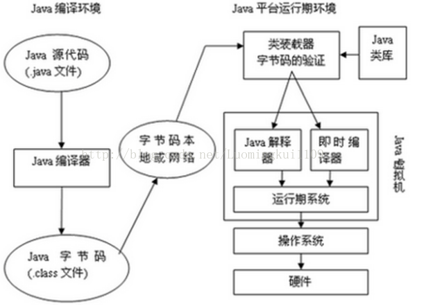

​	JVM在它的生存周期中有一个明确的任务，那就是运行Java程序，因此当Java程序启动的时候，就产生JVM的一个实例；当程序运行结束的时候，该实例也跟着消失了。     在Java平台的结构中可以看出，Java虚拟机(JVM) 处在核心的位置，是程序与底层操作系统和硬件无关的关键。它的下方是移植接口，移植接口由两部分组成：适配器和Java操作系统, 其中依赖于平台的部分称为适配器；JVM 通过移植接口在具体的平台和操作系统上实现；在JVM 的上方是Java的基本类库和扩展类库以及它们的API， 利用Java API编写的应用程序(application) 和小程序(Java applet) 可以在任何Java平台上运行而无需考虑底层平台, 就是因为有Java虚拟机(JVM)实现了程序与操作系统的分离，从而实现了Java 的平台无关性。 

## JVM基本概念

### 1.基本概念 

​	JVM是可运行Java代码的假想计算机 ，包括一套字节码指令集、一组寄存器、一个栈、一个垃圾回收、堆 和 一个存储方法域。JVM是运行在操作系统之上的，它与硬件没有直接的交互。 

### 2.运行过程 

​	我们都知道Java源文件，通过编译器，能够生产相应的.Class文件，也就是字节码文件，而字节码文件又通过Java虚拟机中的解释器，编译成特定机器上的机器码 。

也就是如下：

​     ① Java源文件—->编译器—->字节码文件

​     ② 字节码文件—->JVM—->机器码

 	每一种平台的解释器是不同的，但是实现的虚拟机是相同的，这也就是Java为什么能够跨平台的原因了 ，当一个程序开始运行，这时虚拟机就开始实例化了，多个程序启动就会存在多个虚拟机实例。程序退出或者关闭，则虚拟机实例消亡，多个虚拟机实例之间数据不能共享。

### 3.三种JVM 

​	① Sun公司的HotSpot；

​	② BEA公司的JRockit；

​	③ IBM公司的J9 JVM；

 	在JDK1.7及其以前我们所使用的都是Sun公司的HotSpot，但由于Sun公司和BEA公司都被oracle收购，jdk1.8将采用Sun公司的HotSpot和BEA公司的JRockit两个JVM中精华形成jdk1.8的JVM。

## JVM体系结构 

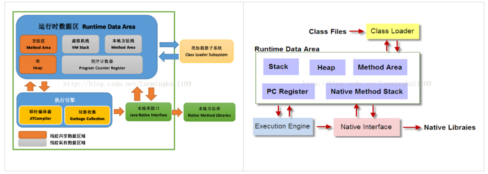

### 1.Class Loader类加载器 

​	负责加载 .class文件，class文件在文件开头有特定的文件标示，并且ClassLoader负责class文件的加载等，至于它是否可以运行，则由Execution Engine决定。

​	① 定位和导入二进制class文件

​	② 验证导入类的正确性

​	③ 为类分配初始化内存

​	④ 帮助解析符号引用

### 2.Native Interface本地接口 

​	本地接口的作用是融合不同的编程语言为Java所用，它的初衷是融合C/C++程序，Java诞生的时候C/C++横行的时候，要想立足，必须有调用C/C++程序，于是就在内存中专门开辟了一块区域处理标记为native的代码，它的具体作法是Native Method Stack中登记native方法，在Execution Engine执行时加载native libraies。

​	目前该方法使用的越来越少了，除非是与硬件有关的应用，比如通过Java程序驱动打印机，或者Java系统管理生产设备，在企业级应用中已经比较少见。

### 3.Execution Engine 执行引擎 

​	执行包在装载类的方法中的指令，也就是方法。 

### 4.Runtime data area 运行时数据区

​	虚拟机内存或者Jvm内存，从整个计算机内存中开辟一块内存存储Jvm需要用到的对象，变量等，运行时数据区有分很多小区，分别为：方法区，虚拟机栈，本地方法栈，堆，程序计数器。 

## JVM运行时数据区详解

​	JVM调优主要就是优化 Heap堆 和 Method Area 方法区。 

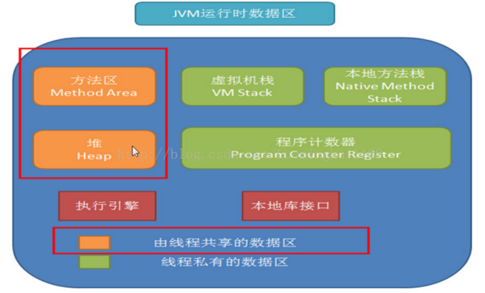

### 1.Native Method Stack本地方法栈 

​	它的具体做法是Native Method Stack中登记native方法，在Execution Engine执行时加载native libraies。 

### 2.PC Register程序计数器 

​	每个线程都有一个程序计算器，就是一个指针，指向方法区中的方法字节码（下一个将要执行的指令代码），由执行引擎读取下一条指令，是一个非常小的内存空间，几乎可以忽略不记。 

### 3.Method Area方法区 

​	方法区是被所有线程共享，所有字段和方法字节码，以及一些特殊方法如构造函数，接口代码也在此定义。简单说，所有定义的方法的信息都保存在该区域，此区域属于共享区间。 

​	静态变量+常量+类信息+运行时常量池存在方法区中，实例变量存在堆内存中。 

### 4.VM Stack虚拟机栈

​	① 栈是什么 

​		栈也叫栈内存，主管Java程序的运行，是在线程创建时创建，它的生命期是跟随线程的生命期，线程结束栈内存也就释放，对于栈来说不存在垃圾回收问题，只要线程一结束该栈就Over，生命周期和线程一致，是线程私有的。 

​		基本类型的变量和对象的引用变量都是在函数的栈内存中分配。 

​	② 栈存储什么 

​		栈帧中主要保存3类数据： 

​		本地变量（Local Variables）：输入参数和输出参数以及方法内的变量； 

​		栈操作（Operand Stack）：记录出栈、入栈的操作； 

​		栈帧数据（Frame Data）：包括类文件、方法等等。 

​	③ 栈运行原理 

​		栈中的数据都是以栈帧（Stack Frame）的格式存在，栈帧是一个内存区块，是一个数据集，是一个有关方法和运行期数据的数据集，当一个方法A被调用时就产生了一个栈帧F1，并被压入到栈中，A方法又调用了B方法，于是产生栈帧F2也被压入栈，B方法又调用了C方法，于是产生栈帧F3也被压入栈…… 依次执行完毕后，先弹出后进......F3栈帧，再弹出F2栈帧，再弹出F1栈帧。 

​		遵循“先进后出”/“后进先出”原则。 

### 5.Heap 堆 

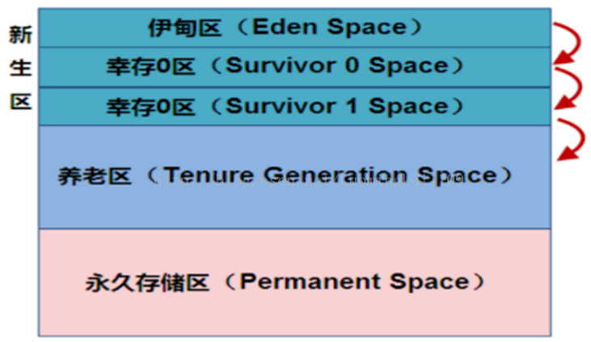

​	堆这块区域是JVM中最大的，应用的对象和数据都是存在这个区域，这块区域也是线程共享的，也是 gc 主要的回收区，一个 JVM 实例只存在一个堆类存，堆内存的大小是可以调节的。类加载器读取了类文件后，需要把类、方法、常变量放到堆内存中，以方便执行器执行，堆内存分为三部分： 

​	① 新生区 （新生代）

​	新生区是类的诞生、成长、消亡的区域，一个类在这里产生，应用，最后被垃圾回收器收集，结束生命。新生区又分为两部分：伊甸区（Eden space）和幸存者区（Survivor pace），所有的类都是在伊甸区被new出来的。幸存区有两个：0区（Survivor 0 space）和1区（Survivor 1 space）。当伊甸园的空间用完时，程序又需要创建对象，JVM的垃圾回收器将对伊甸园进行垃圾回收（Minor GC）,将伊甸园中的剩余对象移动到幸存0区。若幸存0区也满了，再对该区进行垃圾回收，然后移动到1区。那如果1去也满了呢？再移动到养老区。若养老区也满了，那么这个时候将产生Major GC（FullGCC），进行养老区的内存清理。若养老区执行Full GC 之后发现依然无法进行对象的保存，就会产生OOM异常“OutOfMemoryError”。 

​	 如果出现java.lang.OutOfMemoryError: Java heap space异常，说明Java虚拟机的堆内存不够。原因有二：Java虚拟机的堆内存设置不够，可以通过参数-Xms、-Xmx来调整；代码中创建了大量大对象，并且长时间不能被垃圾收集器收集（存在被引用）。

​	② 养老区 （老年代）

​	养老区用于保存从新生区筛选出来的 JAVA 对象，一般池对象都在这个区域活跃。 

​	③ 永久区 （永久代）

​	永久存储区是一个常驻内存区域，用于存放JDK自身所携带的 Class,Interface 的元数据，也就是说它存储的是运行环境必须的类信息，被装载进此区域的数据是不会被垃圾回收器回收掉的，关闭 JVM 才会释放此区域所占用的内存。 

​	如果出现java.lang.OutOfMemoryError: PermGen space，说明是Java虚拟机对永久代Perm内存设置不够。原因有二：程序启动需要加载大量的第三方jar包。例如：在一个Tomcat下部署了太多的应用；大量动态反射生成的类不断被加载，最终导致Perm区被占满。

​	注意：

​	Jdk1.6及之前：常量池分配在永久代 。

​	Jdk1.7：有，但已经逐步“去永久代” 。

​	Jdk1.8及之后：无(java.lang.OutOfMemoryError: PermGen space,这种错误将不会出现在JDK1.8中)。

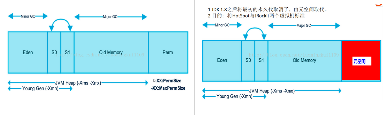

​	注意：

​	实际而言，方法区和堆一样，是各个线程共享的内存区域，它用于存储虚拟机加载的：类信息+普通常量+静态常量+编译器编译后的代码等等，虽然JVM规范将方法区描述为堆的一个逻辑部分，但它却还有一个别名叫做Non-Heap（非堆），目的就是要和堆分开。

​	对于HotSpot虚拟机，很多开发者习惯将方法区称之为“永久代（Parmanent Gen）”,但严格本质上说两者不同，或者说使用永久代来实现方法区而已，永久代是方法区的一个实现，jdk1.7的版本中，已经将原本放在永久代的字符串常量池移走。

​	常量池（Constant Pool）是方法区的一部分，Class文件除了有类的版本、字段、方法、接口等描述信息外，还有一项信息就是常量池，这部分内容将在类加载后进入方法区的运行时常量池中存放。

## JVM类加载机制

​	如下图所示，JVM类加载机制分为五个部分：加载，验证，准备，解析，初始化，下面我们就分别来看一下这五个过程。 

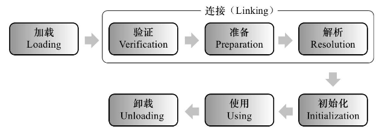

### 1.加载

​	加载是类加载过程中的一个阶段，这个阶段会在内存中生成一个代表这个类的java.lang.Class对象，作为方法区这个类的各种数据的入口。注意这里不一定非得要从一个Class文件获取，这里既可以从ZIP包中读取（比如从jar包和war包中读取），也可以在运行时计算生成（动态代理），也可以由其它文件生成（比如将JSP文件转换成对应的Class类）。 

### 2.验证

​	这一阶段的主要目的是为了确保Class文件的字节流中包含的信息是否符合当前虚拟机的要求，并且不会危害虚拟机自身的安全。 

### 3.准备

​	准备阶段是正式为类变量分配内存并设置类变量的初始值阶段，即在方法区中分配这些变量所使用的内存空间。注意这里所说的初始值概念，比如一个类变量定义为： 

```
public static int v = 8080;
```

​	实际上变量v在准备阶段过后的初始值为0而不是8080，将v赋值为8080的putstatic指令是程序被编译后，存放于类构造器<client>方法之中，这里我们后面会解释。 但是注意如果声明为： 

```
public static final int v = 8080;
```

​	在编译阶段会为v生成ConstantValue属性，在准备阶段虚拟机会根据ConstantValue属性将v赋值为8080。 

### 4.解析

​	解析阶段是指虚拟机将常量池中的符号引用替换为直接引用的过程。符号引用就是class文件中的： 	

- CONSTANT_Class_info
- CONSTANT_Field_info
- CONSTANT_Method_info

符号引用和直接引用的概念 

- 符号引用与虚拟机实现的布局无关，引用的目标并不一定要已经加载到内存中。各种虚拟机实现的内存布局可以各不相同，但是它们能接受的符号引用必须是一致的，因为符号引用的字面量形式明确定义在Java虚拟机规范的Class文件格式中。
- 直接引用可以是指向目标的指针，相对偏移量或是一个能间接定位到目标的句柄。如果有了直接引用，那引用的目标必定已经在内存中存在。

### 5.初始化

​	初始化阶段是类加载最后一个阶段，前面的类加载阶段之后，除了在加载阶段可以自定义类加载器以外，其它操作都由JVM主导。到了初始阶段，才开始真正执行类中定义的Java程序代码。 

​	初始化阶段是执行类构造器<client>方法的过程。<client>方法是由编译器自动收集类中的类变量的赋值操作和静态语句块中的语句合并而成的。虚拟机会保证<client>方法执行之前，父类的<client>方法已经执行完毕。p.s: 如果一个类中没有对静态变量赋值也没有静态语句块，那么编译器可以不为这个类生成<client>()方法。 

​	注意以下几种情况不会执行类初始化： 

- 通过子类引用父类的静态字段，只会触发父类的初始化，而不会触发子类的初始化。
- 定义对象数组，不会触发该类的初始化。
- 常量在编译期间会存入调用类的常量池中，本质上并没有直接引用定义常量的类，不会触发定义常量所在的类。
- 通过类名获取Class对象，不会触发类的初始化。
- 通过Class.forName加载指定类时，如果指定参数initialize为false时，也不会触发类初始化，其实这个参数是告诉虚拟机，是否要对类进行初始化。
- 通过ClassLoader默认的loadClass方法，也不会触发初始化动作。

### 6.类加载器

​	虚拟机设计团队把加载动作放到JVM外部实现，以便让应用程序决定如何获取所需的类，JVM提供了3种类加载器： 

- 启动类加载器(Bootstrap ClassLoader)：负责加载 JAVA_HOME\lib 目录中的，或通过-Xbootclasspath参数指定路径中的，且被虚拟机认可（按文件名识别，如rt.jar）的类。
- 扩展类加载器(Extension ClassLoader)：负责加载 JAVA_HOME\lib\ext 目录中的，或通过java.ext.dirs系统变量指定路径中的类库。
- 应用程序类加载器(Application ClassLoader)：负责加载用户路径（classpath）上的类库。

JVM通过双亲委派模型进行类的加载，当然我们也可以通过继承java.lang.ClassLoader实现自定义的类加载器。 

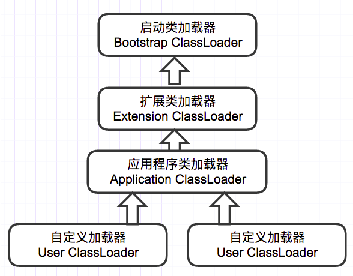

​	当一个类加载器收到类加载任务，会先交给其父类加载器去完成，因此最终加载任务都会传递到顶层的启动类加载器，只有当父类加载器无法完成加载任务时，才会尝试执行加载任务。采用双亲委派的一个好处是比如加载位于rt.jar包中的类java.lang.Object，不管是哪个加载器加载这个类，最终都是委托给顶层的启动类加载器进行加载，这样就保证了使用不同的类加载器最终得到的都是同样一个Object对象。

## JVM垃圾回收

​	内存处理是编程人员容易出现问题的地方，忘记或者错误的内存回收会导致程序或系统的不稳定甚至崩溃，Java提供的GC功能可以自动监测对象是否超过作用域从而达到自动回收内存的目的 。

### 1.判断对象存活

​	① 引用计数法

​		引用计数法就是给对象加个引用计数器，每有一个地方引用到它时，这个引用计数器就加1。当引用失效的时候，计数器的值就减1，也就是说根据引用计数器的值来判断对象是否存活，若值是0，那么该对象就不再被使用了。 

​	②可达性分析法

​		可达性分析法的基本思路是通过一系列的GC Roots对象作为起始点，从这些点向下搜索它们引用的对象，这样可以生成一颗引用树，树的节点就是可达的对象。反之，不在树上的对象即可判定对象已死。 

​		作为GC Roots的对象必须是极难被回收的对象，包括了如下几种对象： 

- 虚拟机栈（`栈帧中的本地变量表`）中引用的对象，如在方法中定义和使用的变量

- 方法区中的`类静态属性引用的对象`，如static修饰的成员变量

- 方法区中`常量引用的对象`，如static和final共同修饰的常量

- 本地方法栈中`JNI引用的对象`，JNI也就是调的native方法

  ​	注意：

- `强引用`：只要某个对象有强引用与之关联，JVM必定不会回收这个对象，即使在内存不足的情况下，`JVM宁愿抛出OutOfMemory错误也不会回收`这种对象。 

- `软引用`：软引用是用来描述一些有用但并不是必需的对象，比如引用图片地址等，在Java中用java.lang.ref.SoftReference类来表示。对于软引用关联着的对象，`只有在内存不足的时候JVM才会回收`该对象。 

- `弱引用`：弱引用也是用来描述非必需对象的，当JVM进行垃圾回收时，无论内存是否充足，都会回收被弱引用关联的对象。也就是说被弱引用关联的对象，`只能生存到下一次垃圾收集发生之前`。 

- `虚引用（幽灵引用或幻影引用）`：虚引用和前面的软引用、弱引用不同，它并不影响对象的生命周期。在java中用java.lang.ref.PhantomReference类表示。如果一个对象与虚引用关联，则跟没有引用与之关联一样，在任何时候都可能被垃圾回收器回收。为一个对象设置虚引用关联的`唯一目的就是能在这个对象被收集器回收时收到一个系统通知`。与弱引用区别：在GC时会被通知。 

### 2.垃圾回收算法

​	① 标记-清除算法

​		算法的过程就如同算法的名字，分为`标记`和`清除`两个阶段：首先标记出所有要回收的对象，然后对标记的对象统一清除。算法很简单，再看下逻辑图：  

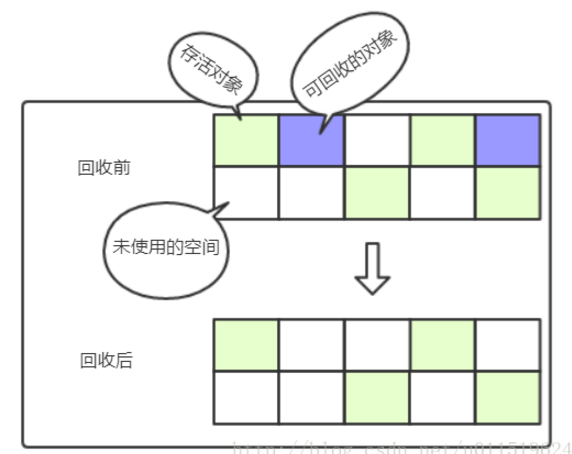

​		内存空间经过标记清除算法回收的过程一目了然，从图中也能看出这种算法的不足，即`标记清除后会产生大量的不连续的内存碎片`，如果碎片过多会导致大对象无法分配足够的空间而不得不触发垃圾回收。 另外，标记清除算法的标记和清除阶段效率都不高，所以效率也是个问题。 

​	②复制算法

​		既然标记清除效率达不到预期，那么新的回收算法就被创造出来了–复制算法。算法将可用内存分成两块大小一样的区域，每次只使用其中的一块区域，当使用的区域空间不足时就得进行垃圾回收了，而存活的对象就直接转移至另一块区域，如此往复。看如下复制算法逻辑图：  

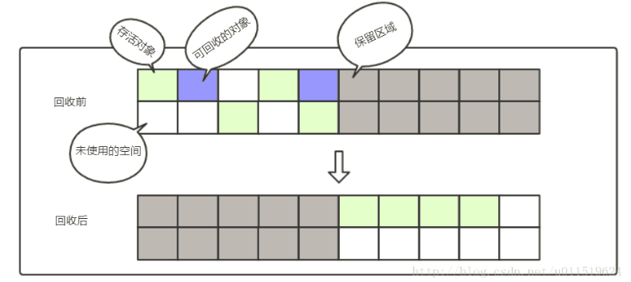

​		每次垃圾回收都是在一块区域进行，即一半的空间进行内存回收。好处是`内存分配后不会产生内存碎片问题`，当然缺点也显而易见，内存空间利用率只有一半。 

​		由于每次垃圾回收需要对存活对象再一次迁移，这种算法适用于存活对象较少的场景。根据大多数经验表明，新生代的对象98%都是朝生熄灭的，所以复制算法适应于新生代的垃圾回收。但是在新生代中，一半的空间利用率实在太低，而且绝大部分对象都会被回收的特性，所以将内存分为了较大的eden区和两个较小的survivor区（s0和s1区），每次使用eden区和其中的一个survivor区，另一个survivor区则用于保存存活的对象。HotSpot虚拟机默认eden和survivor的比例是8:1，也就是说空间利用率达到了90%（80%+10%）。 

​	③ 标记-整理算法

​		顾名思义，看名字大致与标记-清除算法类似，其算法的标记过程还真是一样，但后续不是直接清除垃圾对象，而是让所有的存活的对象向一个方向移动，然后再清理掉存活对象边界之外的内存空间。来看图更清晰：  

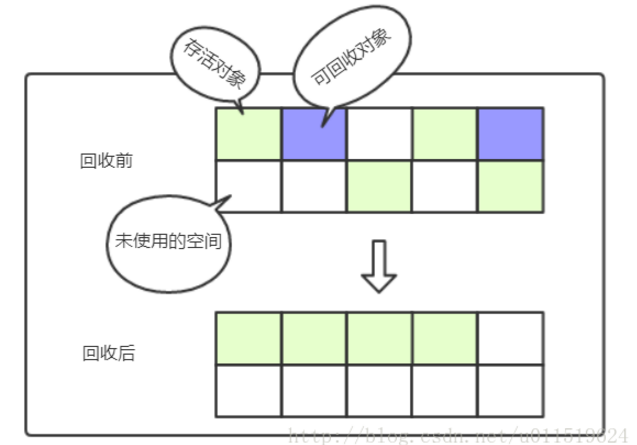

​		上图与标记清除算法的图一比较就很容易发现区别了，标记整理算法重在`整理`。  那么标记整理算法相对于复制算法有什么优势呢？复制算法，在回收对象存活率低的情况下比较合适，如果在对象存活率较高时（比如老年代的垃圾回收），就要进行较多的复制操作，效率明显变低，所以不会采用复制算法。而在对象存活较高的区域中，如老年代，采用标记整理算法是比较合适的。 

​	④分代收集算法

​		堆中根据对象的存活时间划分为新生代、老年代和永久代几个区域，这里又可以根据各个年代的特点采用最合适的垃圾回收算法。新生代绝大部分对象朝生熄灭，只有少部分存活，采用复制算法最合适不过。老年代对象即使进行了垃圾回收，对象的存活率也高，所以采用标记清除或标记整理算法都是不错的选择。 

### 3.垃圾收集器

​	HotSpot虚拟机提供的收集器如下图：  

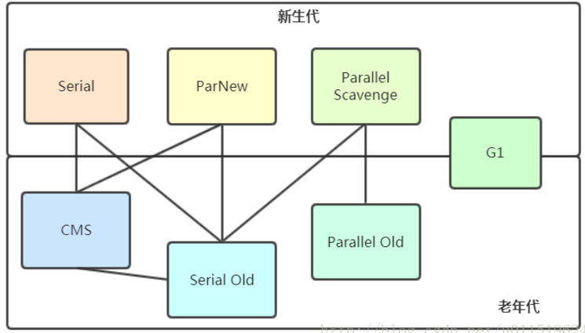

​	新生代的垃圾收集器有：Serial、ParNew、Parallel Scavenge

​	老年代的垃圾收集器有：CMS、Serial Old、Parallel Old 

​	① Serial与Serial Old 收集器

​	Serial，翻译成中文的意思是“`串行`”，顾名思义，这就是个单线程的收集器。仅仅使用一个线程去执行垃圾收集任务，而且收集任务期间，必须停掉其他的工作线程，直到垃圾收集完成。`垃圾回收时停掉其他的线程的现象，就称为“Stop The World(STW)”`。打个比方，我清扫房间的时候，任何人都不能在家里活动，以免给我捣乱，不然清扫工作怎么也没法做完。STW就是这么个意思，至于暂停应用多久，得看具体垃圾的情况了。  Serial收集器是收集新生代的收集器，而Serial Old收集器是收集老年代的，上图也看到了它们之间有连线可搭配使用，看如下它们搭配使用的运行图：  

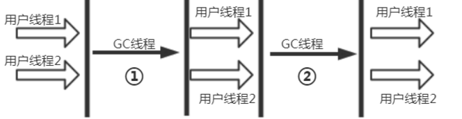

​	a：新生代使用Serial收集器，采用复制算法，会暂停其他用户线程（STW）专心做垃圾回收。  b：老年代使用Serial Old收集器，采用标记整理算法，会发生STW。 

​	②ParNew 收集器

​	ParNew其实就是Serial的多线程版本，在新生代中使用多条线程进行垃圾回收。看如下逻辑图就一目了然了： 

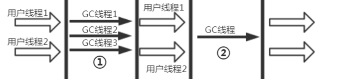

​	a：新生代使用ParNew收集器，可以看到有多条GC线程在进行垃圾回收，采用复制算法，会暂停其他用户线程（STW）专心做垃圾回收。  b：老年代使用Serial Old收集器，采用标记整理算法，会发生STW。 

​	③ Parallel Scavenge 收集器与Parallel Old 收集器

​	Parallel Scavenge 收集器也是新生代收集器，也是使用复制算法的多线程收集器。  看上去和ParNew收集器差不多，但是Parallel Scavenge最大的特点是更关注`吞吐量`。  吞吐量就是CPU用于运行用户代码的时间与CPU总消耗时间的比值： 
$$
吞吐量 = 运行用户代码时间 / (运行用户代码时间 + 垃圾收集时间)
$$
​	打个比方，虚拟机运行了100分钟，垃圾回收用了2分钟，那么吞吐量就是98%。  按照公式来看，吞吐量越高的虚拟机，自然是垃圾收集时间也越短，理所当然的用户体验也要更好。`Parallel Scavenge收集器会根据当前系统的运行情况，动态调整某些参数来提供最合适的停顿时间或最大的吞吐量`，这就是GC的自适应调节策略，这也是其与ParNew收集器最明显的区别。 

​	Parallel Old 是 Parallel Scavenge收集器的老年代版本，运用多线程和标记整理算法收集。从最上面的搭配图也可以看到，Parallel Old 只能与Parallel Scavenge配对使用。这样的组合，在注重`吞吐量和CPU资源`的场合使用比较合适。如下是逻辑运行图： 

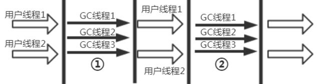

​	a：新生代使用Parallel Scavenge收集器，可以看到有多条GC线程在进行垃圾回收，采用复制算法，会暂停其他用户线程（STW）专心做垃圾回收。  b：老年代使用Parallel Old收集器，使用多线程采用标记整理算法，会发生STW。 

​	④CMS 收集器

​	CMS收集器是一种`以获取最短回收停顿时间为目标`的收集器。在B/S架构模型的网站上，运用CMS收集器十分广泛，因为网站上更希望停顿越短越好，用户体验才能更好。 CMS收集器是基于标记清除算法实现的，但是其运行过程相对来说更复杂了，整个过程分成下图4个步骤： 

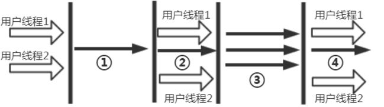

- a：初始标记（initial mark） 
  在图中可以看出这个步骤是单线程处理的，并且用户线程并未运行，是因为出现了STW。这个过程只是`标记一下GC Roots能直接关联到的对象`，速度很快。
- b：并发标记（concurrent mark） 
  这个阶段就是进行GC Roots Tracing过程，可以看出GC线程与用户线程并发工作，所以并发标记过程并不影响用户线程的使用。
- c：重新标记（remark） 
  重新标记阶段是为了修正并发标记期间，因用户线程继续运行导致标记产生变动的那一部分对象的标记。看起来有点绕，其实意思就是在并发标记时，用户线程也会产生需要标记的对象，这部分对象不能漏了标记，所以就需要重新标记过程。在图中可以看到，没有用户线程在运行，说明需要STW。
- d：并发清除（concurrent sweep） 
  并发清除这个阶段看图也能类比了，有GC线程与用户线程并发运行，GC线程清理掉那些标记的对象，用户线程正常运行。

整体来看，CMS收集器的垃圾回收过程是与用户线程一起并发执行的。 但是CMS收集器还是有一下三个缺点：

​	a)因为是使用并发收集，虽然不会导致用户线程停顿，但是会占用一部分线程而导致应用程序变慢，总的吞吐量会降低。

​	b)CMS收集器无法处理浮动垃圾，可能出现“Concurrent Mode Failure”失败而导致另一次Full GC的发生。因为在并发清理阶段，用户线程还在运行，自然就还有新的垃圾不断产生，这部分垃圾出现在标记过程之后，CMS也束手无策，只能等待下次GC时再清理，这一部分垃圾就叫“浮动垃圾”。

​	c)CMS是基于标记清除算法实现的，前面的文章也提到过标记清除算法的缺点，就是会产生大量的空间碎片。空间碎片过多时，就会给大对象的空间分配带来麻烦。比如老年代有足够的空间，但是找不到连续的足够大的空间，而不得不触发一次Full GC。为了解决这个问题，CMS收集器提供了-`XX:+UseCMSFullGCsBeforeCompaction`参数，用于设置执行了多少次不压缩的FGC后来一次碎片整理（默认是0，每次进入FGC时都进行碎片整理）。

### 4.GC过程

​	①新生代GC(Minor GC)

​	指发生在新生代的垃圾回收，一般是对生命周期较短的对象的回收(例如：方法内部声明对象)，通过幸存区交换来处理所以回收速度快 

​		a) 触发条件：当创建对象时Eden区空间不够时触发，当执行Minor GC时单个对象大于幸存区时，通过分配担保机制转移动老年代。 

​		b) 推荐：由于Minor GC速度快，建议及时将不使用的对象置空，利于对象在新生代回收。

​		c) 不建议创建生命周期短的大对象造成频繁的GC，可以通过参数设置阀值将大对象直接进老年代 。默认在幸存区交换15次会移至老年代；动态年龄判断：幸存区中同龄所有对象大于幸存区空间的一半，年龄大于等于该年龄的对象可以直接进入老年代 。

​	②老年代GC(Full GC/Major GC) 

​	指发生在老年代的垃圾回收，标记整理回收速度慢(比MinorGC慢10倍以上)并且会有暂停响应(stop the world)。 

​	如果FullGC非常频繁(90%以上时)将会严重影响服务性能，此时就需要调整堆内存参数大小或将大对象转至堆外存。 

​	③**永久代** GC

​	触发条件：

​		a)该类所有的实例都已经被回收，即堆中不存在该类的任何实例 

​		b)该类的ClassLoader已经被回收 

​		c)该类的Class对象没有任何地方被引用，无法在任何地方通过反射访问该类的方法 

## JVM调优

### 	1.对象内存分配策略

​		①对象优先在eden分配

​		对象在绝大多数情况下，在新生代eden区分配，当eden区没有足够空间进行分配的时候，JVM会发起一次Minor GC。相关内存参数如下：

- -Xms:最小堆内存值
- -Xmx:最大堆内存值
- -Xmn:新生代内存值
- -XX:SurvivorRatio:新生代中eden区与一个survivor区的空间比

	​	

	​	②大对象直接进入老年代

	​	大对象，即需要大量连续内存空间的对象，比如上述测试代码中的byte数组就是典型的大对象。经常出现大对象就容易导致内存还有不少空间时就提前触发了GC，以便获取更大的连续空间来分配。虚拟机提供了一个参数`-XX:PretenureSizeThreshold`，大于此设置值的对象将直接进入老年代分配内存，这样做的目的是避免在eden区和两个survivor区之间发生大量的内存复制。

	​	③长期存活的对象进入老年代

	​	与大对象相对应，小对象在GC过程中通常不会因为内存空间不够分配而直接进入老年代，而是通过给每个对象定义一个对象年龄计数器的方式。对象在eden区出生，经过第一次Minor GC后仍然能存活，并且能被survivor区容纳，将被移动到survivor区中，并且对象的年龄设为1。对象在survivor区每经过一次Minor GC，对象的年龄就加1岁，当它的年龄增加到一定程度时（默认为15岁），就会晋升到老年代中去。对象晋升老年代的年龄阈值，可通过参数`-XX:MaxTenuringThreshold`调整。

	​	④动态对象年龄判定

	​	为了能更好地适应不同程序的内存状况，虚拟机并不是永远的要求对象的年龄必须达到了MaxTenuringThreshold才能晋升老年代，而是有个机智的策略：如果在survivor区中相同年龄的所有对象大小的总和大于survivor区空间的一半时，年龄大于或等于该年龄的对象就可以直接进入老年代，无须达到MaxTenuringThreshold中要求的年龄。 

	​	⑤空间分配担保

	​	在发生Minor GC之前，虚拟机会先检查老年代最大可用的连续空间是否大于新生代所有对象的空间，如果条件满足，那么Minor GC就是安全的，否则继续检查老年代最大可用的连续空间是否大于历次晋升到老年代对象的平均大小，如果大于，则“尝试”进行一次Minor GC，如果小于，则要进行Full GC。

	​	为什么是尝试进行Minor GC呢？因为新生代采用复制收集算法，只使用其中一个survivor空间来作为轮换备份，因此出现大量对象在Minor GC后仍然存活的情况下（最极端的就是内存回收后新生代中所有对象都存活），就需要老年代进行分配担保，把survivor区无法容纳的对象直接移至老年代。老年代要进行这样的担保，前提是老年代本身还有容纳这些对象的空间，然而一共会有多少对象存活下来，在实际完成内存回收的过程中是无法明确知晓的，所以只好取之前每一次回收晋升到老年代的对象容量的平均大小值作为参考值，与老年代的剩余空间比较，来决定是否进行Full GC来让老年代腾出更多空间。

### 2.JVM常用参数

​		①GC参数

​		-XX:+PrintGC    每次触发GC的时候打印相关日志

​		-XX:+PrintGCDetails    更详细的GC日志

​		-XX:+PrintHeapAtGC    每次GC时打印堆的详细详细信息

​		-XX:+PrintGCApplicationConcurrentTime    打印应用程序执行时间

​		-XX:+PrintGCApplicationAtoppedTime    打印应用程序由GC引起的停顿时间

​		-XX:+PrintReferenceGC    跟踪系统内的软引用，弱引用，虚引用和finallize队列。

​		②系统参数查看 

​		-XX:+PrintVMOptions       运行时，打印jvm接受的命令行显式参数

​		-XX:+PrintCommandLineFlags    打印传递jvm的显式和隐式参数

​		-XX:+PrintFlagsFinal    打印所有系统参数值

​		③堆 

​		-Xms    堆初始值

​		-Xmx    堆最大可用值

​		-Xmn    新生代大小，一般设为整个堆的1/3到1/4左右

​		-XX:SurvivorRatio    设置新生代中eden区和from/to空间的比例关系n/1

​		-XX:NewRatio    设置老年代与新生代的比

​		④非堆 

​		-XX:PermSize   方法区（永久区）初始值

​		-XX:MaxPermSize    方法区（永久区）最大值

​		-Xss    设置栈空间大小

​		-XX:MaxDirectMemorySize    直接内存最大可用空间，设置不当可能导致系统OOM

​		⑤虚拟机工作模式 

​		-client    默认工作模式

​		-server    server工作模式，启动虚拟机时需要显式指定

​		与client模式相比，server模式启动较慢，会尝试搜集更多的系统性能信息，使用更复杂的优化算法对程序进行优化，server模式下系统完全启动并进入稳定期后，执行速度远远快于client模式，适合长期后台运行的系统。Client模式更适合运行时间不长，又追求启动速度的客户端程序。当虚拟机运行在-client模式的时候,使用的是一个代号为C1的轻量级编译器, 而-server模式启动的虚拟机采用相对重量级,代号为C2的编译器. C2比C1编译器编译的相对彻底,,服务起来之后,性能更高 。

​		⑥收集器设置 

​		-XX:+UseSerialGC:设置串行收集器

​		-XX:+UseParallelGC:设置并行收集器

​		-XX:+UseParalledlOldGC:设置并行年老代收集器

​		-XX:+UseConcMarkSweepGC:设置并发收集器

​		-XX:ParallelGCThreads=n:设置并行收集器收集时使用的CPU数。并行收集线程数。

​		-XX:MaxGCPauseMillis=n:设置并行收集最大暂停时间

​		-XX:GCTimeRatio=n:设置垃圾回收时间占程序运行时间的百分比。公式为1/(1+n)

​		-XX:+CMSIncrementalMode:设置为增量模式。适用于单CPU情况。

​		-XX:ParallelGCThreads=n:设置并发收集器年轻代收集方式为并行收集时，使用的CPU数。并行收集线程数。

### 	3.JVM调优工具

​	jps：JVM Process Status Tool,显示指定系统内所有的HotSpot虚拟机进程。 

​	jstat：jstat(JVM statistics Monitoring)是用于监视虚拟机运行时状态信息的命令，它可以显示出虚拟机进程中的类装载、内存、垃圾收集、JIT编译等运行数据。 

​	jmap：jmap(JVM Memory Map)命令用于生成heap dump文件，如果不使用这个命令，还阔以使用-XX:+HeapDumpOnOutOfMemoryError参数来让虚拟机出现OOM的时候·自动生成dump文件。 jmap不仅能生成dump文件，还阔以查询finalize执行队列、Java堆和永久代的详细信息，如当前使用率、当前使用的是哪种收集器等。 

​	jhat：jhat(JVM Heap Analysis Tool)命令是与jmap搭配使用，用来分析jmap生成的dump，jhat内置了一个微型的HTTP/HTML服务器，生成dump的分析结果后，可以在浏览器中查看。在此要注意，一般不会直接在服务器上进行分析，因为jhat是一个耗时并且耗费硬件资源的过程，一般把服务器生成的dump文件复制到本地或其他机器上进行分析。 

​	jstack：jstack用于生成java虚拟机当前时刻的线程快照。线程快照是当前java虚拟机内每一条线程正在执行的方法堆栈的集合，生成线程快照的主要目的是定位线程出现长时间停顿的原因，如线程间死锁、死循环、请求外部资源导致的长时间等待等。 线程出现停顿的时候通过jstack来查看各个线程的调用堆栈，就可以知道没有响应的线程到底在后台做什么事情，或者等待什么资源。 如果java程序崩溃生成core文件，jstack工具可以用来获得core文件的java stack和native stack的信息，从而可以轻松地知道java程序是如何崩溃和在程序何处发生问题。另外，jstack工具还可以附属到正在运行的java程序中，看到当时运行的java程序的java stack和native stack的信息, 如果现在运行的java程序呈现hung的状态，jstack是非常有用的。 

​	jinfo：jinfo(JVM Configuration info)这个命令作用是实时查看和调整虚拟机运行参数。 之前的jps -v口令只能查看到显示指定的参数，如果想要查看未被显示指定的参数的值就要使用jinfo口令 。

​	jconsole：JConsole 是一个内置 Java 性能分析器，可以从命令行或在 GUI shell 中运行。您可以轻松地使用 JConsole（或者，它更高端的 “近亲” VisualVM ）来监控 Java 应用程序性能和跟踪 Java 中的代码。 

```
set JAVA_OPTS= %JAVA_OPTS% -Djava.rmi.server.hostname=HostIP
set JAVA_OPTS= %JAVA_OPTS% -Dcom.sun.management.jmxremote.port=8888
set JAVA_OPTS= %JAVA_OPTS% -Dcom.sun.management.jmxremote.ssl=false
set JAVA_OPTS= %JAVA_OPTS% -Dcom.sun.management.jmxremote.authenticate=false
```

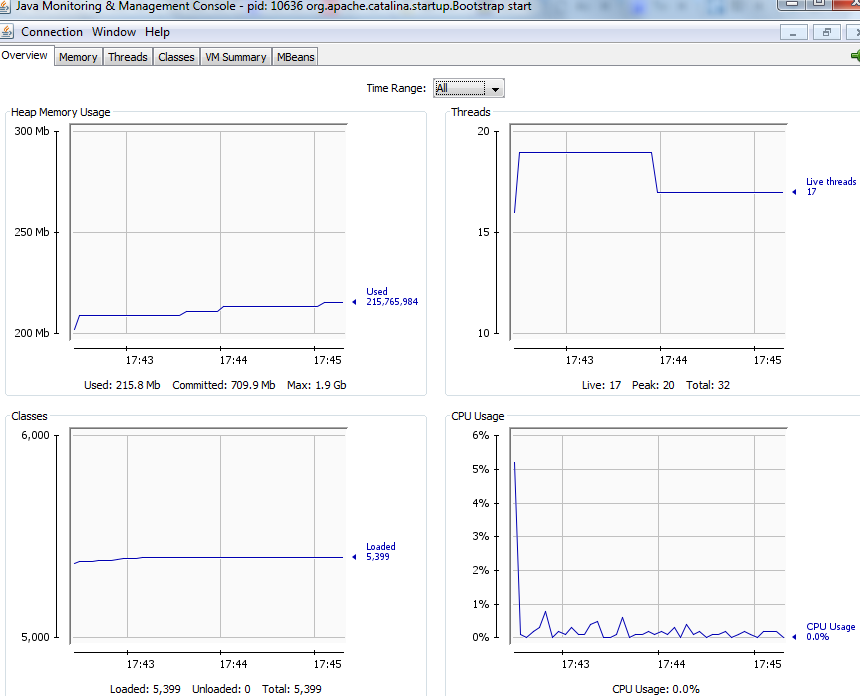

visualVM：VisualVM 是一款免费的，集成了多个 JDK 命令行工具的可视化工具，它能为您提供强大的分析能力，对 Java 应用程序做性能分析和调优。这些功能包括生成和分析海量数据、跟踪内存泄漏、监控垃圾回收器、执行内存和 CPU 分析，同时它还支持在 MBeans 上进行浏览和操作。 

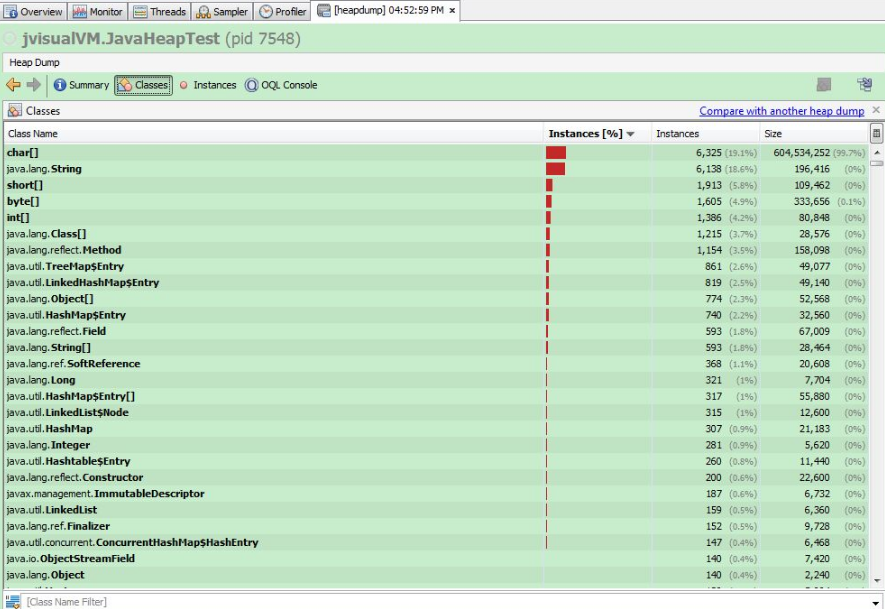

## 分支预测

在stackoverflow上有一个非常有名的问题：[为什么处理有序数组要比非有序数组快？](https://stackoverflow.com/questions/11227809/why-is-it-faster-to-process-a-sorted-array-than-an-unsorted-array)，可见分支预测对代码运行效率有非常大的影响。

现代CPU都支持分支预测(branch prediction)和指令流水线(instruction pipeline)，这两个结合可以极大提高CPU效率。对于像简单的if跳转，CPU是可以比较好地做分支预测的。但是对于switch跳转，CPU则没有太多的办法。switch本质上是据索引，从地址数组里取地址再跳转。

要提高代码执行效率，一个重要的原则就是尽量避免CPU把流水线清空，那么提高分支预测的成功率就非常重要。