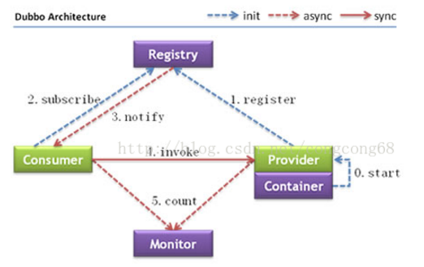
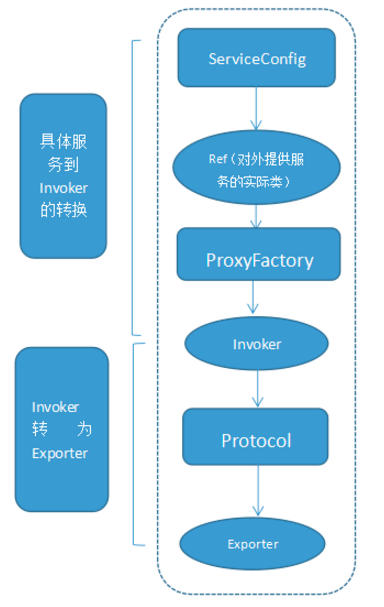
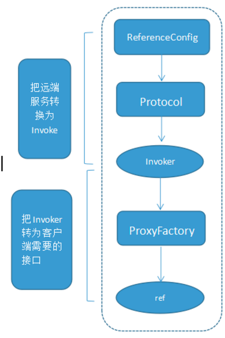

# dubbo

## 	架构

​	Dubbo是一种分布式服务框架。 Webservice也是一种服务框架，但是webservice并不是分布式的服务框架，他需要结合F5实现负载均衡。因此，dubbo除了可以提供服务之外，还可以实现软负载均衡。它还提供了两个功能Monitor 监控中心和调用中心。这两个是可选的，需要单独配置。 



​	Consumer服务消费者，Provider服务提供者。Container服务容器。消费当然是invoke提供者了，invoke这条实线按照图上的说明当然同步的意思了，多说一句，在实际调用过程中，Provider的位置对于Consumer来说是透明的，上一次调用服务的位置（IP地址）和下一次调用服务的位置，是不确定的。这个地方就是实现了软负载。

​	服务提供者先启动start，然后注册register服务。消费订阅subscribe服务，如果没有订阅到自己想获得的服务，它会不断的尝试订阅。新的服务注册到注册中心以后，注册中心会将这些服务通过notify到消费者。

Monitor这是一个监控，图中虚线表明Consumer 和Provider通过异步的方式发送消息至Monitor，Consumer和Provider会将信息存放在本地磁盘，平均1min会发送一次信息。Monitor在整个架构中是可选的（图中的虚线并不是可选的意思），Monitor功能需要单独配置，不配置或者配置以后，Monitor挂掉并不会影响服务的调用。

## 	原理

​	**初始化过程细节**
	上图中的第一步start，就是将服务装载容器中，然后准备注册服务。和Spring中启动过程类似，spring启动时，将bean装载进容器中的时候，首先要解析bean。所以dubbo也是先读配置文件解析服务。 
	**解析服务**
	①基于dubbo.jar内的Meta-inf/spring.handlers配置，spring在遇到dubbo名称空间时，会回调DubboNamespaceHandler类。 
	②所有的dubbo标签，都统一用DubboBeanDefinitionParser进行解析，基于一对一属性映射，将XML标签解析为Bean对象。  

​	在ServiceConfig.export 或者ReferenceConfig.get 初始化时，将Bean对象转会为url格式，将所以Bean属性转成url的参数。 然后将URL传给Protocol扩展点，基于扩展点的Adaptive机制，根据URL的协议头，进行不同协议的服务暴露和引用。 
	**暴露服务：**

​	①只暴露服务端口

​	在没有使用注册中心的情况，这种情况一般适用在开发环境下，服务的调用这和提供在同一个IP上，只需要打开服务的端口即可。 即，当配置 or ServiceConfig解析出的URL的格式为： Dubbo：//service-host/com.xxx.TxxService?version=1.0.0 基于扩展点的Adaptiver机制，通过URL的“dubbo：//”协议头识别，直接调用DubboProtocol的export（）方法，打开服务端口。

​	②向注册中心暴露服务：

和上一种的区别：需要将服务的IP和端口一同暴露给注册中心。 ServiceConfig解析出的url格式为： 
registry://registry-host/com.alibaba.dubbo.registry.RegistryService?export=URL.encode(“dubbo://service-host/com.xxx.TxxService?version=1.0.0”)

​	基于扩展点的Adaptive机制，通过URL的“registry：//”协议头识别，调用RegistryProtocol的export方法，将export参数中的提供者URL先注册到注册中心，再重新传给Protocol扩展点进行暴露： Dubbo：//service-host/com.xxx.TxxService?version=1.0.0

​	**引用服务**

​	①直接引用服务：

​	在没有注册中心的，直连提供者情况下， ReferenceConfig解析出的URL格式为： Dubbo：//service-host/com.xxx.TxxService?version=1.0.0。基于扩展点的Adaptive机制，通过url的“dubbo：//”协议头识别，直接调用DubboProtocol的refer方法，返回提供者引用。

​	②从注册中心发现引用服务：

​	此时，ReferenceConfig解析出的URL的格式为： registry://registry-host/com.alibaba.dubbo.registry.RegistryService?refer=URL.encode(“consumer://consumer-host/com.foo.FooService?version=1.0.0”)

​	基于扩展点的Apaptive机制，通过URL的“registry：//”协议头识别，就会调用RegistryProtocol的refer方法，基于refer参数总的条件，查询提供者URL，如： Dubbo：//service-host/com.xxx.TxxService?version=1.0.0

​	基于扩展点的Adaptive机制，通过提供者URL的“dubbo：//”协议头识别，就会调用DubboProtocol的refer（）方法，得到提供者引用。 然后RegistryProtocol将多个提供者引用，通过Cluster扩展点，伪装成单个提供这引用返回。

​	**远程调用细节**

​	服务提供者暴露一个服务的详细过程：



​	上图是服务提供者暴露服务的主过程： 
	首先ServiceConfig类拿到对外提供服务的实际类ref，然后将ProxyFactory类的getInvoker方法使用ref生成一个AbstractProxyInvoker实例，到这一步就完成具体服务到invoker的转化。接下来就是Invoker转换到Exporter的过程。 
Dubbo处理服务暴露的关键就在Invoker转换到Exporter的过程，下面我们以Dubbo和rmi这两种典型协议的实现来进行说明： 
	Dubbo的实现： Dubbo协议的Invoker转为Exporter发生在DubboProtocol类的export方法，它主要是打开socket侦听服务，并接收客户端发来的各种请求，通讯细节由dubbo自己实现。 
Rmi的实现： RMI协议的Invoker转为Exporter发生在RmiProtocol类的export方法，他通过Spring或Dubbo或JDK来实现服务，通讯细节由JDK底层来实现。

​	服务消费者消费一个服务的详细过程



​	上图是服务消费的主过程：  首先ReferenceConfig类的init方法调用Protocol的refer方法生成Invoker实例。接下来把Invoker转为客户端需要的接口 

## 通讯协议

### 	dubbo

​	Dubbo 缺省协议采用单一长连接和 NIO 异步通讯，适合于小数据量大并发的服务调用，以及服务消费者机器数远大于服务提供者机器数的情况。反之，Dubbo 缺省协议不适合传送大数据量的服务，比如传文件，传视频等，除非请求量很低。

缺省协议，使用基于 mina `1.1.7` 和 hessian `3.2.1` 的 tbremoting 交互。

- 连接个数：单连接
- 连接方式：长连接
- 传输协议：TCP
- 传输方式：NIO 异步传输
- 序列化：Hessian 二进制序列化
- 适用范围：传入传出参数数据包较小（建议小于100K），消费者比提供者个数多，单一消费者无法压满提供者，尽量不要用 dubbo 协议传输大文件或超大字符串。
- 适用场景：常规远程服务方法调用

### RMI 

RMI 协议采用 JDK 标准的 `java.rmi.*` 实现，采用阻塞式短连接和 JDK 标准序列化方式。注意：如果正在使用 RMI 提供服务给外部访问，同时应用里依赖了老的 common-collections 包的情况下，存在反序列化安全风险。

- 连接个数：多连接
- 连接方式：短连接
- 传输协议：TCP
- 传输方式：同步传输
- 序列化：Java 标准二进制序列化
- 适用范围：传入传出参数数据包大小混合，消费者与提供者个数差不多，可传文件。
- 适用场景：常规远程服务方法调用，与原生RMI服务互操作

### hessian 

Hessian协议用于集成 Hessian 的服务，Hessian 底层采用 Http 通讯，采用 Servlet 暴露服务，Dubbo 缺省内嵌 Jetty 作为服务器实现。

Dubbo 的 Hessian 协议可以和原生 Hessian 服务互操作，即：提供者用 Dubbo 的 Hessian 协议暴露服务，消费者直接用标准 Hessian 接口调用；或者提供方用标准 Hessian 暴露服务，消费方用 Dubbo 的 Hessian 协议调用。

- 连接个数：多连接
- 连接方式：短连接
- 传输协议：HTTP
- 传输方式：同步传输
- 序列化：Hessian二进制序列化
- 适用范围：传入传出参数数据包较大，提供者比消费者个数多，提供者压力较大，可传文件。
- 适用场景：页面传输，文件传输，或与原生hessian服务互操作

### Http 

​	基于 HTTP 表单的远程调用协议，采用 Spring 的 HttpInvoker 实现 。

- 连接个数：多连接
- 连接方式：短连接
- 传输协议：HTTP
- 传输方式：同步传输
- 序列化：表单序列化
- 适用范围：传入传出参数数据包大小混合，提供者比消费者个数多，可用浏览器查看，可用表单或URL传入参数，暂不支持传文件。
- 适用场景：需同时给应用程序和浏览器 JS 使用的服务

### thrift 

​	当前 dubbo 支持 [1](http://dubbo.io/books/dubbo-user-book/references/protocol/thrift.html#fn_1)的 thrift 协议是对 thrift 原生协议 [2](http://dubbo.io/books/dubbo-user-book/references/protocol/thrift.html#fn_2) 的扩展，在原生协议的基础上添加了一些额外的头信息，比如 service name，magic number 等。使用 dubbo thrift 协议同样需要使用 thrift 的 idl compiler 编译生成相应的 java 代码，后续版本中会在这方面做一些增强。

## 注册中心

​	zookeeper是 Apacahe Hadoop 的子项目，是一个树型的目录服务，支持变更推送，适合作为 Dubbo 服务的注册中心，工业强度较高，可用于生产环境，并推荐使用  。

流程说明：

- 服务提供者启动时: 向 `/dubbo/com.foo.BarService/providers` 目录下写入自己的 URL 地址
- 服务消费者启动时: 订阅 `/dubbo/com.foo.BarService/providers` 目录下的提供者 URL 地址。并向 `/dubbo/com.foo.BarService/consumers` 目录下写入自己的 URL 地址
- 监控中心启动时: 订阅 `/dubbo/com.foo.BarService` 目录下的所有提供者和消费者 URL 地址。

支持以下功能：

- 当提供者出现断电等异常停机时，注册中心能自动删除提供者信息
- 当注册中心重启时，能自动恢复注册数据，以及订阅请求
- 当会话过期时，能自动恢复注册数据，以及订阅请求
- 当设置 `<dubbo:registry check="false" />` 时，记录失败注册和订阅请求，后台定时重试
- 可通过 `<dubbo:registry username="admin" password="1234" />` 设置 zookeeper 登录信息
- 可通过 `<dubbo:registry group="dubbo" />` 设置 zookeeper 的根节点，不设置将使用无根树
- 支持 `*` 号通配符 `<dubbo:reference group="*" version="*" />`，可订阅服务的所有分组和所有版本的提供者

## 集群容错

​	失败自动切换，当出现失败，重试其它服务器 [1](http://dubbo.io/books/dubbo-user-book/demos/fault-tolerent-strategy.html#fn_1)。通常用于读操作，但重试会带来更长延迟。可通过 `retries="2"` 来设置重试次数(不含第一次)。

重试次数配置如下：

```
<dubbo:service retries="2" />
```

或

```
<dubbo:reference retries="2" />
```

或

```
<dubbo:reference>
    <dubbo:method name="findFoo" retries="2" />
</dubbo:reference>
```

- Failfast Cluster：快速失败，只发起一次调用，失败立即报错。通常用于非幂等性的写操作，比如新增记录。
- Failsafe Cluster：失败安全，出现异常时，直接忽略。通常用于写入审计日志等操作。
- Failback Cluster：失败自动恢复，后台记录失败请求，定时重发。通常用于消息通知操作。
- Forking Cluster：并行调用多个服务器，只要一个成功即返回。通常用于实时性要求较高的读操作，但需要浪费更多服务资源。可通过 `forks="2"` 来设置最大并行数。
- Broadcast Cluster：广播调用所有提供者，逐个调用，任意一台报错则报错 。通常用于通知所有提供者更新缓存或日志等本地资源信息。