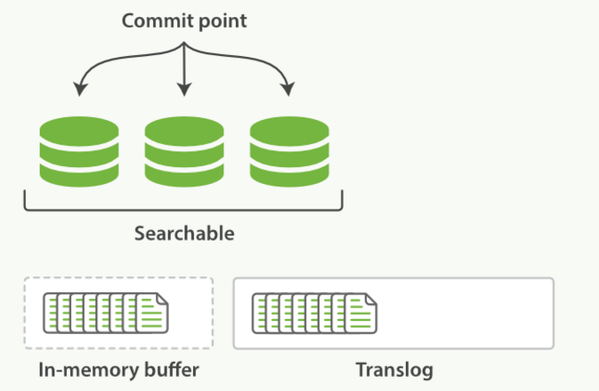
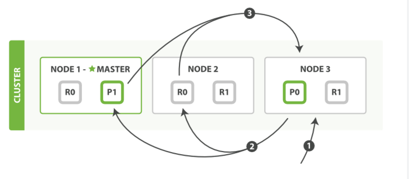
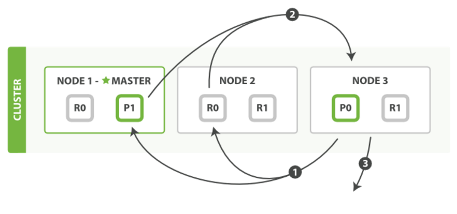
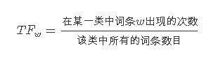
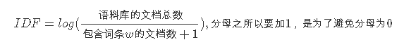

# ElasticSearch

## 基本概念

### **索引（Index）**

ES将数据存储于一个或多个索引中，索引是具有类似特性的文档的集合。类比传统的关系型数据库领域来说，索引相当于SQL中的一个数据库，或者一个数据存储方案(schema)。索引由其名称(必须为全小写字符)进行标识，并通过引用此名称完成文档的创建、搜索、更新及删除操作。一个ES集群中可以按需创建任意数目的索引。

### 类型（Type）

类型是索引内部的逻辑分区(category/partition)，然而其意义完全取决于用户需求。因此，一个索引内部可定义一个或多个类型(type)。一般来说，类型就是为那些拥有相同的域的文档做的预定义。例如，在索引中，可以定义一个用于存储用户数据的类型，一个存储日志数据的类型，以及一个存储评论数据的类型。类比传统的关系型数据库领域来说，类型相当于“表”。

### 文档（Document）

文档是索引和搜索的原子单位，它是包含了一个或多个域（Field）的容器，基于JSON格式进行表示。文档由一个或多个域组成，每个域拥有一个名字及一个或多个值，有多个值的域通常称为“多值域”。每个文档可以存储不同的域集，但同一类型下的文档至应该有某种程度上的相似之处。

### 倒排索引（Inverted Index）

每一个文档都对应一个ID。倒排索引会按照指定语法对每一个文档进行分词，然后维护一张表，列举所有文档中出现的terms以及它们出现的文档ID和出现频率。搜索时同样会对关键词进行同样的分词分析，然后查表得到结果。这里所述倒排索引是针对非结构化的文档构造的，而在ES中存储的文档是基于JSON格式的，因此索引结构会更为复杂。简单来说，ES对于JSON文档中的每一个field都会构建一个对应的倒排索引。 

### 节点（Node）

一个运行中的 Elasticsearch 实例称为一个节点，而集群是由一个或者多个拥有相同cluster.name配置的节点组成， 它们共同承担数据和负载的压力。

ES集群中的节点有三种不同的类型：

- 主节点：负责管理集群范围内的所有变更，例如增加、删除索引，或者增加、删除节点等。 主节点并不需要涉及到文档级别的变更和搜索等操作。可以通过属性node.master进行设置。
- 数据节点：存储数据和其对应的倒排索引。默认每一个节点都是数据节点（包括主节点），可以通过node.data属性进行设置。
- 协调节点：如果node.master和node.data属性均为false，则此节点称为协调节点，用来响应客户请求，均衡每个节点的负载。

### 分片（Shard）

一个索引中的数据保存在多个分片中，相当于水平分表。一个分片便是一个Lucene 的实例，它本身就是一个完整的搜索引擎。我们的文档被存储和索引到分片内，但是应用程序是直接与索引而不是与分片进行交互。

ES实际上就是利用分片来实现分布式。分片是数据的容器，文档保存在分片内，分片又被分配到集群内的各个节点里。 当你的集群规模扩大或者缩小时， ES会自动的在各节点中迁移分片，使得数据仍然均匀分布在集群里。

一个分片可以是*主分片*或者*副本分片*。 索引内任意一个文档都归属于一个主分片，所以主分片的数目决定着索引能够保存的最大数据量。一个副本分片只是一个主分片的拷贝。副本分片作为硬件故障时保护数据不丢失的冗余备份，并为搜索和返回文档等读操作提供服务。

在索引建立的时候就已经确定了主分片数，但是副本分片数可以随时修改。默认情况下，一个索引会有5个主分片，而其副本可以有任意数量。

主分片和副本分片的状态决定了集群的健康状态。每一个节点上都只会保存主分片或者其对应的一个副本分片，相同的副本分片不会存在于同一个节点中。如果集群中只有一个节点，则副本分片将不会被分配，此时集群健康状态为yellow，存在丢失数据的风险。

## CRUD操作

### 索引新文档（Create）

当用户向一个节点提交了一个索引新文档的请求，节点会计算新文档应该加入到哪个分片（shard）中。每个节点都存储有每个分片存储在哪个节点的信息，因此协调节点会将请求发送给对应的节点。注意这个请求会发送给主分片，等主分片完成索引，会并行将请求发送到其所有副本分片，保证每个分片都持有最新数据。

每次写入新文档时，都会先写入内存中，并将这一操作写入一个translog文件（transaction log）中，此时如果执行搜索操作，这个新文档还不能被索引到。



ES会每隔1秒时间（这个时间可以修改）进行一次刷新操作（refresh），此时在这1秒时间内写入内存的新文档都会被写入一个文件系统缓存（filesystem cache）中，并构成一个分段（segment）。此时这个segment里的文档可以被搜索到，但是尚未写入硬盘，即如果此时发生断电，则这些文档可能会丢失。 不断有新的文档写入，则这一过程将不断重复执行。每隔一秒将生成一个新的segment，而translog文件将越来越大。 

每隔30分钟或者translog文件变得很大，则执行一次fsync操作。此时所有在文件系统缓存中的segment将被写入磁盘，而translog将被删除（此后会生成新的translog）。 

由上面的流程可以看出，在两次fsync操作之间，存储在内存和文件系统缓存中的文档是不安全的，一旦出现断电这些文档就会丢失。所以ES引入了translog来记录两次fsync之间所有的操作，这样机器从故障中恢复或者重新启动，ES便可以根据translog进行还原。

当然，translog本身也是文件，存在于内存当中，如果发生断电一样会丢失。因此，ES会在每隔5秒时间或是一次写入请求完成后将translog写入磁盘。可以认为一个对文档的操作一旦写入磁盘便是安全的可以复原的，因此只有在当前操作记录被写入磁盘，ES才会将操作成功的结果返回发送此操作请求的客户端。

此外，由于每一秒就会生成一个新的segment，很快将会有大量的segment。对于一个分片进行查询请求，将会轮流查询分片中的所有segment，这将降低搜索的效率。因此ES会自动启动合并segment的工作，将一部分相似大小的segment合并成一个新的大segment。合并的过程实际上是创建了一个新的segment，当新segment被写入磁盘，所有被合并的旧segment被清除。

### 更新（Update）和删除（Delete）

ES的索引是不能修改的，因此更新和删除操作并不是直接在原索引上直接执行。

每一个磁盘上的segment都会维护一个del文件，用来记录被删除的文件。每当用户提出一个删除请求，文档并没有被真正删除，索引也没有发生改变，而是在del文件中标记该文档已被删除。因此，被删除的文档依然可以被检索到，只是在返回检索结果时被过滤掉了。每次在启动segment合并工作时，那些被标记为删除的文档才会被真正删除。

更新文档会首先查找原文档，得到该文档的版本号。然后将修改后的文档写入内存，此过程与写入一个新文档相同。同时，旧版本文档被标记为删除，同理，该文档可以被搜索到，只是最终被过滤掉。

### 读操作（Read）

查询的过程大体上分为查询（query）和取回（fetch）两个阶段。这个节点的任务是广播查询请求到所有相关分片，并将它们的响应整合成全局排序后的结果集合，这个结果集合会返回给客户端。

**查询阶段**

当一个节点接收到一个搜索请求，则这个节点就变成了协调节点。



第一步是广播请求到索引中每一个节点的分片拷贝。 查询请求可以被某个主分片或某个副本分片处理，协调节点将在之后的请求中轮询所有的分片拷贝来分摊负载。

每个分片将会在本地构建一个优先级队列。如果客户端要求返回结果排序中从第from名开始的数量为size的结果集，则每个节点都需要生成一个from+size大小的结果集，因此优先级队列的大小也是from+size。分片仅会返回一个轻量级的结果给协调节点，包含结果集中的每一个文档的ID和进行排序所需要的信息。

协调节点会将所有分片的结果汇总，并进行全局排序，得到最终的查询排序结果。此时查询阶段结束。

**取回阶段**

查询过程得到的是一个排序结果，标记出哪些文档是符合搜索要求的，此时仍然需要获取这些文档返回客户端。

协调节点会确定实际需要返回的文档，并向含有该文档的分片发送get请求；分片获取文档返回给协调节点；协调节点将结果返回给客户端。



### 相关性计算

在搜索过程中对文档进行排序，需要对每一个文档进行打分，判别文档与搜索条件的相关程度。在旧版本的ES中默认采用TF/IDF（term frequency/inverse document frequency）算法对文档进行打分。

TF-IDF(Term Frequency-Inverse Document Frequency, 词频-逆文件频率).

> 是一种用于资讯检索与资讯探勘的常用加权技术。TF-IDF是一种统计方法，用以评估一字词对于一个文件集或一个语料库中的其中一份文件的重要程度。**字词的重要性随着它在文件中出现的次数成正比增加，但同时会随着它在语料库中出现的频率成反比下降。**

**上述引用总结就是, 一个词语在一篇文章中出现次数越多, 同时在所有文档中出现次数越少, 越能够代表该文章.**

这也就是TF-IDF的含义.

**词频 (term frequency, TF)** 指的是某一个给定的词语在该文件中出现的次数。这个数字通常会被归一化(一般是词频除以文章总词数), 以防止它偏向长的文件。（同一个词语在长文件里可能会比短文件有更高的词频，而不管该词语重要与否。）

> 但是, 需要注意, 一些通用的词语对于主题并没有太大的作用, 反倒是一些出现频率较少的词才能够表达文章的主题, 所以单纯使用是TF不合适的。权重的设计必须满足：**一个词预测主题的能力越强，权重越大，反之，权重越小**。所有统计的文章中，一些词只是在其中很少几篇文章中出现，那么这样的词对文章的主题的作用很大，这些词的权重应该设计的较大。IDF就是在完成这样的工作.

公式:



逆向文件频率 (inverse document frequency, IDF)

IDF的主要思想是：如果包含词条t的文档越少, IDF越大，则说明词条具有很好的类别区分能力。某一特定词语的IDF，可以由总文件数目除以包含该词语之文件的数目，再将得到的商取对数得到。

公式: 



　　某一特定文件内的高词语频率，以及该词语在整个文件集合中的低文件频率，可以产生出高权重的TF-IDF。因此，TF-IDF倾向于过滤掉常见的词语，保留重要的词语。 

**数值类型对搜索效率的影响**

ES5.x之前用到的Lucene版本，实际上只能够索引文本类型的数据，表面上被定义为数值类型的字段，在暗地里都被转换成了字符串，编排成了倒排索引。

## Lucene倒排索引原理

Lucerne使用的是倒排文件索引结构。该结构及相应的生成算法如下： 　　

设有两篇文章1和2：

文章1的内容为：Tom lives in Guangzhou,I live in Guangzhou too. 　　

文章2的内容为：He once lived in Shanghai.

**<1>取得关键词**

由于lucene是基于关键词索引和查询的，首先我们要取得这两篇文章的关键词，通常我们需要如下处理措施： 　　

a.我们现在有的是文章内容，即一个字符串，我们先要找出字符串中的所有单词，即分词。英文单词由于用空格分隔，比较好处理。中文单词间是连在一起的需要特殊的分词处理。 　 　

b.文章中的”in”, “once” “too”等词没有什么实际意义，中文中的“的”“是”等字通常也无具体含义，这些不代表概念的词可以过滤掉 　　

c.用户通常希望查“He”时能把含“he”，“HE”的文章也找出来，所以所有单词需要统一大小写。 　　

d.用户通常希望查“live”时能把含“lives”，“lived”的文章也找出来，所以需要把“lives”，“lived”还原成“live” 　　

e.文章中的标点符号通常不表示某种概念，也可以过滤掉 　　

在lucene中以上措施由Analyzer类完成。 经过上面处理后，

文章1的所有关键词为：[tom][live] [guangzhou][i] [live][guangzhou] 　 　

文章2的所有关键词为：[he][live] [shanghai]

**<2>建立倒排索引**

有了关键词后，我们就可以建立倒排索引了。上面的对应关系是：“文章号”对“文章中所有关键词”。倒排索引把这个关系倒过来，变成: “关键词”对“拥有该关键词的所有文章号”。

文章1，2经过倒排后变成 　　

```
关键词          文章号 　　
guangzhou        1 　　
he               2 　　
i                1 　　
live             1,2 　　
shanghai         2 　　
tom              1 　　
12345678
```

通常仅知道关键词在哪些文章中出现还不够，我们还需要知道关键词在文章中出现次数和出现的位置，通常有两种位置：

a.字符位置，即记录该词是文章中第几个字符（优点是关键词亮显时定位快）；

b.关键词位置，即记录该词是文章中第几个关键词（优点是节约索引空间、词组（phase）查询快），lucene中记录的就是这种位置。 　　

加上“出现频率”和“出现位置”信息后，我们的索引结构变为： 　　

```
关键词            文章号[出现频率]              出现位置 　　
guangzhou           1[2]                      3，6 　　
he                  2[1]                      1 　　
i                   1[1]                      4 　　
live                1[2]                      2，5, 
                    2[1]                      2 　　
shanghai            2[1]                      3 　　
tom                 1[1]                      1 12345678
```

以live 这行为例我们说明一下该结构：live在文章1中出现了2次，文章2中出现了一次，它的出现位置为“2,5,2”这表示什么呢？我们需要结合文章号和出现频率来分析，文章1中出现了2次，那么“2,5”就表示live在文章1中出现的两个位置，文章2中出现了一次，剩下的“2”就表示live是文章2中第 2个关键字。 　　

以上就是lucene索引结构中最核心的部分。我们注意到关键字是按字符顺序排列的（lucene没有使用B树结构），**因此lucene可以用二分搜索算法快速定位关键词**。

**<3>实现**

实现时，lucene将上面三列分别作为词典文件（Term Dictionary）、频率文件(frequencies)、位置文件 (positions)保存。其中词典文件不仅保存有每个关键词，还保留了指向频率文件和位置文件的指针，通过指针可以找到该关键字的频率信息和位置信息。 　　

Lucene中使用了field的概念，用于表达信息所在位置（如标题中，文章中，url中），在建索引中，该field信息也记录在词典文件中，每个关键词都有一个field信息(因为每个关键字一定属于一个或多个field)。

**<4>压缩算法**

为了减小索引文件的大小，Lucene对索引还使用了压缩技术。

首先，对词典文件中的关键词进行了压缩，关键词压缩为<前缀长度，后缀>，例如：当前词为“阿拉伯语”，上一个词为“阿拉伯”，那么“阿拉伯语”压缩为<3，语>。

其次大量用到的是对数字的压缩，数字只保存与上一个值的差值（这样可以减小数字的长度，进而减少保存该数字需要的字节数）。例如当前文章号是16389（不压缩要用3个字节保存），上一文章号是16382，压缩后保存7（只用一个字节）。

**<5>应用原因**

下面我们可以通过对该索引的查询来解释一下为什么要建立索引。 　　

假设要查询单词 “live”，lucene先对词典二元查找、找到该词，通过指向频率文件的指针读出所有文章号，然后返回结果。词典通常非常小，因而，整个过程的时间是毫秒级的。 　　

而用普通的顺序匹配算法，不建索引，而是对所有文章的内容进行字符串匹配，这个过程将会相当缓慢，当文章数目很大时，时间往往是无法忍受的。