# HBase

## 架构

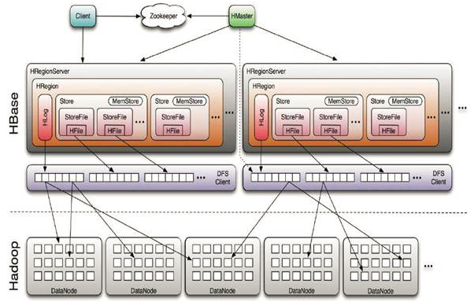

HBase隶属于hadoop生态系统，它参考了谷歌的BigTable建模，实现的编程语言为 Java, 建立在hdfs之上，提供高可靠性、高性能、列存储、可伸缩、实时读写的数据库系统。它仅能通过主键(row key)和主键的range来检索数据，主要用来存储非结构化和半结构化的松散数据。与hadoop一样，Hbase目标主要依靠横向扩展，通过不断增加廉价的商用服务器，来增加计算和存储能力。Hbase数据库中的表一般有这样的特点：

- 大： 一个表可以有上亿行，上百万列
- 面向列:  面向列(族)的存储和权限控制，列(族)独立检索
- 稀疏: 对于为空(null)的列，并不占用存储空间，因此，表可以设计的非常稀疏

## HBase的构成

​	物理上来说，HBase是由三种类型的服务器以主从模式构成的。这三种服务器分别是：**Region server**，**HBase HMaster**，**ZooKeeper**。

​	其中Region server负责数据的读写服务。用户通过沟通Region server来实现对数据的访问。HBase HMaster负责Region的分配及数据库的创建和删除等操作。ZooKeeper作为HDFS的一部分，负责维护集群的状态（某台服务器是否在线，服务器之间数据的同步操作及master的选举等）。

​	另外，Hadoop DataNode负责存储所有Region Server所管理的数据。HBase中的所有数据都是以HDFS文件的形式存储的。出于使Region server所管理的数据更加本地化的考虑，Region server是根据DataNode分布的。HBase的数据在写入的时候都存储在本地。但当某一个region被移除或被重新分配的时候，就可能产生数据不在本地的情况。这种情况只有在所谓的compaction之后才能解决。NameNode负责维护构成文件的所有物理数据块的元信息（metadata）。

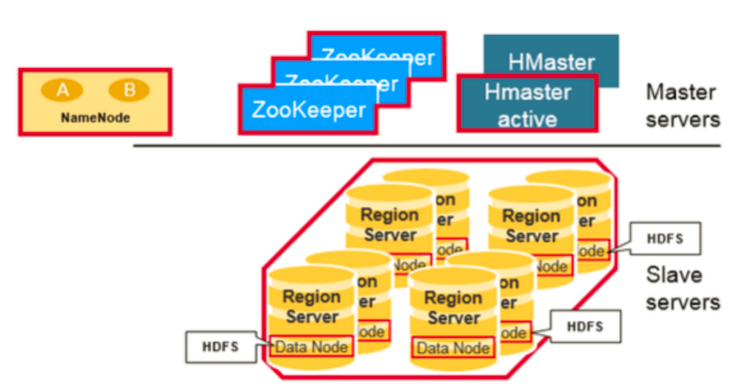

### Regions

​	HBase中的表是根据row key的值水平分割成所谓的region的。一个region包含表中所有row key位于region的起始键值和结束键值之间的行。集群中负责管理Region的结点叫做Region server。Region server负责数据的读写。每一个Region server大约可以管理1000个region。Region的结构如下图所示： 

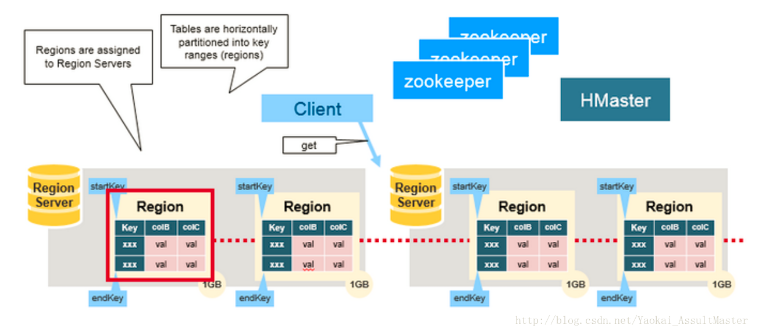

### HMaster

​	HMaster负责region的分配，数据库的创建和删除操作。具体来说，HMaster的职责包括：

- 调控Region server的工作 
  - 在集群启动的时候分配region，根据恢复服务或者负载均衡的需要重新分配region。
  - 监控集群中的Region server的工作状态。（通过监听zookeeper对于ephemeral node状态的通知）。
- 管理数据库 
  - 提供创建，删除或者更新表格的接口。

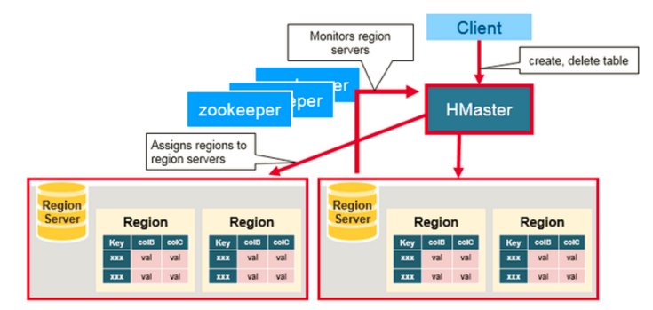

### ZooKeeper

​	HBase利用ZooKeeper维护集群中服务器的状态并协调分布式系统的工作。ZooKeeper维护服务器是否存活，是否可访问的状态并提供服务器故障/宕机的通知。ZooKeeper同时还使用一致性算法来保证服务器之间的同步。同时也负责Master选举的工作。需要注意的是要保证良好的一致性及顺利的Master选举，集群中的服务器数目必须是奇数。 

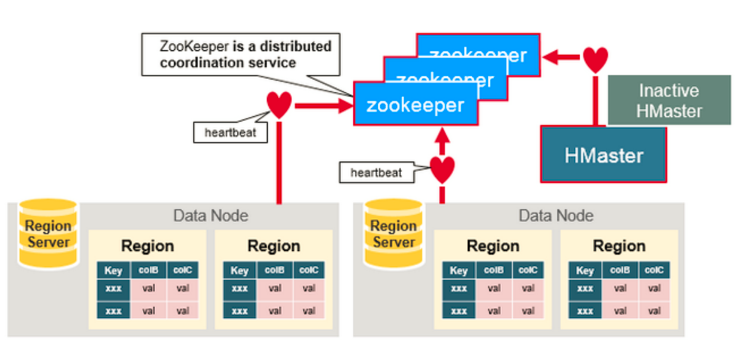

​	每一个Region server都在ZooKeeper中创建相应的ephemeral node。HMaster通过监控这些ephemeral node的状态来发现正常工作的或发生故障下线的Region server。HMaster之间通过互相竞争创建ephemeral node进行Master选举。ZooKeeper会选出区中第一个创建成功的作为唯一一个活跃的HMaster。活跃的HMaster向ZooKeeper发送心跳信息来表明自己在线的状态。不活跃的HMaster则监听活跃HMaster的状态，并在活跃HMaster发生故障下线之后重新选举，从而实现了HBase的高可用性。

​	如果Region server或者HMaster不能成功向ZooKeeper发送心跳信息，则其与ZooKeeper的连接超时之后与之相应的ephemeral node就会被删除。监听ZooKeeper状态的其他节点就会得到相应node不存在的信息，从而进行相应的处理。活跃的HMaster监听Region Server的信息，并在其下线后重新分配Region server来恢复相应的服务。不活跃的HMaster监听活跃HMaster的信息，并在起下线后重新选出活跃的HMaster进行服务。

## 存储结构

### 	meta表

- META table中保存了HBase中所有region的信息。
- META table的格式类似于B tree。
- META table的结构如下： 
  - 键：region的起始键，region id。
  - 值：Region server

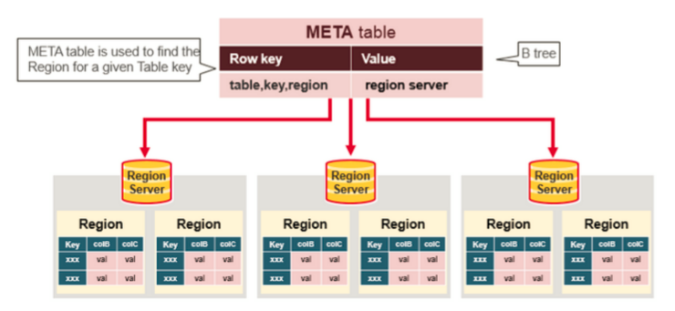

### 	Region Server

​	运行在HDFS DataNode上的Region server包含如下几个部分：

- WAL：既Write Ahead Log。WAL是HDFS分布式文件系统中的一个文件。WAL用来存储尚未写入永久性存储区中的新数据。WAL也用来在服务器发生故障时进行数据恢复。
- Block Cache：Block cache是读缓存。Block cache将经常被读的数据存储在内存中来提高读取数据的效率。当Block cache的空间被占满后，其中被读取频率最低的数据将会被杀出。
- MemStore：MemStore是写缓存。其中存储了从WAL中写入但尚未写入硬盘的数据。MemStore中的数据在写入硬盘之前会先进行排序操作。每一个region中的每一个column family对应一个MemStore。
- Hfiles：Hfiles存在于硬盘上，根据排序号的键存储数据行。

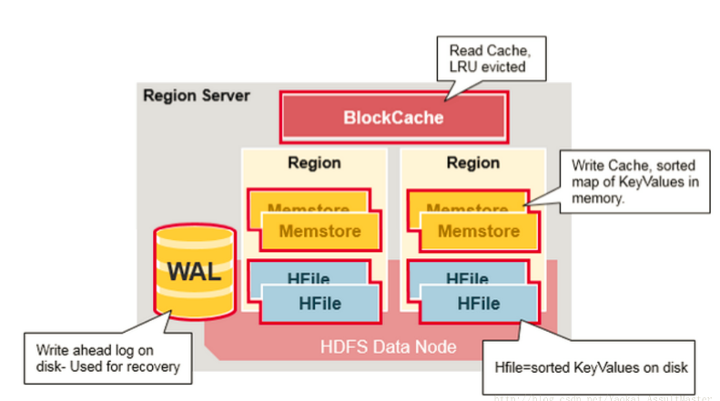

### MemStore

​	Memstore存在于内存中，其中存储的是按键排好序的待写入硬盘的数据。数据也是按键排好序写入HFile中的。每一个Region中的每一个Column family对应一个Memstore文件。因此对数据的更新也是对应于每一个Column family。 

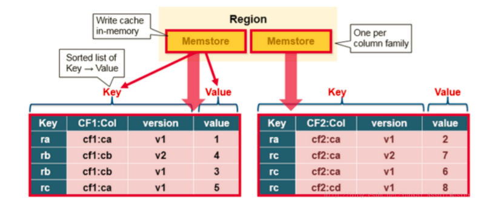

​	当MemStore中积累了足够多的数据之后，整个Memcache中的数据会被一次性写入到HDFS里的一个新的HFile中。因此HDFS中一个Column family可能对应多个HFile。这个HFile中包含了相应的cell，或者说键值的实例。这些文件随着MemStore中积累的对数据的操作被flush到硬盘上而创建。

​	需要注意的是，MemStore存储在内存中，这也是为什么HBase中Column family的数目有限制的原因。每一个Column family对应一个MemStore，当MemStore存满之后，里面所积累的数据就会一次性flush到硬盘上。同时，为了使HDFS能够知道当前哪些数据已经被存储了，MemStore中还保存最后一次写操作的序号。

​	每个HFile中最大的序号作为meta field存储在其中，这个序号标明了之前的数据向硬盘存储的终止点和接下来继续存储的开始点。当一个region启动的时候，它会读取每一个HFile中的序号来得知当前region中最新的操作序号是什么（最大的序号）。

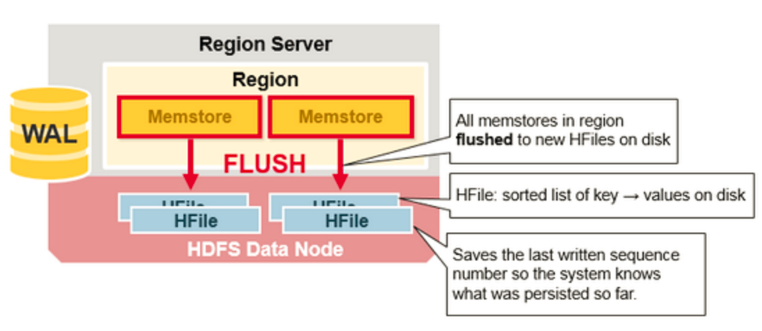

### 	HFile

​	HBase中的键值数据对存储在HFile中。上面已经说过，当MemStore中积累足够多的数据的时候就会将其中的数据整个写入到HDFS中的一个新的HFile中。因为MemStore中的数据已经按照键排好序，所以这是一个顺序写的过程。由于顺序写操作避免了磁盘大量寻址的过程，所以这一操作非常高效。 

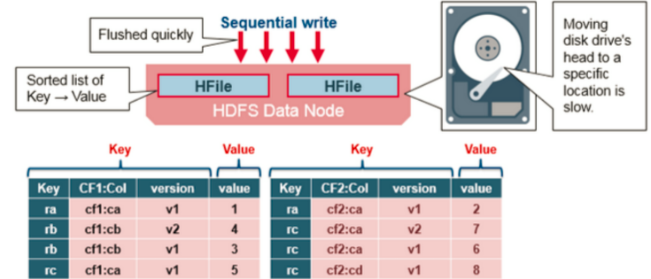

​	HFile中包含了一个多层索引系统。这个多层索引是的HBase可以在不读取整个文件的情况下查找数据。这一多层索引类似于一个B+树。

- 键值对根据键大小升序排列。
- 索引指向64KB大小的数据块。
- 每一个数据块还有其相应的叶索引（leaf-index）。
- 每一个数据块的最后一个键作为中间索引（intermediate index）。
- 根索引（root index）指向中间索引。

文件结尾指向meta block。因为meta block是在数据写入硬盘操作的结尾写入该文件中的。文件的结尾同时还包含一些别的信息。比如`bloom filter`及时间信息。`Bloom filter`可以帮助HBase加速数据查询的速度。因为HBase可以利用`Bloom filter`跳过不包含当前查询的键的文件。时间信息则可以帮助HBase在查询时跳过读操作所期望的时间区域之外的文件。

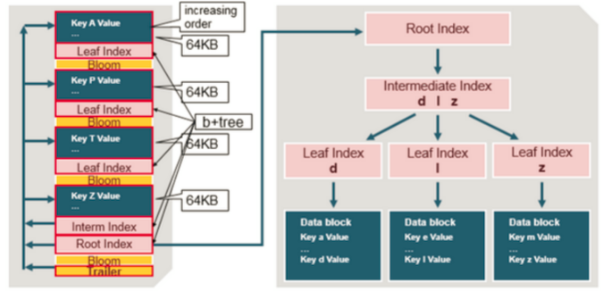

HFile的索引在HFile被打开时会被读取到内存中。这样就可以保证数据检索只需一次硬盘查询操作。 

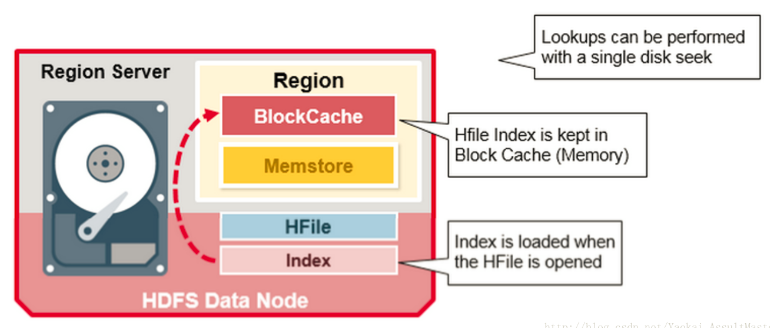

## 读写过程

​	HBase中有一个特殊的起目录作用的表格，称为META table。META table中保存集群region的地址信息。ZooKeeper中会保存META table的位置。

当用户第一次想HBase中进行读或写操作时，以下步骤将被执行：

1. 客户从ZooKeeper中得到保存META table的Region server的信息。
2. 客户向该Region server查询负责管理自己想要访问的row key的所在的region的Region server的地址。客户会缓存这一信息以及META table所在位置的信息。
3. 客户与负责其row所在region的Region Server通信，实现对该行的读写操作。

在未来的读写操作中，客户会根据缓存寻找相应的Region server地址。除非该Region server不再可达。这时客户会重新访问META table并更新缓存。这一过程如下图所示：

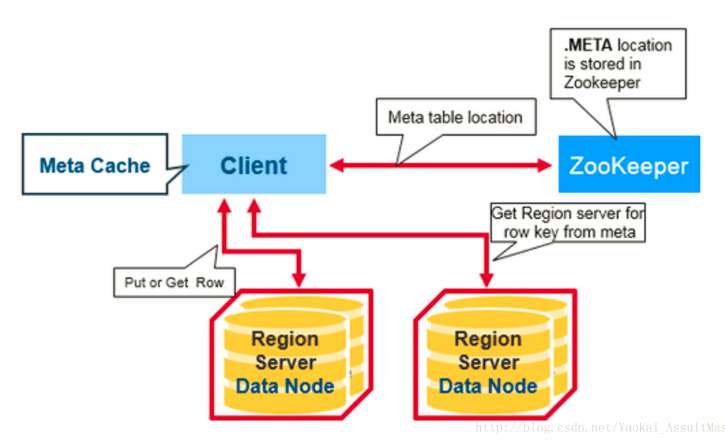

### 步骤一

当HBase的用户发出一个`PUT`请求时（也就是HBase的写请求），HBase进行处理的第一步是将数据写入HBase的write-ahead log（WAL）中。

- WAL文件是顺序写入的，也就是所有新添加的数据都被加入WAL文件的末尾。WAL文件存在硬盘上。
- 当server出现问题之后，WAL可以被用来恢复尚未写入HBase中的数据（因为WAL是保存在硬盘上的）。

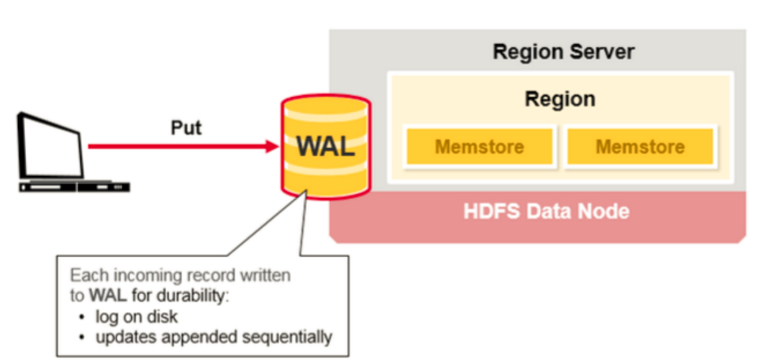

### 步骤二

当数据被成功写入WAL后，HBase将数据存入MemStore。这时HBase就会通知用户PUT操作已经成功了。

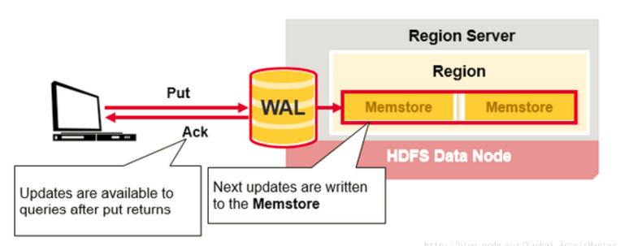

## 集群操作

### 	Compaction

​		①Minor Compaction

​		HBase会自动选取一些较小的HFile进行合并，并将结果写入几个较大的HFile中。这一过程称为Minor compaction。Minor compaction通过Merge sort的形式将较小的文件合并为较大的文件，从而减少了存储的HFile的数量，提升HBase的性能。

这一过程如下图所示：

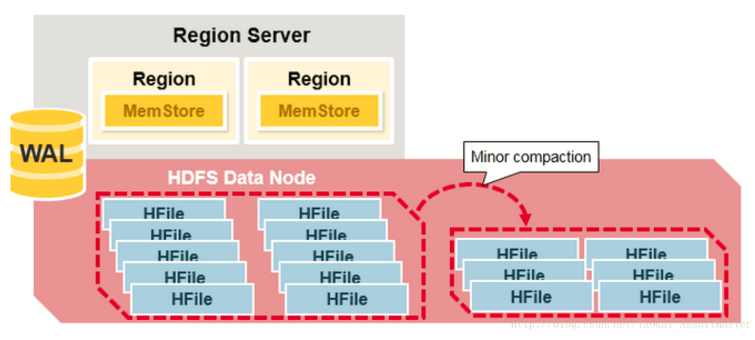

​		②Major Compaction

​		所谓Major Compaction指的是HBase将对应于某一个Column family的所有HFile重新整理并合并为一个HFile，并在这一过程中删除已经删除或过期的cell，更新现有cell的值。这一操作大大提升读的效率。但是因为Major compaction需要重新整理所有的HFile并写入一个HFile，这一过程包含大量的硬盘I/O操作以及网络数据通信。这一过程也称为写放大（Write amplification）。在Major compaction进行的过程中，当前Region基本是处于不可访问的状态。

​		Major compaction可以配置在规定的时间自动运行。为避免影响业务，Major compaction一般安排在夜间或周末进行。需要注意的一点事，Major compaction会将当前Region所服务的所有远程数据下载到本地Region server上。这些远程数据可能由于服务器故障或者负载均衡等原因而存储在于远端服务器上。

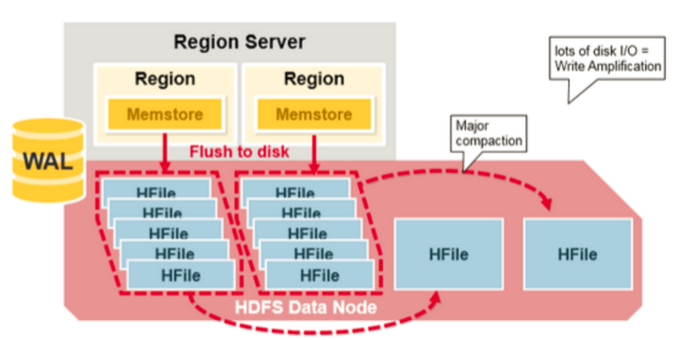

### split

​	每一个表格最初都对应于一个region。随着region中数据量的增加，region会被分割成两个子region。每一个子region中存储原来一半的数据。同时Region server会通知HMaster这一分割。出于负载均衡的原因，HMaster可能会将新产生的region分配给其他的Region server管理（这也就导致了Region server服务远端数据的情况的产生）。 

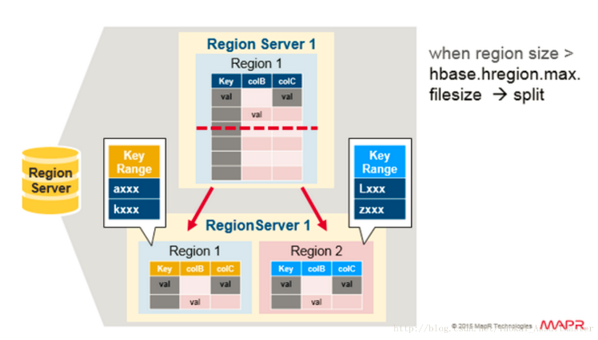

### Read Load Balancing

​		Region的分割最初是在Region server本地发生的。但是出于负载均衡的原因，HMaster可能会将新产生的region分配给其他的Region server进行管理。这也就导致了Region server管理存储在远端服务器上的region情况的产生。这一情况会持续至下一次Major compaction之前。如上文所示，Major compaction会将任何不在本地的数据下载至本地。

也就是说，HBase中的数据在写入时总是存储在本地的。但是随着region的重新分配（由于负载均衡或数据恢复），数据相对于Region server不再一定是本地的。这种情况会在Major compaction后得到解决。

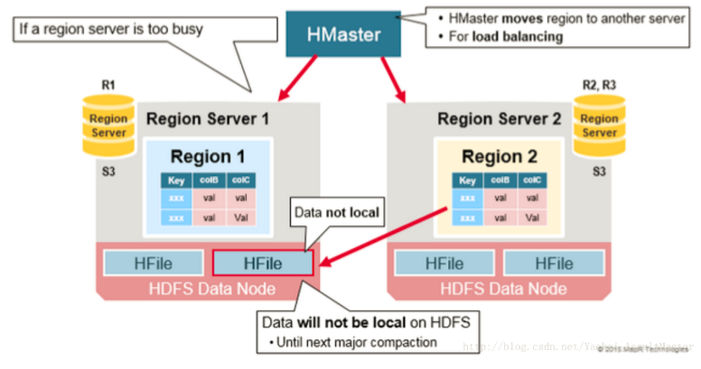

### 数据备份

​	HDFS中所有的数据读写操作都是针对主节点进行的。HDFS会自动备份WAL和HFile。HBase以来HDFS来提供可靠的安全的数据存储。当数据被写入HDFS本地时，另外两份备份数据会分别存储在另外两台服务器上。 

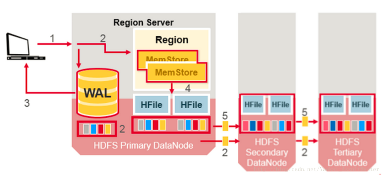

### 异常恢复

​	WAL文件和HFile都存储于硬盘上且存在备份，因此恢复它们是非常容易的。那么HBase如何恢复位于内存中的MemStore呢？ 

​	当Region server宕机的时候，其所管理的region在这一故障被发现并修复之前是不可访问的。ZooKeeper负责根据服务器的心跳信息来监控服务器的工作状态。当某一服务器下线之后，ZooKeeper会发送该服务器下线的通知。HMaster收到这一通知之后会进行恢复操作。

​	HMaster会首先将宕机的Region server所管理的region分配给其他仍在工作的活跃的Region server。然后HMaster会将该服务器的WAL分割并分别分配给相应的新分配的Region server进行存储。新的Region server会读取并顺序执行WAL中的数据操作，从而重新创建相应的MemStore。

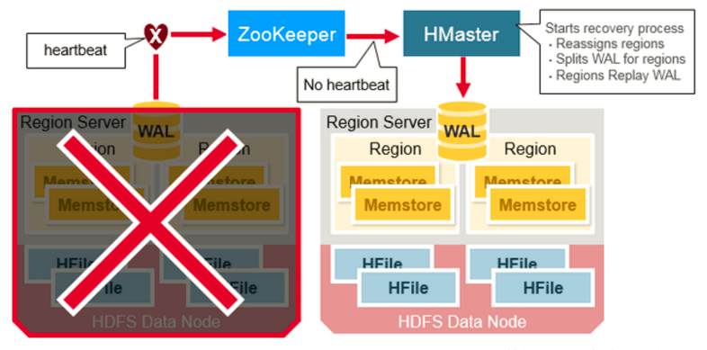

### 数据恢复

​	WAL文件之中存储了一系列数据操作。每一个操作对应WAL中的一行。新的操作会顺序写在WAL文件的末尾。

那么当MemStore中存储的数据因为某种原因丢失之后应该如何恢复呢？HBase以来WAL对其进行恢复。相应的Region server会顺序读取WAL并执行其中的操作。这些数据被存入内存中当前的MemStore并排序。最终当MemStore存满之后，这些数据被flush到硬盘上。

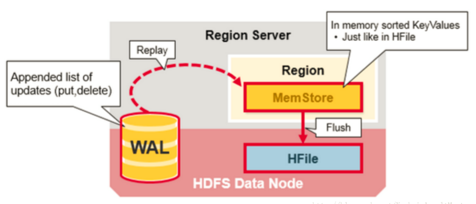

## 调优

### 	服务端

- hbase.regionserver.handler.count：rpc请求的线程数量，默认值是10，生产环境建议使用100，也不是越大越好，特别是当请求内容很大的时候，比如scan/put几M的数据，会占用过多的内存，有可能导致频繁的GC，甚至出现内存溢出。
- hbase.master.distributed.log.splitting：默认值为true，建议设为false。关闭hbase的分布式日志切割，在log需要replay时，由master来负责重放
- hbase.regionserver.hlog.splitlog.writer.threads：默认值是3，建议设为10，日志切割所用的线程数
- hbase.snapshot.enabled：快照功能，默认是false(不开启)，建议设为true，特别是对某些关键的表，定时用快照做备份是一个不错的选择。
- hbase.hregion.max.filesize：默认是10G， 如果任何一个column familiy里的StoreFile超过这个值, 那么这个Region会一分为二，因为region分裂会有短暂的region下线时间(通常在5s以内)，为减少对业务端的影响，建议手动定时分裂，可以设置为60G。
- hbase.hregion.majorcompaction：hbase的region主合并的间隔时间，默认为1天，建议设置为0，禁止自动的major主合并，major合并会把一个store下所有的storefile重写为一个storefile文件，在合并过程中还会把有删除标识的数据删除，在生产集群中，主合并能持续数小时之久，为减少对业务的影响，建议在业务低峰期进行手动或者通过脚本或者api定期进行major合并。
- hbase.hregion.memstore.flush.size：默认值128M，单位字节，一旦有memstore超过该值将被flush，如果regionserver的jvm内存比较充足(16G以上)，可以调整为256M。
- hbase.hregion.memstore.block.multiplier：默认值2，如果一个memstore的内存大小已经超过hbase.hregion.memstore.flush.size *  hbase.hregion.memstore.block.multiplier，则会阻塞该memstore的写操作，为避免阻塞，建议设置为5，如果太大，则会有OOM的风险。如果在regionserver日志中出现"Blocking updates for '<threadName>' on region <regionName> : memstore size <多少M> is >= than blocking <多少M> size"的信息时，说明这个值该调整了。
- hbase.hstore.compaction.min：默认值为3，如果任何一个store里的storefile总数超过该值，会触发默认的合并操作，可以设置5~8，在手动的定期major compact中进行storefile文件的合并，减少合并的次数，不过这会延长合并的时间，以前的对应参数为hbase.hstore.compactionThreshold。
- hbase.hstore.compaction.max：默认值为10,一次最多合并多少个storefile，避免OOM。
- hbase.hstore.blockingStoreFiles：默认为7，如果任何一个store(非.META.表里的store)的storefile的文件数大于该值，则在flush memstore前先进行split或者compact，同时把该region添加到flushQueue，延时刷新，这期间会阻塞写操作直到compact完成或者超过hbase.hstore.blockingWaitTime(默认90s)配置的时间，可以设置为30，避免memstore不及时flush。当regionserver运行日志中出现大量的“Region <regionName> has too many store files; delaying flush up to 90000ms"时，说明这个值需要调整了
- hbase.regionserver.global.memstore.upperLimit：默认值0.4，regionserver所有memstore占用内存在总内存中的upper比例，当达到该值，则会从整个regionserver中找出最需要flush的region进行flush，直到总内存比例降到该数以下，采用默认值即可。
- hbase.regionserver.global.memstore.lowerLimit：默认值0.35，采用默认值即可。
- hbase.regionserver.thread.compaction.small：默认值为1，regionserver做Minor Compaction时线程池里线程数目,可以设置为5。
- hbase.regionserver.thread.compaction.large：默认值为1，regionserver做Major Compaction时线程池里线程数目，可以设置为8。
- hbase.regionserver.lease.period：默认值60000(60s)，客户端连接regionserver的租约超时时间，客户端必须在这个时间内汇报，否则则认为客户端已死掉。这个最好根据实际业务情况进行调整
- hfile.block.cache.size：默认值0.25，regionserver的block cache的内存大小限制，在偏向读的业务中，可以适当调大该值，需要注意的是hbase.regionserver.global.memstore.upperLimit的值和hfile.block.cache.size的值之和必须小于0.8。
- dfs.socket.timeout：默认值60000(60s)，建议根据实际regionserver的日志监控发现了异常进行合理的设置，比如我们设为900000，这个参数的修改需要同时更改hdfs-site.xml
- dfs.datanode.socket.write.timeout：默认480000(480s),有时regionserver做合并时，可能会出现datanode写超时的情况，480000 millis timeout while waiting for channel to be ready for write，这个参数的修改需要同时更改hdfs-site.xml

### jvm和垃圾收集参数

- export HBASE_REGIONSERVER_OPTS="-Xms36g -Xmx36g -Xmn1g -XX:+UseParNewGC -XX:+UseConcMarkSweepGC -XX:+UseCMSCompactAtFullCollection -XX:CMSFullGCsBeforeCompaction=15 -XX:CMSInitiatingOccupancyFraction=70 -verbose:gc -XX:+PrintGCDetails -XX:+PrintGCTimeStamps -Xloggc:/data/logs/gc-$(hostname)-hbase.log"
- 由于我们服务器内存较大(96G),我们给一部分regionserver的jvm内存开到64G，到现在为止，还没有发生过一次full gc，hbase在内存使用控制方面确实下了不少功夫，比如各种blockcache的实现，细心的同学可以看源码。

### Client端

- hbase.client.write.buffer：默认为2M，写缓存大小，推荐设置为5M，单位是字节，当然越大占用的内存越多，此外测试过设为10M下的入库性能，反而没有5M好
- hbase.client.pause：默认是1000(1s),如果你希望低延时的读或者写，建议设为200，这个值通常用于失败重试，region寻找等
- hbase.client.retries.number：默认值是10，客户端最多重试次数,可以设为11，结合上面的参数，共重试时间71s
- hbase.ipc.client.tcpnodelay：默认是false，建议设为true，关闭消息缓冲
- hbase.client.scanner.caching：scan缓存，默认为1，避免占用过多的client和rs的内存，一般1000以内合理，如果一条数据太大，则应该设置一个较小的值，通常是设置业务需求的一次查询的数据条数 
- 如果是扫描数据对下次查询没有帮助，则可以设置scan的setCacheBlocks为false，避免使用缓存；
- table用完需关闭，关闭scanner
- 限定扫描范围：指定列簇或者指定要查询的列，指定startRow和endRow
- 使用Filter可大量减少网络消耗
- 通过Java多线程入库和查询，并控制超时时间。后面会共享下我的hbase单机多线程入库的代码

### 建表注意事项

- 开启压缩
- 合理的设计rowkey
- 进行预分区
- 开启bloomfilter

### ZooKeeper调优

- zookeeper.session.timeout：默认值3分钟，不可配置太短，避免session超时，hbase停止服务，线上生产环境由于配置为1分钟，如果太长，当regionserver挂掉，zk还得等待这个超时时间(已有patch修复)，从而导致master不能及时对region进行迁移。
- zookeeper数量：建议5个或者7个节点。给每个zookeeper 4G左右的内存，最好有独立的磁盘。
- hbase.zookeeper.property.maxClientCnxns：zk的最大连接数，默认为300，无需调整。
- 设置操作系统的swappiness为0，则在物理内存不够的情况下才会使用交换分区，避免GC回收时会花费更多的时间，当超过zk的session超时时间则会出现regionserver宕机的误报

### HDFS调优

- dfs.name.dir：namenode的数据存放地址，可以配置多个，位于不同的磁盘并配置一个nfs远程文件系统，这样namenode的数据可以有多个备份
- dfs.namenode.handler.count：namenode节点RPC的处理线程数，默认为10，可以设置为60
- dfs.datanode.handler.count：datanode节点RPC的处理线程数，默认为3，可以设置为30
- dfs.datanode.max.xcievers：datanode同时处理文件的上限，默认为256，可以设置为8192

### 其他

- 列族名、column名、rowkey均会存储到hfile中，因此这几项在设计表结构时都尽量短些
- regionserver的region数量不要过1000，过多的region会导致产生很多memstore，可能会导致内存溢出，也会增加major compact的耗时