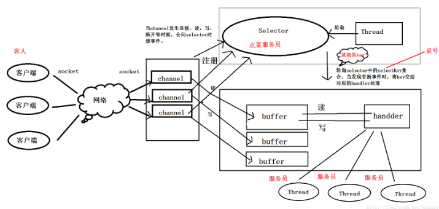
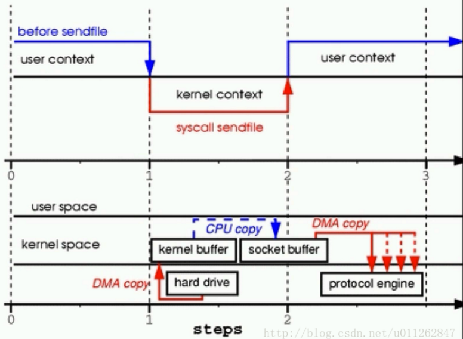

# IO

## 流的概念

### 	流的体系结构

​	java的核心库java.io提供了全面的IO接口。包括：文件读写、标准设备输出等。Java中IO是以流为基础进行输入输出的，所有数据被串行化写入输出流，或者从输入流读入。 在整个Java.io包中最重要的就是5个类和一个接口。5个类指的是File、OutputStream、InputStream、Writer、Reader；一个接口指的是Serializable 。

​	Java I/O主要包括如下几个层次，包含三个部分：

  	①流式部分――IO的主体部分；

  	②非流式部分――主要包含一些辅助流式部分的类，如：File类、RandomAccessFile类和FileDescriptor等类；

​	③其他类--文件读取部分的与安全相关的类，如：SerializablePermission类，以及与本地操作系统相关的文件系统的类，如：FileSystem类和Win32FileSystem类和WinNTFileSystem类。

​	主要的类如下：

​	①File（文件特征与管理）：用于文件或者目录的描述信息，例如生成新目录，修改文件名，删除文件，判断文件所在路径等。

​	②InputStream（二进制格式操作）：抽象类，基于字节的输入操作，是所有输入流的父类。定义了所有输入流都具有的共同特征。

​	③OutputStream（二进制格式操作）：抽象类。基于字节的输出操作。是所有输出流的父类。定义了所有输出流都具有的共同特征。

​	④Reader（文件格式操作）：抽象类，基于字符的输入操作。

​	⑤Writer（文件格式操作）：抽象类，基于字符的输出操作。

​	⑥RandomAccessFile（随机文件操作）：一个独立的类，直接继承至Object.它的功能丰富，**可以从文件的任意位置进行存取（输入输出）操作**。

​	

​	Java的IO模型设计非常优秀，它使用Decorator(装饰者)模式，按功能划分Stream，您可以动态装配这些Stream，以便获得您需要的功能。

###       流的分类

​	字节流：数据流中最小的数据单元是字节  

​	字符流：数据流中最小的数据单元是字符， Java中的字符是Unicode编码，一个字符占用两个字节。 

​	字符流的由来： Java中字符是采用Unicode标准，一个字符是16位，即一个字符使用两个字节来表示。为此，JAVA中引入了处理字符的流。因为数据编码的不同，而有了对字符进行高效操作的流对象。本质其实就是基于字节流读取时，去查了指定的码表。 

### 	特性

  	相对于程序来说，输出流是往存储介质或数据通道写入数据，而输入流是从存储介质或数据通道中读取数据，一般来说关于流的特性有下面几点：

​	①先进先出，最先写入输出流的数据最先被输入流读取到。

​	②顺序存取，可以一个接一个地往流中写入一串字节，读出时也将按写入顺序读取一串字节，不能随机访问中间的数据。（RandomAccessFile**可以从文件的任意位置进行存取（输入输出）操作**）

​	③只读或只写，每个流只能是输入流或输出流的一种，不能同时具备两个功能，输入流只能进行读操作，对输出流只能进行写操作。在一个数据传输通道中，如果既要写入数据，又要读取数据，则要分别提供两个流。 

## BIO

 	传统的同步阻塞模型开发中，ServerSocket负责绑定IP地址，启动监听端口；Socket负责发起连接操作。连接成功后，双方通过输入和输出流进行**同步阻塞式**通信。 服务端提供IP和监听端口，客户端通过连接操作想服务端监听的地址发起连接请求，通过三次握手连接，如果连接成功建立，双方就可以通过套接字进行通信。

 	简单的描述一下BIO的服务端通信模型：采用BIO通信模型的服务端，通常由一个独立的Acceptor线程负责监听客户端的连接，它接收到客户端连接请求之后为每个客户端创建一个新的线程进行链路处理没处理完成后，通过输出流返回应答给客户端，线程销毁。即典型的一请求一应答通宵模型。

​	

​	该模型最大的问题就是缺乏弹性伸缩能力，当客户端并发访问量增加后，**服务端的线程个数和客户端并发访问数呈1:1的正比关系**，Java中的线程也是比较宝贵的系统资源，线程数量快速膨胀后，系统的性能将急剧下降，随着访问量的继续增大，系统最终就**死掉了**。 

**同步和异步是目的，阻塞和非阻塞是实现方式**。

- 同步和异步是针对应用程序和内核的交互而言的。
- 阻塞和非阻塞是针对于进程在访问数据的时候，根据IO操作的就绪状态来采取的不同方式，说白了是一种读取或者写入操作函数的实现方式，阻塞方式下读取或者写入函数将一直等待，而非阻塞方式下，读取或者写入函数会立即返回一个状态值。

		**同步阻塞：** 
	在此种方式下，用户进程在发起一个IO操作以后，必须等待IO操作的完成，只有当真正完成了IO操作以后，用户进程才能运行。JAVA传统的IO模型属于此种方式。

		**同步非阻塞：** 
	在此种方式下，用户进程发起一个IO操作以后边可返回做其它事情，但是用户进程需要时不时的询问IO操作是否就绪，这就要求用户进程不停的去询问，从而引入不必要的CPU资源浪费。其中目前JAVA的NIO就属于同步非阻塞IO。 
**异步：** 
此种方式下是指应用发起一个IO操作以后，不等待内核IO操作的完成，等内核完成IO操作以后会通知应用程序。

## NIO

​	Java NIO(New IO)是一个可以替代标准Java IO API（从Java 1.4开始)，Java NIO提供了与标准IO不同的IO工作方式。

Java NIO 由以下几个核心部分组成：

- Channels
- Buffers
- Selectors

虽然Java NIO 中除此之外还有很多类和组件，但Channel，Buffer 和 Selector 构成了核心的API。其它组件，如Pipe和FileLock，只不过是与三个核心组件共同使用的工具类。

### 	工作原理

​	

​	NIO中，客户端创建一个连接后，先要将连接注册到Selector，相当于客人进入餐厅后，告诉前台你要用餐，前台会告诉你你的桌号是几号，然后你就可能到那张桌子坐下了，SelectionKey就是桌号。当某一桌需要服务时，前台就记录哪一桌需要什么服务，比如1号桌要点菜，2号桌要结帐，服务员从前台取一条记录，根据记录提供服务，完了再来取下一条。这样服务的时间就被最有效的利用起来了。 这种服务方式跟传统的区别有两个：

​	①增加了一个角色，要有一个专门负责收集客人需求的人。NIO里对应的就是Selector。

​	②由阻塞服务方式改为非阻塞服务了，客人吃着的时候服务员不用一直侯在客人旁边了。传统的IO操作，比如read()，当没有数据可读的时候，线程一直阻塞被占用，直到数据到来。NIO中没有数据可读时，read()会立即返回0，线程不会阻塞。

​	Java NIO和IO之间第一个最大的区别是，IO是面向流的，NIO是面向缓冲区的。Java IO面向流意味着每次从流中读一个或多个字节，直至读取所有字节，它们没有被缓存在任何地方。此外，它**不能前后移动流中的数据**。如果需要前后移动从流中读取的数据，需要先将它缓存到一个缓冲区。 Java NIO的缓冲导向方法略有不同。数据读取到一个它稍后处理的缓冲区，需要时可在缓冲区中前后移动。这就增加了处理过程中的**灵活性**。但是，还需要检查是否该缓冲区中包含所有您需要处理的数据。而且，需确保当更多的数据读入缓冲区时，不要覆盖缓冲区里尚未处理的数据。

​	Java IO的各种流是阻塞的。这意味着，当一个线程调用read() 或 write()时，该线程被阻塞，直到有一些数据被读取，或数据完全写入。该线程在此期间不能再干任何事情了。 Java NIO的非阻塞模式，使一个线程从某通道发送请求读取数据，但是它仅能得到目前可用的数据，如果目前没有数据可用时，就什么都不会获取。而不是保持线程阻塞，所以直至数据变的可以读取之前，该线程可以继续做其他的事情。 非阻塞写也是如此。一个线程请求写入一些数据到某通道，但不需要等待它完全写入，这个线程同时可以去做别的事情。 线程通常将非阻塞IO的空闲时间用于在其它通道上执行IO操作，所以一个单独的线程现在可以管理多个输入和输出通道（channel）。 

### 	通道 Channel

​	Channel 是对数据的源头和数据目标点流经途径的抽象，在这个意义上和 InputStream 和 OutputStream 类似。Channel可以译为“通道、管 道”，而传输中的数据仿佛就像是在其中流淌的水。前面也提到了Buffer，Buffer和Channel相互配合使用，才是Java的NIO。

​	①Java NIO的通道与流区别

- 既可以从通道中读取数据，又可以写数据到通道。但流的读写通常是单向的。
- 通道可以异步地读写。
- 通道中的数据总是要先读到一个Buffer，或者总是要从一个Buffer中写入。

		②Channel主要分类

广义上来说通道可以被分为两类：File I/O和Stream I/O，也就是文件通道和套接字通道。如果分的更细致一点则是：

- FileChannel 从文件读写数据
- SocketChannel 通过TCP读写网络数据
- ServerSocketChannel 可以监听新进来的TCP连接，并对每个链接创建对应的SocketChannel
- DatagramChannel 通过UDP读写网络中的数据
- Pipe

		③Channel的实现

- FileChannel：从文件中读写数据。
- DatagramChannel：能通过UDP读写网络中的数据。
- SocketChannel：能通过TCP读写网络中的数据。
- ServerSocketChannel：可以监听新进来的TCP连接，像Web服务器那样。对每一个新进来的连接都会创建一个SocketChannel。

	## 	缓冲区 Buffer

		缓冲区本质上是一块可以写入数据，然后可以从中读取数据的内存。这块内存被包装成NIO Buffer对象，并提供了一组方法，用来方便的访问该块内存。
	
		使用Buffer读写数据一般遵循以下四个步骤：

- 写入数据到Buffer
- 调用flip()方法
- 从Buffer中读取数据
- 调用clear()方法或者compact()方法

当向buffer写入数据时，buffer会记录下写了多少数据。一旦要读取数据，需要通过 flip() 方法将 Buffer 从**写模式切换到读模式**。在读模式下，可以读取之前写入到buffer的所有数据。

​	一旦读完了所有的数据，就需要清空缓冲区，让它可以再次被写入。有两种方式能清空缓冲区：调用 **clear() 或 compact() 方法**。clear() 方法会清空整个缓冲区。compact() **方法只会清除已经读过的数据**。任何未读的数据都被移到缓冲区的起始处，新写入的数据将放到缓冲区未读数据的后面。

​	**Buffer的三个属性**

- **capacity**：作为一个内存块，Buffer 有一个固定的大小值，也叫 “capacity”. 你只能往里写 capacity 个 byte、long，char 等类型。一旦 Buffer 满了，需要将其清空（通过读数据或者清除数据）才能继续写数据往里写数据。
- **position**：当你写数据到Buffer中时，position表示当前的位置。初始的position值为0.当一个byte、long等数据写到Buffer后， position会向前移动到下一个可插入数据的 Buffer 单元。position 最大可为 capacity – 1。 当读取数据时，也是从某个特定位置读。当将 Buffer 从写模式切换到读模式，position会被重置为 0。当从Buffer的 position 处读取数据时，position 向前移动到下一个可读的位置。
- **limit**：在写模式下，Buffer的limit表示你最多能往 Buffer 里写多少数据。 **写模式下**，limit 等于 Buffer 的 capacity 。 当切换Buffer到读模式时， limit 表示你**最多**能读到多少数据。因此，当切换Buffer到读模式时，limit 会被设置成写模式下的 position 值。换句话说，你能读到之前写入的所有数据（limit被设置成已写数据的数量，这个值在写模式下就是 position ）。


### 	选择器 Selector

​	Java NIO引入了选择器的概念，选择器用于监听多个通道的事件（比如：连接打开，数据到达）。Selector提供选择**已经就绪的任务的能力**：Selector会不断轮询注册在其上的Channel，如果某个Channel上面发生读或者写事件，这个Channel就处于就绪状态，会被Selector轮询出来，然后通过**SelectionKey**可以获取就绪Channel的集合，进行后续的I/O操作。

​	一个Selector可以同时轮询多个Channel，因为JDK使用了epoll()代替传统的select实现，所以没有最大连接句柄1024/2048的限制。所以，只需要一个线程负责Selector的轮询，就可以接入成千上万的客户端。

​	通道触发了一个事件意思是该事件已经就绪。所以，某个channel成功连接到另一个服务器称为“连接就绪”。一个 server socket channel 准备好接收新进入的连接称为“接收就绪”。一个有数据可读的通道可以说是“读就绪”。等待写数据的通道可以说是“写就绪”。

这四种事件用 SelectionKey 的四个常量来表示：

- SelectionKey.OP_CONNECT
- SelectionKey.OP_ACCEPT
- SelectionKey.OP_READ
- SelectionKey.OP_WRITE

### 其它组件

​	①分散（Scatter）/聚集（Gather）

​	分散（scatter）：从Channel中读取是指在读操作时将读取的数据写入多个buffer中。因此，Channel将从Channel中读取的数据“分散（scatter）”到多个Buffer中。 

​	聚集（gather）：写入Channel是指在写操作时将多个buffer的数据写入同一个Channel，因此，Channel 将多个Buffer中的数据“聚集（gather）”后发送到Channel。 

​	②管道（Pipe）

​	Java NIO 管道是2个线程之间的单向数据连接。Pipe有一个source通道和一个sink通道。数据会被写到sink通道，从source通道读取。 

### nio之zero copy

​	①传统IO

​	对于读操作：jvm虚拟机一定会发送一个read（）操作系统级别的方法，由此会产生一个上下文的切换，从程序所在的用户空间切换至系统的内核空间，内核空间向磁盘空间请求数据，通过DMA直接内存访问的方式将数据读取到内核空间缓冲区，此时用户空间是无法直接使用的，所以下面会将这份缓冲数据原封不动的拷贝到用户空间，至此read操作就结束。期间有两次上下文的切换，和两次数据的拷贝

​	对于写操作：将文件读取之后需要发送给远端socket客户端。同样调用系统级别的write方法，需要将上述读到的用户空间的数据原封不动的拷贝到内核上的socket缓冲区，然后DMA 引擎将数据从该缓冲区传到协议引擎，这一次拷贝独立地、异步地发生 。

​	对于这种io的操作，用户空间只是作为一个中转站，会和内核空间有不必要的上下文切换和数据之间的拷贝。

​	②优化IO

​	

​	通过DMA的方式拷贝数据到内核缓冲区，将对应的文件描述符写到socket buffer中，包含了内核的缓冲区的地址和数据长度，并不需要将数据拷贝到socket buffer中，只用存文件描述符。最后协议引擎发送数据的时候，从kernel buffer和socket buffer里面读取数据，对于kernel buffer是真实数据的读取，而对于socket buffer是文件描述符的读取，通过gather操作最终一起发送给客户端

> 很多的web应用程序都支持零拷贝，比如apache和tomcat，Java中提供的nio的方式是通过transferTo来实现

对于我们上面所述的所有方式，用户是无法对文件进行一定的操作。我们可以通过内存映射在中间过程来对文件进行一定的操作：


### nio之内存映射

​	内存映射文件和之前说的 标准IO操作最大的不同之处就在于它虽然最终也是要从磁盘读取数据，但是它并不需要将数据读取到OS内核缓冲区，而是直接将进程的用户私有地址空间中的一部分区域与文件对象建立起映射关系，就好像直接从内存中读、写文件一样，速度当然快了。 


​	按照jdk文档的官方说法，内存映射文件属于JVM中的直接缓冲区，还可以通过 ByteBuffer.allocateDirect() ，即DirectMemory的方式来创建直接缓冲区。他们相比基础的 IO操作来说就是少了中间缓冲区的数据拷贝开销。同时他们属于JVM堆外内存，不受JVM堆内存大小的限制。 直接内存DirectMemory的大小默认为 -Xmx 的JVM堆的最大值，但是并不受其限制，而是由JVM参数 MaxDirectMemorySize单独控制。 

​	java中提供了3种内存映射模式，即：只读(readonly)、读写(read_write)、专用(private) ，对于  只读模式来说，如果程序试图进行写操作，则会抛出ReadOnlyBufferException异常；第二种的读写模式表明了通过内存映射文件的方式写或修改文件内容的话是会立刻反映到磁盘文件中去的，别的进程如果共享了同一个映射文件，那么也会立即看到变化！而不是像标准IO那样每个进程有各自的内核缓冲区，比如JAVA代码中，没有执行 IO输出流的 flush() 或者  close() 操作，那么对文件的修改不会更新到磁盘去，除非进程运行结束；最后一种专用模式采用的是OS的“写时拷贝”原则，即在没有发生写操作的情况下，多个进程之间都是共享文件的同一块物理内存（进程各自的虚拟地址指向同一片物理地址），一旦某个进程进行写操作，那么将会把受影响的文件数据单独拷贝一份到进程的私有缓冲区中，不会反映到物理文件中去。 

## AIO

### 	**AIO的特点**

- 读完了再通知我
- 不会加快IO，只是在读完后进行通知
- 使用回调函数，进行业务处理

AIO的相关代码：

```
//AsynchronousServerSocketChannel类
server = AsynchronousServerSocketChannel.open().bind(new InetSocketAddress(PORT));12
```

使用server上的accept方法

```
public abstract <A> void accept(A attachment,CompletionHandler<AsynchronousSocketChannel,? super A> handler);1
```

CompletionHandler为回调接口，当有客户端accept之后，就做handler中的事情。

### 	NIO与AIO区别

- NIO是同步非阻塞的，AIO是异步非阻塞的
- 由于NIO的读写过程依然在应用线程里完成，所以对于那些读写过程时间长的，NIO就不太适合。而AIO的读写过程完成后才被通知，所以AIO能够胜任那些重量级，读写过程长的任务。