# netty

​	**Netty是由JBOSS提供的一个Java开源框架。Netty提供异步的、事件驱动的网络应用程序框架和工具，用以快速开发高性能、高可靠性的网络服务器和客户端程序。** 

## 特性

### 	设计

- 统一的API，适用于不同的协议（阻塞和非阻塞）
- 基于灵活、可扩展的事件驱动模型
- 高度可定制的线程模型
- 可靠的无连接数据Socket支持（UDP）

### 	性能

- 更好的吞吐量，低延迟
- 更省资源
- 尽量减少不必要的内存拷贝

### 	安全

- 完整的SSL/TLS和STARTTLS的支持
- 能在Applet与Android的限制环境运行良好

### 	健壮

- 不再因过快、过慢或超负载连接导致OutOfMemoryError
- 不再有在高速网络环境下NIO读写频率不一致的问题

### 	易用

- 完善的JavaDoc，用户指南和样例
- 简洁简单
- 仅依赖标准JDK

## 总体架构

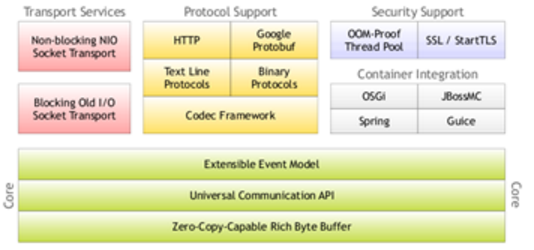

### Core

```
Netty Core是Netty核心内容，它包括事件模型、通用API和Zero Copy功能。是上层功能的基础，由Core可以构建不同的应用服务。
```

### Protocl Support

```
Protocol Support提供了多种协议的编解码包括HTTP、二进制和Google Protobuf等等，它们通过Codec Framework进行整合。
```

### Transport Support

```
Transport Support提供了基本的NIO和BIO传输实现，是Netty网络通信的基础。
```

### Security Support

```
Security Support不光提供了通信层的安全保障（比如SSL/TLS）,还在应用层提供了解决OOM的方案。
```

### Container Integration

```
Container Integration是可以应用于其他主流开发框架的集合，通过它可以和Spring、OSGi进行快速集成，为快速使用Netty提供基础支撑。
```

## 逻辑分层

​	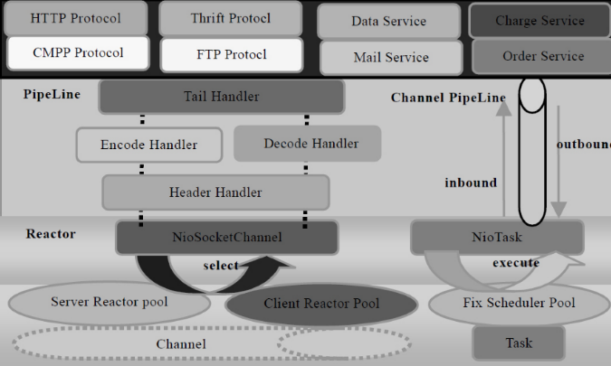

### Reactor通信调度层

```
该层的主要职责是监听网络的读写和连接操作，负责将网络层的数据读取到内存缓冲区中，然后触发各种网络事件，例如连接创建、连接激活、读事件、写事件等等。将这些事件触发到PipeLine中，由PipeLine管理的职责链来后续进行处理。
```

### PipeLine

```
PipeLine是职责链ChannelPipeLine,它负责事件在职责链中的有序传播，同时负责动态的编排职责链。职责链可以选择监听和处理自己关心的事件，它可以拦截处理和向后/向前传播事件。不同应用的Handler节点的功能也不同，通常情况下，往往会开发编解码Handler用于消息的编解码，它可以将外部的协议消息转换成内部的POJO对象，这样上层业务则只需要关心处理业务逻辑即可，不需要感知底层的协议差异和线程模型差异，实现层面的分层隔离。
```

### 业务逻辑编排层

```
业务逻辑编排层通常有两类：一类是纯粹的业务逻辑编排，还有一类是其他的应用层协议插件，用于特定协议相关的会话和链路管理。
```

### 分层设计

```
架构的不同层面，需要关心和处理的对象都不同，通常情况下，对于业务开发者，只需要关心职责链的拦截和业务Handler的编排，因为应用层协议栈往往是开发一次，到处运行，实际上对于业务开发者来说，只需要关心服务层的业务逻辑开发即可。各种应用协议以插件的形式提供，只有协议开发人员需要关注协议插件，对于其他业务开发人员来说，只需要关心业务逻辑定制即可。这种分层的架构设计理念实现了NIO框架各层之间的解耦，便于上层业务协议栈的开发和业务逻辑的定制。
```

> 正是由于Netty的分层架构设计合理，基于Netty的各种应用服务器和协议栈开发才能够如雨后春笋般得到快速发展。

## 架构特点

### 高性能

> **性能是设计出来的，而不是测试出来的**

- 采用异步非阻塞I/O类库，基于Reactor模型实现，解决了传统同步阻塞I/O模式下一个服务器无法平滑地处理线性增长的客户端问题
- TCP接收和发送缓冲区使用直接内存代替堆内存，避免了内存复杂，提高读写性能
- 通过内存池循环利用ByteBuf，避免频繁创建和销毁带来的性能损耗
- 可配置的IO线程数、TCP参数
- 采用环形数组缓冲区实现无锁化并发编程
- 关键资源使用单线程串行化方式
- 通过引入计数器及时地申请释放不再被引用的对象，细粒度的内存管理，减少GC

### 可靠性

- 链路有效性检测

  > 心跳机制进行检测：空闲时检测，事件通知

- 内存保护机制

  > 计数器、重用、上限

- 优雅停机

### 可定制扩展性

- 责任链模式
- 基于接口开发
- 提供了大量工厂类
- 提供了大量的可配置参数

## 组件

### accept

​	**accept属于tcp被动打开环节(被动打开请参考tcp状态变迁图), 被动打开的前提是你这一端listen,** listen时创建了一个监听套接字, 专门负责监听, 不负责传输数据.  当一个SYN到达服务器时, linux内核并不会创建sock结构体, 只是创建一个轻量级的request_sock结构体,里面能唯一确定是哪一个客户端发来的SYN的信息.  接着服务端发送SYN + ACK给客户端, 总结下来是两个步骤:      1.建立request_sock      2.回复SYN + ACK  接着客户端需要回复ACK, 此时服务端从ACK这个包中取出相应信息去查找之前相同客户端发过来的SYN时候创建的request_sock结构体, **到这里内核才会为这条连接创建真正的重量级sock结构体.**  **但是sock还只是socket的子集(socket结构体中有一个指针sock \* sk), 此时一条连接至少还需要绑定一个fd(文件描述符)才能传输数据, accept系统调用后将绑定一个fd**。

​	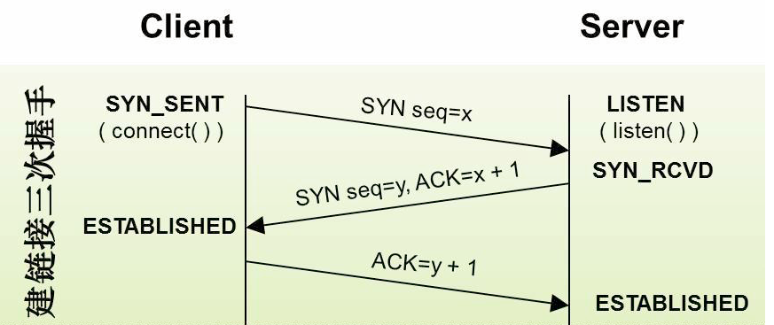

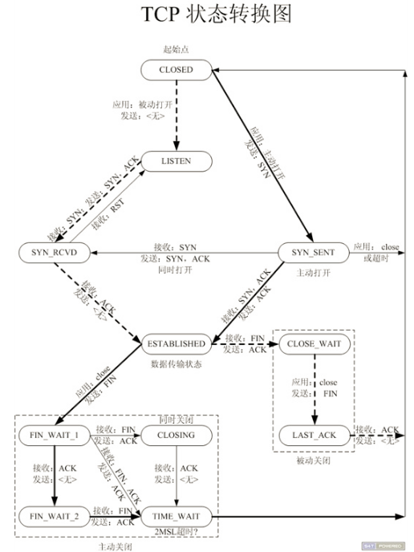

```
private static void processSelectedKey(SelectionKey k, AbstractNioChannel ch) {
    final AbstractNioChannel.NioUnsafe unsafe = ch.unsafe();
    // ......
    try {
        int readyOps = k.readyOps();
        // Also check for readOps of 0 to workaround possible JDK bug which may otherwise lead
        // to a spin loop
        if ((readyOps & (SelectionKey.OP_READ | SelectionKey.OP_ACCEPT)) != 0 || readyOps == 0) {
            unsafe.read();
            if (!ch.isOpen()) {
                // Connection already closed - no need to handle write.
                return;
            }
        }
        if ((readyOps & SelectionKey.OP_WRITE) != 0) {
            // Call forceFlush which will also take care of clear the OP_WRITE once there is nothing left to write
            ch.unsafe().forceFlush();
        }
        if ((readyOps & SelectionKey.OP_CONNECT) != 0) {
            // remove OP_CONNECT as otherwise Selector.select(..) will always return without blocking
            // See https://github.com/netty/netty/issues/924
            int ops = k.interestOps();
            ops &= ~SelectionKey.OP_CONNECT;
            k.interestOps(ops);

            unsafe.finishConnect();
        }
    } catch (CancelledKeyException ignored) {
        unsafe.close(unsafe.voidPromise());
    }
}
```

​	maxMessagesPerRead的默认值在NioMessageUnsafe中为16, 尽可能的一次多accept些连接, 在os层我们提到了accept queue会满, 所以应用层越早拿走accept queue中的连接越好。

​	javaChannel().accept()会通过accept系统调用从os的accept queue中拿出一个连接并包装成SocketChannel，接着又包装一层netty的NioSocketChannel之后放进buf中，NioSocketChannel构造方法将SocketChannel感兴趣的事件设置成OP_READ, 并设置成非阻塞模式。

​	我们回到unsafe#read()方法, 如果每次调用doReadMessages都能拿到一个channel, 那么一直拿到16个以上的channel再跳出循环, 原因在第一点中已经说了.      如果localRead == 0, 表示此时os 的 accept queue中可能已经没有就绪连接了, 所以也跳出循环。

​	接下来触发channelRead event: pipeline.fireChannelRead(readBuf.get(i)); channelRead是inbound event, 回想之前pipeline中的顺序(head--> ServerBootstrapAcceptor-->tail), 会调用ServerBootstrapAcceptor的channelRead()。

​	child.pipeline().addLast(childHandler)就是将这里我们自己用户逻辑相关的handler加入到 channel 的pipeline里面(注意这是worker的pipeline, 前面提到的都是boss 的 pipeline) 。.接下里从workerGroup中拿出一个workerEventLoop并将channel注册到其中, register()的逻辑和第二篇讲bind时bossEventLoop的注册基本是一样的。

### EventLoop

​	**NioEventLoop中维护了一个线程，线程启动时会调用NioEventLoop的run方法**，执行I/O任务和非I/O任务：

​	①**I/O任务**：即selectionKey中ready的事件，如accept、connect、read、write等，由processSelectedKeys方法触发。

​	②**非IO任务**：添加到taskQueue中的任务，如register0、bind0等任务，由runAllTasks方法触发。

两种任务的执行时间比由变量ioRatio控制，默认为50，则表示允许非IO任务执行的时间与IO任务的执行时间相等。

​	**EventLoop的大致数据结构是** 
    	①**一个任务队列** 
 	②**一个延迟任务队列(schedule)** 
    	③**EventLoop绑定了一个Thread, 这直接避免了pipeline中的线程竞争(在这里更正一下4.1.x以及5.x由于引入了FJP[4.1.x现在又去掉了FJP], 线程模型已经有所变化, EventLoop.run()可能被不同的线程执行,但大多数scheduler(包括FJP)在EventLoop这种方式的使用下都能保证在handler中不会"可见性(visibility)"问题, 所以为了理解简单, 我们仍可以理解为为EventLoop绑定了一个Thread)** 
    	④**每个EventLoop有一个Selector, boss用Selector处理accept, worker用Selector处理read,write等**

​	boss可简单理解为Reactor模式中的mainReactor的角色, worker可简单理解为subReactor的角色 
	①boss和worker共用EventLoop的代码逻辑 
	②在不bind多端口的情况下bossEventLoopGroup中只需要包含一个EventLoop 
	③workerEventLoopGroup中一般包含多个EventLoop 
	④netty server启动后会把一个监听套接字ServerSocketChannel注册到bossEventLoop中
	⑤通过上一点我们知道bossEventLoop一个主要责任就是负责accept连接(channel)然后dispatch到worker
	⑥worker接到boss爷赏的channel后负责处理此chanel后续的read,write等event

​	channel分两大类ServerChannel和channel, ServerChannel对应着监听套接字(ServerSocketChannel), channel对应着一个网络连接 。有两大类event:inbound/outbound(上行/下行) 。event按照一定顺序在pipeline里面流转, 流转顺序参见下图 。pipeline里面有多个handler, 每个handler节点过滤在pipeline中流转的event, 如果判定需要自己处理这个event,则处理(用户可以在pipeline中添加自己的handler)

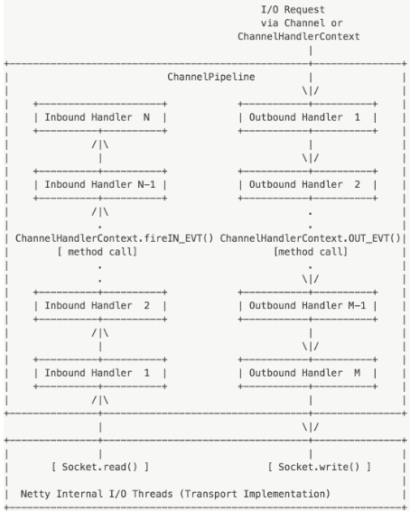

​	如果之前没有指定executor默认为fjp, fjp的parallelism值即为nEventExecutors。xecutor(scheduler)可以由用户指定, 这给了第三方很大的自由度, 总会有高级用户想完全的控制scheduler, 比如Twitter的Finagle.接下来创建children数组, 即EventLoop[],现在可以知道 EventLoop与EventLoopGroup的关系了。后面会讲到boss把一个就绪的连接转交给worker时会从children中取模拿出一个EventLoop然后将连接交给它.。值得注意的是由于这段代码是热点代码, 作为"优化狂魔"netty团队岂会放过这种优化细节? 如果children个数为2的n次方, 会采用和HashMap同样的优化方式[位操作]来代替取模操作:    **children[childIndex.getAndIncrement() & children.length - 1]**  

​	接着在父类中会构造一个task queue, 这是一个lock-free的MPSC队列, netty的线程(比如worker)一直在一个死循环状态中(引入fjp后是不断自己调度自己)去执行IO事件和非IO事件.  除了IO事件, 非IO事件都是先丢到这个MPSC队列再由worker线程去异步执行.      MPSC即multi-producer single-consumer(多生产者, 单消费者) 完美贴合netty的IO线程模型(消费者就是EventLoop自己咯) 。

​	EventLoop执行的任务分为两大类:IO任务和非IO任务：IO任务比如: OP_ACCEPT、OP_CONNECT、OP_READ、OP_WRITE ；非IO任务比如: bind、channelActive等。

​	①先调用hasTask()判断是否有非IO任务, 如果有的话, 选择调用非阻塞的selectNow()让select立即返回, 否则以阻塞的方式调用select. 后续再分析select方法, 目前先把run的流程梳理完.

​	②两类任务执行的时间比例由ioRatio来控制, 你可以通过它来限制非IO任务的执行时间, 默认值是50, 表示允许非IO任务获得和IO任务相同的执行时间, 这个值根据自己的具体场景来设置. 
	③接着调用processSelectedKeys()处理IO事件, 后边会再详细分析. 
	④执行完IO任务后就轮到非IO任务了runAllTasks(). 
	⑤**最后scheduleExecution()是自己调度自己进入下一个轮回, 如此反复, 生命不息调度不止, 除非被shutDown了, isShuttingDown()方法就是去检查state是否被标记为ST_SHUTTING_DOWN.**

```
private void select(boolean oldWakenUp) throws IOException {
    Selector selector = this.selector;
    try {
        int selectCnt = 0;
        long currentTimeNanos = System.nanoTime();
        long selectDeadLineNanos = currentTimeNanos + delayNanos(currentTimeNanos);
        for (;;) {
            long timeoutMillis = (selectDeadLineNanos - currentTimeNanos + 500000L) / 1000000L;
            if (timeoutMillis <= 0) {
                if (selectCnt == 0) {
                    selector.selectNow();
                    selectCnt = 1;
                }
                break;
            }

            int selectedKeys = selector.select(timeoutMillis);
            selectCnt ++;

            if (selectedKeys != 0 || oldWakenUp || wakenUp.get() || hasTasks() || hasScheduledTasks()) {
                break;
            }
            if (Thread.interrupted()) {
                selectCnt = 1;
                break;
            }

            long time = System.nanoTime();
            if (time - TimeUnit.MILLISECONDS.toNanos(timeoutMillis) >= currentTimeNanos) {
                selectCnt = 1;
            } else if (SELECTOR_AUTO_REBUILD_THRESHOLD > 0 &&
                    selectCnt >= SELECTOR_AUTO_REBUILD_THRESHOLD) {
                rebuildSelector();
                selector = this.selector;

                // Select again to populate selectedKeys.
                selector.selectNow();
                selectCnt = 1;
                break;
            }
            currentTimeNanos = time;
        }
        // ...
    } catch (CancelledKeyException ignored) {}
}
```

​	要了解delayNanos我们需要知道每个EventLoop都有一个延迟执行任务的队列(在父类SingleThreadEventExecutor中), 是的现在我们知道EventLoop有2个队列了。delayNanos就是去这个延迟队列里面瞄一眼是否有非IO任务未执行, 如果没有则返回1秒钟 。如果很不幸延迟队列里面有任务, delayNanos的计算结果就等于这个task的deadlineNanos到来之前的这段时间, 也即是说select在这个task按预约到期执行的时候就返回了, 不会耽误这个task。如果最终计算出来的可以无忧无虑select的时间(selectDeadLineNanos - currentTimeNanos)小于500000L纳秒, 就认为这点时间是干不出啥大事业的, 还是selectNow一下直接返回吧, 以免耽误了延迟队列里预约好的task。如果大于500000L纳秒, 表示很乐观, 就以1000000L纳秒为时间片, 放肆的去执行阻塞的select了, 阻塞时间就是timeoutMillis(n * 1000000L纳秒时间片).

​	阻塞的select返回后,如果遇到以下几种情况则立即返回 
	①如果select到了就绪连接(selectedKeys > 0) 
    	②被用户waken up了 
  	③任务队列(上面介绍的那个MPSC)来了一个任务 
 	④延迟队列里面有个预约任务到期需要执行了 
	如果上面情况都不满足, 代表select返回0了, 并且还有时间继续愉快的玩耍。这其中有一个统计select次数的计数器selectCnt, select过多并且都返回0, 默认512就代表过多了, 这表示需要调用rebuildSelector()重建selector了, 为啥呢, 因为nio有个臭名昭著的epoll cpu 100%的bug, 为了规避这个bug, 无奈重建吧。rebuildSelector的实际工作就是，重新打开一个selector, 将原来的那个selector中已注册的所有channel重新注册到新的selector中, 并将老的selectionKey全部cancel掉, 最后将的selector关闭 。重建selector后, 不死心的再selectNow一下 。select过后, 有了一些就绪的读啊写啊等事件, 就需要processSelectedKeys()登场处理了, 我只分析一下优化了selectedKeys的处理方法processSelectedKeysOptimized(selectedKeys.flip())。

​	我们查看 `taskQueue` 定义的地方和被初始化的地方

```
private final Queue<Runnable> taskQueue;


taskQueue = newTaskQueue(this.maxPendingTasks);

@Override
protected Queue<Runnable> newTaskQueue(int maxPendingTasks) {
    // This event loop never calls takeTask()
    return PlatformDependent.newMpscQueue(maxPendingTasks);
}
```

​	我们发现 `taskQueue`在NioEventLoop中默认是mpsc队列，mpsc队列，即多生产者单消费者队列，netty使用mpsc，方便的将外部线程的task聚集，在reactor线程内部用单线程来串行执行，我们可以借鉴netty的任务执行模式来处理类似多线程数据上报，定时聚合的应用。

- 当前reactor线程调用当前eventLoop执行任务，直接执行，否则，添加到任务队列稍后执行
- netty内部的任务分为普通任务和定时任务，分别落地到MpscQueue和PriorityQueue
- netty每次执行任务循环之前，会将已经到期的定时任务从PriorityQueue转移到MpscQueue
- netty每隔64个任务检查一下是否该退出任务循环

### channel

​	Channel是Netty的核心概念之一，它是Netty网络通信的主体，由它负责同对端进行网络通信、注册和数据操作等功能。 

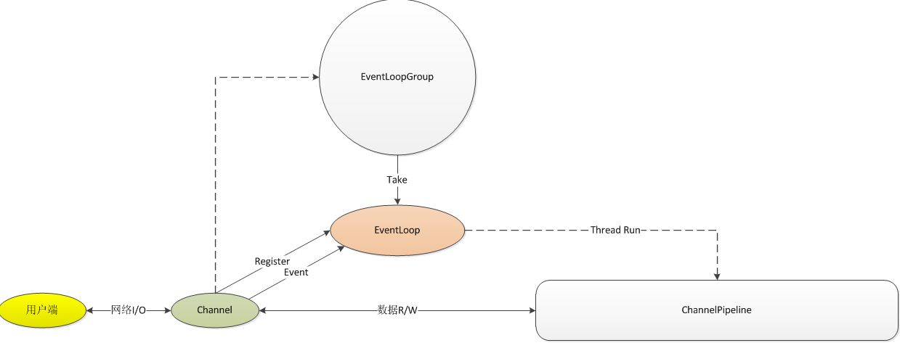

- 一旦用户端连接成功，将新建一个channel同该用户端进行绑定
- channel从EventLoopGroup获得一个EventLoop，并注册到该EventLoop，channel生命周期内都和该EventLoop在一起（注册时获得selectionKey）
- channel同用户端进行网络连接、关闭和读写，生成相对应的event（改变selectinKey信息），触发eventloop调度线程进行执行
- 如果是读事件，执行线程调度pipeline来处理用户业务逻辑

多个channel可以注册到一个eventloop上，所有的操作都是顺序执行的，eventloop会依据channel的事件调用channel的方法进行相关操作，每个channel的操作和处理在eventloop中都是顺序的 。ChannelPipeline和ChannelHandler用于channel事件的拦截和处理，Netty使用类似责任链的模式来设计ChannelPipeline和ChannelHandler 。ChannelPipeline相当于ChannelHandler的容器，channel事件消息在ChannelPipeline中流动和传播，相应的事件能够被ChannelHandler拦截处理、传递、忽略或者终止 。每个ChannelHandler 被添加到ChannelPipeline 后，都会创建一个ChannelHandlerContext 并与之创建的ChannelHandler 关联绑定。 ChannelHandler通过ChannelHandlerContext来操作channel和channelpipeline 。

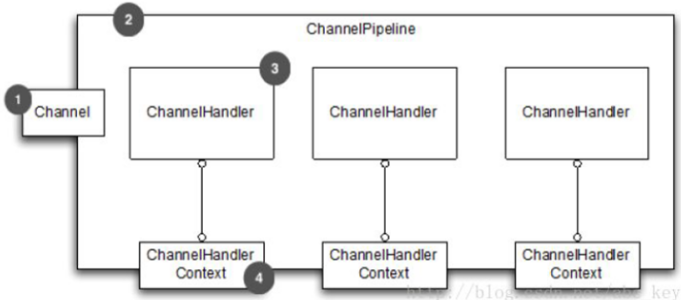

​	ChannelHandler负责I/O事件或者I/O操作进行拦截和处理，用户可以通过ChannelHandlerAdapter来选择性的实现自己感兴趣的事件拦截和处理。 由于Channel只负责实际的I/O操作，因此数据的编解码和实际处理都需要通过ChannelHandler进行处理。 ChannelPipeline是线程安全的，多个业务线程可以并发的操作ChannelPipeline；ChannelHandler不是线程安全的，用户需要自己保重ChannelHandler的线程安全。在Netty中，所有的I/O操作都是异步的，因此调用一个I/O操作后，将继续当前线程的执行，但I/O操作的结果怎么获得？——ChannelFuture。 前线程A异步发起I/O操作后，不阻塞继续执行相关操作，当IO线程B完成后，通过回调执行A设置的回调方法。 回调方法通过监听的形式实现:ChannelFutureListener。 **ChannelPromise是ChannelFuture的扩展，允许设置I/O操作的结果，使ChannelFutureListener可以执行相关操作** 。

​	如果将ChannelPipeline视为ChannelHandler实例链，可拦截流经通道的入站和出站事件，即可明白ChannelHandler之间的交互是如何构成应用程序数据和事件处理逻辑的核心的。当创建一个新的Channel时，都会分配了一个新的ChannelPipeline，该关联是永久的，该通道既不能附加另一个ChannelPipeline也不能分离当前的ChannelPipeline。

　　一个事件要么被ChannelInboundHander处理，要么被ChannelOutboundHandler处理，随后，它将通过调用ChannelHandlerContext的实现来将事件转发至同一超类型的下一个处理器。ChannelHandlerContext允许ChannelHandler与其ChannelPipeline和其他ChannelHandler进行交互，一个处理器可以通知ChannelPipeline中的下一个处理器，甚至可以修改器隶属于的ChannelPipeline。

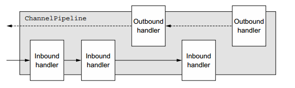

​	因为ChannelHandler可以属于多个ChannelPipeline，所以它可以绑定到多个ChannelHandlerContext实例，当使用时必须使用@Sharable注释，否则，当将其添加至多个ChannelPipeline时会抛出异常。 

​	可以通过ChannelHandlerContext来访问Channel，并且当调用Channel的write方法时，写事件会在管道中传递，代码如	下　

```
ChannelHandlerContext ctx = ..;
Channel channel = ctx.channel();
channel.write(Unpooled.copiedBuffer("Netty in Action",
CharsetUtil.UTF_8));
```

　　除了使用Channel的write方法写入数据外，还可以使用ChannelPipeline的write方法写入数据，代码如下　

```
ChannelHandlerContext ctx = ..;
ChannelPipeline pipeline = ctx.pipeline();
pipeline.write(Unpooled.copiedBuffer("Netty in Action",
CharsetUtil.UTF_8));
```

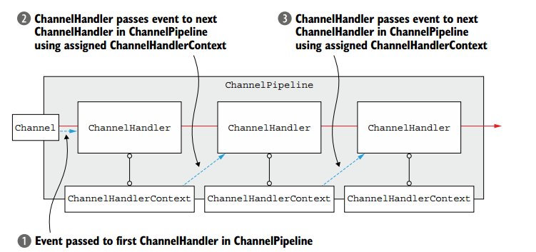

### ByteBuf

​	缓冲区是不同的通道之间传递数据的中介，JDK中的ByteBuffer操作复杂，而且没有经过优化，所以在netty中实现了一个更加强大的缓冲区 **ByteBuf** 用于表示字节序列。ByteBuf在netty中是通过Channel传输数据的，新的设计解决了JDK中ByteBuffer中的一些问题。 

​	netty中ByteBuf的缓冲区的优势： 
		①可以自定义缓冲区的类型；

​		②通过内置的复合缓冲类型实现零拷贝；

​		③不需要调用flip()函数切换读/写模式

​		④读取和写入的索引分开了，不像JDK中使用一个索引

​		⑤引用计数（referenceCounting的实现原理？）

​		⑥Pooling池

​	在netty中除了heap和direct类型外，还有composite Buffer(复合缓冲区类型)：

​	**Heap Buffer 堆缓冲区**

​	这是最常用的类型，ByteBuf将数据存储在JVM的堆空间，通过将数据存储在数组中实现的。 
	①堆缓冲的优点是：由于数据存储在JVM的堆中可以快速创建和快速释放，并且提供了数组的直接快速访问的方法。

​	②堆缓冲缺点是：每次读写数据都要先将数据拷贝到直接缓冲区再进行传递。

​	**Direct Buffer 直接缓冲区**

​	Direct Buffer在堆之外直接分配内存，直接缓冲区不会占用堆的容量。

​	①Direct Buffer的优点是：在使用Socket传递数据时性能很好，由于数据直接在内存中，不存在从JVM拷贝数据到直接缓冲区的过程，性能好。

​	②缺点是：因为Direct Buffer是直接在内存中，所以分配内存空间和释放内存比堆缓冲区更复杂和慢。

​	虽然netty的Direct Buffer有这个缺点，但是netty通过内存池来解决这个问题。直接缓冲池不支持数组访问数据，但可以通过间接的方式访问数据数组：

```
ByteBuf directBuf = Unpooled.directBuffer(16);   
if(!directBuf.hasArray()){   
    int len = directBuf.readableBytes();   
    byte[] arr = new byte[len];   
    directBuf.getBytes(0, arr);   
}  123456
```

但是上面的操作太过复杂，所以在使用时，建议一般是用heap buffer。 
不过对于一些IO通信线程中读写缓冲时建议使用DirectByteBuffer，因为这涉及到大量的IO数据读写。对于后端的业务消息的编解码模块使用HeapByteBuffer。

​	**Composite Buffer 复合缓冲区**

​	这个是netty特有的缓冲类型。复合缓冲区就类似于一个ByteBuf的组合视图，在这个视图里面我们可以创建不同的ByteBuf(可以是不同类型的)。 这样，复合缓冲区就类似于一个列表，我们可以动态的往里面添加和删除其中的ByteBuf，JDK里面的ByteBuffer就没有这样的功能。

​	Netty提供了Composite ByteBuf来处理复合缓冲区。例如：一条消息由Header和Body组成，将header和body组装成一条消息发送出去。下图显示了Composite ByteBuf组成header和body： 
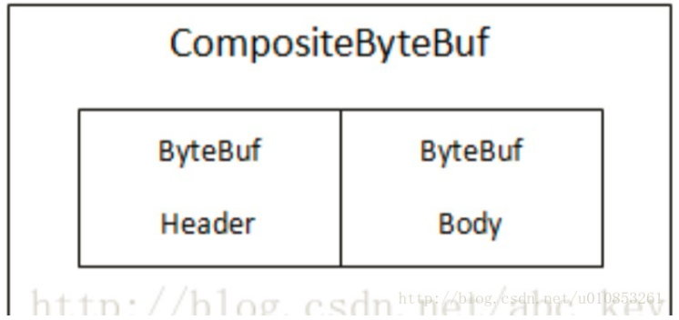

如果使用的是JDK的ByteBuffer就不能简单的实现，只能通过创建数组或则新的ByteBuffer，再将里面的内容复制到新的ByteBuffer中，下面给出了一个CompositeByteBuf的使用示例：

```
//组合缓冲区
CompositeByteBuf compBuf = Unpooled.compositeBuffer();   
//堆缓冲区
ByteBuf heapBuf = Unpooled.buffer(8);   
//直接缓冲区
ByteBuf directBuf = Unpooled.directBuffer(16);   
//添加ByteBuf到CompositeByteBuf   
compBuf.addComponents(heapBuf, directBuf);   
//删除第一个ByteBuf   
compBuf.removeComponent(0);   
Iterator<ByteBuf> iter = compBuf.iterator();   
while(iter.hasNext()){   
    System.out.println(iter.next().toString());   
}   

//使用数组访问数据      
if(!compBuf.hasArray()){   
    int len = compBuf.readableBytes();   
    byte[] arr = new byte[len];   
    compBuf.getBytes(0, arr);   
}   
```

​	ByteBuf提供了两个索引指针变量来支持读写操作，读操作使用的是readerIndex()，写操作使用的是writerIndex()。这与JDK中的ByteBuffer有很大不同，ByteBuffer只有一个方法来设置索引，而且需要使用flip()方法来切换读写操作，这就很麻烦了。

​	ByteBuf一定满足的是：0<=readerIndex<=writerIndex<=capacity 
下图显示了一个ByteBuf中可以被划分为三个区域：

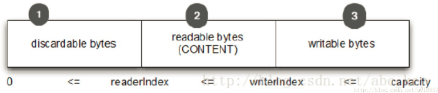

据ByteBuf的引用次数判断ByteBuf是否可被自动回收。 每调用一次retain()函数一次，引用计数器就会加一，由于可能存在多线程并发使用的情景，所以必须保证累加操作是线程安全的，那么是怎么保证的呢？我们来看一下源码：

```
public ByteBuf retain() {
    return retain0(1);
}

public ByteBuf retain(int increment) {
    return retain0(checkPositive(increment, "increment"));
}

/** 最后都是调用这个函数。
  */
private ByteBuf retain0(int increment) {
    for (;;) {
        int refCnt = this.refCnt;
        final int nextCnt = refCnt + increment;

        // Ensure we not resurrect (which means the refCnt was 0) and also that we encountered an overflow.
        if (nextCnt <= increment) {
            throw new IllegalReferenceCountException(refCnt, increment);
        }
        if (refCntUpdater.compareAndSet(this, refCnt, nextCnt)) {
            break;
        }
    }
    return this;
}12345678910111213141516171819202122232425
```

在retain0()函数中， 通过for(;;)来实现了自旋锁。通过自旋来对引用计数器refCnt执行加1操作。这里的加一操作是通过原子变量refCntUpdater的compareAndSet(this, refCnt, nextCnt)方法实现的，这个通过硬件级别的CAS保证了原子性，如果修改失败了就会不停的自旋，直到修改成功为止。

下面再看看释放的过程：release()函数：

```
private boolean release0(int decrement) {
    for (;;) {
        int refCnt = this.refCnt;
        if (refCnt < decrement) {
            throw new IllegalReferenceCountException(refCnt, -decrement);
        }

        if (refCntUpdater.compareAndSet(this, refCnt, refCnt - decrement)) {
            if (refCnt == decrement) {
                deallocate();
                return true;
            }
            return false;
        }
    }
}12345678910111213141516
```

这里基本和retain()函数一样，也是通过自旋和CAS保证执行的正确的将计数器减一。这里需要注意的是当`refCnt == decrement` 也就是引用对象不可达时，就需要调用deallocate();方法来释放ByteBuf对象。