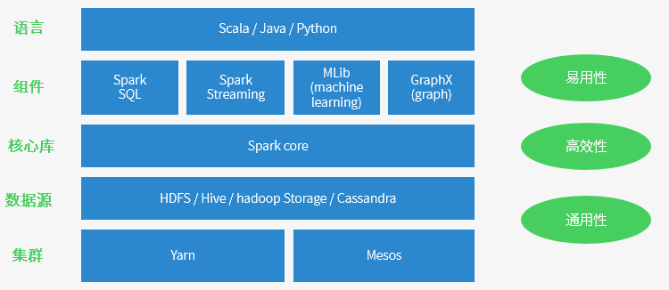
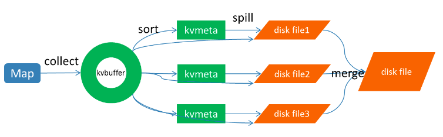

# spark

## Hadoop MRv1的局限

​    早在Hadoop1.0版本，当时采用的是MRv1版本的MapReduce编程模型。MRv1版本的实现都封装在org.apache.hadoop.mapred包中，MRv1的Map和Reduce是通过接口实现的。MRv1包括三个部分：

- 运行时环境（JobTracker和TaskTracker）；
- 编程模型（MapReduce）；
- 数据处理引擎（Map任务和Reduce任务）。

​        MRv1存在以下不足：

- **可扩展性差**：在运行时，JobTracker既负责资源管理又负责任务调度，当集群繁忙时，JobTracker很容易成为瓶颈，最终导致它的可扩展性问题。
- **可用性差**：采用了单节点的Master，没有备用Master及选举操作，这导致一旦Master出现故障，整个集群将不可用。
- **资源利用率低**：TaskTracker 使用slot等量划分本节点上的资源量。slot代表计算资源（CPU、内存等）。一个Task 获取到一个slot 后才有机会运行，Hadoop 调度器负责将各个TaskTracker 上的空闲slot 分配给Task 使用。一些Task并不能充分利用slot，而其他Task也无法使用这些空闲的资源。slot 分为Map slot 和Reduce slot 两种，分别供MapTask 和Reduce Task 使用。有时会因为作业刚刚启动等原因导致MapTask很多，而Reduce Task任务还没有调度的情况，这时Reduce slot也会被闲置。
- **不能支持多种MapReduce框架**：无法通过可插拔方式将自身的MapReduce框架替换为其他实现，如Spark、Storm等。


​	Apache为了解决以上问题，对Hadoop升级改造，MRv2最终诞生了。MRv2中，重用了MRv1中的编程模型和数据处理引擎。但是运行时环境被重构了。JobTracker被拆分成了通用的资源调度平台（ResourceManager，简称RM）、节点管理器（NodeManager）和负责各个计算框架的任务调度模型（ApplicationMaster，简称AM）。ResourceManager依然负责对整个集群的资源管理，但是在任务资源的调度方面只负责将资源封装为Container分配给ApplicationMaster 的一级调度，二级调度的细节将交给ApplicationMaster去完成，这大大减轻了ResourceManager 的压力，使得ResourceManager 更加轻量。NodeManager负责对单个节点的资源管理，并将资源信息、Container运行状态、健康状况等信息上报给ResourceManager。ResourceManager 为了保证Container的利用率，会监控Container，如果Container未在有限的时间内使用，ResourceManager将命令NodeManager杀死Container，以便于将资源分配给其他任务。MRv2的核心不再是MapReduce框架，而是Yarn。在以Yarn为核心的MRv2中，MapReduce框架是可插拔的，完全可以替换为其他MapReduce实现，比如Spark、Storm等。MRv2的示意如图2所示。 


​	Hadoop MRv2虽然解决了MRv1中的一些问题，但是由于对HDFS的频繁操作（包括计算结果持久化、数据备份、资源下载及Shuffle等）导致磁盘I/O成为系统性能的瓶颈，因此只适用于离线数据处理或批处理，而不能支持对迭代式、流式数据的处理。 

## Spark的特点

​	spark看到MRv2的问题，对MapReduce做了大量优化，总结如下：

- **减少磁盘I/O**：随着实时大数据应用越来越多，Hadoop作为离线的高吞吐、低响应框架已不能满足这类需求。HadoopMapReduce的map端将中间输出和结果存储在磁盘中，reduce端又需要从磁盘读写中间结果，势必造成磁盘IO成为瓶颈。Spark允许将map端的中间输出和结果存储在内存中，reduce端在拉取中间结果时避免了大量的磁盘I/O。Hadoop Yarn中的ApplicationMaster申请到Container后，具体的任务需要利用NodeManager从HDFS的不同节点下载任务所需的资源（如Jar包），这也增加了磁盘I/O。Spark将应用程序上传的资源文件缓冲到Driver本地文件服务的内存中，当Executor执行任务时直接从Driver的内存中读取，也节省了大量的磁盘I/O。
- **增加并行度**：由于将中间结果写到磁盘与从磁盘读取中间结果属于不同的环节，Hadoop将它们简单的通过串行执行衔接起来。Spark把不同的环节抽象为Stage，允许多个Stage既可以串行执行，又可以并行执行。
- **避免重新计算**：当Stage中某个分区的Task执行失败后，会重新对此Stage调度，但在重新调度的时候会过滤已经执行成功的分区任务，所以不会造成重复计算和资源浪费。
- **可选的Shuffle排序**：HadoopMapReduce在Shuffle之前有着固定的排序操作，而Spark则可以根据不同场景选择在map端排序或者reduce端排序。
- **灵活的内存管理策略**：Spark将内存分为堆上的存储内存、堆外的存储内存、堆上的执行内存、堆外的执行内存4个部分。Spark既提供了执行内存和存储内存之间是固定边界的实现，又提供了执行内存和存储内存之间是“软”边界的实现。Spark默认使用“软”边界的实现，执行内存或存储内存中的任意一方在资源不足时都可以借用另一方的内存，最大限度的提高资源的利用率，减少对资源的浪费。Spark由于对内存使用的偏好，内存资源的多寡和使用率就显得尤为重要，为此Spark的内存管理器提供的Tungsten实现了一种与操作系统的内存Page非常相似的数据结构，用于直接操作操作系统内存，节省了创建的Java对象在堆中占用的内存，使得Spark对内存的使用效率更加接近硬件。Spark会给每个Task分配一个配套的任务内存管理器，对Task粒度的内存进行管理。Task的内存可以被多个内部的消费者消费，任务内存管理器对每个消费者进行Task内存的分配与管理，因此Spark对内存有着更细粒度的管理。
- **检查点支持**：Spark的RDD之间维护了血缘关系（lineage），一旦某个RDD失败了，则可以由父RDD重建。虽然lineage可用于错误后RDD的恢复，但对于很长的lineage来说，恢复过程非常耗时。如果应用启用了检查点，那么在Stage中的Task都执行成功后，SparkContext将把RDD计算的结果保存到检查点，这样当某个RDD执行失败后，在由父RDD重建时就不需要重新计算，而直接从检查点恢复数据。
- **易于使用**。Spark现在支持Java、Scala、Python和R等语言编写应用程序，大大降低了使用者的门槛。自带了80多个高等级操作符，允许在Scala，Python，R的shell中进行交互式查询。
- **支持交互式**：Spark使用Scala开发，并借助于Scala类库中的Iloop实现交互式shell，提供对REPL（Read-eval-print-loop）的实现。
- **支持SQL查询**。在数据查询方面，Spark支持SQL及Hive SQL，这极大的方便了传统SQL开发和数据仓库的使用者。
- **支持流式计算**：与MapReduce只能处理离线数据相比，Spark还支持实时的流计算。Spark依赖SparkStreaming对数据进行实时的处理，其流式处理能力还要强于Storm。
- **可用性高**。Spark自身实现了Standalone部署模式，此模式下的Master可以有多个，解决了单点故障问题。Spark也完全支持使用外部的部署模式，比如YARN、Mesos、EC2等。
- **丰富的数据源支持**：Spark除了可以访问操作系统自身的文件系统和HDFS，还可以访问Kafka、Socket、Cassandra、HBase、Hive、Alluxio（Tachyon）以及任何Hadoop的数据源。这极大地方便了已经使用HDFS、HBase的用户顺利迁移到Spark。
- **丰富的文件格式支持**：Spark支持文本文件格式、Csv文件格式、Json文件格式、Orc文件格式、Parquet文件格式、Libsvm文件格式，也有利于Spark与其他数据处理平台的对接。

## spark生态及运行原理



- 运行速度快 => Spark拥有DAG执行引擎，支持在内存中对数据进行迭代计算。官方提供的数据表明，如果数据由磁盘读取，速度是Hadoop MapReduce的10倍以上，如果数据从内存中读取，速度可以高达100多倍。
- 适用场景广泛 => 大数据分析统计，实时数据处理，图计算及机器学习
- 易用性 => 编写简单，支持80种以上的高级算子，支持多种语言，数据源丰富，可部署在多种集群中
- 容错性高。Spark引进了弹性分布式数据集RDD (Resilient Distributed Dataset) 的抽象，它是分布在一组节点中的只读对象集合，这些集合是弹性的，如果数据集一部分丢失，则可以根据“血统”（即充许基于数据衍生过程）对它们进行重建。另外在RDD计算时可以通过CheckPoint来实现容错，而CheckPoint有两种方式：CheckPoint Data，和Logging The Updates，用户可以控制采用哪种方式来实现容错。

## spark运行架构


Spark架构采用了分布式计算中的Master-Slave模型。Master是对应集群中的含有Master进程的节点，Slave是集群中含有Worker进程的节点。

- Master作为整个集群的控制器，负责整个集群的正常运行；
- Worker相当于计算节点，接收主节点命令与进行状态汇报；
- Executor负责任务的执行；
- Client作为用户的客户端负责提交应用；
- Driver负责控制一个应用的执行。

Spark集群部署后，需要在主节点和从节点分别启动Master进程和Worker进程，对整个集群进行控制。在一个Spark应用的执行过程中，Driver和Worker是两个重要角色。Driver 程序是应用逻辑执行的起点，负责作业的调度，即Task任务的分发，而多个Worker用来管理计算节点和创建Executor并行处理任务。在执行阶段，Driver会将Task和Task所依赖的file和jar序列化后传递给对应的Worker机器，同时Executor对相应数据分区的任务进行处理。

- Excecutor /Task 每个程序自有，不同程序互相隔离，task多线程并行
- 集群对Spark透明，Spark只要能获取相关节点和进程
- Driver 与Executor保持通信，协作处理

## 核心概念

### RDD


### Transformations / Actions


Transformation返回值还是一个RDD。它使用了链式调用的设计模式，对一个RDD进行计算后，变换成另外一个RDD，然后这个RDD又可以进行另外一次转换。这个过程是分布式的。 Action返回值不是一个RDD。它要么是一个Scala的普通集合，要么是一个值，要么是空，最终或返回到Driver程序，或把RDD写入到文件系统中。

Action是返回值返回给driver或者存储到文件，是RDD到result的变换，Transformation是RDD到RDD的变换。只有action执行时，rdd才会被计算生成，这是rdd懒惰执行的根本所在。

### Jobs / Stage

Job => 包含多个task的并行计算，一个action触发一个job

stage => 一个job会被拆为多组task，每组任务称为一个stage，以shuffle进行划分


刚 fetch 来的 FileSegment 存放在 softBuffer 缓冲区，经过处理后的数据放在内存 + 磁盘上。这里我们主要讨论处理后的数据，可以灵活设置这些数据是“只用内存”还是“内存＋磁盘”。如果spark.shuffle.spill = false就只用内存。由于不要求数据有序，shuffle write 的任务很简单：将数据 partition 好，并持久化。之所以要持久化，一方面是要减少内存存储空间压力，另一方面也是为了 fault-tolerance。

shuffle之所以需要把中间结果放到磁盘文件中，是因为虽然上一批task结束了，下一批task还需要使用内存。如果全部放在内存中，内存会不够。另外一方面为了容错，防止任务挂掉。

**存在问题如下：**

- 产生的 FileSegment 过多。每个 ShuffleMapTask 产生 R（reducer 个数）个 FileSegment，M 个 ShuffleMapTask 就会产生 M * R 个文件。一般 Spark job 的 M 和 R 都很大，因此磁盘上会存在大量的数据文件。
- 缓冲区占用内存空间大。每个 ShuffleMapTask 需要开 R 个 bucket，M 个 ShuffleMapTask 就会产生 MR 个 bucket。虽然一个 ShuffleMapTask 结束后，对应的缓冲区可以被回收，但一个 worker node 上同时存在的 bucket 个数可以达到 cores R 个（一般 worker 同时可以运行 cores 个 ShuffleMapTask），占用的内存空间也就达到了cores× R × 32 KB。对于 8 核 1000 个 reducer 来说，占用内存就是 256MB。

为了解决上述问题，我们可以使用文件合并的功能。**在进行task的文件分片合并下的shuffle过程如下**：（`spark.shuffle.consolidateFiles=true`）


​	可以明显看出，在一个 core 上连续执行的 ShuffleMapTasks 可以共用一个输出文件 ShuffleFile。先执行完的 ShuffleMapTask 形成 ShuffleBlock i，后执行的 ShuffleMapTask 可以将输出数据直接追加到 ShuffleBlock i 后面，形成 ShuffleBlock i'，每个 ShuffleBlock 被称为 FileSegment。下一个 stage 的 reducer 只需要 fetch 整个 ShuffleFile 就行了。这样，每个 worker 持有的文件数降为 cores× R。FileConsolidation 功能可以通过`spark.shuffle.consolidateFiles=true`来开启。 

### cache

```
val rdd1 = ... // 读取hdfs数据，加载成RDD
rdd1.cache

val rdd2 = rdd1.map(...)
val rdd3 = rdd1.filter(...)

rdd2.take(10).foreach(println)
rdd3.take(10).foreach(println)

rdd1.unpersist
```

cache和unpersisit两个操作比较特殊，他们既不是action也不是transformation。cache会将标记需要缓存的rdd，真正缓存是在第一次被相关action调用后才缓存；unpersisit是抹掉该标记，并且立刻释放内存。只有action执行时，rdd1才会开始创建并进行后续的rdd变换计算。

cache其实也是调用的persist持久化函数，只是选择的持久化级别为`MEMORY_ONLY`。persist支持的RDD持久化级别如下：


​	Cache或shuffle场景序列化时， spark序列化不支持protobuf message，需要java 可以serializable的对象。一旦在序列化用到不支持java serializable的对象就会出现上述错误。Spark只要写磁盘，就会用到序列化。除了shuffle阶段和persist会序列化，其他时候RDD处理都在内存中，不会用到序列化。

### streaming

spark程序是使用一个spark应用实例一次性对一批历史数据进行处理，spark streaming是将持续不断输入的数据流转换成多个batch分片，使用一批spark应用实例进行处理。 


需要构建4个东西：

- 一个静态的 RDD DAG 的模板，来表示处理逻辑；
- 一个动态的工作控制器，将连续的 streaming data 切分数据片段，并按照模板复制出新的 RDD ；
- DAG 的实例，对数据片段进行处理；
- Receiver进行原始数据的产生和导入；Receiver将接收到的数据合并为数据块并存到内存或硬盘中，供后续batch RDD进行消费；
- 对长时运行任务的保障，包括输入数据的失效后的重构，处理任务的失败后的重调。

**对于spark streaming需要注意以下三点：**

- 尽量保证每个work节点中的数据不要落盘，以提升执行效率。
- 保证每个batch的数据能够在batch interval时间内处理完毕，以免造成数据堆积。
- 使用steven提供的框架进行数据接收时的预处理，减少不必要数据的存储和传输。从tdbank中接收后转储前进行过滤，而不是在task具体处理时才进行过滤。

## spark资源调优

​	

Executor的内存主要分为三块：

第一块是让task执行我们自己编写的代码时使用，默认是占Executor总内存的20%；第二块是让task通过shuffle过程拉取了上一个stage的task的输出后，进行聚合等操作时使用，默认也是占Executor总内存的20%；第三块是让RDD持久化时使用，默认占Executor总内存的60%。每个task以及每个executor占用的内存需要分析一下。每个task处理一个partiiton的数据，分片太少，会造成内存不够。

其他资源配置：


## shuffle过程

### 	MapReduce

​	Shuffle的本义是洗牌、混洗，把一组有一定规则的数据尽量转换成一组无规则的数据，越随机越好。MapReduce中的Shuffle更像是洗牌的逆过程，把一组无规则的数据尽量转换成一组具有一定规则的数据。

​	为 什么MapReduce计算模型需要Shuffle过程？我们都知道MapReduce计算模型一般包括两个重要的阶段：Map是映射，负责数据的过滤分 发；Reduce是规约，负责数据的计算归并。Reduce的数据来源于Map，Map的输出即是Reduce的输入，Reduce需要通过 Shuffle来获取数据。

​	从Map输出到Reduce输入的整个过程可以广义地称为Shuffle。Shuffle横跨Map端和Reduce端，在Map端包括Spill过程，在Reduce端包括copy和sort过程，如图所示：




每个Map任务不断地以对的形式把数据输出到在内存中构造的一个环形数据结构中。使用环形数据结构是为了更有效地使用内存空间，在内存中放置尽可能多的数据。

这个数据结构其实就是个字节数组，叫Kvbuffer， 名如其义，但是这里面不光放置了数据，还放置了一些索引数据，给放置索引数据的区域起了一个Kvmeta的别名，在Kvbuffer的一块区域上穿了一个 IntBuffer（字节序采用的是平台自身的字节序）的马甲。数据区域和索引数据区域在Kvbuffer中是相邻不重叠的两个区域，用一个分界点来划分两者，分界点不是亘古不变的，而是每次 Spill之后都会更新一次。初始的分界点是0，数据的存储方向是向上增长，索引数据的存储方向是向下增长，如图所示：


Kvbuffer的存放指针bufindex是一直闷着头地向上增长，比如bufindex初始值为0，一个Int型的key写完之后，bufindex增长为4，一个Int型的value写完之后，bufindex增长为8。

索引是对在kvbuffer中的索引，是个四元组，包括：value的起始位置、key的起始位置、partition值、value的长度， 占用四个Int长度，Kvmeta的存放指针Kvindex每次都是向下跳四个“格子”，然后再向上一个格子一个格子地填充四元组的数据。比如 Kvindex初始位置是-4，当第一个写完之后，(Kvindex+0)的位置存放value的起始位置、(Kvindex+1)的位置存放key的起始位置、 (Kvindex+2)的位置存放partition的值、(Kvindex+3)的位置存放value的长度，然后Kvindex跳到-8位置，等第二 个和索引写完之后，Kvindex跳到-32位置。

Kvbuffer的大小虽然可以通过参数设置，但是总共就那么大，和索引不断地增加，加着加着，Kvbuffer总有不够用的那天，那怎么办？把数据从内存刷到磁盘上再接着往内存写数据，把 Kvbuffer中的数据刷到磁盘上的过程就叫Spill，多么明了的叫法，内存中的数据满了就自动地spill到具有更大空间的磁盘。

关于Spill 触发的条件，也就是Kvbuffer用到什么程度开始Spill，还是要讲究一下的。如果把Kvbuffer用得死死得，一点缝都不剩的时候再开始 Spill，那Map任务就需要等Spill完成腾出空间之后才能继续写数据；如果Kvbuffer只是满到一定程度，比如80%的时候就开始 Spill，那在Spill的同时，Map任务还能继续写数据，如果Spill够快，Map可能都不需要为空闲空间而发愁。两利相衡取其大，一般选择后 者。

Spill这个重要的过程是由Spill线程承担，Spill线程从Map任务接到“命令”之后就开始正式干活，干的活叫SortAndSpill，原来不仅仅是Spill，在Spill之前还有个颇具争议性的Sort。先把Kvbuffer中的数据按照partition值和key两个关键字升序排序，移动的只是索引数据，排序结果是Kvmeta中数据按照partition为单位聚集在一起，同一partition内的按照key有序。

Spill线程为这次Spill过程创建一个磁盘文件：从所有的本地目录中轮训查找能存储这么大空间的目录，找到之后在其中创建一个类似于 “spill12.out”的文件。Spill线程根据排过序的Kvmeta挨个partition的把数据吐到这个文件中，一个partition对应的数据吐完之后顺序地吐下个partition，直到把所有的partition遍历 完。一个partition在文件中对应的数据也叫段(segment)。

所有的partition 对应的数据都放在这个文件里，虽然是顺序存放的，但是怎么直接知道某个partition在这个文件中存放的起始位置呢？强大的索引又出场了。有一个三元 组记录某个partition对应的数据在这个文件中的索引：起始位置、原始数据长度、压缩之后的数据长度，一个partition对应一个三元组。然后 把这些索引信息存放在内存中，如果内存中放不下了，后续的索引信息就需要写到磁盘文件中了：从所有的本地目录中轮训查找能存储这么大空间的目录，找到之后 在其中创建一个类似于“spill12.out.index”的文件，文件中不光存储了索引数据，还存储了crc32的校验数据。 (spill12.out.index不一定在磁盘上创建，如果内存（默认1M空间）中能放得下就放在内存中，即使在磁盘上创建了，和 spill12.out文件也不一定在同一个目录下。)

每一次Spill过程就会最少生成一个out文件，有时还会生成index文件，Spill的次数也烙印在文件名中。索引文件和数据文件的对应关系如下图所示： 


在Spill线程如火如荼的进行SortAndSpill工作的同时，Map任务不会因此而停歇，而是一无既往地进行着数据输出。Map还是把数 据写到kvbuffer中，那问题就来了：只顾着闷头按照bufindex指针向上增长，kvmeta只顾着按照Kvindex向下增长，是保持指针起始位置不变继续跑呢，还是 另谋它路？如果保持指针起始位置不变，很快bufindex和Kvindex就碰头了，碰头之后再重新开始或者移动内存都比较麻烦，不可取。Map取 kvbuffer中剩余空间的中间位置，用这个位置设置为新的分界点，bufindex指针移动到这个分界点，Kvindex移动到这个分界点的-16位 置，然后两者就可以和谐地按照自己既定的轨迹放置数据了，当Spill完成，空间腾出之后，不需要做任何改动继续前进。 

Map任务如果输出数据量很大，可能会进行好几次Spill，out文件和Index文件会产生很多，分布在不同的磁盘上。最后把这些文件进行合并的merge过程闪亮登场。

Merge 过程怎么知道产生的Spill文件都在哪了呢？从所有的本地目录上扫描得到产生的Spill文件，然后把路径存储在一个数组里。Merge过程又怎么知道 Spill的索引信息呢？没错，也是从所有的本地目录上扫描得到Index文件，然后把索引信息存储在一个列表里。到这里，又遇到了一个值得纳闷的地方。 在之前Spill过程中的时候为什么不直接把这些信息存储在内存中呢，何必又多了这步扫描的操作？特别是Spill的索引数据，之前当内存超限之后就把数 据写到磁盘，现在又要从磁盘把这些数据读出来，还是需要装到更多的内存中。之所以多此一举，是因为这时kvbuffer这个内存大户已经不再使用可以回 收，有内存空间来装这些数据了。（对于内存空间较大的土豪来说，用内存来省却这两个io步骤还是值得考虑的。）

然后为merge过程创建一个叫file.out的文件和一个叫file.out.Index的文件用来存储最终的输出和索引。

一 个partition一个partition的进行合并输出。对于某个partition来说，从索引列表中查询这个partition对应的所有索引信 息，每个对应一个段插入到段列表中。也就是这个partition对应一个段列表，记录所有的Spill文件中对应的这个partition那段数据的文 件名、起始位置、长度等等。

然后对这个partition对应的所有的segment进行合并，目标是合并成一个segment。当这个 partition对应很多个segment时，会分批地进行合并：先从segment列表中把第一批取出来，以key为关键字放置成最小堆，然后从最小 堆中每次取出最小的输出到一个临时文件中，这样就把这一批段合并成一个临时的段，把它加回到segment列表中；再从segment列表中把第二批取出 来合并输出到一个临时segment，把其加入到列表中；这样往复执行，直到剩下的段是一批，输出到最终的文件中。

最终的索引数据仍然输出到Index文件中。


Map端的Shuffle过程到此结束。

Reduce 任务通过HTTP向各个Map任务拖取它所需要的数据。每个节点都会启动一个常驻的HTTP server，其中一项服务就是响应Reduce拖取Map数据。当有MapOutput的HTTP请求过来的时候，HTTP server就读取相应的Map输出文件中对应这个Reduce部分的数据通过网络流输出给Reduce。

Reduce任务拖取某个Map 对应的数据，如果在内存中能放得下这次数据的话就直接把数据写到内存中。Reduce要向每个Map去拖取数据，在内存中每个Map对应一块数据，当内存 中存储的Map数据占用空间达到一定程度的时候，开始启动内存中merge，把内存中的数据merge输出到磁盘上一个文件中。

如果在内存 中不能放得下这个Map的数据的话，直接把Map数据写到磁盘上，在本地目录创建一个文件，从HTTP流中读取数据然后写到磁盘，使用的缓存区大小是 64K。拖一个Map数据过来就会创建一个文件，当文件数量达到一定阈值时，开始启动磁盘文件merge，把这些文件合并输出到一个文件。

有些Map的数据较小是可以放在内存中的，有些Map的数据较大需要放在磁盘上，这样最后Reduce任务拖过来的数据有些放在内存中了有些放在磁盘上，最后会对这些来一个全局合并。

这里使用的Merge和Map端使用的Merge过程一样。Map的输出数据已经是有序的，Merge进行一次合并排序，所谓Reduce端的 sort过程就是这个合并的过程。一般Reduce是一边copy一边sort，即copy和sort两个阶段是重叠而不是完全分开的。

Reduce端的Shuffle过程至此结束。

### 	spark

Spark丰富了任务类型，有些任务之间数据流转不需要通过Shuffle，但是有些任务之间还是需要通过Shuffle来传递数据，比如wide dependency的group by key。

Spark中需要Shuffle 输出的Map任务会为每个Reduce创建对应的bucket，Map产生的结果会根据设置的partitioner得到对应的bucketId，然后填 充到相应的bucket中去。每个Map的输出结果可能包含所有的Reduce所需要的数据，所以每个Map会创建R个bucket（R是reduce的 个数），M个Map总共会创建M*R个bucket。

Map创建的bucket其实对应磁盘上的一个文 件，Map的结果写到每个bucket中其实就是写到那个磁盘文件中，这个文件也被称为blockFile，是Disk Block Manager管理器通过文件名的Hash值对应到本地目录的子目录中创建的。每个Map要在节点上创建R个磁盘文件用于结果输出，Map的结果是直接输 出到磁盘文件上的，100KB的内存缓冲是用来创建Fast Buffered OutputStream输出流。这种方式一个问题就是Shuffle文件过多。

针对上述Shuffle 过程产生的文件过多问题，Spark有另外一种改进的Shuffle过程：consolidation Shuffle，以期显著减少Shuffle文件的数量。在consolidation Shuffle中每个bucket并非对应一个文件，而是对应文件中的一个segment部分。Job的map在某个节点上第一次执行，为每个 reduce创建bucket对应的输出文件，把这些文件组织成ShuffleFileGroup，当这次map执行完之后，这个 ShuffleFileGroup可以释放为下次循环利用；当又有map在这个节点上执行时，不需要创建新的bucket文件，而是在上次的 ShuffleFileGroup中取得已经创建的文件继续追加写一个segment；当前次map还没执行完，ShuffleFileGroup还没有 释放，这时如果有新的map在这个节点上执行，无法循环利用这个ShuffleFileGroup，而是只能创建新的bucket文件组成新的 ShuffleFileGroup来写输出。 


比 如一个Job有3个Map和2个reduce：(1) 如果此时集群有3个节点有空槽，每个节点空闲了一个core，则3个Map会调度到这3个节点上执行，每个Map都会创建2个Shuffle文件，总共创 建6个Shuffle文件；(2) 如果此时集群有2个节点有空槽，每个节点空闲了一个core，则2个Map先调度到这2个节点上执行，每个Map都会创建2个Shuffle文件，然后其 中一个节点执行完Map之后又调度执行另一个Map，则这个Map不会创建新的Shuffle文件，而是把结果输出追加到之前Map创建的Shuffle 文件中；总共创建4个Shuffle文件；(3) 如果此时集群有2个节点有空槽，一个节点有2个空core一个节点有1个空core，则一个节点调度2个Map一个节点调度1个Map，调度2个Map的 节点上，一个Map创建了Shuffle文件，后面的Map还是会创建新的Shuffle文件，因为上一个Map还正在写，它创建的 ShuffleFileGroup还没有释放；总共创建6个Shuffle文件。

Reduce去拖Map的输出数据，Spark提供了两套不同的拉取数据框架：通过socket连接去取数据；使用netty框架去取数据。每 个节点的Executor会创建一个BlockManager，其中会创建一个BlockManagerWorker用于响应请求。当Reduce的 GET_BLOCK的请求过来时，读取本地文件将这个blockId的数据返回给Reduce。如果使用的是Netty框架，BlockManager会 创建ShuffleSender用于发送Shuffle数据。并不是所有的数据都是通过网络读取，对于在本节点的Map数据，Reduce直接去磁盘上读取而不再通过网络框架。

Reduce 拖过来数据之后以什么方式存储呢？Spark Map输出的数据没有经过排序，Spark Shuffle过来的数据也不会进行排序，Spark认为Shuffle过程中的排序不是必须的，并不是所有类型的Reduce需要的数据都需要排序，强 制地进行排序只会增加Shuffle的负担。Reduce拖过来的数据会放在一个HashMap中，HashMap中存储的也是对，key是Map输出的key，Map输出对应这个key的所有value组成HashMap的value。Spark将 Shuffle取过来的每一个对插入或者更新到HashMap中，来一个处理一个。HashMap全部放在内存中。

Shuffle 取过来的数据全部存放在内存中，对于数据量比较小或者已经在Map端做过合并处理的Shuffle数据，占用内存空间不会太大，但是对于比如group by key这样的操作，Reduce需要得到key对应的所有value，并将这些value组一个数组放在内存中，这样当数据量较大时，就需要较多内存。

当 内存不够时，要不就失败，要不就用老办法把内存中的数据移到磁盘上放着。Spark意识到在处理数据规模远远大于内存空间时所带来的不足，引入了一个具有 外部排序的方案。Shuffle过来的数据先放在内存中，当内存中存储的对超过1000并且内存使用超过70%时，判断节点上可用内存如果还足够，则把内存缓冲区大小翻倍，如果可用内存不再够了，则把内存中 的对排序然后写到磁盘文件中。最后把内存缓冲区中的数据排序之后和那些磁盘文件组成一个最小堆，每次从最小堆中读取最小的数据，这个和 MapReduce中的merge过程类似。


Spark作为MapReduce的进阶架构，对于Shuffle过程已经是优化了的，特别是对于那些具有争议的步骤已经做了优化，但是Spark的Shuffle对于我们来说在一些方面还是需要优化的。

- 压缩：对数据进行压缩，减少写读数据量；
- 内存化：Spark历史版本中是有这样设计的：Map写数据先把数据全部写到内存中，写完之后再把数据刷到磁盘上；考虑内存是紧缺资源，后来修改成把数据直接写到磁盘了；对于具有较大内存的集群来讲，还是尽量地往内存上写吧，内存放不下了再放磁盘。