# spring

## 架构设计

Spring框架是一个分层架构，它包含一系列的功能要素，并被分为大约20个模块 

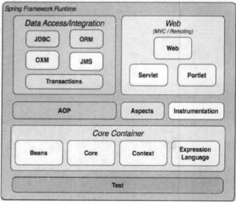

## 核心模块

### Core Container

​	Core Container(核心容器)包含有Core、Beans、Context和Expression Language模块 
Core和Beans模块是框架的基础部分，提供IoC(转控制)和依赖注入特性。这里的基础概念是BeanFactory，它提供对Factory模式的经典实现来消除对程序性单例模式的需要，并真正地允许你从程序逻辑中分离出依赖关系和配置

- Core模块主要包含Spring框架基本的核心工具类
- Beans模块是所有应用都要用到的，它包含访问配置文件、创建和管理bean以及进行Inversion of Control/Dependency Injection(Ioc/DI)操作相关的所有类
- Context模块构建于Core和Beans模块基础之上，提供了一种类似于JNDI注册器的框架式的对象访问方法。Context模块继承了Beans的特性，为Spring核心提供了大量扩展，添加了对国际化(如资源绑定)、事件传播、资源加载和对Context的透明创建的支持。ApplicationContext接口是Context模块的关键
- Expression Language模块提供了一个强大的表达式语言用于在运行时查询和操纵对象，该语言支持设置/获取属性的值，属性的分配，方法的调用，访问数组上下文、容器和索引器、逻辑和算术运算符、命名变量以及从Spring的IoC容器中根据名称检索对象

### Data Access/Integration

- JDBC模块提供了一个JDBC抽象层，它可以消除冗长的JDBC编码和解析数据库厂商特有的错误代码，这个模块包含了Spring对JDBC数据访问进行封装的所有类
- ORM模块为流行的对象-关系映射API，如JPA、JDO、Hibernate、iBatis等，提供了一个交互层，利用ORM封装包，可以混合使用所有Spring提供的特性进行O/R映射，如前边提到的简单声明性事务管理

### Web

​	Web上下文模块建立在应用程序上下文模块之上，为基于Web的应用程序提供了上下文，所以Spring框架支持与Jakarta Struts的集成。Web模块还简化了处理多部分请求以及将请求参数绑定到域对象的工作。Web层包含了Web、Web-Servlet、Web-Struts和Web、Porlet模块

- Web模块：提供了基础的面向Web的集成特性，例如，多文件上传、使用Servlet listeners初始化IoC容器以及一个面向Web的应用上下文，它还包含了Spring远程支持中Web的相关部分
- Web-Servlet模块web.servlet.jar：该模块包含Spring的model-view-controller(MVC)实现，Spring的MVC框架使得模型范围内的代码和web forms之间能够清楚地分离开来，并与Spring框架的其他特性基础在一起
- Web-Struts模块：该模块提供了对Struts的支持，使得类在Spring应用中能够与一个典型的Struts Web层集成在一起
- Web-Porlet模块：提供了用于Portlet环境和Web-Servlet模块的MVC的实现

### AOP

​	AOP模块提供了一个符合AOP联盟标准的面向切面编程的实现，它让你可以定义例如方法拦截器和切点，从而将逻辑代码分开，降低它们之间的耦合性，利用source-level的元数据功能，还可以将各种行为信息合并到你的代码中

​	Spring AOP模块为基于Spring的应用程序中的对象提供了事务管理服务，通过使用Spring AOP，不用依赖EJB组件，就可以将声明性事务管理集成到应用程序中

### Test

Test模块支持使用Junit和TestNG对Spring组件进行测试。

## 设计理念

​	Bean 在 Spring 中作用就像 Object 对 OOP 的意义一样，没有对象的概念就像没有面向对象编程，Spring 中没有 Bean 也就没有 Spring 存在的意义。就像一次演出舞台都准备好了但是却没有演员一样。为什么要 Bean 这种角色 Bean 或者为何在 Spring 如此重要，这由 Spring 框架的设计目标决定，Spring 为何如此流行，我们用 Spring 的原因是什么，想想你会发现原来 Spring 解决了一个非常关键的问题他可以让你把对象之间的依赖关系转而用配置文件来管理，也就是他的依赖注入机制。而这个注入关系在一个叫 Ioc 容器中管理，那 Ioc 容器中有又是什么就是被 Bean 包裹的对象。Spring 正是通过把对象包装在 Bean 中而达到对这些对象管理以及一些列额外操作的目的。

​	它这种设计策略完全类似于 Java 实现 OOP 的设计理念，当然了 Java 本身的设计要比 Spring 复杂太多太多，但是都是构建一个数据结构，然后根据这个数据结构设计他的生存环境，并让它在这个环境中按照一定的规律在不停的运动，在它们的不停运动中设计一系列与环境或者与其他个体完成信息交换。这样想来回过头想想我们用到的其他框架都是大慨类似的设计理念。

​	前面说 Bean 是 Spring 中关键因素，那 Context 和 Core 又有何作用呢？前面吧 Bean 比作一场演出中的演员的话，那 Context 就是这场演出的舞台背景，而 Core 应该就是演出的道具了。只有他们在一起才能具备能演出一场好戏的最基本的条件。当然有最基本的条件还不能使这场演出脱颖而出，还要他表演的节目足够的精彩，这些节目就是 Spring 能提供的特色功能了。

​	我们知道 Bean 包装的是 Object，而 Object 必然有数据，如何给这些数据提供生存环境就是 Context 要解决的问题，对 Context 来说他就是要发现每个 Bean 之间的关系，为它们建立这种关系并且要维护好这种关系。所以 Context 就是一个 Bean 关系的集合，这个关系集合又叫 Ioc 容器，一旦建立起这个 Ioc 容器后 Spring 就可以为你工作了。那 Core 组件又有什么用武之地呢？其实 Core 就是发现、建立和维护每个 Bean 之间的关系所需要的一些列的工具，从这个角度看来，Core 这个组件叫 Util 更能让你理解。

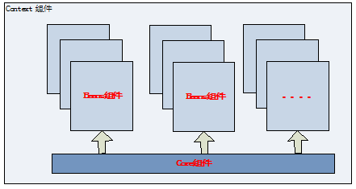

## 核心组件详解

### 	Bean 组件

​		Bean 组件在 Spring 的 org.springframework.beans 包下。这个包下的所有类主要解决了三件事：Bean 的定义、Bean 的创建以及对 Bean 的解析。对 Spring 的使用者来说唯一需要关心的就是 Bean 的创建，其他两个由 Spring 在内部帮你完成了，对你来说是透明的。Spring Bean 的创建是典型的工厂模式，他的顶级接口是 BeanFactory，下图是这个工厂的继承层次关系：

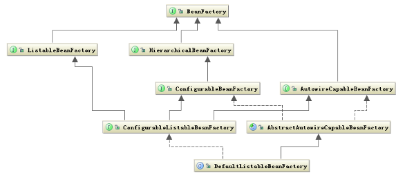

​	BeanFactory 有三个子类：ListableBeanFactory、HierarchicalBeanFactory 和 AutowireCapableBeanFactory。但是从上图中我们可以发现最终的默认实现类是 DefaultListableBeanFactory，他实现了所有的接口。那为何要定义这么多层次的接口呢？查阅这些接口的源码和说明发现，每个接口都有他使用的场合，它主要是为了区分在 Spring 内部在操作过程中对象的传递和转化过程中，对对象的数据访问所做的限制。例如 ListableBeanFactory 接口表示这些 Bean 是可列表的，而 HierarchicalBeanFactory 表示的是这些 Bean 是有继承关系的，也就是每个 Bean 有可能有父 Bean。AutowireCapableBeanFactory 接口定义 Bean 的自动装配规则。这四个接口共同定义了 Bean 的集合、Bean 之间的关系、以及 Bean 行为。Bean 的定义主要有 BeanDefinition 描述，如下图说明了这些类的层次关系：

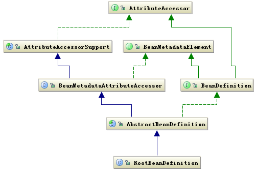

​	Bean 的定义就是完整的描述了在 Spring 的配置文件中你定义的 <bean/> 节点中所有的信息，包括各种子节点。当 Spring 成功解析你定义的一个 <bean/> 节点后，在 Spring 的内部他就被转化成 BeanDefinition 对象。以后所有的操作都是对这个对象完成的。Bean 的解析过程非常复杂，功能被分的很细，因为这里需要被扩展的地方很多，必须保证有足够的灵活性，以应对可能的变化。Bean 的解析主要就是对 Spring 配置文件的解析。这个解析过程主要通过下图中的类完成：

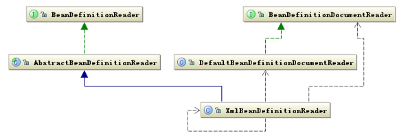

### 	Context 组件

​		Context 在 Spring 的 org.springframework.context 包下，前面已经讲解了 Context 组件在 Spring 中的作用，他实际上就是给 Spring 提供一个运行时的环境，用以保存各个对象的状态。下面看一下这个环境是如何构建的。ApplicationContext 是 Context 的顶级父类，他除了能标识一个应用环境的基本信息外，他还继承了五个接口，这五个接口主要是扩展了 Context 的功能。下面是 Context 的类结构图：

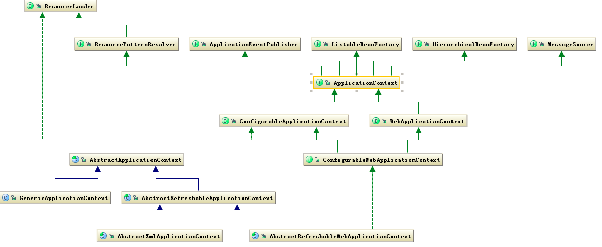

从上图中可以看出 ApplicationContext 继承了 BeanFactory，这也说明了 Spring 容器中运行的主体对象是 Bean，另外 ApplicationContext 继承了 ResourceLoader 接口，使得 ApplicationContext 可以访问到任何外部资源，这将在 Core 中详细说明。

ApplicationContext 的子类主要包含两个方面：

​	①ConfigurableApplicationContext 表示该 Context 是可修改的，也就是在构建 Context 中用户可以动态添加或修改已有的配置信息，它下面又有多个子类，其中最经常使用的是可更新的 Context，即 AbstractRefreshableApplicationContext 类。

​	②WebApplicationContext 顾名思义，就是为 web 准备的 Context 他可以直接访问到 ServletContext，通常情况下，这个接口使用的少。

再往下分就是按照构建 Context 的文件类型，接着就是访问 Context 的方式。这样一级一级构成了完整的 Context 等级层次。

总体来说 ApplicationContext 必须要完成以下几件事：

- 标识一个应用环境
- 利用 BeanFactory 创建 Bean 对象
- 保存对象关系表
- 能够捕获各种事件

Context 作为 Spring 的 Ioc 容器，基本上整合了 Spring 的大部分功能，或者说是大部分功能的基础。

### Core 组件

​	Core 组件作为 Spring 的核心组件，他其中包含了很多的关键类，其中一个重要组成部分就是定义了资源的访问方式。这种把所有资源都抽象成一个接口的方式很值得在以后的设计中拿来学习。下面就重要看一下这个部分在 Spring 的作用。 

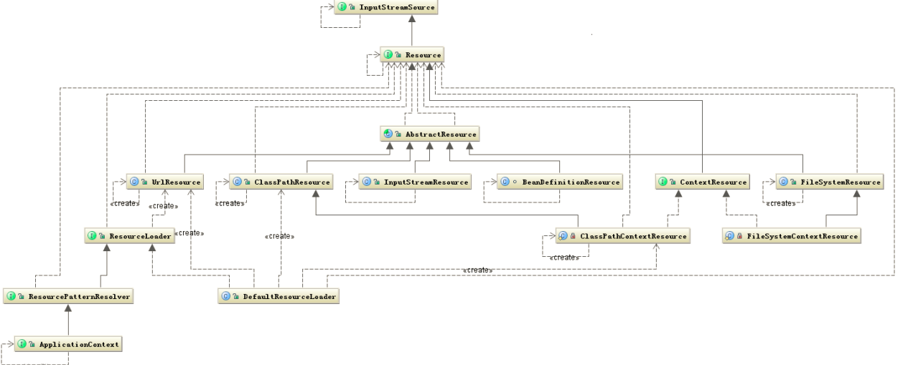

​	从上图可以看出 Resource 接口封装了各种可能的资源类型，也就是对使用者来说屏蔽了文件类型的不同。对资源的提供者来说，如何把资源包装起来交给其他人用这也是一个问题，我们看到 Resource 接口继承了 InputStreamSource 接口，这个接口中有个 getInputStream 方法，返回的是 InputStream 类。这样所有的资源都被可以通过 InputStream 这个类来获取，所以也屏蔽了资源的提供者。另外还有一个问题就是加载资源的问题，也就是资源的加载者要统一，从上图中可以看出这个任务是由 ResourceLoader 接口完成，他屏蔽了所有的资源加载者的差异，只需要实现这个接口就可以加载所有的资源，他的默认实现是 DefaultResourceLoader。 

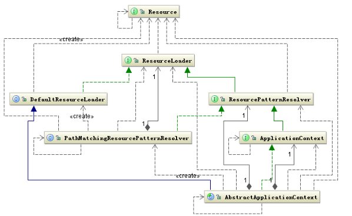

## 核心功能

### 	IOC

​	Ioc 容器实际上就是 Context 组件结合其他两个组件共同构建了一个 Bean 关系网，如何构建这个关系网？构建的入口就在 AbstractApplicationContext 类的 refresh 方法中。这个方法的代码如下： 

```
public void refresh() throws BeansException, IllegalStateException { 
    synchronized (this.startupShutdownMonitor) { 
        // Prepare this context for refreshing. 
        prepareRefresh(); 
        // Tell the subclass to refresh the internal bean factory. 
        ConfigurableListableBeanFactory beanFactory = obtainFreshBeanFactory(); 
        // Prepare the bean factory for use in this context. 
        prepareBeanFactory(beanFactory); 
        try { 
            // Allows post-processing of the bean factory in context subclasses. 
            postProcessBeanFactory(beanFactory); 
            // Invoke factory processors registered as beans in the context. 
            invokeBeanFactoryPostProcessors(beanFactory); 
            // Register bean processors that intercept bean creation. 
            registerBeanPostProcessors(beanFactory); 
            // Initialize message source for this context. 
            initMessageSource(); 
            // Initialize event multicaster for this context. 
            initApplicationEventMulticaster(); 
            // Initialize other special beans in specific context subclasses. 
            onRefresh(); 
            // Check for listener beans and register them. 
            registerListeners(); 
            // Instantiate all remaining (non-lazy-init) singletons. 
            finishBeanFactoryInitialization(beanFactory); 
            // Last step: publish corresponding event. 
            finishRefresh(); 
        } 
        catch (BeansException ex) { 
            // Destroy already created singletons to avoid dangling resources. 
            destroyBeans(); 
            // Reset 'active' flag. 
            cancelRefresh(ex); 
            // Propagate exception to caller. 
            throw ex; 
        } 
    } 
}
```

这个方法就是构建整个 Ioc 容器过程的完整的代码，了解了里面的每一行代码基本上就了解大部分 Spring 的原理和功能了。这段代码主要包含这样几个步骤：

- 构建 BeanFactory，以便于产生所需的“演员”

- 注册可能感兴趣的事件

- 创建 Bean 实例对象

- 触发被监听的事件

  第二三句就是在创建和配置 BeanFactory。这里是 refresh 也就是刷新配置，前面介绍了 Context 有可更新的子类，这里正是实现这个功能，当 BeanFactory 已存在是就更新，如果没有就新创建。下面是更新 BeanFactory 的方法代码：

```
protected final void refreshBeanFactory() throws BeansException { 
    if (hasBeanFactory()) { 
        destroyBeans(); 
        closeBeanFactory(); 
    } 
    try { 
        DefaultListableBeanFactory beanFactory = createBeanFactory(); 
        beanFactory.setSerializationId(getId()); 
        customizeBeanFactory(beanFactory); 
        loadBeanDefinitions(beanFactory); 
        synchronized (this.beanFactoryMonitor) { 
            this.beanFactory = beanFactory; 
        } 
    } 
    catch (IOException ex) { 
        throw new ApplicationContextException(
			"I/O error parsing bean definition source for " 
			+ getDisplayName(), ex); 
    } 
}
```

​	这个方法实现了 AbstractApplicationContext 的抽象方法 refreshBeanFactory，这段代码清楚的说明了 BeanFactory 的创建过程。注意 BeanFactory 对象的类型的变化，前面介绍了他有很多子类，在什么情况下使用不同的子类这非常关键。BeanFactory 的原始对象是 DefaultListableBeanFactory，这个非常关键，因为他设计到后面对这个对象的多种操作，下面看一下这个类的继承层次类图： 

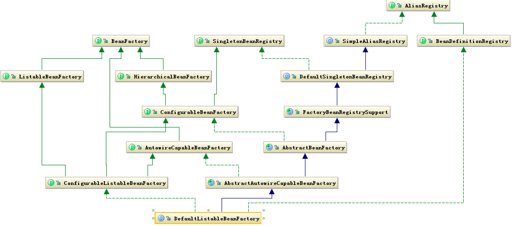

​	从这个图中发现除了 BeanFactory 相关的类外，还发现了与 Bean 的 register 相关。这在 refreshBeanFactory 方法中有一行 loadBeanDefinitions(beanFactory) 将找到答案，这个方法将开始加载、解析 Bean 的定义，也就是把用户定义的数据结构转化为 Ioc 容器中的特定数据结构。 创建好 BeanFactory 后，接下去添加一些 Spring 本身需要的一些工具类，这个操作在 AbstractApplicationContext 的 prepareBeanFactory 方法完成。AbstractApplicationContext 中接下来的三行代码对 Spring 的功能扩展性起了至关重要的作用。前两行主要是让你现在可以对已经构建的 BeanFactory 的配置做修改，后面一行就是让你可以对以后再创建 Bean 的实例对象时添加一些自定义的操作。所以他们都是扩展了 Spring 的功能，所以我们要学习使用 Spring 必须对这一部分搞清楚。

​	其中在 invokeBeanFactoryPostProcessors 方法中主要是获取实现 BeanFactoryPostProcessor 接口的子类。并执行它的 postProcessBeanFactory 方法，这个方法的声明如下：

```
void postProcessBeanFactory(ConfigurableListableBeanFactory beanFactory) 
    throws BeansException;
```

​	它的参数是 beanFactory，说明可以对 beanFactory 做修改，这里注意这个 beanFactory 是 ConfigurableListableBeanFactory 类型的，这也印证了前面介绍的不同 BeanFactory 所使用的场合不同，这里只能是可配置的 BeanFactory，防止一些数据被用户随意修改。

registerBeanPostProcessors 方法也是可以获取用户定义的实现了 BeanPostProcessor 接口的子类，并执行把它们注册到 BeanFactory 对象中的 beanPostProcessors 变量中。BeanPostProcessor 中声明了两个方法：postProcessBeforeInitialization、postProcessAfterInitialization 分别用于在 Bean 对象初始化时执行。可以执行用户自定义的操作。

​	后面的几行代码是初始化监听事件和对系统的其他监听者的注册，监听者必须是 ApplicationListener 的子类。下面就是 Bean 的实例化代码，是从 finishBeanFactoryInitialization 方法开始的。

```
protected void finishBeanFactoryInitialization(
	ConfigurableListableBeanFactory beanFactory) { 

    // Stop using the temporary ClassLoader for type matching. 
    beanFactory.setTempClassLoader(null); 

    // Allow for caching all bean definition metadata, not expecting further changes.
    beanFactory.freezeConfiguration(); 

    // Instantiate all remaining (non-lazy-init) singletons. 
    beanFactory.preInstantiateSingletons(); 
}
```

从上面代码中可以发现 Bean 的实例化是在 BeanFactory 中发生的。preInstantiateSingletons 方法的代码如下：

```
public void preInstantiateSingletons() throws BeansException { 
    if (this.logger.isInfoEnabled()) { 
        this.logger.info("Pre-instantiating singletons in " + this); 
    } 
    synchronized (this.beanDefinitionMap) { 
        for (String beanName : this.beanDefinitionNames) { 
            RootBeanDefinition bd = getMergedLocalBeanDefinition(beanName); 
            if (!bd.isAbstract() && bd.isSingleton() 
                && !bd.isLazyInit()) {
                if (isFactoryBean(beanName)) { 
                    final FactoryBean factory = 
                        (FactoryBean) getBean(FACTORY_BEAN_PREFIX+ beanName); 
                    boolean isEagerInit; 
                    if (System.getSecurityManager() != null 
                        && factory instanceof SmartFactoryBean) { 
                        isEagerInit = AccessController.doPrivileged(
                            new PrivilegedAction<Boolean>() { 
                            public Boolean run() { 
                                return ((SmartFactoryBean) factory).isEagerInit(); 
                            } 
                        }, getAccessControlContext()); 
                    } 
                    else { 
                        isEagerInit = factory instanceof SmartFactoryBean 
                            && ((SmartFactoryBean) factory).isEagerInit(); 
                    } 
                    if (isEagerInit) { 
                        getBean(beanName); 
                    } 
                } 
                else { 
                    getBean(beanName); 
                } 
            } 
        } 
    } 
}
```

​	这里出现了一个非常重要的 Bean —— FactoryBean，可以说 Spring 一大半的扩展的功能都与这个 Bean 有关，这是个特殊的 Bean 他是个工厂 Bean，可以产生 Bean 的 Bean，这里的产生 Bean 是指 Bean 的实例，如果一个类继承 FactoryBean 用户可以自己定义产生实例对象的方法只要实现他的 getObject 方法。然而在 Spring 内部这个 Bean 的实例对象是 FactoryBean，通过调用这个对象的 getObject 方法就能获取用户自定义产生的对象，从而为 Spring 提供了很好的扩展性。Spring 获取 FactoryBean 本身的对象是在前面加上 & 来完成的。

​	如何创建 Bean 的实例对象以及如何构建 Bean 实例对象之间的关联关系式 Spring 中的一个核心关键，下面是这个过程的流程图。

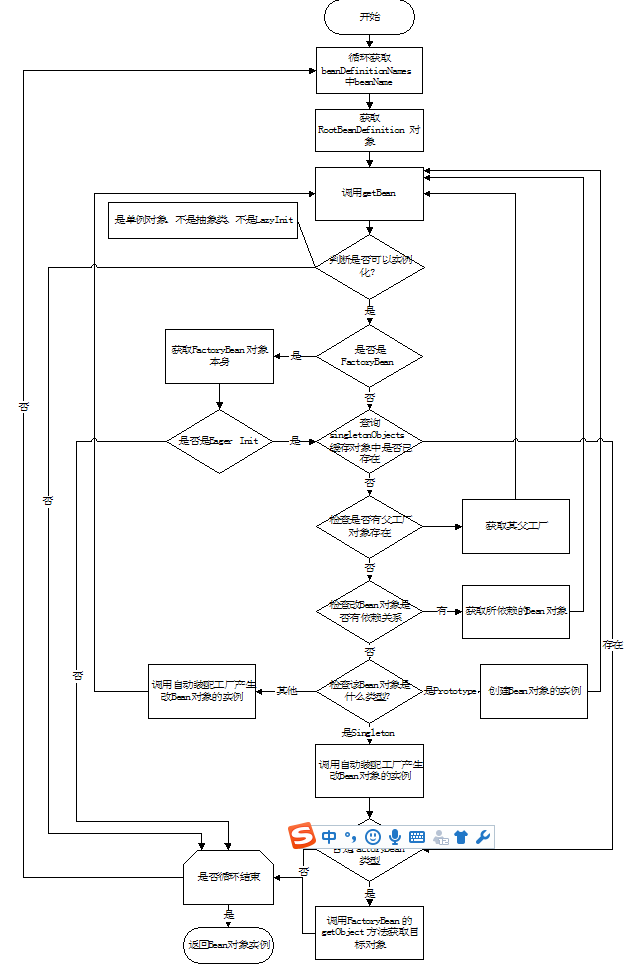

### AOP

​	Spring 的 Aop 实现是遵守 Aop 联盟的约定。同时 Spring 又扩展了它，增加了如 Pointcut、Advisor 等一些接口使得更加灵活。 

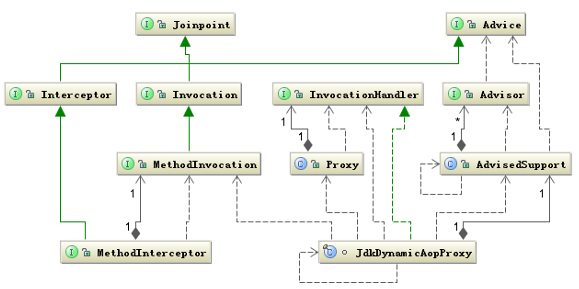

​	上图清楚的显示了 Spring 引用了 Aop Alliance 定义的接口。姑且不讨论 Spring 如何扩展 Aop Alliance，先看看 Spring 如何实现代理类的，要实现代理类在 Spring 的配置文件中通常是这样定一个 Bean 的，如下： 

```
<bean id="testBeanSingleton" 
    class="org.springframework.aop.framework.ProxyFactoryBean">
    <property name="proxyInterfaces">
        <value>
            org.springframework.aop.framework.PrototypeTargetTests$TestBean
        </value>
    </property>
    <property name="target"><ref local="testBeanTarget"></ref> </property>
    <property name="singleton"><value>true</value></property>
    <property name="interceptorNames">
        <list>
            <value>testInterceptor</value>
            <value>testInterceptor2</value>
        </list>
    </property>
</bean>
```

​	配置上看到要设置被代理的接口，和接口的实现类也就是目标类，以及拦截器也就在执行目标方法之前被调用，这里 Spring 中定义的各种各样的拦截器，可以选择使用。 前面提到 Spring Aop 也是实现其自身的扩展点来完成这个特性的，从这个代理类可以看出它正是继承了 FactoryBean 的 ProxyFactoryBean，FactoryBean 之所以特别就在它可以让你自定义对象的创建方法。当然代理对象要通过 Proxy 类来动态生成。 

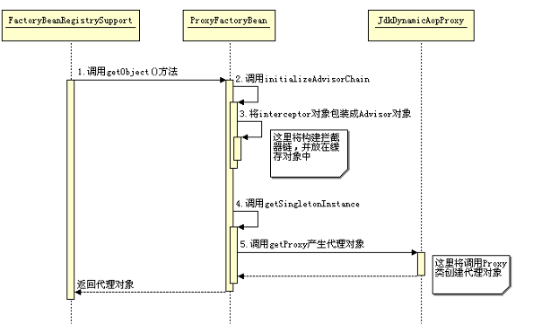

​	Spring 创建了代理对象后，当你调用目标对象上的方法时，将都会被代理到 InvocationHandler 类的 invoke 方法中执行，这在前面已经解释。在这里 JdkDynamicAopProxy 类实现了 InvocationHandler 接口。 

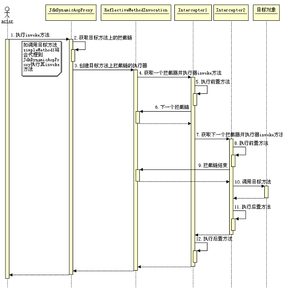

