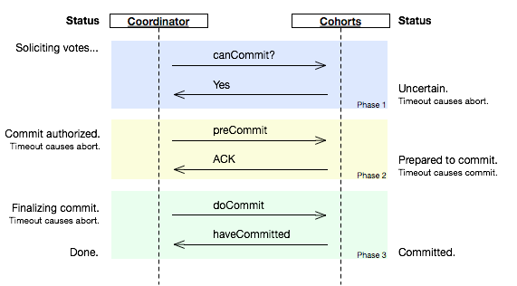
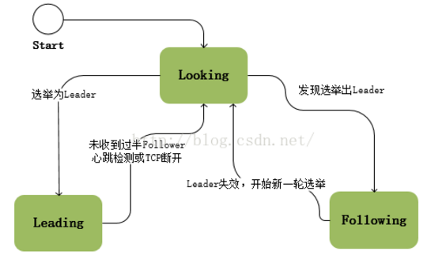
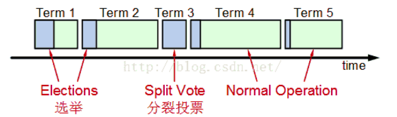

# 分布式理论

## 介绍

### CAP原理

- 要想数据高可用，就得写多份数据
- 写多分数据就会导致数据一致性问题
- 数据一致性问题会引起性能问题

### 一致性模型

- 弱一致性
- 最终一致性（一段时间达到一致性）
- 强一致

### 扩展服务的方案

- 数据分区： uid % 16
- 数据镜像：让多有的服务器都有相同的数据，提供相当的服务（冗余存储，一般3份为好）

## 解决方案

### 	2PC

​	阶段一：提交事务请求（投票阶段）

​		①事务询问

```
协调者向所有的参与者发送事务内容，询问是否可以执行事务提交操作，并开始等待各参与者的响应
```

​		②执行事务

```
各参与者节点执行事务操作，并将Undo和Redo信息计入事务日志中
```

​		③各参与者向协调者反馈事务询问的响应

```
如果参与者成功执行了事务操作，那么就反馈给协调者Yes响应，表示事务可以执行；如果参与者没有成功执行事务，那么就反馈给协调者No响应，表示事务不可以执行。
```

​	阶段二：执行事务提交（执行阶段）

​	①执行事务提交

​	如果所有参与者的反馈都是Yes响应，那么

- 发送提交请求：协调者向所有参与者节点发出Commit请求
- 事务提交：参与者接收到Commit请求后，会正式执行事务提交操作，并在完成提交之后释放在整个事务执行期间占用的事务资源
- 反馈事务提交结果：参与者在完成事务提交之后，向协调者发送ACK信息
- 完成事务：协调者接收到所有参与者反馈的ACK消息后，完成事务

​	②中断事务

​	任何一个参与者反馈了No响应，或者在等待超时之后，协调者尚无法接收到所有参与者的反馈响应，那么就会中断事务。

- 发送回滚请求：协调者向所有参与者节点发出Rollback请求

- 事务回滚：参与者接收到rollback请求后，会利用其在阶段一中记录的Undo信息来执行事务回滚操作，并在完成回滚之后释放整个事务执行期间占用的资源

- 反馈事务回滚结果：参与者在完成事务回滚之后，向协调者发送ACK信息

- 中断事务：协调者接收到所有参与者反馈的ACK信息后，完成事务中断

**优缺点**

优点：原理简单、实现方便
缺点：同步阻塞、单点问题、数据不一致、太过保守

- 同步阻塞
  同步阻塞会极大地限制分布式系统的性能。在二阶段提交的执行过程中，所有参与该事务操作的逻辑都处于阻塞状态，各个参与者在等待其他参与者响应的过程中，将无法进行其他任何操作。
- 单点问题
  一旦协调者出现问题，那么整个二阶段提交流程将无法运转，更为严重的是，如果是在阶段二中出现问题，那么其他参与者将会一直处于锁定事务资源的状态中，无法继续完成事务操作。
- 数据不一致
  在阶段二，当协调者向所有参与者发送commit请求之后，发生了局部网络异常或协调者在尚未发完commit请求之前自身发生了崩溃，导致最终只有部分参与者接收到了commit请求，于是这部分参与者执行事务提交，而没收到commit请求的参与者则无法进行事务提交，于是整个分布式系统出现了数据不一致性现象。
- 太过保守
  如果参与者在与协调者通信期间出现故障，协调者只能靠超时机制来判断是否需要中断事务，这个策略比较保守，需要更为完善的容错机制，任意一个节点的失败都会导致整个事务的失败。

### 3PC



​	为了避免在通知所有参与者提交事务时，其中一个参与者crash不一致时，就出现了三阶段提交的方式。三阶段提交在两阶段提交的基础上增加了一个preCommit的过程，当所有参与者收到preCommit后，并不执行动作，直到收到commit或超过一定时间后才完成操作。 

​	阶段一：CanCommit

事务询问：协调者向各参与者发送CanCommit的请求，询问是否可以执行事务提交操作，并开始等待各参与者的响应

参与者向协调者反馈询问的响应：参与者收到CanCommit请求后，正常情况下，如果自身认为可以顺利执行事务，那么会反馈Yes响应，并进入预备状态，否则反馈No。

​	阶段二：PreCommit

​	**执行事务**

预提交如果协调者接收到各参与者反馈都是Yes，那么执行事务预提交

- 发送预提交请求：协调者向各参与者发送preCommit请求，并进入prepared阶段
- 事务预提交：参与者接收到preCommit请求后，会执行事务操作，并将Undo和Redo信息记录到事务日记中
- 各参与者向协调者反馈事务执行的响应：如果各参与者都成功执行了事务操作，那么反馈给协调者Ack响应，同时等待最终指令，提交commit或者终止abort

​	**中断事务**

如果任何一个参与者向协调者反馈了No响应，或者在等待超时后，协调者无法接收到所有参与者的反馈，那么就会中断事务。

- 发送中断请求：协调者向所有参与者发送abort请求
- 中断事务：无论是收到来自协调者的abort请求，还是等待超时，参与者都中断事务

​	阶段三doCommit

​	**执行提交**

- 发送提交请求：假设协调者正常工作，接收到了所有参与者的ack响应，那么它将从预提交阶段进入提交状态，并向所有参与者发送doCommit请求
- 事务提交：参与者收到doCommit请求后，正式提交事务，并在完成事务提交后释放占用的资源
- 反馈事务提交结果：参与者完成事务提交后，向协调者发送ACK信息
- 完成事务：协调者接收到所有参与者ack信息，完成事务

​	**中断事务**

​	假设协调者正常工作，并且有任一参与者反馈No，或者在等待超时后无法接收所有参与者的反馈，都会中断事务

- 发送中断请求：协调者向所有参与者节点发送abort请求
- 事务回滚：参与者接收到abort请求后，利用undo日志执行事务回滚，并在完成事务回滚后释放占用的资源
- 反馈事务回滚结果：参与者在完成事务回滚之后，向协调者发送ack信息
- 中断事务：协调者接收到所有参与者反馈的ack信息后，中断事务。

​	阶段三可能出现的问题：
协调者出现问题、协调者与参与者之间网络出现故障。不论出现哪种情况，最终都会导致参与者无法及时接收到来自协调者的doCommit或是abort请求，针对这种情况，参与者都会在等待超时后，继续进行事务提交（timeout后中断事务）。

​	优点：降低参与者阻塞范围，并能够在出现单点故障后继续达成一致
	缺点：引入preCommit阶段，在这个阶段如果出现网络分区，协调者无法与参与者正常通信，参与者依然会进行事务提交，造成数据不一致。

### paxos

- 解决的问题：在一个可能发生异常的分布式系统中如何就某个值达成一致，让整个集群的节点对某个值的变更达成一致
- 任何一个节点都可以提出要修改**某个**数据的提案,是否通过这个提案取决于这个集群中是否有超过半数的节点同意（所以节点数总是单数）—— 版本标记。虽然一致性，但是只能对一个操作进行操作啊？？
- 当一个Server接收到比当前版本号小的提案时，则拒绝。当收到比当前大的版本号的提案时，则锁定资源，进行修改，返回OK.   也就是说收到超过一半的最大版本的提案才算成功。

**核心思想**：

​	①在抢占式访问权的基础上引入多个acceptor，也就是说当一个版本号更大的提案可以剥夺版本号已经获取的锁。

​	②后者认同前者的原则：

- 在肯定旧epoch 无法生成确定性取值时，新的 epoch 会提交自己的valu
- 一旦 旧epoch形成确定性取值，新的 epoch肯定可以获取到此取值，并且会认同此取值，不会被破坏。

### zab

​	**定义**：原子广播协议 ZAB 是一致性协议，Zookeeper 把其作为数据一致性的算法。ZAB 是在 Paxos 算法基础上进行扩展而来的。Zookeeper 使用单一主进程 Leader用于处理客户端所有事务请求，采用 ZAB 协议将服务器状态以事务形式广播到所有 Follower 上，由于事务间可能存在着依赖关系，ZAB协议保证 Leader 广播的变更序列被顺序的处理，一个状态被处理那么它所依赖的状态也已经提前被处理

**核心思想：**保证任意时刻只有一个节点是Leader，所有更新事务由Leader发起去更新所有副本 Follower，更新时用的是 两段提交协议，只要多数节点 prepare 成功，就通知他们commit。各个follower 要按当初 leader 让他们 prepare 的顺序来 apply 事务

**协议状态**

​	Looking:系统刚启动时 或者 Leader 崩溃后正处于选举状态

​	Following：Follower 节点所处的状态，Follower与 Leader处于数据同步状态

​	Leading：Leader 所处状态，当前集群中有一个 Leader 为主进程



- ZooKeeper启动时所有节点初始状态为Looking，这时集群会尝试选举出一个Leader节点，选举出的Leader节点切换为Leading状态；当节点发现集群中已经选举出Leader则该节点会切换到Following状态，然后和Leader节点保持同步；当Follower节点与Leader失去联系时Follower节点则会切换到Looking状态，开始新一轮选举；在ZooKeeper的整个生命周期中每个节点都会在Looking、Following、Leading状态间不断转换。
- 选举出Leader节点后 ZAB 进入原子广播阶段，这时Leader为和自己同步每个节点 Follower 创建一个操作序列，一个时期一个 Follower 只能和一个Leader保持同步 

**阶段**

​	①Election： 在 Looking状态中选举出 Leader节点，Leader的LastZXID总是最新的（只有lastZXID的节点才有资格成为Leade,这种情况下选举出来的Leader总有最新的事务日志）。在选举的过程中会对每个Follower节点的ZXID进行对比只有highestZXID的Follower才可能当选Leader

- 每个Follower都向其他节点发送选自身为Leader的Vote投票请求，等待回复；
- Follower接受到的Vote如果比自身的大（ZXID更新）时则投票，并更新自身的Vote，否则拒绝投票；
- 每个Follower中维护着一个投票记录表，当某个节点收到过半的投票时，结束投票并把该Follower选为Leader，投票结束；

②Discovery:Follower 节点向准 Leader推送 FollwerInfo,该信息包含了上一周期的epoch，接受准 Leader 的 NEWLEADER 指令

③Sync：将 Follower 与 Leader的数据进行同步，由Leader发起同步指令，最终保持数据的一致性

④Broadcast：Leader广播 Proposal 与 Commit，Follower 接受 Proposal 与 commit。因为一个时刻只有一个Leader节点，若是更新请求，只能由Leader节点执行（若连到的是 Follower 节点，则需转发到Leader节点执行；读请求可以从Follower 上读取，若是要最新的数据，则还是需要在 Leader上读取）

- 消息广播使用了TCP协议进行通讯所有保证了接受和发送事务的顺序性。广播消息时Leader节点为每个事务Proposal分配一个全局递增的ZXID（事务ID），每个事务Proposal都按照ZXID顺序来处理（Paxos 保证不了）
- Leader节点为每一个Follower节点分配一个队列按事务ZXID顺序放入到队列中，且根据队列的规则FIFO来进行事务的发送。

⑤Recovery ：根据Leader的事务日志对Follower 节点数据进行同步更新

- 同步策略：
  1. **SNAP** ：如果Follower数据太老，Leader将发送快照SNAP指令给Follower同步数据；
  2. **DIFF** ：Leader发送从Follolwer.lastZXID到Leader.lastZXID议案的DIFF指令给Follower同步数据；
  3. **TRUNC** ：当Follower.lastZXID比Leader.lastZXID大时，Leader发送从Leader.lastZXID到Follower.lastZXID的TRUNC指令让Follower丢弃该段数据；（当老Leader在Commit前挂掉，但是已提交到本地）
- Follower将所有事务都同步完成后Leader会把该节点添加到可用Follower列表中；
- Follower接收Leader的NEWLEADER指令，如果该指令中epoch比当前Follower的epoch小那么Follower转到Election阶段

### raft

​	①Raft 算法也是一种少数服从多数的算法，在任何时候一个服务器可以扮演以下角色之一：

- Leader：负责 Client 交互 和 log 复制，同一时刻系统中最多存在一个
- Follower：被动响应请求 RPC，从不主动发起请求 RPC
- Candidate : 由Follower 向Leader转换的中间状态

​	②在选举Leader的过程中，是有时间限制的，raft 将时间分为一个个 Term，可以认为是“逻辑时间”：

- 每个 Term中至多存在1个 Leader
- 某些 Term由于不止一个得到的票数一样，就会选举失败，不存在Leader。则会出现 Split Vote  ，再由候选者发出邀票
- 每个 Server 本地维护 currentTerm



选举过程：

​	①自增 CurrentTerm，由Follower 转换为 Candidate，设置 votedFor 为自身，并行发起 RequestVote RPC,不断重试，直至满足下列条件之一为止：

- 获得超过半数的Server的投票，转换为 Leader，广播 HeatBeat
- 接收到 合法 Leader 的 AppendEnties RPC，转换为Follower
- 选举超时，没有 Server选举成功，自增 currentTerm ,重新选举

​	②当Candidate 在等待投票结果的过程中，可能会接收到来自其他Leader的 AppendEntries RPC ,如果该 Leader 的 Term 不小于本地的 Current Term，则认可该Leader身份的合法性，主动降级为Follower，反之，则维持 candida 身份继续等待投票结果

​	③Candidate 既没有选举成功，也没有收到其他 Leader 的 RPC (多个节点同时发起选举，最终每个 Candidate都将超时)，为了减少冲突，采取随机退让策略，每个 Candidate 重启选举定时器

日志更新问题：

​	如果在日志复制过程中，发生了网络分区或者网络通信故障，使得Leader不能访问大多数Follwers了，那么Leader只能正常更新它能访问的那些Follower服务器，而大多数的服务器Follower因为没有了Leader，他们重新选举一个候选者作为Leader，然后这个Leader作为代表于外界打交道，如果外界要求其添加新的日志，这个新的Leader就按上述步骤通知大多数Followers，如果这时网络故障修复了，那么原先的Leader就变成Follower，在失联阶段这个老Leader的任何更新都不能算commit，都回滚，接受新的Leader的新的更新。

流程：

- Client 发送command 命令给 Leader
- Leader追加日志项，等待 commit 更新本地状态机，最终响应 Client
- 若 Client超时，则不断重试，直到收到响应为止（重发 command，可能被执行多次，在被执行但是由于网络通信问题未收到响应）。解决办法：Client 赋予每个 Command唯一标识，Leader在接收 command 之前首先检查本地log

paxos 算法与 raft 算法的差异：

- raft强调是唯一leader的协议，此leader至高无上
- raft：新选举出来的leader拥有全部提交的日志，而 paxos 需要额外的流程从其他节点获取已经被提交的日志，它允许日志有空洞
- 相同点：得到大多数的赞成，这个 entries 就会定下来，最终所有节点都会赞成

