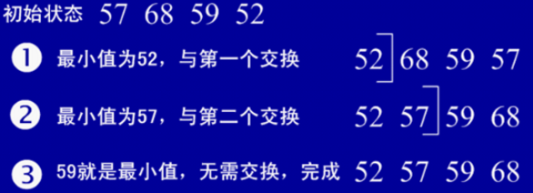

# 排序算法

​	排序大的分类可以分为两种：内排序和外排序。在排序过程中，全部记录存放在内存，则称为内排序，如果排序过程中需要使用外存，则称为外排序。

​	内排序有可以分为以下几类：

　　①插入排序：直接插入排序、二分法插入排序、希尔排序。

　　②选择排序：直接选择排序、堆排序。

　　③交换排序：冒泡排序、快速排序。

　　④归并排序

　　⑤线性排序：计数排序、基数排序、桶排序 

## 插入排序

思想：每步将一个待排序的记录，按其顺序码大小插入到前面已经排序的字序列的合适位置，直到全部插入排序完为止。  关键问题：在前面已经排好序的序列中找到合适的插入位置。 

### 	直接插入排序

​	（从后向前找到合适位置后插入） 

### 	二分法插入排序

​	（按二分法找到合适位置插入） 

​	二分法插入排序的思想和直接插入一样，只是找合适的插入位置的方式不同，这里是按二分法找到合适的位置，可以减少比较的次数。 

​		

### 	希尔排序

​	希尔排序通过将比较的全部元素分为几个区域来提升插入排序的性能。这样可以让一个元素可以一次性地朝最终位置前进一大步。然后算法再取越来越小的步长进行排序，算法的最后一步就是普通的插入排序，但是到了这步，需排序的数据几乎是已排好的了（**此时插入排序较快**）。

​	**步长的选择是希尔排序的重要部分**。只要最终步长为1任何步长序列都可以工作（**且步长要小于数组长度**）。算法最开始以一定的步长进行排序。然后会继续以一定步长进行排序，最终算法以步长为1进行排序。当步长为1时，算法变为插入排序，这就保证了数据一定会被排序。

​	关于希尔排序的**时间复杂度**，与步长息息相关：

​	

## 选择排序

### 	直接选择排序

​	在要排序的一组数中，选出最小的一个数与第一个位置的数交换；然后在剩下的数当中再找最小的与第二个位置的数交换，如此循环到倒数第二个数和最后一个数比较为止。 

​	

### 	堆排序

​	堆是具有以下性质的完全二叉树：每个结点的值都大于或等于其左右孩子结点的值，称为大顶堆；或者每个结点的值都小于或等于其左右孩子结点的值，称为小顶堆。

​	堆排序的基本思想是：将待排序序列构造成一个大顶堆，此时，整个序列的最大值就是堆顶的根节点。将其与末尾元素进行交换，此时末尾就为最大值。然后将剩余n-1个元素重新构造成一个堆，这样会得到n个元素的次小值。如此反复执行，便能得到一个有序序列了。

## 交换排序

### 	冒泡排序

​	在要排序的一组数中，对当前还未排好序的范围内的全部数，自上而下对相邻的两个数依次进行比较和调整，让较大的数往下沉，较小的往上冒。即：每当两相邻的数比较后发现它们的排序与排序要求相反时，就将它们互换。 

### 	快速排序 

​	选择一个基准元素,通常选择第一个元素或者最后一个元素,通过一趟扫描，将待排序列分成两部分,一部分比基准元素小，一部分大于等于基准元素,此时基准元素在其排好序后的正确位置,然后再用同样的方法递归地排序划分的两部分。 java中Arrays.sort()对基本类型的排序都是使用了DualPivotQuicksort的排序方法 。

​	①固定位置

​	取序列的第一个或最后一个元素作为基准 

​	②随机选取基准

​	在待排序列是部分有序时，固定选取枢轴使快排效率底下，要缓解这种情况，就引入了随机选取枢轴 

​	③三数取中

​	虽然随机选取枢轴时，减少出现不好分割的几率，但是还是最坏情况下还是O(n^2），要缓解这种情况，就引入了三数取中选取枢轴

​	最佳的划分是将待排序的序列分成等长的子序列，最佳的状态我们可以使用序列的中间的值，也就是第N/2个数。可是，这很难算出来，并且会明显减慢快速排序的速度。这样的中值的估计可以通过随机选取三个元素并用它们的中值作为枢纽元而得到。事实上，随机性并没有多大的帮助，因此一般的做法是使用左端、右端和中心位置上的三个元素的中值作为枢纽元。显然使用三数中值分割法消除了预排序输入的不好情形，并且减少快排大约14%的比较次数 。

​	④Dual-Pivot QuickSort

​	由于CPU与内存的发展失衡，我们在分析算法复杂性的时候已经不能简单地用`元素比较次数`来比较了，因为这种比较的方法只考虑了CPU的因素，没有考虑内存的因素。 `扫描元素个数`反应的是CPU与内存之间的数据流量的大小。 经典快排确实进行了更多的元素扫描动作，因此也就比较慢。在这种新的算法下面，Dual-Pivot快排比经典快排t节省了12%的元素扫描，从实验来看节省了10%的时间。 

​	优化策略：当待排序序列的长度分割到一定大小后，使用插入排序；在一次分割结束后，可以把与Key相等的元素聚在一起，继续下次分割时，不用再对与key相等元素分割；优化递归操作，可以缩减堆栈深度，由原来的O(n)缩减为O(logn)，将会提高性能；使用并行或多线程处理子序列。

## 归并排序

​	归并（Merge）排序法是将两个（或两个以上）有序表合并成一个新的有序表，即把待排序序列分为若干个子序列，每个子序列是有序的。然后再把有序子序列合并为整体有序序列。 

​	

​	归并排序是稳定排序，它也是一种十分高效的排序，能利用完全二叉树特性的排序一般性能都不会太差。java中Arrays.sort()采用了一种名为TimSort的排序算法，就是归并排序的优化版本。每次合并操作的平均时间复杂度为O(n)，而完全二叉树的深度为|log2n|。总的平均时间复杂度为O(nlogn)。而且，归并排序的最好，最坏，平均时间复杂度均为O(nlogn)。 

## 线性排序

### 	计数排序

​	对于一个输入数组中的一个元素x，只要我们知道了这个数组中比x小的元素的个数，那么我们就可以直接把x放到（x+1）的位置上。这就是计数排序的基本思想。  基于这个思想，计数排序的一个主要问题就是如何统计数组中元素的个数。再加上**输入数组中的元素都是0-k区间的一个整数**这个条件，那么就可以**通过另外一个数组的地址表示输入元素的值，数组的值表示元素个数**的方法来进行统计。 

​	计数排序的时间复杂度为O(N+K)，空间复杂度为O(N+K)。 

### 	基数排序

​	将所有待比较数值（正整数）统一为同样的数位长度，数位较短的数前面补零。然后，从最低位开始，依次进行一次排序。这样从最低位排序一直到最高位排序完成以后,数列就变成一个有序序列。 

​	

### 	桶排序

​	桶排序（bucket sort）假设输入数据服从均匀分布。平均情况下他的时间代价是O(n)。计数排序假设输入数据分布于一个小区间的整数，而桶排序则假设输入是一个随机过程产生的，该过程将元素均匀独立地分布于[0,1)区间上。 

​	桶排序将[0,1)区间划分为n个相同的大小的子区间，这些子区间被称为**桶**。然后将n个输入元素分别放入各自的桶中。因为输入时均匀独立的，所以一般不会有很多数同时落在一个桶中的情况。这样，我们想对各个桶中的数据进行排序，然后遍历每个桶，按照次序把各个桶中的元素列出来即可。  

​	对该算法简单分析，如果数据是期望平均分布的，则每个桶中的元素平均个数为N/M。如果对每个桶中的元素排序使用的算法是快速排序，每次排序的时间复杂度为O(N/M*log(N/M))。则总的时间复杂度为O(N)+O(M)*O(N/M*log(N/M)) = O(N+ N*log(N/M)) =**O(N + NlogN - NlogM)**。当M接近于N是，桶排序的时间复杂度就可以近似认为是O(N)的。就是桶越多，时间效率就越高，而桶越多，空间却就越大，由此可见时间和空间是一个矛盾的两个方面。 

# 其它算法

## 字符串比较

### 	KMP算法

​	KMP算法是一种改进的字符串匹配算法，由D.E.Knuth，J.H.Morris和V.R.Pratt同时发现，因此人们称它为克努特——莫里斯——普拉特操作（简称KMP算法）。KMP算法的关键是利用匹配失败后的信息，尽量减少模式串与主串的匹配次数以达到快速匹配的目的。具体实现就是实现一个next()函数，函数本身包含了模式串的局部匹配信息。时间复杂度O(m+n)。 

​	用暴力算法匹配字符串过程中，我们会把T[0] 跟 W[0] 匹配，如果相同则匹配下一个字符，直到出现不相同的情况，此时我们会丢弃前面的匹配信息，然后把T[1] 跟 W[0]匹配，循环进行，直到主串结束，或者出现匹配成功的情况。这种丢弃前面的匹配信息的方法，极大地降低了匹配效率。

​	而在KMP算法中，对于每一个模式串我们会事先计算出模式串的内部匹配信息，在匹配失败时最大的移动模式串，以减少匹配次数。

### 	BM算法

​	在计算机科学里，Boyer-Moore字符串搜索算法是一种非常高效的字符串搜索算法。它由Bob Boyer和J Strother Moore设计于1977年。此算法仅对搜索目标字符串（关键字）进行预处理，而非被搜索的字符串。虽然Boyer-Moore算法的执行时间同样线性依赖于被搜索字符串的大小，但是通常仅为其它算法的一小部分：它不需要对被搜索的字符串中的字符进行逐一比较，而会跳过其中某些部分。通常搜索关键字越长，算法速度越快。它的效率来自于这样的事实：对于每一次失败的匹配尝试，算法都能够使用这些信息来排除尽可能多的无法匹配的位置。

​	移动字符数是通过两条规则决定的：坏字符规则和好后缀规则。实际移动为通过这两条规则计算出的最大移动个数。 

## 图遍历算法

### 	广度优先搜索

​	广度优先搜索的策略是：

​	从起始点开始遍历其邻接的节点，由此向外不断扩散。

​		①假设我们以顶点0为原点进行搜索，首先确定邻接0的顶点集合S0 = {1，2}。

​		②然后确定顶点1的集合S1 = {3}，顶点2没有邻接点，所以集合为空。

​		③然后确定3的邻接点集合S3，因为2已经被遍历过，所以不考虑，所以由顶点3知道的邻接点集合S3 = {4}。

​		④然后再确定顶点4的邻接点集合,顶点4没有更多的邻接点了，此时也没有还未遍历的邻接点集合，搜索终止。

### 	深度优先搜索

​	深度优先遍历的策略是：

​	从一个顶点v出发，首先将v标记为已遍历的顶点，然后选择一个邻接于v的尚未遍历的顶点u，如果u不存在，本次搜素终止。如果u存在，那么从u又开始一次DFS。如此循环直到不存在这样的顶点。

​		①从顶点0开始，将0标记为已遍历，然后选择未被遍历的邻接0的顶点1。

​		②标记顶点1，然后选择3并标记，然后选择顶点3邻接的顶点2。

​		③顶点2标记后没有与它邻接的未标记的点，所以返回3选择另一个邻接3并且未被标记的顶点4。

​		④顶点4没有更多的符合条件的点，因此搜索终止，返回到3，3没有更多的点，搜索终止返回到1，最后返回到0，搜索终止。

## 贪心算法

​	贪心选择是指所求问题的整体最优解可以通过一系列局部最优的选择，即贪心选择来达到。这是贪心算法可行的第一个基本要素，也是贪心算法与动态规划算法的主要区别。贪心选择是采用从顶向下、以迭代的方法做出相继选择，每做一次贪心选择就将所求问题简化为一个规模更小的子问题。对于一个具体问题，要确定它是否具有贪心选择的性质，我们必须证明每一步所作的贪心选择最终能得到问题的最优解。通常可以首先证明问题的一个整体最优解，是从贪心选择开始的，而且作了贪心选择后，原问题简化为一个规模更小的类似子问题。然后，用数学归纳法证明，通过每一步贪心选择，最终可得到问题的一个整体最优解。 

​	当一个问题的最优解包含其子问题的最优解时，称此问题具有最优子结构性质。运用贪心策略在每一次转化时都取得了最优解。问题的最优子结构性质是该问题可用贪心算法或动态规划算法求解的关键特征。贪心算法的每一次操作都对结果产生直接影响，而动态规划则不是。贪心算法对每个子问题的解决方案都做出选择，不能回退；动态规划则会根据以前的选择结果对当前进行选择，有回退功能。动态规划主要运用于二维或三维问题，而贪心一般是一维问题 。

### 	一般背包问题

​	贪心策略是：**总是优先选择单位重量下价值最大的物品**

​	正确性证明 是：使用该贪心策略，可以获得最优解。在这里，最优解就是带走的物品价值最大。

​	**证明思路：先考察一个全局最优解，然后对该解加以修改(一般是采用“剪枝”技巧)，使其采用贪心选择，这个选择将原问题变成一个相似的、但是更小的问题。**

先假设 物品集合S={W1，W2....Wn}已经按 单位重量价值从小到大排好序了。并假设 一个全局最优解是：S(i)={Wi1，Wi2，.....Win}。Wi1，Wi2，.....Win是有序的。对于贪心选择而言，总是会优先 选择 Wn 的物品，当Wn 没有后，再选择Wn-1 .....。如果Win = Wn 问题已经得证。因为，我们的最优解S(i)中，已经包含了贪心选择。只要继续归纳下去，Wi(n-1) 就是 Wn-1 ....。如果Win != Wn 运用剪枝技巧，剪掉Win 并 贴上 Wn  此时，**得到的是一个更优的解(因为价值更大了 ，Wn > Win)**。因为，Wn 是单位重量价值最高的那个物品啊，我们的贪心选择**应该**选择它，但是这里的最优解S(i)**却没有选择它**，于是我们用剪枝技巧，将它加入到S(i)中去，并把S(i)中的Win除去。  这就证明了，如果用贪心策略来进行选择，得到的是最优解。从而证明了贪心算法的正确性

### 	最小生成树

​	方法上：Kruskal在所有边中不断寻找最小的边，Prim在U和V两个集合之间寻找权值最小的连接，共同点是构造过程都不能形成环。

​	时间上：Prim适合稠密图，复杂度为O(n * n)，因此通常使用邻接矩阵储存，复杂度为O(e * loge)，而Kruskal多用邻接表，稠密图 Prim > Kruskal，稀疏图 Kruskal > Prim。

​	空间上： Prim适合点少边多，Kruskal适合边多点少。

​	①Prim算法

​	设G = (V,E)是连通带权图，V = {1,2,…,n}。构造G的最小生成树Prim算法的基本思想是：首先置S = {1}，然后，只要S是V的真子集，就进行如下的贪心选择：选取满足条件i ∈S,j ∈V – S,且c[i][j]最小的边，将顶点j添加到S中。这个过程一直进行到S = V时为止。在这个过程中选取到的所有边恰好构成G的一棵最小生成树。 

​	②Kruskal算法

​	给定无向连同带权图G = (V,E),V = {1,2,...,n}。Kruskal算法构造G的最小生成树的基本思想是：首先将G的n个顶点看成n个孤立的连通分支。将所有的边按权从小大排序。从第一条边开始，依边权递增的顺序检查每一条边。并按照下述方法连接两个不同的连通分支：当查看到第k条边(v,w)时，如果端点v和w分别是当前两个不同的连通分支T1和T2的端点是，就用边(v,w)将T1和T2连接成一个连通分支，然后继续查看第k+1条边；如果端点v和w在当前的同一个连通分支中，就直接再查看k+1条边。这个过程一个进行到只剩下一个连通分支时为止。

### 	最短路径

​	Dijstra单源最短路径算法的基本思想是，设置顶点集合S并不断地作贪心选择来扩充这个集合。一个顶点属于集合S当且仅当从源到该顶点的最短路径长度已知。

初始时，S中仅含有源。设u是G的某一个顶点，把从源到u且中间只经过S中顶点的路称为从源到u的特殊路径，并用数组dist记录当前每个顶点所对应的最短特殊路径长度。Dijkstra算法每次从V-S中取出具有最短特殊路长度的顶点u，将u添加到S中，同时对数组dist作必要的修改。一旦S包含了所有V中顶点，dist就记录了从源到所有其它顶点之间的最短路径长度。

例如，对下图中的有向图，应用Dijkstra算法计算从源顶点1到其它顶点间最短路径的过程列在下表中。

## 回溯算法

​	回溯算法实际上一个类似枚举的搜索尝试过程，主要是在搜索尝试过程中寻找问题的解，当发现已不满足求解条件时，就“回溯”返回，尝试别的路径。回溯法是一种选优搜索法，按选优条件向前搜索，以达到目标。但当探索到某一步时，发现原先选择并不优或达不到目标，就退回一步重新选择，这种走不通就退回再走的技术为回溯法，而满足回溯条件的某个状态的点称为“回溯点”。许多复杂的，规模较大的问题都可以使用回溯法，有“通用解题方法”的美称。

​	在包含问题的所有解的解空间树中，按照**深度优先搜索的策略**，从根结点出发深度探索解空间树。当探索到某一结点时，要先判断该结点是否包含问题的解，如果包含，就从该结点出发继续探索下去，如果该结点不包含问题的解，则逐层向其祖先结点回溯。（其实回溯法就是对隐式图的深度优先搜索算法）。

​       若用回溯法求问题的所有解时，要回溯到根，且根结点的所有可行的子树都要已被搜索遍才结束。而若使用回溯法求任一个解时，只要搜索到问题的一个解就可以结束。

## 动态规划

​	动态规划是通过组合子问题的解而解决整个问题的，通过将问题分解为相互不独立（各个子问题包含有公共的子问题，也叫重叠子问题）的子问题，对每个子问题求解一次，将其结果保存到一张辅助表中，避免每次遇到各个子问题时重新计算。动态规划通常用于解决最优化问题，其设计步骤如下：

​	①描述最优解的结构。

​	②递归定义最优解的值。

​	③按自底向上的方式计算最优解的值。

​	④由计算出的结果构造出一个最优解。

### 	0/1背包问题

​	0-1背包问题是个典型举办子结构的问题，但是只能采用动态规划来解决，而不能采用贪心算法。因为在0-1背包问题中，在选择是否要把一个物品加到背包中，必须把该物品加进去的子问题的解与不取该物品的子问题的解进行比较。这种方式形成的问题导致了许多重叠子问题，满足动态规划的特征。动态规划解决0-1背包问题步骤如下：

​	0-1背包问题子结构：选择一个给定物品i，则需要比较选择i的形成的子问题的最优解与不选择i的子问题的最优解。分成两个子问题，进行选择比较，选择最优的。

### 	最优二叉查找树

​	二叉搜索树：在二叉树中，对任意的节点X其左子树的所有节点都不大于X.key，其右子树的所有节点都不小于X.key。满足此条件的二叉树称为二叉搜索树。对二叉搜索树进行中序遍历将会得到一个单调递增的数列。

​	最优二叉树：在二叉树中，不同的节点都有不同的访问频率。为了减少查找某个节点所需要遍历的次数，通过将访问频率最高的节点放在离根节点近的位置，这样就可以减少平均遍历次数。最优二叉树又称赫夫曼树。

​	最优二叉搜索树：就是满足二叉搜索树性质的最优二叉树。

​	

### 	最长公共子序列

​	**最长公共子串（Longest Common Substring）**与**最长公共子序列（Longest Common Subsequence）**的区别： 子串要求在原字符串中是连续的，而子序列则只需保持相对顺序，并不要求连续。 

​	设 `C[i,j] = |LCS(x[1...i],y[1...j])|`，即`C[i,j]`表示序列`X[1...i]`和`Y[1...j]`的最长公共子序列的长度，则 `C[m,n] = |LCS(x,y)|`就是问题的解。 

​	递归推导式： 

## 