# 多线程和并发

​	多线程是Java语言中不可或缺的重要部分，它们能使复杂的异步代码变得简单，简化复杂系统的开发；能充分发挥多处理器系统的强大计算能力。 

## 	多线程优缺点

### 		优点

​		①充分利用硬件资源。由于线程是cpu的基本调度单位，所以如果是单线程，那么最多只能同时在一个处理器上运行，意味着其他的CPU资源都将被浪费。而多线程可以同时在多个处理器上运行，只要各个线程间的通信设计正确，那么多线程将能充分利用处理器的资源。

​		②结构优雅。多线程程序能将代码量巨大，复杂的程序分成一个个简单的功能模块，每块实现复杂程序的一部分单一功能，这将会使得程序的建模，测试更加方便，结构更加清晰，更加优雅。

​		③简化异步处理。为了避免阻塞，单线程应用程序必须使用非阻塞I/O,这样的I/O复杂性远远高于同步I/O，并且容易出错。

### 		缺点

​		①线程安全：由于统一进程下的多个线程是共享同样的地址空间和数据的，又由于线程执行顺序的不可预知性，一个线程可能会修改其他线程正在使用的变量，这一方面是给数据共享带来了便利；另一方面，如果处理不当，会产生脏读，幻读等问题，好在Java提供了一系列的同步机制来帮助解决这一问题，例如内置锁。

​		②活跃性问题。可能会发生长时间的等待锁，甚至是死锁。

​		③性能问题。 线程的频繁调度切换会浪费资源，同步机制会导致内存缓冲区的数据无效，以及增加同步流量。

## 线程的各种状态

1、**新建状态**(New)：新创建了一个线程对象。

2、**就绪状态**(Runnable)：线程对象创建后，其他线程调用了该对象的start()方法。该状态的线程位于“可运行线程池”中，变得可运行，只等待获取CPU的使用权。即在就绪状态的进程除CPU之外，其它的运行所需资源都已全部获得。

3、**运行状态**(Running)：就绪状态的线程获取了CPU，执行程序代码。

4、**暂停运行状态**(Blocked)：暂停运行状态是线程因为某种原因放弃CPU使用权，暂时停止运行。直到线程进入就绪状态，才有机会转到运行状态。

暂停运行状态的情况分三种：

(1)等待：运行的线程执行wait()或join()方法，该线程会释放占用的所有资源，JVM会把该线程放入“等待池”中。进入这个状态后，是不能自动唤醒的，必须依靠其他线程调用notify()或notifyAll()方法才能被唤醒，join()等待线程终止或者超时、或者I/O处理完毕时，线程重新转入就绪状态。

(2)阻塞：运行的线程在获取对象的同步锁时，若该同步锁被别的线程占用，则JVM会把该线程放入“锁池”中。

(3)睡眠：运行的线程执行sleep()方法，或者发出了I/O请求时，JVM会把该线程置为阻塞状态。当sleep()状态超时，线程重新转入就绪状态。（网上有部分文章也会把join()和sleep()归为一类，这里为了描述特性方便，把wait()和join()归为一类）。

5、**死亡状态**(Dead)：线程执行完了或者因异常退出了run()方法，该线程结束生命周期。 

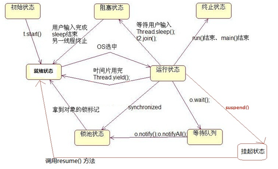

**线程的执行顺序：**

操作程序运行过程中，每个线程都会希望获得CPU的控制权，那么它们执行的先后顺序要怎么排列呢？怎么保证同级别的线程中JVM不会“厚此薄彼”呢？又怎么保证重要的线程能获得更多的执行时间呢？

这其中有很多种已经比较成熟调度线程的算法：例如先来先服务和短作业优先算法，高优先权调度算法，时间片轮转调度算法。

这里以JVM为例介绍一种控制线程的方法：**高优先权调度算法。**

先来熟悉一个概念：**线程队列**

JVM会把一个程序中所有的线程按照启动顺序先后分配内存，并且创建线程控制模块（参看文章开头），然后会给每一个线程创建一个引用（其作用类似于指针），并存入一个设置好的队列（一种数据结构，特点是先入先出。可参看《数据结构与算法》），于是乎所有的线程都会有序的去排队等待获得CPU的运行时间片（如果没有特殊设置，每个线程获得的时间片是相等的）。如果一个线程在自己拥有的时间片中完成（即run()方法执行结束。线程死亡）则撤出JVM，同时释放线程控制模块；如果没有完成，则这个线程会被从新放入队列的尾部，等待再次被调用。

**高优先权调度算法**就是基于这种“排队，平均分配”的思想来调度线程的，但是为了保证短作业可以优先完成，重要作业可以优先被执行的实际需要。

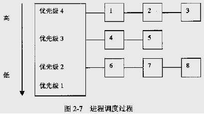

## 	线程安全

### 		定义

​		当多个线程访问某个类时，不管运行时环境采用何种调度方式或者这些线程将如何交替运行，并且在主调试代码中不需要任何额外的同步或者协同，这个类都能表现出正确的行为，则称这个类时线程安全的。线程安全类中封装了必要的同步机制，因此客户端无须进一步采取同步措施。

​		线程安全产生的原因：正确性取决于多个线程的交替执行时序，产生了竞态条件。

### 		原子类

​		 应尽量使用原子类（使用volatile+cas实现），这样会让你分析线程安全时更加方便，但需要注意的是用线程安全类构建的类并不能保证线程安全。例如，一个AtomicInteger get() 和 AtomicInteger set() 是线程安全的，在一个类的一个方法 f()中同时用到了这两个方法，此时的f()就是线程不安全的，因为你不能保证这个复合操作中的get 和 set同时更新。 

​		①**原子性**

​		一个操作不能被再拆分了；即一个操作或者多个操作 要么全部执行并且执行的过程不会被任何因素打断，要么就都不执行。一个很经典的例子就是银行账户转账问题。 
增量操作符++，不是原子的操作，它是先读取旧值，然后写回新值，包含2个操作

​		②**可见性**

​		可见性是指当多个线程访问同一个变量时，一个线程修改了这个变量的值，其他线程能够立即看得到修改的值。

​		③**有序性**

​		即程序执行的顺序按照代码的先后顺序执行。但是指令重排序会影响到线程并发执行的正确性 。

## 	解决机制

### 		加锁

​		①锁能使其保护的代码以串行的形式来访问，当给一个复合操作加锁后，能使其成为原子操作。一种错误的思想是只要对写数据的方法加锁，其实这是错的，对数据进行操作的所有方法都需加锁，不管是读还是写。

​		②加锁时需要考虑性能问题，不能总是一味地给整个方法加锁synchronized就了事了，应该将方法中不影响共享状态且执行时间比较长的代码分离出去。

​		③加锁的含义不仅仅局限于互斥，还包括可见性。为了确保所有线程都能看见最新值，读操作和写操作必须使用同样的锁对象。

### 		不共享状态

​		①无状态对象： 无状态对象一定是线程安全的，因为不会影响到其他线程。

​		②线程关闭： 仅在单线程环境下使用。

### 		不可变对象

​		可以使用final修饰的对象保证线程安全，由于final修饰的引用型变量(除String外)不可变是指引用不可变，但其指向的对象是可变的，所以此类必须安全发布，也即不能对外提供可以修改final对象的接口。

## 锁分类

### 	公平锁/非公平锁

​		公平锁是指多个线程按照申请锁的顺序来获取锁。 非公平锁是指多个线程获取锁的顺序并不是按照申请锁的顺序，有可能后申请的线程比先申请的线程优先获取锁。有可能，会造成优先级反转或者饥饿现象。 对于Java `ReentrantLock`而言，通过构造函数指定该锁是否是公平锁，默认是非公平锁。非公平锁的优点在于吞吐量比公平锁大。 对于`Synchronized`而言，也是一种非公平锁。由于其并不像`ReentrantLock`是通过AQS的来实现线程调度，所以并没有任何办法使其变成公平锁。 

### 	可重入锁

​		可重入锁又名递归锁，是指在同一个线程在外层方法获取锁的时候，在进入内层方法会自动获取锁。说的有点抽象，下面会有一个代码的示例。 对于Java `ReentrantLock`而言, 他的名字就可以看出是一个可重入锁，其名字是`Re entrant Lock`重新进入锁。 对于`Synchronized`而言,也是一个可重入锁。可重入锁的一个好处是可一定程度避免死锁。 

```
synchronized void setA() throws Exception{
    Thread.sleep(1000);
    setB();
}

synchronized void setB() throws Exception{
    Thread.sleep(1000);
}
```

上面的代码就是一个可重入锁的一个特点，如果不是可重入锁的话，setB可能不会被当前线程执行，可能造成死锁。 

​	Lock与Synchronized区别：

​	①Lock不是Java语言内置的，synchronized是Java语言的关键字，因此是内置特性。Lock是一个类，通过这个类可以实现同步访问；

　　②Lock和synchronized有一点非常大的不同，采用synchronized不需要用户去手动释放锁，当synchronized方法或者synchronized代码块执行完之后，系统会自动让线程释放对锁的占用；而Lock则必须要用户去手动释放锁，如果没有主动释放锁，就有可能导致出现死锁现象。

### 	独享锁/共享锁

​	独享锁是指该锁一次只能被一个线程所持有。共享锁是指该锁可被多个线程所持有。对于Java `ReentrantLock`而言，其是独享锁。但是对于Lock的另一个实现类`ReadWriteLock`，其读锁是共享锁，其写锁是独享锁。读锁的共享锁可保证并发读是非常高效的，读写，写读 ，写写的过程是互斥的。独享锁与共享锁也是通过AQS来实现的，通过实现不同的方法，来实现独享或者共享。对于`Synchronized`而言，当然是独享锁。

### 	互斥锁/读写锁

​	上面讲的独享锁/共享锁就是一种广义的说法，互斥锁/读写锁就是具体的实现。 互斥锁在Java中的具体实现就是`ReentrantLock` 。读写锁在Java中的具体实现就是`ReadWriteLock` 。

### 	乐观锁/悲观锁

​	乐观锁与悲观锁不是指具体的什么类型的锁，而是指看待并发同步的角度。
悲观锁认为对于同一个数据的并发操作，一定是会发生修改的，哪怕没有修改，也会认为修改。因此对于同一个数据的并发操作，悲观锁采取加锁的形式。悲观的认为，不加锁的并发操作一定会出问题。
乐观锁则认为对于同一个数据的并发操作，是不会发生修改的。在更新数据的时候，会采用尝试更新，不断重试的方式更新数据。乐观的认为，不加锁的并发操作是没有事情的。从上面的描述我们可以看出，悲观锁适合写操作非常多的场景，乐观锁适合读操作非常多的场景，不加锁会带来大量的性能提升。悲观锁在Java中的使用，就是利用各种锁。乐观锁在Java中的使用，是无锁编程，常常采用的是CAS算法，典型的例子就是原子类，通过CAS自旋实现原子操作的更新。

### 	分段锁

​	分段锁其实是一种锁的设计，并不是具体的一种锁，对于`ConcurrentHashMap`而言，其并发的实现就是通过分段锁的形式来实现高效的并发操作。 我们以`ConcurrentHashMap`来说一下分段锁的含义以及设计思想，`ConcurrentHashMap`中的分段锁称为Segment，它即类似于HashMap（JDK7与JDK8中HashMap的实现）的结构，即内部拥有一个Entry数组，数组中的每个元素又是一个链表；同时又是一个ReentrantLock（Segment继承了ReentrantLock)。 当需要put元素的时候，并不是对整个hashmap进行加锁，而是先通过hashcode来知道他要放在那一个分段中，然后对这个分段进行加锁，所以当多线程put的时候，只要不是放在一个分段中，就实现了真正的并行的插入。 但是，在统计size的时候，可就是获取hashmap全局信息的时候，就需要获取所有的分段锁才能统计。 分段锁的设计目的是细化锁的粒度，当操作不需要更新整个数组的时候，就仅仅针对数组中的一项进行加锁操作。 

### 	偏向锁/轻量级锁/重量级锁

​	这三种锁是指锁的状态，并且是针对`Synchronized`。在Java 5通过引入锁升级的机制来实现高效`Synchronized`。这三种锁的状态是通过对象监视器在对象头中的字段来表明的。 偏向锁是指一段同步代码一直被一个线程所访问，那么该线程会自动获取锁。降低获取锁的代价。 轻量级锁是指当锁是偏向锁的时候，被另一个线程所访问，偏向锁就会升级为轻量级锁，其他线程会通过自旋的形式尝试获取锁，不会阻塞，提高性能。 重量级锁是指当锁为轻量级锁的时候，另一个线程虽然是自旋，但自旋不会一直持续下去，当自旋一定次数的时候，还没有获取到锁，就会进入阻塞，该锁膨胀为重量级锁。重量级锁会让其他申请的线程进入阻塞，性能降低。 

​	偏向锁在Java 6和Java 7里是默认启用的，但是它在应用程序启动几秒钟之后才激活，如有必要可以使用JVM参数来关闭延迟：**-XX:BiasedLockingStartupDelay=0**。如果你确定应用程序里所有的锁通常情况下处于竞争状态，可以通过JVM参数关闭偏向锁：**-XX:-UseBiasedLocking=false**，那么程序默认会进入轻量级锁状态 

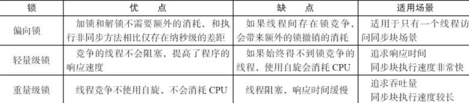

### 	自旋锁

​	在Java中，自旋锁是指尝试获取锁的线程不会立即阻塞，而是采用循环的方式去尝试获取锁，这样的好处是减少线程上下文切换的消耗，缺点是循环会消耗CPU。 

## 内存模型

​	在并发编程中主要需要解决两个问题：**1. 线程之间如何通信；2.线程之间如何完成同步**（这里的线程指的是并发执行的活动实体）。通信是指线程之间以何种机制来交换信息，主要有两种：共享内存和消息传递。 java内存模型是**共享内存的并发模型**，线程之间主要通过读-写共享变量来完成隐式通信。 

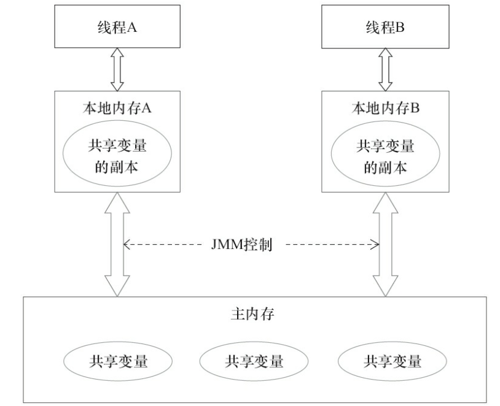

​	我们知道CPU的处理速度和主存的读写速度不是一个量级的，为了平衡这种巨大的差距，每个CPU都会有缓存。因此，共享变量会先放在主存中，每个线程都有属于自己的工作内存，并且会把位于主存中的共享变量拷贝到自己的工作内存，之后的读写操作均使用位于工作内存的变量副本，并在某个时刻将工作内存的变量副本写回到主存中去。JMM就从抽象层次定义了这种方式，并且JMM决定了一个线程对共享变量的写入何时对其他线程是可见的。 

### 	重排序

​	一个好的内存模型实际上会放松对处理器和编译器规则的束缚，也就是说软件技术和硬件技术都为同一个目标而进行奋斗：在不改变程序执行结果的前提下，尽可能提高并行度。JMM对底层尽量减少约束，使其能够发挥自身优势。因此，在执行程序时，**为了提高性能，编译器和处理器常常会对指令进行重排序**。一般重排序可以分为如下三种： 

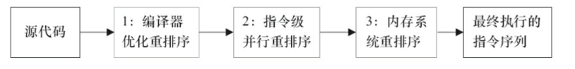

​	①编译器优化的重排序。编译器在不改变单线程程序语义的前提下，可以重新安排语句的执行顺序；

​	②指令级并行的重排序。现代处理器采用了指令级并行技术来将多条指令重叠执行。如果**不存在数据依赖性**，处理器可以改变语句对应机器指令的执行顺序；

​	③内存系统的重排序。由于处理器使用缓存和读/写缓冲区，这使得加载和存储操作看上去可能是在乱序执行的。

​	①属于编译器重排序，而②和③统称为处理器重排序。这些重排序会导致线程安全的问题，一个很经典的例子就是DCL问题，这个在以后的文章中会具体去聊。**针对编译器重排序**，JMM的编译器重排序规则会禁止一些**特定类型的编译器重排序**；**针对处理器重排序**，编译器在生成指令序列的时候会通过**插入内存屏障指令来禁止某些特殊的处理器重排序**。 

### 	happens-before规则

​	①程序顺序规则：一个线程中的每个操作，happens-before于该线程中的任意后续操作。

​	②监视器锁规则：对一个锁的解锁，happens-before于随后对这个锁的加锁。

​	③volatile变量规则：对一个volatile域的写，happens-before于任意后续对这个volatile域的读。

​	④传递性：如果A happens-before B，且B happens-before C，那么A happens-before C。

​	⑤start()规则：如果线程A执行操作ThreadB.start()（启动线程B），那么A线程的ThreadB.start()操作happens-before于线程B中的任意操作。

​	⑥join()规则：如果线程A执行操作ThreadB.join()并成功返回，那么线程B中的任意操作happens-before于线程A从ThreadB.join()操作成功返回。

​	⑦程序中断规则：对线程interrupted()方法的调用先行于被中断线程的代码检测到中断时间的发生。

​	⑧对象finalize规则：一个对象的初始化完成（构造函数执行结束）先行于发生它的finalize()方法的开始。

## 关键字

### 	synchronized

​		synchronized可以用在**方法**上也可以使用在**代码块**中，其中方法是实例方法和静态方法分别锁的是该类的实例对象和该类的对象。而使用在代码块中也可以分为三种，具体的可以看下面的表格。这里的需要注意的是：**如果锁的是类对象的话，尽管new多个实例对象，但他们仍然是属于同一个类依然会被锁住，即线程之间保证同步关系**。 

​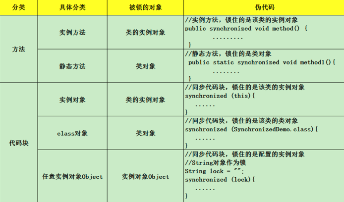

​	编译之后，切换到SynchronizedDemo.class的同级目录之后，然后用**javap -v SynchronizedDemo.class**查看字节码文件： 

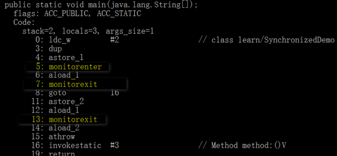	

​	执行同步代码块后首先要先执行**monitorenter**指令，退出的时候**monitorexit**指令。通过分析之后可以看出，使用Synchronized进行同步，其关键就是必须要对对象的监视器monitor进行获取，当线程获取monitor后才能继续往下执行，否则就只能等待。而这个获取的过程是**互斥**的，即同一时刻只有一个线程能够获取到monitor。上面的demo中在执行完同步代码块之后紧接着再会去执行一个静态同步方法，而这个方法锁的对象依然就这个类对象，那么这个正在执行的线程还需要获取该锁吗？答案是不必的，从上图中就可以看出来，执行静态同步方法的时候就只有一条monitorexit指令，并没有monitorenter获取锁的指令。这就是**锁的重入性**，即在同一锁程中，线程不需要再次获取同一把锁。Synchronized先天具有重入性。**每个对象拥有一个计数器，当线程获取该对象锁后，计数器就会加一，释放锁后就会将计数器减一**。 

​	Synchronized通过CAS优化。使用锁时，线程获取锁是一种**悲观锁策略**，即假设每一次执行临界区代码都会产生冲突，所以当前线程获取到锁的时候同时也会阻塞其他线程获取该锁。而CAS操作（又称为无锁操作）是一种**乐观锁策略**，它假设所有线程访问共享资源的时候不会出现冲突，既然不会出现冲突自然而然就不会阻塞其他线程的操作。因此，线程就不会出现阻塞停顿的状态。那么，如果出现冲突了怎么办？无锁操作是使用**CAS(compare and swap)**又叫做比较交换来鉴别线程是否出现冲突，出现冲突就重试当前操作直到没有冲突为止。 

​	CAS比较交换的过程可以通俗的理解为CAS(V,O,N)，包含三个值分别为：**V 内存地址存放的实际值；O 预期的值（旧值）；N 更新的新值**。当V和O相同时，也就是说旧值和内存中实际的值相同表明该值没有被其他线程更改过，即该旧值O就是目前来说最新的值了，自然而然可以将新值N赋值给V。反之，V和O不相同，表明该值已经被其他线程改过了则该旧值O不是最新版本的值了，所以不能将新值N赋给V，返回V即可。当多个线程使用CAS操作一个变量是，只有一个线程会成功，并成功更新，其余会失败。失败的线程会重新尝试，当然也可以选择挂起线程。CAS的实现需要硬件指令集的支撑，在JDK1.5后虚拟机才可以使用处理器提供的**CMPXCHG**指令实现。

​	CAS的问题：

​	①ABA问题

​	因为CAS会检查旧值有没有变化，这里存在这样一个有意思的问题。比如一个旧值A变为了成B，然后再变成A，刚好在做CAS时检查发现旧值并没有变化依然为A，但是实际上的确发生了变化。解决方案可以沿袭数据库中常用的乐观锁方式，添加一个版本号可以解决。原来的变化路径A->B->A就变成了1A->2B->3C。java这么优秀的语言，当然在java 1.5后的atomic包中提供了AtomicStampedReference来解决ABA问题，解决思路就是这样的。 

​	②自旋时间过长

​	使用CAS时非阻塞同步，也就是说不会将线程挂起，会自旋（无非就是一个死循环）进行下一次尝试，如果这里自旋时间过长对性能是很大的消耗。如果JVM能支持处理器提供的pause指令，那么在效率上会有一定的提升。 

​	③只能保证一个共享变量的原子操作

​	当对一个共享变量执行操作时CAS能保证其原子性，如果对多个共享变量进行操作,CAS就不能保证其原子性。有一个解决方案是利用对象整合多个共享变量，即一个类中的成员变量就是这几个共享变量。然后将这个对象做CAS操作就可以保证其原子性。atomic中提供了AtomicReference来保证引用对象之间的原子性。 

### 	volatile

**被volatile修饰的变量能够保证每个线程能够获取该变量的最新值，从而避免出现数据脏读的现象。** 在生成汇编代码时会在volatile修饰的共享变量进行写操作的时候会多出**Lock前缀的指令**（具体的大家可以使用一些工具去看一下，这里我就只把结果说出来）。我们想这个**Lock**指令肯定有神奇的地方，那么Lock前缀的指令在多核处理器下会发现什么事情了？主要有这两个方面的影响：将当前处理器缓存行的数据写回系统内存；这个写回内存的操作会使得其他CPU里缓存了该内存地址的数据无效。

​	volatile变量自身具有下列特性：

​	①可见性。对一个volatile变量的读，总是能看到（任意线程）对这个volatile变量最后的写入。

​	②原子性：对任意单个volatile变量的读/写具有原子性，即使是64位的long型和double型变量，只要它是volatile变量，对该变量的读/写就具有原子性。如果是多个volatile操作或类似于volatile++这种复合操作，这些操作整体上不具有原子性。

volatile写和volatile读的内存语义

- 线程A写一个volatile变量，实质上是线程A向接下来将要读这个volatile变量的某个线程发出了（其对共享变量所做修改的）消息。
- 线程B读一个volatile变量，实质上是线程B接收了之前某个线程发出的（在写这个volatile变量之前对共享变量所做修改的）消息。
- 线程A写一个volatile变量，随后线程B读这个volatile变量，这个过程实质上是线程A通过主内存向线程B发送消息。

为了实现volatile的内存语义，编译器在生成字节码时，会在指令序列中插入内存屏障来禁止特定类型的处理器重排序。对于编译器来说，发现一个最优布置来最小化插入屏障的总数几乎不可能。为此，JMM采取保守策略。下面是基于保守策略的JMM内存屏障插入策略。

- 在每个volatile写操作的前面插入一个StoreStore屏障。
- 在每个volatile写操作的后面插入一个StoreLoad屏障。
- 在每个volatile读操作的后面插入一个LoadLoad屏障。
- 在每个volatile读操作的后面插入一个LoadStore屏障。


### 	final

​	final可以修饰**变量，方法和类**，用于表示所修饰的内容一旦赋值之后就不会再被改变，比如String类就是一个final类型的类。

​	 写final域的重排序规则**禁止对final域的写重排序到构造函数之外**，这个规则的实现主要包含了两个方面：JMM禁止编译器把final域的写重排序到构造函数之外；编译器会在final域写之后，构造函数return之前，插入一个storestore屏障。这个屏障可以禁止处理器把final域的写重排序到构造函数之外。写final域的重排序规则可以确保：**在对象引用为任意线程可见之前，对象的final域已经被正确初始化过了，而普通域就不具有这个保障**。 

​	读final域重排序规则为：**在一个线程中，初次读对象引用和初次读该对象包含的final域，JMM会禁止这两个操作的重排序。**（注意，这个规则仅仅是针对处理器），处理器会在读final域操作的前面插入一个LoadLoad屏障。实际上，读对象的引用和读该对象的final域存在间接依赖性，一般处理器不会重排序这两个操作。但是有一些处理器会重排序，因此，这条禁止重排序规则就是针对这些处理器而设定的。 

​	针对引用数据类型，final域写针对编译器和处理器重排序**增加了这样的约束**：在构造函数内对**一个final修饰的对象的成员域的写入，与随后在构造函数之外把这个被构造的对象的引用赋给一个引用变量**，这两个操作是不能被重排序的。注意这里的是“增加”也就说前面对final基本数据类型的重排序规则在这里还是使用。 

## AQS

​	锁是用来控制多个线程访问共享资源的方式，一般来说，一个锁能够防止多个线程同时访问共享资源。在Lock接口出现之前，java程序主要是靠synchronized关键字实现锁功能的，而java SE5之后，并发包中增加了lock接口，它提供了与synchronized一样的锁功能。虽然它失去了像synchronize关键字隐式加锁解锁的便捷性，但是却拥有了锁获取和释放的可操作性，可中断的获取锁以及超时获取锁等多种synchronized关键字所不具备的同步特性。 

​**基本上所有的方法的实现实际上都是调用了其静态内存类Sync中的方法，而Sync类继承了AbstractQueuedSynchronizer（AQS）**。可以看出要想理解ReentrantLock关键核心在于对队列同步器AbstractQueuedSynchronizer（简称同步器）的理解。 

​	同步器是用来构建锁和其他同步组件的基础框架，它的实现主要依赖一个int成员变量来表示同步状态以及通过一个FIFO队列构成等待队列。它的**子类必须重写AQS的几个protected修饰的用来改变同步状态的方法**，其他方法主要是实现了排队和阻塞机制。**状态的更新使用getState,setState以及compareAndSetState这三个方法**。 

- 同步组件（这里不仅仅值锁，还包括CountDownLatch等）的实现依赖于同步器AQS，在同步组件实现中，使用AQS的方式被推荐定义继承AQS的静态内存类；
- AQS采用模板方法进行设计，AQS的protected修饰的方法需要由继承AQS的子类进行重写实现，当调用AQS的子类的方法时就会调用被重写的方法；
- AQS负责同步状态的管理，线程的排队，等待和唤醒这些底层操作，而Lock等同步组件主要专注于实现同步语义；
- 在重写AQS的方式时，使用AQS提供的`getState(),setState(),compareAndSetState()`方法进行修改同步状态

		子类被**推荐定义为自定义同步组件的静态内部类**，同步器自身没有实现任何同步接口，它仅仅是定义了若干同步状态的获取和释放方法来供自定义同步组件的使用，同步器既支持独占式获取同步状态，也可以支持共享式获取同步状态，这样就可以方便的实现不同类型的同步组件。同步器是实现锁（也可以是任意同步组件）的关键，在锁的实现中聚合同步器，利用同步器实现锁的语义。可以这样理解二者的关系：**锁是面向使用者，它定义了使用者与锁交互的接口，隐藏了实现细节；同步器是面向锁的实现者，它简化了锁的实现方式，屏蔽了同步状态的管理，线程的排队，等待和唤醒等底层操作**。锁和同步器很好的隔离了使用者和实现者所需关注的领域。

		AQS实际上通过头尾指针来管理同步队列，同时实现包括获取锁失败的线程进行入队，释放锁时对同步队列中的线程进行通知等核心方法。其示意图如下： 

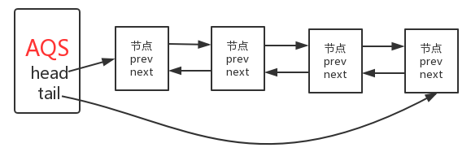

- **节点的数据结构，即AQS的静态内部类Node,节点的等待状态等信息**；
- **同步队列是一个双向队列，AQS通过持有头尾指针管理同步队列**；

```
class Mutex implements Lock, java.io.Serializable {
    // Our internal helper class
    // 继承AQS的静态内存类
    // 重写方法
    private static class Sync extends AbstractQueuedSynchronizer {
        // Reports whether in locked state
        protected boolean isHeldExclusively() {
            return getState() == 1;
        }

        // Acquires the lock if state is zero
        public boolean tryAcquire(int acquires) {
            assert acquires == 1; // Otherwise unused
            if (compareAndSetState(0, 1)) {
                setExclusiveOwnerThread(Thread.currentThread());
                return true;
            }
            return false;
        }

        // Releases the lock by setting state to zero
        protected boolean tryRelease(int releases) {
            assert releases == 1; // Otherwise unused
            if (getState() == 0) throw new IllegalMonitorStateException();
            setExclusiveOwnerThread(null);
            setState(0);
            return true;
        }

        // Provides a Condition
        Condition newCondition() {
            return new ConditionObject();
        }

        // Deserializes properly
        private void readObject(ObjectInputStream s)
                throws IOException, ClassNotFoundException {
            s.defaultReadObject();
            setState(0); // reset to unlocked state
        }
    }

    // The sync object does all the hard work. We just forward to it.
    private final Sync sync = new Sync();
    //使用同步器的模板方法实现自己的同步语义
    public void lock() {
        sync.acquire(1);
    }

    public boolean tryLock() {
        return sync.tryAcquire(1);
    }

    public void unlock() {
        sync.release(1);
    }

    public Condition newCondition() {
        return sync.newCondition();
    }

    public boolean isLocked() {
        return sync.isHeldExclusively();
    }

    public boolean hasQueuedThreads() {
        return sync.hasQueuedThreads();
    }

    public void lockInterruptibly() throws InterruptedException {
        sync.acquireInterruptibly(1);
    }

    public boolean tryLock(long timeout, TimeUnit unit)
            throws InterruptedException {
        return sync.tryAcquireNanos(1, unit.toNanos(timeout));
    }
}
MutexDemo：

public class MutextDemo {
    private static Mutex mutex = new Mutex();

    public static void main(String[] args) {
        for (int i = 0; i < 10; i++) {
            Thread thread = new Thread(() -> {
                mutex.lock();
                try {
                    Thread.sleep(3000);
                } catch (InterruptedException e) {
                    e.printStackTrace();
                } finally {
                    mutex.unlock();
                }
            });
            thread.start();
        }
    }
}
```

## 并发容器

### 	ConcurrentHashmap

​	ConcurrentHashMap 和 HashMap 思路是差不多的，但是因为它支持并发操作，所以要复杂一些。整个 ConcurrentHashMap 由一个个 Segment 组成，Segment 代表”部分“或”一段“的意思，所以很多地方都会将其描述为分段锁。注意，行文中，我很多地方用了“槽”来代表一个 segment。简单理解就是，ConcurrentHashMap 是一个 Segment 数组，Segment 通过继承 ReentrantLock 来进行加锁，所以每次需要加锁的操作锁住的是一个 segment，这样只要保证每个 Segment 是线程安全的，也就实现了全局的线程安全。

​	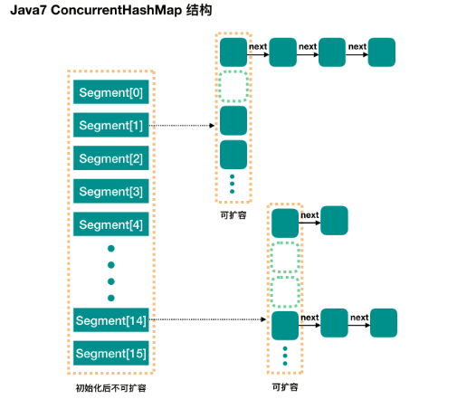

​	Java7 中实现的 ConcurrentHashMap 说实话还是比较复杂的，Java8 对 ConcurrentHashMap 进行了比较大的改动。建议读者可以参考 Java8 中 HashMap 相对于 Java7 HashMap 的改动，对于 ConcurrentHashMap，Java8 也引入了红黑树。 

​	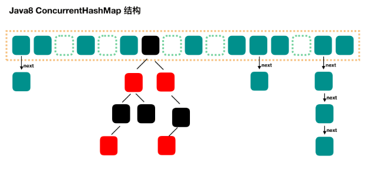

```
final V putVal(K key, V value, boolean onlyIfAbsent) {
    if (key == null || value == null) throw new NullPointerException();
    // 得到 hash 值
    int hash = spread(key.hashCode());
    // 用于记录相应链表的长度
    int binCount = 0;
    for (Node<K,V>[] tab = table;;) {
        Node<K,V> f; int n, i, fh;
        // 如果数组"空"，进行数组初始化
        if (tab == null || (n = tab.length) == 0)
            // 初始化数组，后面会详细介绍
            tab = initTable();
 
        // 找该 hash 值对应的数组下标，得到第一个节点 f
        else if ((f = tabAt(tab, i = (n - 1) & hash)) == null) {
            // 如果数组该位置为空，
            //    用一次 CAS 操作将这个新值放入其中即可，这个 put 操作差不多就结束了，可以拉到最后面了
            //          如果 CAS 失败，那就是有并发操作，进到下一个循环就好了
            if (casTabAt(tab, i, null,
                         new Node<K,V>(hash, key, value, null)))
                break;                   // no lock when adding to empty bin
        }
        // hash 居然可以等于 MOVED，这个需要到后面才能看明白，不过从名字上也能猜到，肯定是因为在扩容
        else if ((fh = f.hash) == MOVED)
            // 帮助数据迁移，这个等到看完数据迁移部分的介绍后，再理解这个就很简单了
            tab = helpTransfer(tab, f);
 
        else { // 到这里就是说，f 是该位置的头结点，而且不为空
 
            V oldVal = null;
            // 获取数组该位置的头结点的监视器锁
            synchronized (f) {
                if (tabAt(tab, i) == f) {
                    if (fh >= 0) { // 头结点的 hash 值大于 0，说明是链表
                        // 用于累加，记录链表的长度
                        binCount = 1;
                        // 遍历链表
                        for (Node<K,V> e = f;; ++binCount) {
                            K ek;
                            // 如果发现了"相等"的 key，判断是否要进行值覆盖，然后也就可以 break 了
                            if (e.hash == hash &&
                                ((ek = e.key) == key ||
                                 (ek != null && key.equals(ek)))) {
                                oldVal = e.val;
                                if (!onlyIfAbsent)
                                    e.val = value;
                                break;
                            }
                            // 到了链表的最末端，将这个新值放到链表的最后面
                            Node<K,V> pred = e;
                            if ((e = e.next) == null) {
                                pred.next = new Node<K,V>(hash, key,
                                                          value, null);
                                break;
                            }
                        }
                    }
                    else if (f instanceof TreeBin) { // 红黑树
                        Node<K,V> p;
                        binCount = 2;
                        // 调用红黑树的插值方法插入新节点
                        if ((p = ((TreeBin<K,V>)f).putTreeVal(hash, key,
                                                       value)) != null) {
                            oldVal = p.val;
                            if (!onlyIfAbsent)
                                p.val = value;
                        }
                    }
                }
            }
            // binCount != 0 说明上面在做链表操作
            if (binCount != 0) {
                // 判断是否要将链表转换为红黑树，临界值和 HashMap 一样，也是 8
                if (binCount >= TREEIFY_THRESHOLD)
                    // 这个方法和 HashMap 中稍微有一点点不同，那就是它不是一定会进行红黑树转换，
                    // 如果当前数组的长度小于 64，那么会选择进行数组扩容，而不是转换为红黑树
                    //    具体源码我们就不看了，扩容部分后面说
                    treeifyBin(tab, i);
                if (oldVal != null)
                    return oldVal;
                break;
            }
        }
    }
    // 
    addCount(1L, binCount);
    return null;
}
```

​	数据迁移：transfer。虽然我们之前说的 tryPresize 方法中多次调用 transfer 不涉及多线程，但是这个 transfer 方法可以在其他地方被调用，典型地，我们之前在说 put 方法的时候就说过了，请往上看 put 方法，是不是有个地方调用了 helpTransfer 方法，helpTransfer 方法会调用 transfer 方法的。此方法支持多线程执行，外围调用此方法的时候，会保证第一个发起数据迁移的线程，nextTab 参数为 null，之后再调用此方法的时候，nextTab 不会为 null。transfer 这个方法并没有实现所有的迁移任务，每次调用这个方法只实现了 transferIndex 往前 stride 个位置的迁移工作，其他的需要由外围来控制。 

### 	ConcurrentLinkedQueue

​	ConcurrentLinkedQueue是一个基于链接节点的无界线程安全队列，它采用先进先出的规则对节点进行排序，当我们添加一个元素的时候，它会添加到队列的尾部，当我们获取一个元素时，它会返回队列头部的元素。 

```
public boolean offer(E e) {
    checkNotNull(e);
    // 新建一个node
    final Node<E> newNode = new Node<E>(e);
    
    // 不断重试（for只有初始化条件，没有判断条件），直到将node加入队列
    // 初始化p、t都是指向tail
    // 循环过程中一直让p指向最后一个节点。让t指向tail
    for (Node<E> t = tail, p = t;;) {
        // q一直指向p的下一个
        Node<E> q = p.next;
        if (q == null) {
            // p is last node
            // 如果q为null表示p是最后一个元素，尝试加入队列
            // 如果失败，表示其他线程已经修改了p指向的节点
            if (p.casNext(null, newNode)) {
                // Successful CAS is the linearization point
                // for e to become an element of this queue,
                // and for newNode to become "live".
                // node加入队列之后，tail距离最后一个节点已经相差大于一个了，需要更新tail
                if (p != t) // hop two nodes at a time
                    // 这儿允许设置tail为最新节点的时候失败，因为添加node的时候是根据p.next是不是为null判断的，
                    casTail(t, newNode);  // Failure is OK.
                return true;
            }
            // Lost CAS race to another thread; re-read next
        }
        else if (p == q)
            // 虽然q是p.next，但是因为是多线程，在offer的同时也在poll，如offer的时候正好p被poll了，那么在poll方法中的updateHead方法会将head指向当前的q，而把p.next指向自己，即：p.next == p
            // 这个时候就会造成tail在head的前面，需要重新设置p
            // 如果tail已经改变，将p指向tail，但这个时候tail依然可能在head前面
            // 如果tail没有改变，直接将p指向head
            // We have fallen off list.  If tail is unchanged, it
            // will also be off-list, in which case we need to
            // jump to head, from which all live nodes are always
            // reachable.  Else the new tail is a better bet.
            p = (t != (t = tail)) ? t : head;
        else
            // Check for tail updates after two hops.
            // tail已经不是最后一个节点，将p指向最后一个节点
            p = (p != t && t != (t = tail)) ? t : q;
    }
}

public E poll() {
    // 如果出现p被删除的情况需要从head重新开始
    restartFromHead:
    for (;;) {
        for (Node<E> h = head, p = h, q;;) {
            E item = p.item;

            if (item != null && p.casItem(item, null)) {
                // Successful CAS is the linearization point
                // for item to be removed from this queue.
                if (p != h) // hop two nodes at a time
                    updateHead(h, ((q = p.next) != null) ? q : p);
                return item;
            }
            else if ((q = p.next) == null) {
                // 队列为空
                updateHead(h, p);
                return null;
            }
            else if (p == q)
                // 当一个线程在poll的时候，另一个线程已经把当前的p从队列中删除——将p.next = p，p已经被移除不能继续，需要重新开始
                continue restartFromHead;
            else
                p = q;
        }
    }
}

final void updateHead(Node<E> h, Node<E> p) {
    if (h != p && casHead(h, p))
        h.lazySetNext(h);
}
```

### 	ThreadLocal

​	虽然ThreadLocal并不在java.util.concurrent包中而在java.lang包中，但我更倾向于把它当作是一种并发容器（虽然真正存放数据的是ThreadLoclMap）进行归类。从**ThreadLocal这个类名可以顾名思义的进行理解，表示线程的“本地变量”，即每个线程都拥有该变量副本，达到人手一份的效果，各用各的这样就可以避免共享资源的竞争**。 

​	方法的逻辑很清晰，具体请看上面的注释。通过源码我们知道value是存放在了ThreadLocalMap里了，当前先把它理解为一个普普通通的map即可，也就是说，**数据value是真正的存放在了ThreadLocalMap这个容器中了，并且是以当前threadLocal实例为key**。 

​	ThreadLocalMap是threadLocal一个静态内部类，和大多数容器一样内部维护了一个数组，同样的threadLocalMap内部维护了一个Entry类型的table数组。

```
/**
 * The table, resized as necessary.
 * table.length MUST always be a power of two.
 */
private Entry[] table;
```

​	通过注释可以看出，table数组的长度为2的幂次方。接下来看下Entry是什么：

```
static class Entry extends WeakReference<ThreadLocal<?>> {
    /** The value associated with this ThreadLocal. */
    Object value;

    Entry(ThreadLocal<?> k, Object v) {
        super(k);
        value = v;
    }
}
```

​	Entry是一个以ThreadLocal为key,Object为value的键值对，另外需要注意的是这里的**threadLocal是弱引用，因为Entry继承了WeakReference，在Entry的构造方法中，调用了super(k)方法就会将threadLocal实例包装成一个WeakReferenece。

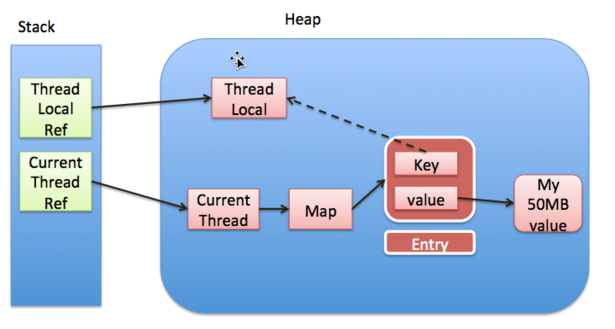

​	注意上图中的实线表示强引用，虚线表示弱引用。如图所示，每个线程实例中可以通过threadLocals获取到threadLocalMap，而threadLocalMap实际上就是一个以threadLocal实例为key，任意对象为value的Entry数组。当我们为threadLocal变量赋值，实际上就是以当前threadLocal实例为key，值为value的Entry往这个threadLocalMap中存放。需要注意的是**Entry中的key是弱引用，当threadLocal外部强引用被置为null(`threadLocalInstance=null`),那么系统 GC 的时候，根据可达性分析，这个threadLocal实例就没有任何一条链路能够引用到它，这个ThreadLocal势必会被回收，这样一来，ThreadLocalMap中就会出现key为null的Entry，就没有办法访问这些key为null的Entry的value，如果当前线程再迟迟不结束的话，这些key为null的Entry的value就会一直存在一条强引用链：Thread Ref -> Thread -> ThreaLocalMap -> Entry -> value永远无法回收，造成内存泄漏。**当然，如果当前thread运行结束，threadLocal，threadLocalMap,Entry没有引用链可达，在垃圾回收的时候都会被系统进行回收。在实际开发中，会使用线程池去维护线程的创建和复用，比如固定大小的线程池，线程为了复用是不会主动结束的，所以，threadLocal的内存泄漏问题，是应该值得我们思考和注意的问题 。

**ThreadLocal 不是用来解决共享对象的多线程访问问题的**，数据实质上是放在每个thread实例引用的threadLocalMap,也就是说**每个不同的线程都拥有专属于自己的数据容器（threadLocalMap），彼此不影响**。因此threadLocal只适用于 **共享对象会造成线程安全** 的业务场景。 

### 	ArrayBlockingQueue

​	阻塞队列最核心的功能是，能够可阻塞式的插入和删除队列元素。当前队列为空时，会阻塞消费数据的线程，直至队列非空时，通知被阻塞的线程；当队列满时，会阻塞插入数据的线程，直至队列未满时，通知插入数据的线程（生产者线程）。 从源码中可以看出ArrayBlockingQueue内部是采用数组进行数据存储的（`属性items`），为了保证线程安全，采用的是`ReentrantLock lock`，为了保证可阻塞式的插入删除数据利用的是Condition，当获取数据的消费者线程被阻塞时会将该线程放置到notEmpty等待队列中，当插入数据的生产者线程被阻塞时，会将该线程放置到notFull等待队列中。 

```
public void put(E e) throws InterruptedException {
    checkNotNull(e);
    final ReentrantLock lock = this.lock;
    lock.lockInterruptibly();
    try {
		//如果当前队列已满，将线程移入到notFull等待队列中
        while (count == items.length)
            notFull.await();
		//满足插入数据的要求，直接进行入队操作
        enqueue(e);
    } finally {
        lock.unlock();
    }
}

private void enqueue(E x) {
    // assert lock.getHoldCount() == 1;
    // assert items[putIndex] == null;
    final Object[] items = this.items;
	//插入数据
    items[putIndex] = x;
    if (++putIndex == items.length)
        putIndex = 0;
    count++;
	//通知消费者线程，当前队列中有数据可供消费
    notEmpty.signal();
}

public E take() throws InterruptedException {
    final ReentrantLock lock = this.lock;
    lock.lockInterruptibly();
    try {
		//如果队列为空，没有数据，将消费者线程移入等待队列中
        while (count == 0)
            notEmpty.await();
		//获取数据
        return dequeue();
    } finally {
        lock.unlock();
    }
}

private E dequeue() {
    // assert lock.getHoldCount() == 1;
    // assert items[takeIndex] != null;
    final Object[] items = this.items;
    @SuppressWarnings("unchecked")
	//获取数据
    E x = (E) items[takeIndex];
    items[takeIndex] = null;
    if (++takeIndex == items.length)
        takeIndex = 0;
    count--;
    if (itrs != null)
        itrs.elementDequeued();
    //通知被阻塞的生产者线程
	notFull.signal();
    return x;
}
```

​	ArrayBlockingQueue与LinkedBlockingQueue的比较

**相同点**：ArrayBlockingQueue和LinkedBlockingQueue都是通过condition通知机制来实现可阻塞式插入和删除元素，并满足线程安全的特性；

**不同点**：1. ArrayBlockingQueue底层是采用的数组进行实现，而LinkedBlockingQueue则是采用链表数据结构； 2. ArrayBlockingQueue插入和删除数据，只采用了一个lock，而LinkedBlockingQueue则是在插入和删除分别采用了`putLock`和`takeLock`，这样可以降低线程由于线程无法获取到lock而进入WAITING状态的可能性，从而提高了线程并发执行的效率。