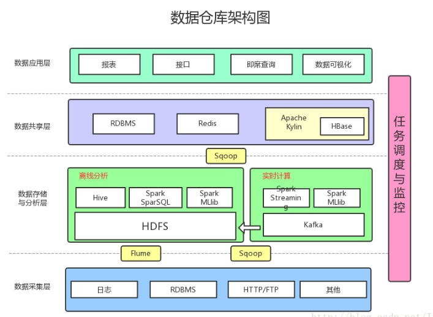
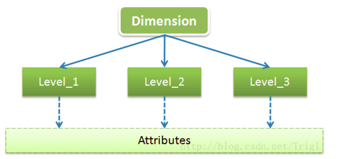
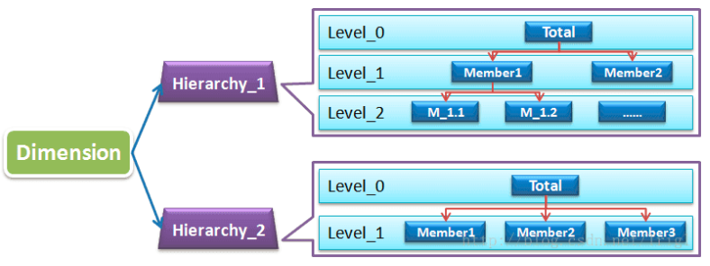
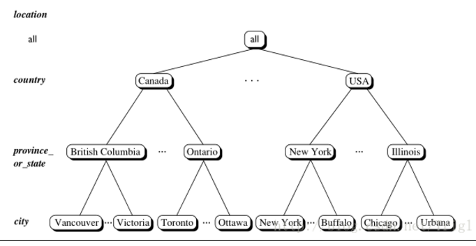
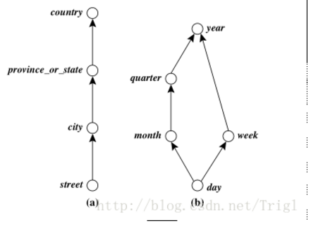
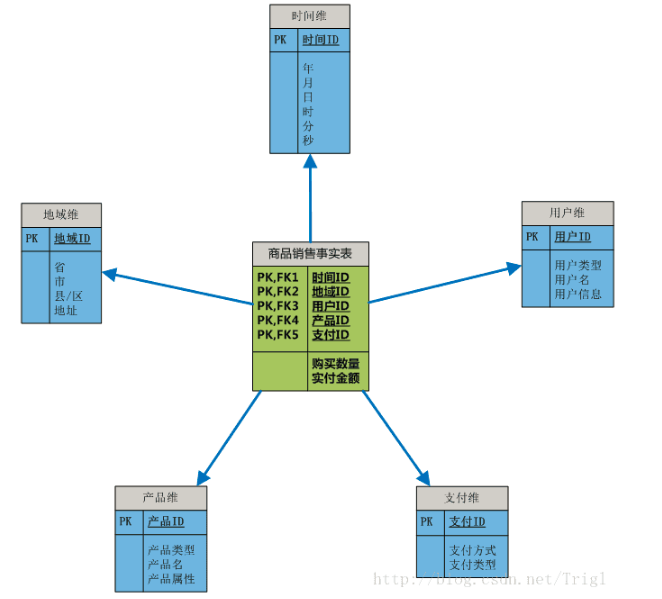
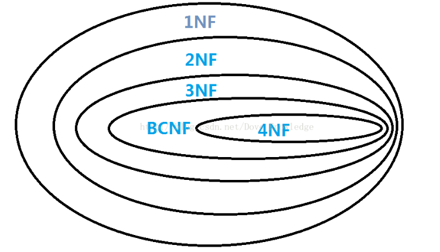

# 数据仓库

## 数据仓库的概念

**官方定义**

数据仓库是一个面向主题的、集成的、随时间变化的、但信息本身相对稳定的数据集合，用于对管理决策过程的支持。

这个定义的确官方，但是却指出了数据仓库的四个特点。

**特点**

面向主题：数据仓库都是基于某个明确主题，仅需要与该主题相关的数据，其他的无关细节数据将被排除掉 
集成的：从不同的数据源采集数据到同一个数据源，此过程会有一些ETL操作 
随时间变化：关键数据隐式或显式的基于时间变化 
信息本身相对稳定：数据装入以后一般只进行查询操作，没有传统数据库的增删改操作

**个人理解**

数据仓库就是整合多个数据源的历史数据进行细粒度的、多维的分析，帮助高层管理者或者业务分析人员做出商业战略决策或商业报表。

## 数据仓库的用途

- 整合公司所有业务数据，建立统一的数据中心
- 产生业务报表，用于作出决策
- 为网站运营提供运营上的数据支持
- 可以作为各个业务的数据源，形成业务数据互相反馈的良性循环
- 分析用户行为数据，通过数据挖掘来降低投入成本，提高投入效果
- 开发数据产品，直接或间接地为公司盈利

## 数据库和数据仓库的区别

| 差异项   | 数据库               | 数据仓库                |
| -------- | -------------------- | ----------------------- |
| 特征     | 操作处理             | 信息处理                |
| 面向     | 事务                 | 分析                    |
| 用户     | DBA、开发            | 经理、主管、分析人员    |
| 功能     | 日常操作             | 长期信息需求、决策支持  |
| DB设计   | 基于ER模型，面向应用 | 星形/雪花模型，面向主题 |
| 数据     | 当前的、最新的       | 历史的、跨时间维护      |
| 汇总     | 原始的、高度详细     | 汇总的、统一的          |
| 视图     | 详细、一般关系       | 汇总的、多维的          |
| 工作单元 | 短的、简单事务       | 复杂查询                |
| 访问     | 读/写                | 大多为读                |
| 关注     | 数据进入             | 信息输出                |
| 操作     | 主键索引操作         | 大量的磁盘扫描          |
| 用户数   | 数百到数亿           | 数百                    |
| DB规模   | GB到TB               | `>=`TB                  |
| 优先     | 高性能、高可用性     | 高灵活性                |
| 度量     | 事务吞吐量           | 查询吞吐量、响应时间    |

## 数据仓库的架构

## 数据仓库多维数据模型的设计

### 基本概念

**主题（Subject）**

主题就是指我们所要分析的具体方面。例如：某年某月某地区某机型某款App的安装情况。主题有两个元素：一是各个分析角度（维度），如时间位置；二是要分析的具体量度，该量度一般通过数值体现，如App安装量。

**维（Dimension）**

维是用于从不同角度描述事物特征的，一般维都会有多层（Level：级别），每个Level都会包含一些共有的或特有的属性（Attribute），可以用下图来展示下维的结构和组成：

以时间维为例，时间维一般会包含年、季、月、日这几个Level，每个Level一般都会有ID、NAME、DESCRIPTION这几个公共属性，这几个公共属性不仅适用于时间维，也同样表现在其它各种不同类型的维。

**分层（Hierarchy）**

OLAP需要基于有层级的自上而下的钻取，或者自下而上地聚合。所以我们一般会在维的基础上再次进行分层，维、分层、层级的关系如下图：

每一级之间可能是附属关系（如市属于省、省属于国家），也可能是顺序关系（如天周年），如下图所示： 

**量度**

量度就是我们要分析的具体的技术指标，诸如年销售额之类。它们一般为数值型数据。我们或者将该数据汇总，或者将该数据取次数、独立次数或取最大最小值等，这样的数据称为量度。

**粒度** 
数据的细分层度，例如按天分按小时分。

**事实表和维表**

事实表是用来记录分析的内容的全量信息的，包含了每个事件的具体要素，以及具体发生的事情。事实表中存储数字型ID以及度量信息。

维表则是对事实表中事件的要素的描述信息，就是你观察该事务的角度，是从哪个角度去观察这个内容的。

事实表和维表通过ID相关联，如图所示：

**星形/雪花形/事实星座**

这三者就是数据仓库多维数据模型建模的模式

上图所示就是一个标准的星形模型。

雪花形就是在维度下面又细分出维度，这样切分是为了使表结构更加规范化。雪花模式可以减少冗余，但是减少的那点空间和事实表的容量相比实在是微不足道，而且多个表联结操作会降低性能，所以一般不用雪花模式设计数据仓库。

事实星座模式就是星形模式的集合，包含星形模式，也就包含多个事实表。

**企业级数据仓库/数据集市**

企业级数据仓库：突出大而全，不论是细致数据和聚合数据它全都有，设计时使用事实星座模式。

数据集市：可以看做是企业级数据仓库的一个子集，它是针对某一方面的数据设计的数据仓库，例如为公司的支付业务设计一个单独的数据集市。由于数据集市没有进行企业级的设计和规划，所以长期来看，它本身的集成将会极其复杂。其数据来源有两种，一种是直接从原生数据源得到，另一种是从企业数据仓库得到。设计时使用星形模型。

## 数据仓库设计步骤

1、确定主题

主题与业务密切相关，所以设计数仓之前应当充分了解业务有哪些方面的需求，据此确定主题

2、确定量度

在确定了主题以后，我们将考虑要分析的技术指标，诸如年销售额之类。量度是要统计的指标，必须事先选 
择恰当，基于不同的量度将直接产生不同的决策结果。

3、确定数据粒度

考虑到量度的聚合程度不同，我们将采用“最小粒度原则”，即将量度的粒度设置到最小。例如如果知道某些数据细分到天就好了，那么设置其粒度到天；但是如果不确定的话，就将粒度设置为最小，即毫秒级别的。

4、确定维度

设计各个维度的主键、层次、层级，尽量减少冗余。

5、创建事实表

事实表中将存在维度代理键和各量度，而不应该存在描述性信息，即符合“瘦高原则”，即要求事实表数据条数尽量多(粒度最小)，而描述性信息尽量少。

## 数据库范式

在设计与操作维护数据库时，最关键的问题就是要确保数据能够正确地分布到数据库的表中。使用正确的数据结构，不仅有助于对数据库进行相应的存取操作，还可以极大地简化应用程序中的其他内容(查询、窗体、报表、代码等)，按照“数据库规范化”对表进行设计，其目的就是减少数据库中的数据冗余，以增加数据的一致性。

泛化时在识别数据库中的一个数据元素、关系以及定义所需的表和各表中的项目这些初始工作之后的一个细化的过程。常见的范式有1NF、2NF、3NF、BCNF以及4NF。

### **1NF(第一范式)**

第一范式是指数据库表中的每一列都是不可分割的基本数据项，同一列中不能有多个值，即实体中的某个属性不能有多个值或者不能有重复的属性。

如果出现重复的属性，就可能需要定义一个新的实体，新的实体由重复的属性构成，新实体与原实体之间为一对多关系。第一范式的模式要求属性值不可再分裂成更小部分，即属性项不能是属性组合或是由一组属性构成。

简而言之，第一范式就是无重复的列。例如，由“职工号”“姓名”“电话号码”组成的表(一个人可能有一部办公电话和一部移动电话)，这时将其规范化为1NF可以将电话号码分为“办公电话”和“移动电话”两个属性，即职工(职工号，姓名，办公电话，移动电话)。

### **2NF(第二范式)**

第二范式(2NF)是在第一范式(1NF)的基础上建立起来的，即满足第二范式(2NF)必须先满足第一范式(1NF)。第二范式(2NF)要求数据库表中的每个实例或行必须可以被唯一地区分。为实现区分通常需要为表加上一个列，以存储各个实例的唯一标识。

如果关系模型R为第一范式，并且R中的每一个非主属性完全函数依赖于R的某个候选键，则称R为第二范式模式(如果A是关系模式R的候选键的一个属性，则称A是R的主属性，否则称A是R的非主属性)。

例如，在选课关系表(学号，课程号，成绩，学分)，关键字为组合关键字(学号，课程号)，但由于非主属性学分仅依赖于课程号，对关键字(学号，课程号)只是部分依赖，而不是完全依赖，因此此种方式会导致数据冗余以及更新异常等问题，解决办法是将其分为两个关系模式：学生表(学号，课程号，分数)和课程表(课程号，学分)，新关系通过学生表中的外关键字课程号联系，在需要时进行连接。

### **3NF(第三范式)**

如果关系模型R是第二范式，且每个非主属性都不传递依赖于R的候选键，则称R是第三范式的模式。

以学生表(学号，姓名，课程号，成绩)为例，其中学生姓名无重名，所以该表有两个候选码(学号，课程号)和(姓名，课程号)，故存在函数依赖：学号——>姓名，(学号，课程号)——>成绩，唯一的非主属性成绩对码不存在部分依赖，也不存在传递依赖，所以属性属于第三范式。

### **BCNF(BC范式)**

它构建在第三范式的基础上，如果关系模型R是第一范式，且每个属性都不传递依赖于R的候选键，那么称R为BCNF的模式。

假设仓库管理关系表(仓库号，存储物品号，管理员号，数量)，满足一个管理员只在一个仓库工作；一个仓库可以存储多种物品，则存在如下关系：

(仓库号，存储物品号)——>(管理员号，数量)

(管理员号，存储物品号)——>(仓库号，数量)

所以，(仓库号，存储物品号)和(管理员号，存储物品号)都是仓库管理关系表的候选码，表中唯一非关键字段为数量，它是符合第三范式的。但是，由于存在如下决定关系：

(仓库号)——>(管理员号)

(管理员号)——>(仓库号)

即存在关键字段决定关键字段的情况，因此其不符合BCNF。把仓库管理关系表分解为两个关系表仓库管理表(仓库号，管理员号)和仓库表(仓库号，存储物品号，数量)，这样这个数据库表是符合BCNF的，并消除了删除异常、插入异常和更新异常。

### **4NF(第四范式)**

设R是一个关系模型，D是R上的多值依赖集合。如果D中存在凡多值依赖X->Y时，X必是R的超键，那么称R是第四范式的模式。

例如，职工表(职工编号，职工孩子姓名，职工选修课程)，在这个表中，同一个职工可能会有多个职工孩子姓名，同样，同一个职工也可能会有多个职工选修课程，即这里存在着多值事实，不符合第四范式。如果要符合第四范式，只需要将上表分为两个表，使它们只有一个多值事实，例如职工表一(职工编号，职工孩子姓名)，职工表二(职工编号，职工选修课程)，两个表都只有一个多值事实，所以符合第四范式。

范式只是一般设计数据库的基本理念，可以建立冗余较小、结构合理的数据库。如果有特殊情况，当然要特殊对待，数据库设计最重要的是看需求跟性能，需求>性能>表结构。所以不能一味的去追求范式建立数据库。 