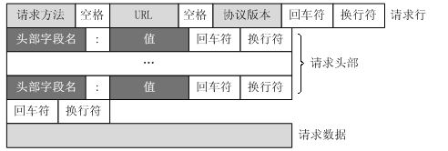
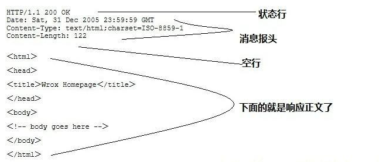
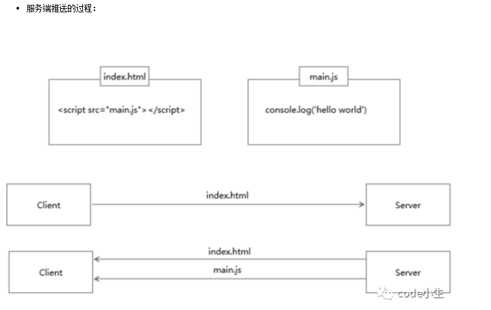
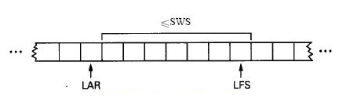

# 计算机网络

## HTTP简介

HTTP协议是Hyper Text Transfer Protocol（超文本传输协议）的缩写,是用于从万维网（WWW:World Wide Web ）服务器传输超文本到本地浏览器的传送协议。

HTTP是一个基于TCP/IP通信协议来传递数据（HTML 文件, 图片文件, 查询结果等）。

HTTP是一个属于应用层的面向对象的协议，由于其简捷、快速的方式，适用于分布式超媒体信息系统。它于1990年提出，经过几年的使用与发展，得到不断地完善和扩展。目前在WWW中使用的是HTTP/1.0的第六版，HTTP/1.1的规范化工作正在进行之中，而且HTTP-NG(Next Generation of HTTP)的建议已经提出。

HTTP协议工作于客户端-服务端架构为上。浏览器作为HTTP客户端通过URL向HTTP服务端即WEB服务器发送所有请求。Web服务器根据接收到的请求后，向客户端发送响应信息。

## 主要特点

1、简单快速：客户向服务器请求服务时，只需传送请求方法和路径。请求方法常用的有GET、HEAD、POST。每种方法规定了客户与服务器联系的类型不同。由于HTTP协议简单，使得HTTP服务器的程序规模小，因而通信速度很快。

2、灵活：HTTP允许传输任意类型的数据对象。正在传输的类型由Content-Type加以标记。

3.无连接：无连接的含义是限制每次连接只处理一个请求。服务器处理完客户的请求，并收到客户的应答后，即断开连接。采用这种方式可以节省传输时间。

4.无状态：HTTP协议是无状态协议。无状态是指协议对于事务处理没有记忆能力。缺少状态意味着如果后续处理需要前面的信息，则它必须重传，这样可能导致每次连接传送的数据量增大。另一方面，在服务器不需要先前信息时它的应答就较快。
5、支持B/S及C/S模式。

## URL

HTTP使用统一资源标识符（Uniform Resource Identifiers, URI）来传输数据和建立连接。URL是一种特殊类型的URI，包含了用于查找某个资源的足够的信息

URL,全称是UniformResourceLocator, 中文叫统一资源定位符,是互联网上用来标识某一处资源的地址。以下面这个URL为例，介绍下普通URL的各部分组成：

<http://www.aspxfans.com:8080/news/index.asp?boardID=5&ID=24618&page=1#name>

从上面的URL可以看出，一个完整的URL包括以下几部分：
1.协议部分：该URL的协议部分为“http：”，这代表网页使用的是HTTP协议。在Internet中可以使用多种协议，如HTTP，FTP等等本例中使用的是HTTP协议。在"HTTP"后面的“//”为分隔符

2.域名部分：该URL的域名部分为“www.aspxfans.com”。一个URL中，也可以使用IP地址作为域名使用

3.端口部分：跟在域名后面的是端口，域名和端口之间使用“:”作为分隔符。端口不是一个URL必须的部分，如果省略端口部分，将采用默认端口

4.虚拟目录部分：从域名后的第一个“/”开始到最后一个“/”为止，是虚拟目录部分。虚拟目录也不是一个URL必须的部分。本例中的虚拟目录是“/news/”

5.文件名部分：从域名后的最后一个“/”开始到“？”为止，是文件名部分，如果没有“?”,则是从域名后的最后一个“/”开始到“#”为止，是文件部分，如果没有“？”和“#”，那么从域名后的最后一个“/”开始到结束，都是文件名部分。本例中的文件名是“index.asp”。文件名部分也不是一个URL必须的部分，如果省略该部分，则使用默认的文件名

6.锚部分：从“#”开始到最后，都是锚部分。本例中的锚部分是“name”。锚部分也不是一个URL必须的部分

7.参数部分：从“？”开始到“#”为止之间的部分为参数部分，又称搜索部分、查询部分。本例中的参数部分为“boardID=5&ID=24618&page=1”。参数可以允许有多个参数，参数与参数之间用“&”作为分隔符。

## URI、URL、URN的区别

URI，是uniform resource identifier，统一资源标识符，用来唯一的标识一个资源。

Web上可用的每种资源如HTML文档、图像、视频片段、程序等都是一个来URI来定位的
URI一般由三部组成：
①访问资源的命名机制
②存放资源的主机名
③资源自身的名称，由路径表示，着重强调于资源。

URL是uniform resource locator，统一资源定位器，它是一种具体的URI，即URL可以用来标识一个资源，而且还指明了如何locate这个资源。

URL是Internet上用来描述信息资源的字符串，主要用在各种WWW客户程序和服务器程序上，特别是著名的Mosaic。
采用URL可以用一种统一的格式来描述各种信息资源，包括文件、服务器的地址和目录等。URL一般由三部组成：
①协议(或称为服务方式)
②存有该资源的主机IP地址(有时也包括端口号)
③主机资源的具体地址。如目录和文件名等

URN，uniform resource name，统一资源命名，是通过名字来标识资源，比如mailto:java-net@java.sun.com。

URI是以一种抽象的，高层次概念定义统一资源标识，而URL和URN则是具体的资源标识的方式。URL和URN都是一种URI。笼统地说，每个 URL 都是 URI，但不一定每个 URI 都是 URL。这是因为 URI 还包括一个子类，即统一资源名称 (URN)，它命名资源但不指定如何定位资源。上面的 mailto、news 和 isbn URI 都是 URN 的示例。

在Java的URI中，一个URI实例可以代表绝对的，也可以是相对的，只要它符合URI的语法规则。而URL类则不仅符合语义，还包含了定位该资源的信息，因此它不能是相对的。
在Java类库中，URI类不包含任何访问资源的方法，它唯一的作用就是解析。
相反的是，URL类可以打开一个到达资源的流。

## HTTP请求消息Request

客户端发送一个HTTP请求到服务器的请求消息包括以下格式：

请求行（request line）、请求头部（header）、空行和请求数据四个部分组成。



## HTTP响应消息Response

一般情况下，服务器接收并处理客户端发过来的请求后会返回一个HTTP的响应消息。

HTTP响应也由四个部分组成，分别是：状态行、消息报头、空行和响应正文。



## HTTP状态码

状态代码有三位数字组成，第一个数字定义了响应的类别，共分五种类别:

1xx：指示信息--表示请求已接收，继续处理

2xx：成功--表示请求已被成功接收、理解、接受

3xx：重定向--要完成请求必须进行更进一步的操作

4xx：客户端错误--请求有语法错误或请求无法实现

5xx：服务器端错误--服务器未能实现合法的请求

常见状态码：

```
200 OK                        //客户端请求成功
400 Bad Request               //客户端请求有语法错误，不能被服务器所理解
401 Unauthorized              //请求未经授权，这个状态代码必须和WWW-Authenticate报头域一起使用 
403 Forbidden                 //服务器收到请求，但是拒绝提供服务
404 Not Found                 //请求资源不存在，eg：输入了错误的URL
500 Internal Server Error     //服务器发生不可预期的错误
503 Server Unavailable        //服务器当前不能处理客户端的请求，一段时间后可能恢复正常
```

## HTTP工作原理

HTTP协议定义Web客户端如何从Web服务器请求Web页面，以及服务器如何把Web页面传送给客户端。HTTP协议采用了请求/响应模型。客户端向服务器发送一个请求报文，请求报文包含请求的方法、URL、协议版本、请求头部和请求数据。服务器以一个状态行作为响应，响应的内容包括协议的版本、成功或者错误代码、服务器信息、响应头部和响应数据。

以下是 HTTP 请求/响应的步骤：

1、客户端连接到Web服务器

一个HTTP客户端，通常是浏览器，与Web服务器的HTTP端口（默认为80）建立一个TCP套接字连接。

2、发送HTTP请求

通过TCP套接字，客户端向Web服务器发送一个文本的请求报文，一个请求报文由请求行、请求头部、空行和请求数据4部分组成。

3、服务器接受请求并返回HTTP响应

Web服务器解析请求，定位请求资源。服务器将资源复本写到TCP套接字，由客户端读取。一个响应由状态行、响应头部、空行和响应数据4部分组成。

4、释放连接TCP连接

若connection 模式为close，则服务器主动关闭[TCP连接](http://www.jianshu.com/p/ef892323e68f)，客户端被动关闭连接，释放[TCP连接](http://www.jianshu.com/p/ef892323e68f);若connection 模式为keepalive，则该连接会保持一段时间，在该时间内可以继续接收请求;

5、客户端浏览器解析HTML内容

客户端浏览器首先解析状态行，查看表明请求是否成功的状态代码。然后解析每一个响应头，响应头告知以下为若干字节的HTML文档和文档的字符集。客户端浏览器读取响应数据HTML，根据HTML的语法对其进行格式化，并在浏览器窗口中显示。

## HTTP版本区别

### **HTTP1.0和HTTP1.1的一些区别**

HTTP1.0最早在网页中使用是在1996年，那个时候只是使用一些较为简单的网页上和网络请求上，而HTTP1.1则在1999年才开始广泛应用于现在的各大浏览器网络请求中，同时HTTP1.1也是当前使用最为广泛的HTTP协议。 主要区别主要体现在：

1. **缓存处理**，在HTTP1.0中主要使用header里的If-Modified-Since,Expires来做为缓存判断的标准，HTTP1.1则引入了更多的缓存控制策略例如Entity tag，If-Unmodified-Since, If-Match, If-None-Match等更多可供选择的缓存头来控制缓存策略。
2. **带宽优化及网络连接的使用**，HTTP1.0中，存在一些浪费带宽的现象，例如客户端只是需要某个对象的一部分，而服务器却将整个对象送过来了，并且不支持断点续传功能，HTTP1.1则在请求头引入了range头域，它允许只请求资源的某个部分，即返回码是206（Partial Content），这样就方便了开发者自由的选择以便于充分利用带宽和连接。
3. **错误通知的管理**，在HTTP1.1中新增了24个错误状态响应码，如409（Conflict）表示请求的资源与资源的当前状态发生冲突；410（Gone）表示服务器上的某个资源被永久性的删除。
4. **Host头处理**，在HTTP1.0中认为每台服务器都绑定一个唯一的IP地址，因此，请求消息中的URL并没有传递主机名（hostname）。但随着虚拟主机技术的发展，在一台物理服务器上可以存在多个虚拟主机（Multi-homed Web Servers），并且它们共享一个IP地址。HTTP1.1的请求消息和响应消息都应支持Host头域，且请求消息中如果没有Host头域会报告一个错误（400 Bad Request）。
5. **长连接**，HTTP 1.1支持长连接（PersistentConnection）和请求的流水线（Pipelining）处理，在一个TCP连接上可以传送多个HTTP请求和响应，减少了建立和关闭连接的消耗和延迟，在HTTP1.1中默认开启Connection： keep-alive，一定程度上弥补了HTTP1.0每次请求都要创建连接的缺点。

### **HTTPS与HTTP的一些区别**

- HTTPS协议需要到CA申请证书，一般免费证书很少，需要交费。
- HTTP协议运行在TCP之上，所有传输的内容都是明文，HTTPS运行在SSL/TLS之上，SSL/TLS运行在TCP之上，所有传输的内容都经过加密的。
- HTTP和HTTPS使用的是完全不同的连接方式，用的端口也不一样，前者是80，后者是443。
- HTTPS可以有效的防止运营商劫持，解决了防劫持的一个大问题。

### **HTTP2.0和HTTP1.X相比的新特性**

- **新的二进制格式**（Binary Format），HTTP1.x的解析是基于文本。基于文本协议的格式解析存在天然缺陷，文本的表现形式有多样性，要做到健壮性考虑的场景必然很多，二进制则不同，只认0和1的组合。基于这种考虑HTTP2.0的协议解析决定采用二进制格式，实现方便且健壮。
- **多路复用**（MultiPlexing），即连接共享，即每一个request都是是用作连接共享机制的。一个request对应一个id，这样一个连接上可以有多个request，每个连接的request可以随机的混杂在一起，接收方可以根据request的 id将request再归属到各自不同的服务端请求里面。
- **header压缩**，如上文中所言，对前面提到过HTTP1.x的header带有大量信息，而且每次都要重复发送，HTTP2.0使用encoder来减少需要传输的header大小，通讯双方各自cache一份header fields表，既避免了重复header的传输，又减小了需要传输的大小。
- **服务端推送**（server push），同SPDY一样，HTTP2.0也具有server push功能。

- HTTP/1.* 一次请求-响应，建立一个连接，用完关闭；每一个请求都要建立一个连接；

- HTTP/1.1 Pipeling解决方式为，若干个请求排队串行化单线程处理，后面的请求等待前面请求的返回才能获得执行机会，一旦有某请求超时等，后续请求只能被阻塞，毫无办法，也就是人们常说的线头阻塞；

- HTTP/2多个请求可同时在一个连接上并行执行。某个请求任务耗时严重，不会影响到其它连接的正常执行；

  



## 滑动窗口协议

为了完成流量控制，TCP使用滑动窗口协议，使用这种方法的时候，发送方和接收方向外通信各使用一个窗口。这个窗口覆盖了缓存的一部分，在缓存中的字节是从应用进程传送来的，在这个窗口中的字节就是可以发送而不必考虑确认的。这个想象的窗口有两个边沿：一个在左，一个在右。这个窗口叫做滑动窗口，因为左沿和右沿都可以滑动。



　　　　　　　　　　　　　　　　　　　　　　SWS（发送窗口大小）：Send Window Size

　　　　　　　　　　　　　　　　　　　　　　LAR（最近接收到的确认帧）:Last Acknowledegement Received

　　　　　　　　　　　　　　　　　　　　　　LFS（最近发送的帧）：Last Frame Sent

**LFS-LAR≤SWS**

　　　　窗口大小取决于下面两个数中的较小值：接收窗口（rwnd）和拥塞窗口（cwnd）。接收窗口是由对方发送的包含确认的报文段中所给出的值，这是另一端在缓存溢出和数据被丢失之前所能接受的字节数。拥塞窗口是由网络为避免拥塞而确定的值。　　

　　右沿窗口向右移动表示展开窗口，说明允许从缓存中发送更多新的字节；

　　左沿窗口向右移动表示合拢窗口，说明某些字节已经被确认了，发送端不必再担心它们。

1. TCP协议的两端分别为发送者A和接收者B，由于是全双工协议，因此A和B应该分别维护着一个独立的发送缓冲区和接收缓冲区，由于对等性（A发B收和B发A收），我们以A发送B接收的情况作为例子；
2. 发送窗口是发送缓存中的一部分，是可以被TCP协议发送的那部分，其实应用层需要发送的所有数据都被放进了发送者的发送缓冲区；
3. 发送窗口中相关的有四个概念：已发送并收到确认的数据（不再发送窗口和发送缓冲区之内）、已发送但未收到确认的数据（位于发送窗口之中）、允许发送但尚未发送的数据以及发送窗口外发送缓冲区内暂时不允许发送的数据；
4. 每次成功发送数据之后，发送窗口就会在发送缓冲区中按顺序移动，将新的数据包含到窗口中准备发送。

