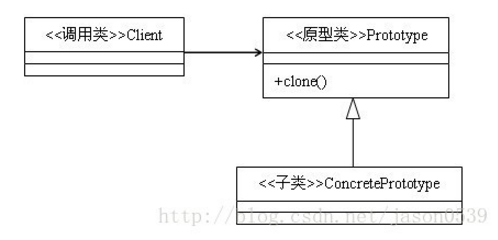
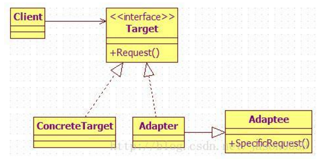
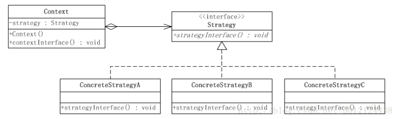

# 设计模式

## 三大分类

​	①**创建型模式** ：工厂方法模式、抽象工厂模式、单例模式、建造者模式、原型模式 

​	②**结构型模式** ：适配器模式、装饰器模式、代理模式、外观模式、桥接模式、组合模式、享元模式 

​	③**行为型模式** ：策略模式、模板方法模式、观察者模式、迭代子模式、责任链模式、命令模式、备忘录模式、状态模式、访问者模式、中介者模式、解释器模式 

## 六大原则

**总原则－开闭原则**

对扩展开放，对修改封闭。在程序需要进行拓展的时候，不能去修改原有的代码，而是要扩展原有代码，实现一个热插拔的效果。所以一句话概括就是：为了使程序的扩展性好，易于维护和升级。

​	①单一职责原则

​	不要存在多于一个导致类变更的原因，也就是说每个类应该实现单一的职责，否则就应该把类拆分。 

​	②里氏替换原则（Liskov Substitution Principle）

​	任何基类可以出现的地方，子类一定可以出现。里氏替换原则是继承复用的基石，只有当衍生类可以替换基类，软件单位的功能不受到影响时，基类才能真正被复用，而衍生类也能够在基类的基础上增加新的行为。

​	里氏代换原则是对“开-闭”原则的补充。实现“开闭”原则的关键步骤就是抽象化。而基类与子类的继承关系就是抽象化的具	体实现，所以里氏代换原则是对实现抽象化的具体步骤的规范。里氏替换原则中，子类对父类的方法尽量不要重写和重载。因为父类代表了定义好的结构，通过这个规范的接口与外界交互，子类不应该随便破坏它。

​	③依赖倒转原则（Dependence Inversion Principle）

​	面向接口编程，依赖于抽象而不依赖于具体。写代码时用到具体类时，不与具体类交互，而与具体类的上层接口交互。 

​	④接口隔离原则（Interface Segregation Principle）

​	每个接口中不存在子类用不到却必须实现的方法，如果不然，就要将接口拆分。使用多个隔离的接口，比使用单个接口（多个接口方法集合到一个的接口）要好。 

​	⑤迪米特法则（最少知道原则）（Demeter Principle）

​	一个类对自己依赖的类知道的越少越好。无论被依赖的类多么复杂，都应该将逻辑封装在方法的内部，通过public方法提供给外部。这样当被依赖的类变化时，才能最小的影响该类。

​	最少知道原则的另一个表达方式是：只与直接的朋友通信。类之间只要有耦合关系，就叫朋友关系。耦合分为依赖、关联、聚合、组合等。我们称出现为成员变量、方法参数、方法返回值中的类为直接朋友。局部变量、临时变量则不是直接的朋友。我们要求陌生的类不要作为局部变量出现在类中。

​	⑥合成复用原则（Composite Reuse Principle）

​	尽量首先使用合成/聚合的方式，而不是使用继承。 

## 工厂类模式

​	工厂模式主要是为创建对象提供过渡接口，以便将创建对象的具体过程屏蔽隔离起来，达到提高灵活性的目的。 
工厂模式可以分为三类： 

- 简单工厂模式（Simple Factory） 
- 工厂方法模式（Factory Method） 
- 抽象工厂模式（Abstract Factory）

工厂方法模式只有一个抽象产品类，而抽象工厂模式有多个。    工厂方法模式的具体工厂类只能创建一个具体产品类的实例，而抽象工厂模式可以创建多个。 两者皆可。  区别：

​	①工厂方法模式

​	 一个抽象产品类，可以派生出多个具体产品类。    一个抽象工厂类，可以派生出多个具体工厂类。    每个具体工厂类只能创建一个具体产品类的实例。 

​	②抽象工厂模式

​	多个抽象产品类，每个抽象产品类可以派生出多个具体产品类。    一个抽象工厂类，可以派生出多个具体工厂类。    每个具体工厂类可以创建多个具体产品类的实例。

## 单例模式

​	java中单例模式是一种常见的设计模式，单例模式的写法有好几种，这里主要介绍三种：懒汉式单例、饿汉式单例、登记式单例。单例模式有以下特点： 　　

​	①单例类只能有一个实例。

​	②单例类必须自己创建自己的唯一实例。

​	③单例类必须给所有其他对象提供这一实例。 

### 	懒汉式单例

​	Singleton通过将构造方法限定为private避免了类在外部被实例化，在同一个虚拟机范围内，Singleton的唯一实例只能通过getInstance()方法访问。（事实上，通过Java反射机制是能够实例化构造方法为private的类的，那基本上会使所有的Java单例实现失效。此问题在此处不做讨论，姑且掩耳盗铃地认为反射机制不存在。）但是以上懒汉式单例的实现没有考虑线程安全问题，它是线程不安全的，并发环境下很可能出现多个Singleton实例。

```
//懒汉式单例类.在第一次调用的时候实例化自己   
public class Singleton {  
    private Singleton() {}  
    private static Singleton single=null;  
    //静态工厂方法   
    public static Singleton getInstance() {  
         if (single == null) {    
             single = new Singleton();  
         }    
        return single;  
    }  
}  
```

### 	饿汉式单例

​	饿汉式在类创建的同时就已经创建好一个静态的对象供系统使用，以后不再改变，所以天生是线程安全的。 

```
//饿汉式单例类.在类初始化时，已经自行实例化   
public class Singleton1 {  
    private Singleton1() {}  
    private static final Singleton1 single = new Singleton1();  
    //静态工厂方法   
    public static Singleton1 getInstance() {  
        return single;  
    }  
} 
```

### 	登记式单例 

​	登记式单例实际上维护了一组单例类的实例，将这些实例存放在一个Map（登记薄）中，对于已经登记过的实例，则从Map直接返回，对于没有登记的，则先登记，然后返回。  

```
//类似Spring里面的方法，将类名注册，下次从里面直接获取。  
public class Singleton3 {  
    private static Map<String,Singleton3> map = new HashMap<String,Singleton3>();  
    static{  
        Singleton3 single = new Singleton3();  
        map.put(single.getClass().getName(), single);  
    }  
    //保护的默认构造子  
    protected Singleton3(){}  
    //静态工厂方法,返还此类惟一的实例  
    public static Singleton3 getInstance(String name) {  
        if(name == null) {  
            name = Singleton3.class.getName();  
            System.out.println("name == null"+"--->name="+name);  
        }  
        if(map.get(name) == null) {  
            try {  
                map.put(name, (Singleton3) Class.forName(name).newInstance());  
            } catch (InstantiationException e) {  
                e.printStackTrace();  
            } catch (IllegalAccessException e) {  
                e.printStackTrace();  
            } catch (ClassNotFoundException e) {  
                e.printStackTrace();  
            }  
        }  
        return map.get(name);  
    }  
    //一个示意性的商业方法  
    public String about() {      
        return "Hello, I am RegSingleton.";      
    }      
    public static void main(String[] args) {  
        Singleton3 single3 = Singleton3.getInstance(null);  
        System.out.println(single3.about());  
    }  
} 
```

## 原型模式



- 实现Cloneable接口。在java语言有一个Cloneable接口，它的作用只有一个，就是在运行时通知虚拟机可以安全地在实现了此接口的类上使用clone方法。在java虚拟机中，只有实现了这个接口的类才可以被拷贝，否则在运行时会抛出CloneNotSupportedException异常。
- 重写Object类中的clone方法。Java中，所有类的父类都是Object类，Object类中有一个clone方法，作用是返回对象的一个拷贝，但是其作用域protected类型的，一般的类无法调用，因此，Prototype类需要将clone方法的作用域修改为public类型。

使用原型模式创建对象比直接new一个对象在性能上要好的多，因为Object类的clone方法是一个本地方法，它直接操作内存中的二进制流，特别是复制大对象时，性能的差别非常明显。 

**原型模式的注意事项**

- 使用原型模式复制对象不会调用类的构造方法。因为对象的复制是通过调用Object类的clone方法来完成的，它直接在内存中复制数据，因此不会调用到类的构造方法。不但构造方法中的代码不会执行，甚至连访问权限都对原型模式无效。单例模式中，只要将构造方法的访问权限设置为private型，就可以实现单例。但是clone方法直接无视构造方法的权限，所以，单例模式与原型模式是冲突的，在使用时要特别注意。
- 深拷贝与浅拷贝。Object类的clone方法只会拷贝对象中的基本的数据类型（8种基本数据类型byte,char,short,int,long,float,double，boolean），对于数组、容器对象、引用对象等都不会拷贝，这就是浅拷贝。如果要实现深拷贝，必须将原型模式中的数组、容器对象、引用对象等另行拷贝。

## 适配器模式

​	①类的适配器模式（采用继承实现）

​	②对象适配器（采用对象组合方式实现）

​	

### 	优点

　　　　①通过适配器，客户端可以调用同一接口，因而对客户端来说是透明的。这样做更简单、更直接、更紧凑。

　　　　②复用了现存的类，解决了现存类和复用环境要求不一致的问题。

　　　　③将目标类和适配者类解耦，通过引入一个适配器类重用现有的适配者类，而无需修改原有代码。

　　　　④一个对象适配器可以把多个不同的适配者类适配到同一个目标，也就是说，同一个适配器可以把适配者类和它的子类都适配到目标接口。

### 	缺点

　　　　对于对象适配器来说，更换适配器的实现过程比较复杂。

### 	适用场景

　　　　①系统需要使用现有的类，而这些类的接口不符合系统的接口。

　　　　②想要建立一个可以重用的类，用于与一些彼此之间没有太大关联的一些类，包括一些可能在将来引进的类一起工作。

　　　　③两个类所做的事情相同或相似，但是具有不同接口的时候。

　　　　④旧的系统开发的类已经实现了一些功能，但是客户端却只能以另外接口的形式访问，但我们不希望手动更改原有类的时候。

　　　　⑤使用第三方组件，组件接口定义和自己定义的不同，不希望修改自己的接口，但是要使用第三方组件接口的功能。

## 代理模式

​	代理(Proxy)是一种设计模式,提供了对目标对象另外的访问方式;即通过代理对象访问目标对象.这样做的好处是:可以在目标对象实现的基础上,增强额外的功能操作,即扩展目标对象的功能 。

### 	静态代理

​	静态代理在使用时,需要定义接口或者父类,被代理对象与代理对象一起实现相同的接口或者是继承相同父类 。因为代理对象需要与目标对象实现一样的接口,所以会有很多代理类,类太多.同时,一旦接口增加方法,目标对象与代理对象都要维护 。

### 	动态代理

​	**动态代理有以下特点:**
	①代理对象,不需要实现接口
	②代理对象的生成,是利用JDK的API,动态的在内存中构建代理对象(需要我们指定创建代理对象/目标对象实现的接口的类型)
	③动态代理也叫做:JDK代理,接口代理

​	代理类所在包:java.lang.reflect.Proxy
JDK实现代理只需要使用newProxyInstance方法,但是该方法需要接收三个参数,完整的写法是:

```
static Object newProxyInstance(ClassLoader loader, Class<?>[] interfaces,InvocationHandler h )
```

注意该方法是在Proxy类中是静态方法,且接收的三个参数依次为:

- `ClassLoader loader,`:指定当前目标对象使用类加载器,获取加载器的方法是固定的
- `Class<?>[] interfaces,`:目标对象实现的接口的类型,使用泛型方式确认类型
- `InvocationHandler h`:事件处理,执行目标对象的方法时,会触发事件处理器的方法,会把当前执行目标对象的方法作为参数传入

### Cglib代理

​	静态代理和动态代理模式都是要求目标对象是实现一个接口的目标对象,但是有时候目标对象只是一个单独的对象,并没有实现任何的接口,这个时候就可以使用以目标对象子类的方式类实现代理,这种方法就叫做Cglib代理

Cglib代理,也叫作子类代理,它是在内存中构建一个子类对象从而实现对目标对象功能的扩展.

- JDK的动态代理有一个限制,就是使用动态代理的对象必须实现一个或多个接口,如果想代理没有实现接口的类,就可以使用Cglib实现.
- Cglib是一个强大的高性能的代码生成包,它可以在运行期扩展java类与实现java接口.它广泛的被许多AOP的框架使用,例如Spring AOP和synaop,为他们提供方法的interception(拦截)
- Cglib包的底层是通过使用一个小而块的字节码处理框架ASM来转换字节码并生成新的类.不鼓励直接使用ASM,因为它要求你必须对JVM内部结构包括class文件的格式和指令集都很熟悉.

## 外观模式


​	外观模式（Facade）,他隐藏了系统的复杂性，并向客户端提供了一个可以访问系统的接口。这种类型的设计模式属于结构性模式。为子系统中的一组接口提供了一个统一的访问接口，这个接口使得子系统更容易被访问或者使用。  

​	简单来说，该模式就是把一些复杂的流程封装成一个接口供给外部用户更简单的使用。这个模式中，设计到3个角色。

　　①门面角色：外观模式的核心。它被客户角色调用，它熟悉子系统的功能。内部根据客户角色的需求预定了几种功能的组合。

　　②子系统角色:实现了子系统的功能。它对客户角色和Facade时未知的。它内部可以有系统内的相互交互，也可以由供外界调用的接口。

　　③客户角色:通过调用Facede来完成要实现的功能。

## 策略模式

​	策略模式定义了一系列的算法，并将每一个算法封装起来，而且使他们可以相互替换，让算法独立于使用它的客户而独立变化。 

​	**策略模式的使用场景：** 

​	①针对同一类型问题的多种处理方式，仅仅是具体行为有差别时；  

​	②需要安全地封装多种同一类型的操作时；

​	③出现同一抽象类有多个子类，而又需要使用 if-else 或者 switch-case 来选择具体子类时。 



环境(Context)角色：持有一个Strategy的引用。

抽象策略(Strategy)角色：这是一个抽象角色，通常由一个接口或抽象类实现。此角色给出所有的具体策略类所需的接口。

具体策略(ConcreteStrategy)角色：包装了相关的算法或行为。

## 模板方法模式

​	模板方法模式是类的行为模式。准备一个抽象类，将部分逻辑以具体方法以及具体构造函数的形式实现，然后声明一些抽象方法来迫使子类实现剩余的逻辑。不同的子类可以以不同的方式实现这些抽象方法，从而对剩余的逻辑有不同的实现。 

### 	优点

​	模板方法模式通过把不变的行为搬移到超类，去除了子类中的重复代码。

​	子类实现算法的某些细节，有助于算法的扩展。

​	通过一个父类调用子类实现的操作，通过子类扩展增加新的行为，符合“开放-封闭原则”。

### 	缺点

​	每个不同的实现都需要定义一个子类，这会导致类的个数的增加，设计更加抽象。

### 	适用场景

​	在某些类的算法中，用了相同的方法，造成代码的重复。

​	控制子类扩展，子类必须遵守算法规则。

## 责任链模式

​	使多个对象都有机会处理请求，从而避免请求的发送者和接受者之间的耦合关系，将这个对象连成一条链，并沿着这条链传递该请求，直到有一个对象处理他为止。

​	抽象处理者角色(Handler)：定义出一个处理请求的接口。如果需要，接口可以定义 出一个方法以设定和返回对下家的引用。这个角色通常由一个Java抽象类或者Java接口实现。具体处理者角色(ConcreteHandler)：具体处理者接到请求后，可以选择将请求处理掉，或者将请求传给下家。由于具体处理者持有对下家的引用，因此，如果需要，具体处理者可以访问下家。

​	①改变内部的传递规则

​	在内部，项目经理完全可以跳过人事部到那一关直接找到总经理。每个人都可以去动态地指定他的继任者。

​	②可以从职责链任何一关开始。

​	如果项目经理不在，可以直接去找部门经理，责任链还会继续，没有影响。

​	③用与不用的区别

​	不用职责链的结构，我们需要和公司中的每一个层级都发生耦合关系。如果反映在代码上即使我们需要在一个类中去写上很多丑陋的if….else语句。如果用了职责链，相当于我们面对的是一个黑箱，我们只需要认识其中的一个部门，然后让黑箱内部去负责传递就好了

